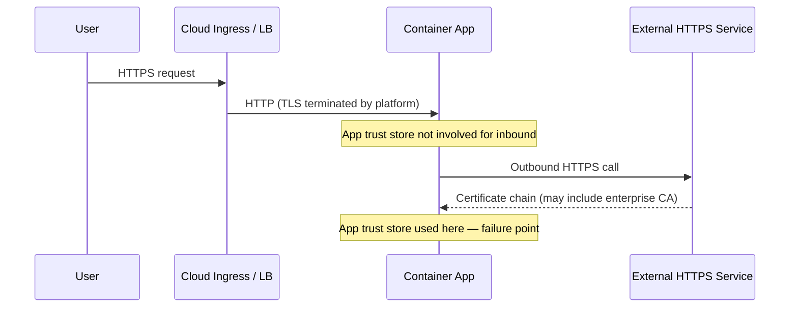

# Why My Container Could Receive Traffic but Failed on Outbound HTTPS

If you run apps in cloud containers behind enterprise networking controls, you might hit a confusing problem:

- Your app is healthy
- Users can reach it
- But some requests fail with TLS/certificate errors when calling external services

This pattern is worth documenting because it appears often in corporate environments and tends to generate hours of debugging in the wrong direction.

<!-- truncate -->

## The confusing symptom

Everything looks fine at first:

- Inbound requests to the app work
- Health endpoints are green
- Platform ingress is healthy

Then a feature that depends on outbound HTTPS fails with errors like:

```
certificate verify failed
unable to get local issuer certificate
self-signed certificate in certificate chain
```

This feels contradictory until you separate inbound and outbound trust paths.

## Inbound and outbound TLS are different flows

This is the core insight. Most developers think of TLS as a single concern, but in a cloud-hosted container behind enterprise network controls, inbound and outbound trust are managed separately.

**Inbound flow:** Cloud ingress (or load balancer/proxy) often terminates TLS before traffic reaches your app container. Your app can receive traffic even if its own trust store is incomplete, because the platform handles certificate presentation on the inbound side.

**Outbound flow:** Your app becomes the TLS client when it calls external HTTPS services. Now your container's runtime trust store is used to verify remote certificates. If your network performs TLS inspection, the certificate chain your app sees may be anchored to an enterprise CA. If that CA is missing from the container trust store, outbound calls fail.



The diagram above shows why health checks pass but specific outbound features fail. The inbound path never touches the container's trust store. The outbound path depends on it entirely.

## Why this is common in corporate networks

Corporate security stacks frequently include:

- HTTPS inspection proxies that re-sign external certificates with an enterprise CA
- Internal PKI root and intermediate CAs for internal services
- Restricted egress paths routed through inspection infrastructure

Developer laptops are usually managed to trust enterprise CAs — IT pushes them via MDM. Minimal container images are not. That mismatch is the root cause.

## Why health checks can still pass

Health checks validate app process readiness and local dependencies. They do not typically exercise the specific outbound HTTPS call that will fail in production. So you can have a healthy container, a reachable API endpoint, and runtime failures only on outbound operations to inspected hosts. The container looks fine right up until the feature that needs it is called.

## The two standard enterprise approaches

Organizations with TLS-inspecting proxies have largely converged on one of two patterns, in order of preference.

### Golden base image

The platform or IT team publishes an internal base Docker image — for example, `internal-registry/python:3.13-slim` — with the corporate CA already installed into the OS trust store via `update-ca-certificates`. Every team builds their app `FROM` that base image. No individual team manages their own CA bundle copy, and there is no per-repo configuration to maintain. When the CA is rotated or a new intermediate is added, the platform team updates the base image and teams rebuild.

This is the cleanest pattern because the CA trust concern is solved once at the platform layer and is invisible to application teams.

### Centrally distributed CA bundle

When a golden base image is not available, the next best option is for IT to publish the CA bundle at a known internal URL or artifact repository, versioned and hash-verified. CI pipelines fetch it at build time rather than teams hand-copying files between repositories. The bundle has a single authoritative source, so it can be updated centrally and all pipelines pick it up on the next build.

This is more work than the base image approach but far better than per-team manual management.

## The right fix and the wrong one

**Right approach:** Keep certificate verification enabled. Add the enterprise-approved CA bundle to the container image via one of the two patterns above. Configure runtime trust variables and, if needed, client-specific verify paths. Validate from inside the running container against real target endpoints.

**Wrong approach:** Disabling verification globally.

Setting `verify=False`, `NODE_TLS_REJECT_UNAUTHORIZED=0`, or equivalent removes identity validation entirely. Any certificate passes, including from a malicious endpoint. This is not a temporary workaround — it is a persistent security gap that removes a core protection layer. It should never be a production solution.

## Practical checklist

1. Confirm the error is certificate trust related, not DNS or authentication.
2. Check whether failure occurs only on outbound HTTPS features, not inbound traffic.
3. Identify whether your network uses TLS inspection (ask the platform team if unsure).
4. Use the golden base image if one is available.
5. If not, fetch the CA bundle from the centrally distributed source at build time.
6. Configure runtime trust variables and client-specific verify paths where needed.
7. Re-test from within the container runtime environment, not from your laptop.
8. Keep verification enabled after the fix.

## Mental model to remember

> Inbound success does not prove outbound trust is correct.
> Outbound trust depends on what your container trusts.
> Enterprise TLS inspection makes CA trust configuration a first-class deployment concern.

If your containerized app works for inbound traffic but fails on selective outbound HTTPS calls, think trust chain mismatch first. In enterprise networks, this is not an edge case — it is a standard operational pattern, and solving it early saves hours of false debugging around keys, endpoints, and application logic.
