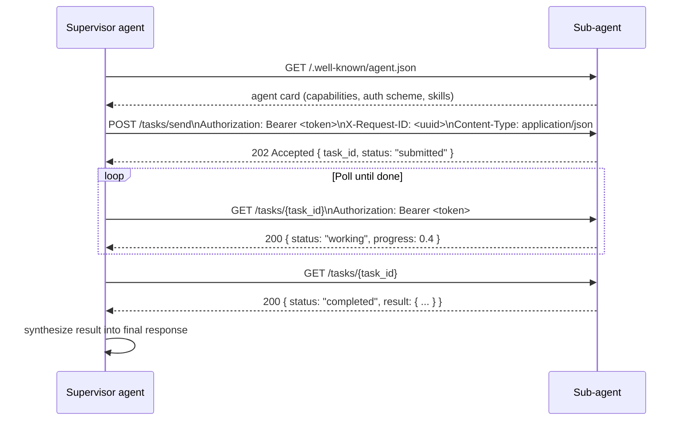
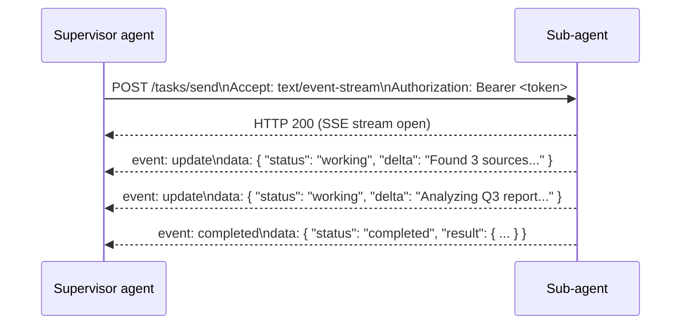
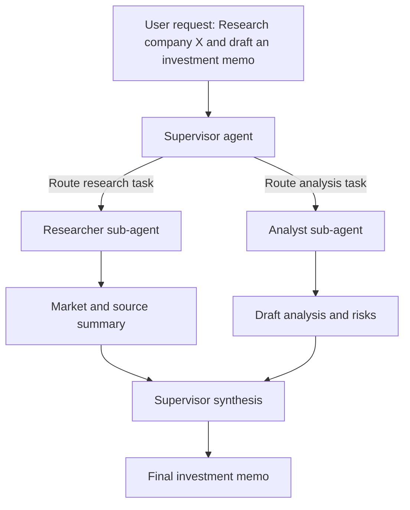
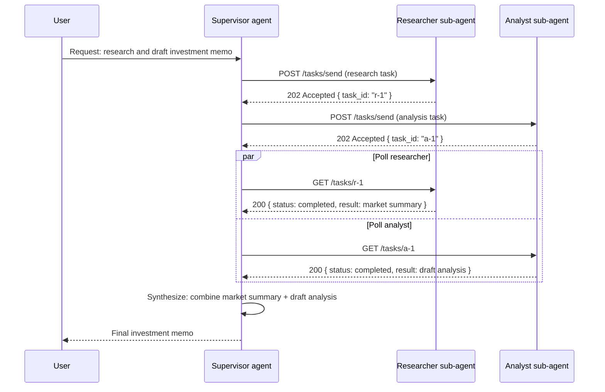
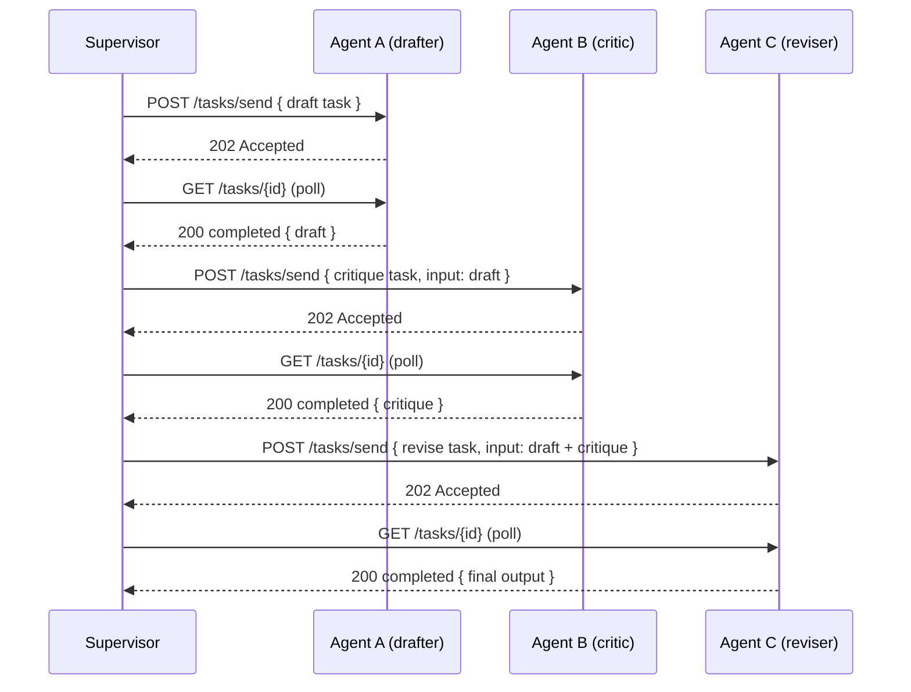
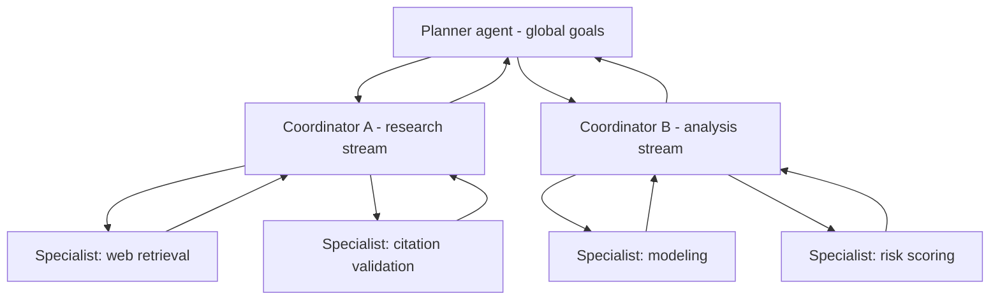
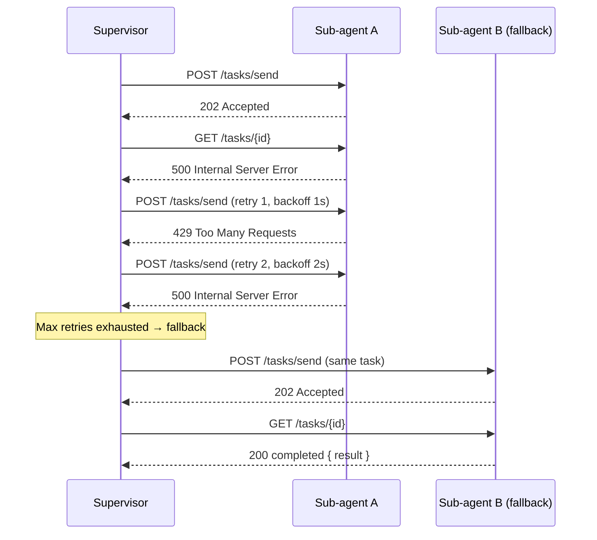

# Agent-to-Agent Communication Architectures

> **TL;DR**
> - **A2A systems** allow models to invoke other agents as tools, enabling composite problem decomposition and specialization.
> - **Core patterns**: delegation (supervisor → sub-agents), composition (sequential/parallel execution), and hierarchical routing.
> - **Production concerns**: state graph management, result streaming, tool discovery, observability, and deterministic failure handling.
> - **When to use**: tasks requiring specialized sub-agents, adaptive routing logic, or dynamic tool composition that can't be static upfront.

## What Is Agent-to-Agent Communication?

Agent-to-agent (A2A) communication enables one agent to invoke, delegate work to, or compose results from other agents. Unlike tool use (where agents call deterministic functions), A2A allows agents to reason about other agents' capabilities, decompose complex tasks into sub-problems, and coordinate solutions across multiple specialized reasoning loops.

In production, A2A systems typically manifest as:

- **Delegation A2A**: A supervisor agent determines which sub-agent should handle a task, passes context, and synthesizes results.
- **Compositional A2A**: Agents chain their outputs—one agent's result feeds into the next agent's input, forming a reasoning pipeline.
- **Hierarchical A2A**: Multi-level agent trees where high-level planners coordinate mid-level coordinators and leaf-level specialist agents.

The key innovation is that edges between agents are themselves reasoning decisions, not statically configured pipelines.

## A2A Wire Protocol

A2A communication uses **HTTP + JSON** as its transport layer. Each agent exposes a standard HTTP endpoint, and callers (supervisor or upstream agents) communicate using a set of well-defined headers and a JSON request body. This section covers the protocol structure before walking through the architectural patterns built on top of it.

### Agent Discovery via Agent Card

Every A2A-compliant agent serves a machine-readable capability descriptor at a well-known path:

```
GET /.well-known/agent.json
```

The agent card declares what the agent can do, what input it expects, and what authentication it requires:

```json
{
  "name": "FactualResearchAgent",
  "version": "1.0",
  "description": "Searches the web and returns summarized source-backed findings.",
  "url": "https://agents.internal/research",
  "authentication": {
    "type": "bearer"
  },
  "capabilities": {
    "streaming": true,
    "push_notifications": false
  },
  "skills": [
    {
      "id": "web_research",
      "name": "Web Research",
      "input_modes": ["text"],
      "output_modes": ["text"]
    }
  ]
}
```

A supervisor agent fetches agent cards at startup (or from a registry) to build its routing table.

### Required HTTP Headers

Every agent-to-agent HTTP request must carry the following headers:

| Header | Required | Purpose |
|--------|----------|---------|
| `Authorization: Bearer <token>` | Yes | Authenticates the calling agent. Tokens are scoped per caller and rotated on a schedule. |
| `Content-Type: application/json` | Yes | Declares JSON body encoding. |
| `Accept: application/json` | Yes (batch) | Expected response format for synchronous responses. |
| `Accept: text/event-stream` | Yes (streaming) | Switches the response to Server-Sent Events (SSE) mode. |
| `X-Request-ID: <uuid>` | Strongly recommended | Correlates the request across distributed traces. Echo'd back in responses. |
| `X-Agent-ID: <agent-identifier>` | Recommended | Identifies the calling agent for audit logging. |

:::warning

Never omit `Authorization` for inter-agent calls even on private networks. Agents can be lateral-movement targets in multi-tenant deployments. Validate the token on every request.

:::

### Request Body Structure

Task requests use a JSON body:

```json
{
  "id": "task-abc-123",
  "message": {
    "role": "user",
    "parts": [
      {
        "type": "text",
        "text": "Research recent earnings reports for company X and summarize key risks."
      }
    ]
  },
  "context": {
    "session_id": "session-xyz",
    "history": []
  },
  "metadata": {
    "priority": "normal",
    "timeout_seconds": 30
  }
}
```

Key fields:

- **`id`**: Unique task identifier; used to poll for status if async, and to correlate logs.
- **`message.parts`**: The actual content sent to the agent. Supports `text`, `file`, and `data` part types.
- **`context`**: Shared session state and conversation history the receiving agent should be aware of.
- **`metadata`**: Non-semantic hints (priority, timeout, budget limits).

### Task Lifecycle and Response Codes

A2A tasks are asynchronous by design. The supervisor sends a task, polls for status, and retrieves the result.

The following sequence shows the full request lifecycle from a supervisor calling a sub-agent:



HTTP status codes used:

| Code | Meaning |
|------|---------|
| `202 Accepted` | Task received and queued; poll for status. |
| `200 OK` | Status or result available. |
| `400 Bad Request` | Malformed request body or missing required fields. |
| `401 Unauthorized` | Missing or invalid `Authorization` header. |
| `429 Too Many Requests` | Rate limit hit; back off and retry. |
| `500 Internal Server Error` | Agent failed; check error body for details. |

### Streaming via Server-Sent Events

For long-running tasks, rather than polling, the supervisor can switch to SSE by setting `Accept: text/event-stream`. The sub-agent streams incremental updates as they become available:



SSE events follow the format:

```
event: update
data: { "status": "working", "delta": "Found 3 sources..." }

event: completed
data: { "status": "completed", "result": { "parts": [ { "type": "text", "text": "..." } ] } }
```

:::tip

Prefer SSE for tasks expected to take more than 2 seconds. Polling adds round-trip overhead and can miss intermediate progress useful for user-facing progress indicators.

:::

## Core A2A Patterns

### Delegation (Supervisor Architecture)

A **supervisor agent** evaluates the incoming task and routes work to one or more sub-agents. The supervisor queries agent capabilities (via tool metadata, natural language descriptions, or learned models) and decides routing.

**Characteristics:**
- Supervisor maintains a **routing policy** that maps task classes to sub-agent definitions.
- Sub-agents are decoupled; each maintains its own state and tool set.
- Supervisor waits for sub-agent results and performs synthesis (aggregation, conflict resolution, re-prompting).

**Implementation considerations:**
- **Tool metadata**: Sub-agent names, descriptions, and expected input/output schemas must be crisp. Poor metadata causes supervisor misrouting.
- **State isolation**: Sub-agents should not share mutable state by default. Pass inputs explicitly; return structured outputs.
- **Timeout and retry logic**: Sub-agents may time out or fail. Supervisor needs backoff strategies and fallback routing.

**Example workflow:**



This flow highlights an important A2A property: the supervisor controls routing and synthesis, while specialists optimize for narrow task quality.

The matching sequence diagram shows the actual HTTP interactions that produce this flow:



### Composition (Sequential & Parallel Execution)

**Sequential composition** chains agent outputs: Agent A's result is Agent B's input. This is useful when later agents depend on earlier reasoning.

**Parallel composition** runs multiple agents concurrently on the same input or on independent sub-tasks, then aggregates results.

**Sequential advantages:**
- Preserves causal flow; later agents can reference earlier steps.
- Useful for refinement pipelines (draft → critique → revise).

**Parallel advantages:**
- Faster time-to-result for independent tasks.
- Approximates the "brainstorming multiple experts in parallel" model.

**Critical design choice: result streaming vs. batch.**

- **Batch**: Agent A completes fully, returns entire result, then Agent B starts. Simpler but blocks on Agent A's latency.
- **Streaming**: Agent A streams tokens/partial results; Agent B begins consuming while Agent A is still reasoning. Reduces end-to-end latency but requires buffer management and partial-result consumption logic.

Sequential composition via batch:



### Hierarchical Routing

In deep hierarchies, a **planner agent** (level 1) breaks a long-horizon problem into subgoals, assigns each to a **coordinator agent** (level 2), which in turn may dispatch to **specialist agents** (level 3).



At runtime, this hierarchy behaves like a control graph: planner-level state tracks cross-stream dependencies, and coordinator-level state tracks execution details.

**State across hierarchy levels:**
- Level 1 (planner) maintains a global state graph tracking all subgoals, their status, and interdependencies.
- Each coordinator maintains task-local state (e.g., which tools have been tried, intermediate results).
- Specialists are typically stateless or minimal-state (single loop for a narrow task).

**Coordination mechanisms:**
- **Futures/promises**: Coordinator issues work to specialists and polls for completion.
- **Event-driven**: Specialists post results to a shared bus; coordinators react to events.
- **Structured concurrency**: Explicit parent-child scope semantics (inspired by structured concurrency in systems like Go, Rust, Python's `asyncio`).

## Production Design Patterns

### State Graph Management

A2A systems produce complex state: task decompositions, intermediate results, agent routing decisions, and failure recovery paths.

**State graph representation:**
- Each node is an agent invocation (name, input, output, status, timestamps).
- Edges represent data flow or control delegation.
- Edges should be **immutable snapshots** of the input passed; this enables deterministic replay and debugging.

**Key operations:**
- **Append**: Log new agent invocations as edges are traversed.
- **Query**: Given a final result, trace back to the original input (auditing).
- **Prune**: Remove failed branches or expired temporary results.

### Tool Discovery & Capability Binding

As A2A systems scale, agents must discover which sub-agents are available and what they can do **dynamically**.

**Approaches:**

1. **Static manifest**: Register all sub-agents in a configuration file; supervisor queries it at startup.
   - Pros: Deterministic, easy to audit and version.
   - Cons: Scales poorly; hard to add new sub-agents at runtime.

2. **Dynamic registry**: Maintain a service discovery mechanism (e.g., a registry server that agents query at runtime).
   - Pros: Scales; enables on-demand sub-agent instantiation.
   - Cons: Adds latency and failure points (registry unavailability).

3. **Learned routing**: Train or fine-tune a lightweight model to predict which sub-agent is best suited (e.g., multi-choice classification).
   - Pros: Can learn domain-specific patterns.
   - Cons: Requires labeled routing data; can hallucinate sub-agents.

**Best practice**: Combine explicit metadata (tool definitions) with learned routing (for probabilistic ranking).

### Error Handling & Determinism

A2A systems must deterministically recover from sub-agent failures.

**Failure modes:**
- Sub-agent times out.
- Sub-agent returns invalid output (validation fails).
- Sub-agent reports an error (explicit failure signal).
- Sub-agent disappears (deployment change, network partition).

**Recovery strategies:**
- **Retry**: Re-invoke the same sub-agent with exponential backoff.
- **Fallback routing**: If sub-agent A fails, try sub-agent B (ranked as secondary choice).
- **Human escalation**: If all automatic recovery fails, escalate to human review.
- **Checkpoint and resume**: If a coordinator crashes, resume from the last checkpoint (using the state graph).

The following shows the retry and fallback flow at the HTTP level:



**Determinism**: To enable debuggable and reproducible A2A flows:
- Log every routing decision and the metadata that drove it (e.g., "Supervisor chose Agent X because task_type == 'analysis'").
- Version sub-agent definitions (name, schema version, endpoint).
- Use **seed-based randomness** if probabilistic routing is used; log the seed.

### Observability & Monitoring

A2A systems are harder to debug than single-agent systems because failure can occur at multiple levels.

**Essential observability:**
- **Trace graph export**: Render the state graph as a timeline or DAG for each request (e.g., export to JSON).
- **Per-agent latency**: Measure time spent in each agent invocation; identify bottlenecks.
- **Token accounting**: Track tokens consumed by each agent and aggregate total tokens (for cost and rate-limiting).
- **Error logs**: Log every agent invocation that fails; include the input, the error, and recovery action taken.

**Recommended tooling:**
- Use a tracing library (e.g., OpenTelemetry) to instrument supervisors and sub-agents.
- Export traces to a backend (e.g., Jaeger, Datadog) for persistent search and correlation.
- Set up alerts on high latency (e.g., coordinator stalled for >5 seconds) and error rate thresholds per sub-agent type.

## Evaluation & Testing

### Correctness Evaluation

A2A systems require multi-level evaluation:

1. **Sub-agent level**: Evaluate each specialist agent in isolation (standard LLM evaluation: accuracy, latency, cost).
2. **Routing level**: Evaluate the supervisor's routing decisions; measure % of tasks routed to the correct sub-agent (compute via ground truth or human judgment).
3. **End-to-end level**: Evaluate the final output (e.g., memo quality, correctness), accounting for errors at any A2A layer.

**Common pitfall**: Sub-agents are individually accurate, but the supervisor routes tasks incorrectly, causing end-to-end failure.

### Synthetic vs. Real Workload Testing

- **Synthetic**: Mock sub-agent responses to test supervisor routing logic in isolation.
- **Real**: Use actual sub-agents; more realistic but slower and burns tokens.

**Recommendation**: Start with synthetic validation to catch routing bugs; graduate to real workload testing on a sample.

## When to Build A2A vs. Single-Agent Loops

Build A2A if:
- **Task specialization**: You have distinct task types that benefit from agent specialization (e.g., research-only agents, synthesis-only agents).
- **Latency tolerance**: Your application can tolerate the latency overhead of multiple agent invocations and synchronization.
- **Modularity**: You want to independently develop, test, and deploy sub-agents.

Stick with a single-agent loop if:
- **Task is coherent**: The problem can be decomposed into tool calls, not sub-agent calls; a single reasoning loop suffices.
- **Latency-critical**: Each extra agent hop adds latency; streaming from one agent is faster.
- **Simpler observability**: One agent = one trace; easier to debug.

:::warning
**Cascading latency**: A2A systems can suffer "latency cascade" if each sub-agent is slow. If Supervisor spends 2s waiting for Sub-Agent A, then Sub-Agent A spends 2s on its sub-agents, end-to-end can easily exceed 10 seconds. Profile and optimize.
:::

:::tip
**Naming and metadata**: Invest heavily in crisp, unambiguous names and descriptions for sub-agents. "Research Agent" is vague. "FactualResearchAgent_WebSearch_Tavily" is clear and enables both human readers and models to route correctly.
:::

## References & Further Reading

- LangGraph's multi-agent examples: https://github.com/langchain-ai/langgraph/tree/main/examples/multi_agent
- Anthropic's guidance on tool use and delegation: Anthropic research papers on agent autonomy.
- Structured concurrency: https://vorpus.org/blog/timeouts-and-cancellation-for-humans/ (applies mental models to A2A coordination).
