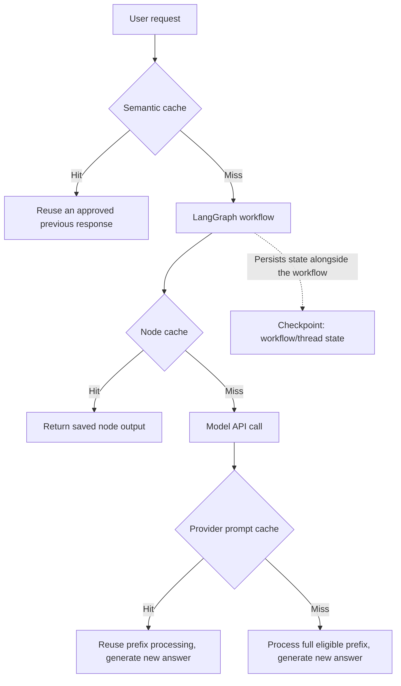

Language models are powerful, but they can also be expensive and slow when called repeatedly with similar inputs. LangChain offers elegant caching mechanisms that help mitigate latency and cost, especially when prototyping or running high-throughput applications.

In this post, we'll walk through why caching matters, how to implement it using LangChain, and show some real-world examples of how caching improves both response time and CPU usage.

## Four Things People Call "Caching" — And Why They're Not the Same

Before getting into the LangChain-style application cache below, it's worth separating out a mechanism that gets confused with it constantly: **provider prompt/prefix caching**, the thing people mean when they mention a "stable prefix." They solve different problems, sit at different layers, and fail in different ways. This section covers prompt/prefix caching in depth, then contrasts it with node caching, semantic caching, and workflow checkpoints — four layers that show up together in any serious agent stack.

### What Is a Stable Prefix?

A **stable prefix** is the fixed, reusable content at the very start of a request — the part that's identical call after call. It typically includes the system instructions, safety guardrails, the output contract, fixed few-shot examples, tool definitions, and any large background document that doesn't change between requests.

Provider prompt caching follows one rule: **static content first, dynamic content last.** Prefix caching matches identical content starting from the beginning of the request. If something that changes — today's timestamp, this user's question, a freshly retrieved passage — sits *before* the stable block, the match breaks before the cache ever reaches the reusable part, and every call pays full price.

The difference is easiest to see side by side. In the first layout, the stable block (`A`) leads and the changing content (`X`/`Y`) trails it, so the identical prefix is intact on both calls:

```text
Request 1:  [A A A A A] [X X]
Request 2:  [A A A A A] [Y Y]
```

In the second layout, the changing content leads instead, so the prompts already diverge near the beginning and the static content that follows can never form a matching prefix:

```text
Request 1:  [X X] [A A A A A]
Request 2:  [Y Y] [A A A A A]
```

That ordering rule is the entire mechanism. Everything else in this section is a consequence of it.

### Prompt-Prefix Caching Is Not Semantic Caching

It's tempting to assume caching is "smart" about meaning, but provider prefix caching asks a much narrower question: *is this an exact match of the leading tokens?* It is not asking whether two requests mean the same thing.

**Semantic caching** is a different, application-level mechanism (covered again below): it embeds the incoming request, compares it against previously cached requests, and reuses a prior result once similarity crosses a threshold. "What is a stable prefix?" and "Can you explain stable prefixes?" are good semantic-cache candidates — a similarity check would likely treat them as close enough to reuse an answer. Under prefix caching, though, they share nothing unless their literal leading tokens match, because prefix caching isn't comparing meaning at all.

:::warning[Common misconception]
Prefix caching does **not** mean the provider returns a previous answer. On a prefix-cache hit, the model still generates a fresh answer — what gets reused is the provider's already-processed internal state for the identical prefix, not the final text.
:::

### What's Actually Reused

Conceptually, a matching request reuses the provider's already-processed representation of an identical prefix instead of recomputing it from scratch. The provider still processes whatever comes after the cache boundary, and it still generates a new answer — two calls sharing a cached prefix are not treated as the same call.

The flow looks like this on a first call, and differs only in step 1 on a later matching call:

- **First request:** the prompt arrives → it's tokenised and processed → the eligible prefix gets cached → the remaining input is processed and the model generates an answer.
- **Later matching request:** the provider recognises an identical eligible prefix → it reuses that cached processing → it processes only the new tail → it generates a new answer.

### Cache Boundaries and Breakpoints

A **cache boundary** (sometimes called a breakpoint) marks exactly where the stable, cacheable part of a prompt ends and the per-request part begins:

```text
===== STABLE, CACHEABLE PREFIX =====
Role: You are an enterprise cost-analysis assistant.
Rules:
  - Use UK English.
  - Only use supplied evidence.
  - Do not estimate missing values.
Output contract:
  1. Summary
  2. Supporting evidence
  3. Limitations
===== CACHE BOUNDARY =====
Current user question: {{user_question}}
Retrieved evidence: {{retrieved_evidence}}
Tool results: {{tool_results}}
Current timestamp: {{timestamp}}
```

Timestamps, random IDs, retrieved documents, and any request-specific value belong **after** the boundary. Each of those is a different string on every call — put one before the boundary and the "stable" prefix isn't actually stable, so the cache never accumulates a hit. The exact mechanics of marking a breakpoint differ by provider and SDK, so check current documentation before wiring one up.

### Who Manages What

Provider prompt caching is usually described as automatic or provider-managed, but that doesn't mean every request is cached with zero configuration — depending on the provider, the application may still need to opt in or attach cache-control metadata to the request. The responsibility split looks roughly like this:

- **The application** builds the prompt, keeps the stable content genuinely deterministic, places dynamic content after the boundary, enables whatever caching option the provider requires, chooses from the provider's supported TTL options, and monitors cache-usage metrics.
- **The provider** operates the underlying cache infrastructure, identifies eligible matching prefixes, stores and retrieves the cached processing state, enforces isolation and expiry, and reports cache-creation/cache-read usage where that's supported.

:::caution[Isolation boundaries are provider-specific]
Don't assume "one API key equals one isolated cache." Multiple API keys can belong to the same workspace or organisation depending on the provider's account structure, and isolation guarantees (workspace-level vs. organisation-level, and whether unrelated customers can ever share a cache) are documented per provider. Verify the current, official behaviour before relying on it for a security argument.
:::

### TTL Controls Availability, Not Matching

TTL ("time to live") is how long a cached entry stays eligible for reuse — it has nothing to do with whether a given request's prefix matches an existing entry. The provider defines which TTL options exist; the application picks from that menu. A longer TTL keeps a rarely-hit but expensive-to-rebuild prefix warm; a short TTL suits a prefix that's called constantly and stays warm on its own. Changing the TTL never turns a non-identical prefix into a match — matching and expiry are two separate questions, and conflating them is a common source of confusion.

### Node Caching, Semantic Caching, and Checkpoints Are Different Layers

Once an application sits inside an orchestration framework like LangGraph, three more mechanisms show up that are easy to lump in with "LLM caching" even though each answers a different question.

- **Node caching** is an orchestration-layer cache keyed on a graph node's input (or a configured cache key). A hit returns the saved node output and **skips running the node entirely** — if that node calls a model, a node-cache hit means no model call happens at all. This is the essential distinction from prefix caching: node caching can skip the call outright; provider prompt caching still makes a call, it just reduces how much of the prefix has to be reprocessed.
- **Semantic response caching** is application-layer: it embeds the request, compares it against previously cached requests, and reuses a prior *answer* above a similarity threshold. It's useful, but risky when two similar-sounding questions differ in a detail that matters — customer, date, permission scope, source version — so it needs careful cache-key design (metadata filters alongside the similarity check), a sensible threshold, and explicit expiry rather than being switched on blindly.
- **Checkpoints** aren't a cache at all. A checkpoint saves graph or thread state — messages, current state, completed steps, workflow position — so a long-running workflow can pause, resume, or recover. A checkpoint answers "where was this workflow, and what state did it have?", which is a different question from anything a cache answers.

The four questions side by side:

| | What's matched | What's reused | Does a model call still happen? | Who manages storage | Who controls TTL | Primary benefit | Main risk | Typical invalidation trigger |
| --- | --- | --- | --- | --- | --- | --- | --- | --- |
| Provider prompt caching | Identical leading tokens (the prefix) | Processed prefix state | Yes | The provider | The provider defines options; the app selects | Cuts repeated prefix processing cost/latency | Silent cache-miss if anything before the boundary changes | Any change to content before the cache boundary |
| Node caching | A node's input or a configured key | The node's saved output | No, if the node is skipped | The application/orchestration layer | The application | Can skip a model call entirely | Stale output if the input change isn't reflected in the cache key | Cache-key version bump |
| Semantic response caching | Embedding similarity to a past request | A prior final answer | No, on a hit | The application | The application | Avoids recomputation for near-duplicate questions | Reuses an answer across requests that differ in an important detail | Similarity threshold miss or metadata filter |
| Checkpointing | N/A — this isn't a cache | Full workflow/thread state | N/A | The application/orchestration layer | The application | Lets a long-running workflow resume or recover | Not a substitute for any of the above; doesn't reduce cost | Workflow completion or explicit reset |



These layers are complementary, but none of them should be switched on blindly — each has different correctness, privacy, staleness, and invalidation considerations, and stacking all four without thinking through each one just multiplies the number of places a stale result can hide.

### Cache Lifecycle Vocabulary and What Breaks a Match

A few terms are worth defining precisely: **cache creation** (a new entry is written), **cache hit** (an eligible match was found and reused), **cache miss** (no eligible match existed), **cache expiry** (an entry aged past its TTL), **cache invalidation** (an entry is explicitly discarded before expiry), **cache-key collision** (two different things are treated as the same key), and **stale cached output** (a hit returned something that's no longer correct).

Seemingly minor changes can silently break a provider prefix match: a different model, changed system instructions, changed tool definitions or tool ordering, prompt formatting changes, a timestamp or random ID inserted before the boundary, or any edit to content before the cache boundary. The safest habit is to monitor the provider's reported cache-usage metrics rather than assume caching worked just because a request felt fast — a fast request can just as easily mean a small prompt, not a cache hit.

### A Realistic Example: An Enterprise Cost-Analysis Agent

Consider an agent with a long, fixed system prompt (safety rules, evidence rules, tool definitions), a changing user question, freshly retrieved financial documents, and a LangGraph workflow with separate retrieval and analysis nodes:

- The fixed system prompt and tool definitions are exactly the stable-prefix candidate — cache them, and keep the question, retrieved documents, and any timestamp after the boundary.
- Deterministic document preprocessing (parsing, normalising a filing) is a good fit for node caching, since the same document input should always produce the same preprocessed output.
- A final answer is **not** a safe candidate for semantic caching here, because the underlying financial data, the user's permissions, or the reporting period can all change between two similar-sounding questions — caching the final answer risks quietly serving stale or wrong information with no error raised.
- Checkpoints let a long-running review session pause and resume without losing its place, independent of whether any of the caches above are hitting.

### Rules of Thumb

1. Static content first, dynamic content last.
2. Exact-prefix caching is not semantic caching.
3. Provider prompt caching reuses processing, not previous answers.
4. Node caching can skip execution entirely; prefix caching still makes a call.
5. Checkpoints preserve workflow state — they are not response caches.
6. TTL and invalidation are different concerns.
7. Version prompts, tools, data, and cache keys so a silent change doesn't hide behind a stale hit.
8. Never cache a permission- or time-sensitive final answer without an explicit security design.
9. Measure cache hits through provider and application telemetry, not the feeling that a call was fast.

## Why Use Caching in LLM Apps?

Without caching:
- Repeated prompts are sent to the LLM, incurring costs.
- Every call takes up valuable computation time.

With caching:
- Previously computed results are returned instantly.
- You save money and reduce model latency.

According to the offical document [How to cache chat model responses](https://python.langchain.com/docs/how_to/chat_model_caching/) and [Lanchina: Redis](https://python.langchain.com/docs/integrations/providers/redis/), there are various backends for caching that LangChain supports:
- In-memory (for quick prototyping)
- SQLite (lightweight persistent cache)
- Redis (fast and scalable networked cache)

Caching provides a lot of value, but each benefit often comes with its own considerations or implementation challenges. Here are some example pairings of utilities and related challenges:

| Utility                       | Related Challenge                                                        |
|------------------------------|---------------------------------------------------------------------------|
| **Latency reduction**        | **Cache invalidation**: Ensuring responses remain fresh over time         |
| **Cost savings**             | **Memory/storage management**: Storing many responses can consume space   |
| **Improved UX**              | **Deterministic hashing**: Slight prompt changes may bypass cache         |
| **Reproducibility**          | **Security**: Sensitive inputs should not be leaked via persistent caches |

Note: These are not strict one-to-one relationships, but rather illustrative pairings that highlight trade-offs to consider when implementing caching.


## Setting Up Caching in LangChain

```python
from langchain.llms import OpenAI
from langchain.globals import set_llm_cache
from langchain.cache import InMemoryCache

# Enable in-memory caching
set_llm_cache(InMemoryCache())

llm = OpenAI(temperature=0)

# First call – hits the LLM and stores in cache
response1 = llm.invoke("What is the capital of France?")
# Second call – retrieves from cache
response2 = llm.invoke("What is the capital of France?")
```

You can swap in other cache types:

```python
from langchain.cache import SQLiteCache, RedisCache

# SQLite
set_llm_cache(SQLiteCache(database_path=".langchain.db"))

# Redis
set_llm_cache(RedisCache(redis_url="redis://localhost:6379/0"))
```

## Measuring Performance: CPU & Wait Time

Let’s simulate an example to compare performance with and without caching:

```python
import time
from langchain.llms import OpenAI
from langchain.globals import set_llm_cache
from langchain.cache import InMemoryCache

llm = OpenAI(temperature=0)

# Without cache
start = time.time()
llm.invoke("List 5 famous painters")
no_cache_time = time.time() - start

# With cache
set_llm_cache(InMemoryCache())
llm.invoke("List 5 famous painters")  # First call caches it
start = time.time()
llm.invoke("List 5 famous painters")  # Cached call
cache_time = time.time() - start

print(f"Without cache: {no_cache_time:.2f} sec")
print(f"With cache: {cache_time:.5f} sec")
```

**Example Output:**
```python
# The exact numbers: (1.4207510948181152, 5.5789947509765625e-05)
Without cache: 1.42 sec
With cache: 0.00005 sec
```

Caching can improve response times by **orders of magnitude**.

## 💡 Best Practices

- Use **in-memory caching** for quick prototyping.
- Use **SQLite or Redis** for persistent or distributed setups.
- Hash prompts deterministically to ensure cache hits.
- Monitor and expire stale cache entries in production.

## Final Thoughts

Caching is one of the simplest yet most effective optimisations you can make in your LangChain-powered LLM applications. It makes your app faster, cheaper, and more responsive.

In production systems or user-facing apps, combining caching with rate limits, streaming responses, and smart batching leads to even greater efficiency.

