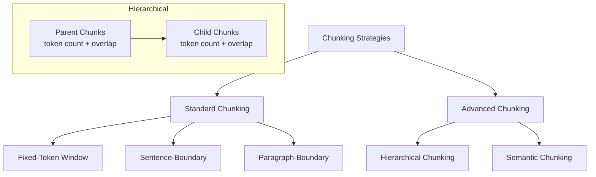
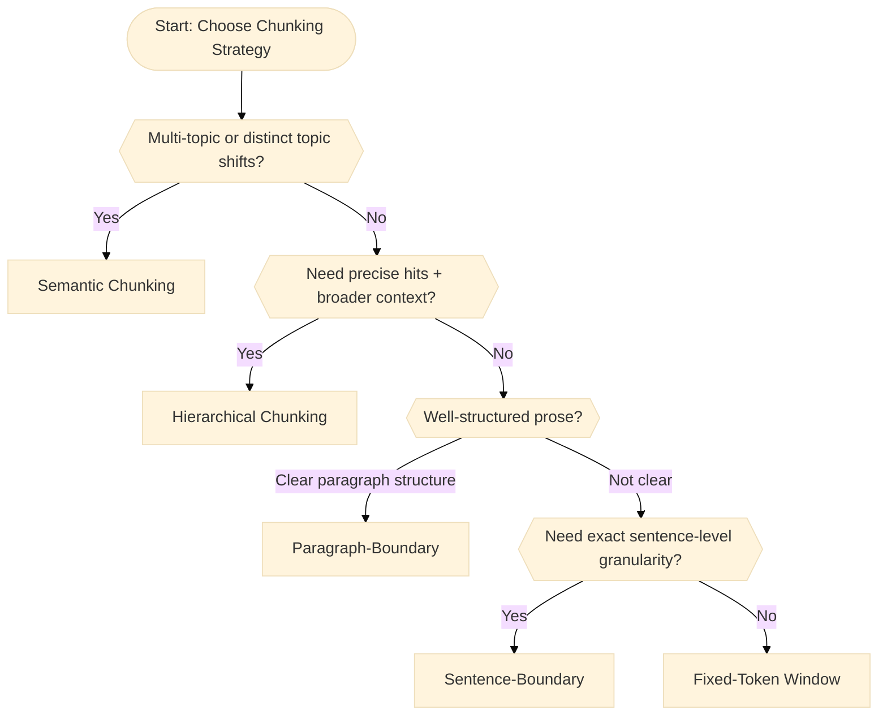

Chunking strategies determine how documents are split into smaller segments ("chunks") before being embedded and stored in a vector database. Selecting the right chunking strategy—whether standard (fixed-token, sentence, paragraph) or advanced (hierarchical, semantic)—is critical for balancing retrieval precision, context relevance, and performance in your retrieval-augmented generation (RAG) application. This guide explains each method clearly, provides code examples, and helps you choose the optimal chunking approach for your use case.

## Overview

Below are the most common strategies that people use. Different platforms provide different kind of strategy out of the box, for example with AWS Bedrock, they provide 3 types of strategies. Reference: [How content chunking works for knowledge bases](https://docs.aws.amazon.com/bedrock/latest/userguide/kb-chunking.html)


- **Standard Chunking**  
  - **Fixed‑Token Window:** uniform token counts (±overlap)  
  - **Sentence‑Boundary:** split on punctuation-delimited sentences  
  - **Paragraph‑Boundary:** split on blank lines or indent markers  
- **Advanced Chunking**  
    - **Hierarchical Chunking** ([AWS doc](https://docs.aws.amazon.com/bedrock/latest/userguide/kb-chunking.html#kb-hiearchical-chunking)):  
        - **Parent chunks:** Break text into coarse windows of token-count + overlap.
        - **Child chunks:** Each parent chunk is split again into smaller token-count windows (+ overlap).
        - **Embedding:** Only embed child chunks. When retrieving, matched child chunks return their parent context for broader understanding.
    - **Semantic/Topic Segments** ([AWS doc](https://docs.aws.amazon.com/bedrock/latest/userguide/kb-chunking.html#kb-semantic-chunking)):  
        - Text is first split into sentences or basic units.
        - Units are embedded using a neural model to capture meaning.
        - Units are accumulated into chunks until semantic similarity (measured by cosine distance) indicates a significant topic shift.
        - Ensures each chunk is meaningfully coherent.


Below is a useful gif that I find easy to understand different type of strategy.


Reference: [9 Chunking Strategies to Improve RAG Performance](https://www.nb-data.com/p/9-chunking-strategis-to-improve-rag)

### Details

How you split text into “chunks” determines the granularity of your retrieval and affects both relevance and performance. Each chunk becomes one row (one vector) in your vector‑store.

1. **Fixed‑Token Window**  
   - **How it works:** Slide a window of *N* tokens (e.g. 200) with *O* tokens overlap (e.g. 50), irrespective of sentence or paragraph boundaries.  
   - **Pros:**  
     - Perfect uniformity—every chunk is the same size  
     - Simple, deterministic and fast  
   - **When to use:**  
     - Unstructured or data‑heavy text (logs, source code)  
     - When you need guaranteed coverage and don’t mind splitting mid‑sentence  
2. **Sentence‑Boundary**  
   - **How it works:** Split on sentence delimiters (`.`, `?`, `!`, etc.). Each chunk is exactly one sentence.  
   - **Pros:**  
     - Exact sentence units with no mid‑sentence cuts  
     - Minimal noise for extractive tasks  
   - **When to use:**  
     - Precise Q&A or fact‑lookup (e.g. chatbot answers)  
     - Documents composed of self‑contained sentences  
3. **Paragraph‑Boundary**  
   - **How it works:** Split on blank lines or indentation markers; each chunk is one paragraph.  
   - **Pros:**  
     - Captures coherent ideas in one chunk  
     - Fewer, larger chunks (smaller index)  
   - **When to use:**  
     - Well‑written prose (blogs, reports, essays)  
     - When paragraphs naturally group single concepts  
4. **Hierarchical** - [AWS document](https://docs.aws.amazon.com/bedrock/latest/userguide/kb-chunking.html#kb-hiearchical-chunking) 
   - **How it works:**  
     1. **Parent chunks:** break document into coarse windows of *M* tokens (+ overlap)  
     2. **Child chunks:** re‑split each parent into smaller windows of *N* tokens (+ overlap)  
     3. **Indexing:** embed only child chunks; at query time, any matching child is “lifted” to its parent text for full context  
   - **Pros:**  
     - Fine‑grained hits plus automatic context expansion  
     - Single flat index of uniformly sized child vectors  
   - **When to use:**  
     - Large, complex docs (legal, manuals, support KBs)  
     - Cases where answers may be small but need broader context  
5. **Semantic / Topic Segments** - [AWS document](https://docs.aws.amazon.com/bedrock/latest/userguide/kb-chunking.html#kb-hiearchical-chunking) 
   - **How it works:**  
     1. Pre‑split text into basic units (typically sentences)  
     2. Compute embeddings for each unit  
     3. Slide a unit‑based window, accumulating units until the **cosine distance** between the next unit and the current chunk exceeds a threshold → start a new chunk  
     4. Optionally include a *buffer* of neighbouring units at each boundary  
   - **Pros:**  
     - Chunks align with actual topic shifts rather than arbitrary lengths  
     - Minimises semantic “noise” within each chunk  
   - **When to use:**  
     - Multi‑topic transcripts, interviews or podcasts  
     - Research papers or reports with clear sub‑topics  

 
:::info What can be stored in one vector space?
- **Scope:**  You can embed anything from a single token to an entire document.  In practice, you choose your “unit”—usually paragraphs or fixed‑length text chunks—and ask:  
  > “Is this *chunk* semantically similar to that *chunk*?”  
- **Word vs Sentence:**  
  You *could* embed single words and compare them (“is ‘happy’ similar to ‘joyful’?”), but embeddings shine when you capture **broader context**.  For Q&A or document search you typically embed and compare whole sentences, paragraphs or sections.
:::


### Decision tree to pick a strategy

Here's the decision tree to make it easier to follow and correctly reflecting chunking strategies:

1. **Semantic Chunking**:  
  Choose first if your text clearly shifts topics (e.g., research papers, podcasts, interviews).
2. **Hierarchical Chunking**:  
  Next best if you need very precise retrieval with guaranteed additional context (e.g., manuals, legal docs).
3. **Paragraph-Boundary**:  
  When content naturally groups into paragraphs (blogs, essays).
4. **Sentence-Boundary**:  
  Ideal if sentence precision is critical (Q&A tasks, factual retrieval).
5. **Fixed-Token Window**:  
  Default strategy when none of the above applies—good for unstructured or consistent data (logs, code).




| Strategy             | Context-aware? | Granularity     | Coherence        | Ideal Use Case               |
|----------------------|----------------|-----------------|------------------|------------------------------|
| **Fixed-Token**      | ❌ No          | Uniform tokens  | Low–Medium       | Logs, code snippets          |
| **Sentence-Boundary**| ✅ Yes (grammar)| Single sentence | High (sentence)  | Precise Q&A, short documents |
| **Paragraph-Boundary**| ✅ Yes (structure)| Paragraph    | High (paragraph) | Blogs, essays                |
| **Hierarchical**     | ❌ No (but context recovered)| Small + large context | Medium–High (context-dependent)| Manuals, long docs |
| **Semantic**         | ✅ Yes (meaning)| Topic segments  | Very high        | Research, interviews         |


## Example

Consider we use the below sample Text for illustration:

> LangChain provides powerful tools to build applications using Large Language Models (LLMs). By carefully chunking text into meaningful segments, you can significantly enhance the accuracy of semantic search and retrieval-augmented generation (RAG).
> 
> Chunking strategies vary widely. For instance, fixed-token chunking slices text uniformly, whereas sentence-boundary and paragraph-boundary methods rely on textual punctuation and structure. 
> 
> Advanced methods, such as hierarchical chunking, provide precise hits and broader context simultaneously, useful in complex documentation scenarios. In contrast, semantic chunking relies on embeddings to detect shifts in topic or meaning, creating highly coherent chunks.


### ① **Fixed-Token Window**

- **Settings:**  
  - Chunk size = 15 tokens, Overlap = 5 tokens
- **Chunks:**
  1. `"LangChain provides powerful tools to build applications using Large Language Models (LLMs). By carefully chunking"`
  2. `"using Large Language Models (LLMs). By carefully chunking text into meaningful segments, you can significantly enhance"`
  3. `"meaningful segments, you can significantly enhance the accuracy of semantic search and retrieval-augmented generation"`
  4. _... (continues uniformly)_

> **What happened here?**  
> The text is sliced uniformly by token count, without consideration for sentence boundaries or logical breaks. Overlaps prevent losing critical context but might lead to repetitive content.

### ② **Sentence-Boundary**

- **Chunks:**  
  1. `"LangChain provides powerful tools to build applications using Large Language Models (LLMs)."`
  2. `"By carefully chunking text into meaningful segments, you can significantly enhance the accuracy of semantic search and retrieval-augmented generation (RAG)."`
  3. `"Chunking strategies vary widely."`
  4. `"For instance, fixed-token chunking slices text uniformly, whereas sentence-boundary and paragraph-boundary methods rely on textual punctuation and structure."`
  5. `"Advanced methods, such as hierarchical chunking, provide precise hits and broader context simultaneously, useful in complex documentation scenarios."`
  6. `"In contrast, semantic chunking relies on embeddings to detect shifts in topic or meaning, creating highly coherent chunks."`

> **What happened here?**  
> Each sentence forms a precise chunk, clearly separating ideas and concepts. However, shorter sentences ("Chunking strategies vary widely.") might lack enough context individually.

### ③ **Paragraph-Boundary**

- **Chunks:**  
  ```
  LangChain provides powerful tools to build applications using Large Language Models (LLMs). By carefully chunking text into meaningful segments, you can significantly enhance the accuracy of semantic search and retrieval-augmented generation (RAG).
  ```
  ```
  Chunking strategies vary widely. For instance, fixed-token chunking slices text uniformly, whereas sentence-boundary and paragraph-boundary methods rely on textual punctuation and structure.
  ```
  ```
  Advanced methods, such as hierarchical chunking, provide precise hits and broader context simultaneously, useful in complex documentation scenarios. In contrast, semantic chunking relies on embeddings to detect shifts in topic or meaning, creating highly coherent chunks.
  ```

> **What happened here?**  
> Each chunk contains a fully developed idea, improving coherence. This is ideal for well-structured, paragraph-based prose.

### ④ **Hierarchical Chunking**

- **Settings:**  
  - **Parent chunks**: ~40 tokens, overlap = 10 tokens  
  - **Child chunks**: ~15 tokens, overlap = 5 tokens

**Parent Chunk Example (1):**
```
LangChain provides powerful tools to build applications using Large Language Models (LLMs). By carefully chunking text into meaningful segments, you can significantly enhance the accuracy of semantic search and retrieval-augmented generation (RAG).
```

**Child Chunks (from Parent 1):**
- `"LangChain provides powerful tools to build applications using Large Language Models (LLMs). By carefully chunking"`
- `"Models (LLMs). By carefully chunking text into meaningful segments, you can significantly enhance the"`

**What happens at retrieval?**
- If a child chunk matches a query, the full parent chunk is returned, ensuring precise hits (child) plus broader context (parent).

### ⑤ **Semantic/Topic Segments**

- **Process (simplified):**  
  - Split into sentences  
  - Embed sentences  
  - Group sentences until embedding dissimilarity exceeds threshold

**Chunks (example):**
- **Chunk 1:** (Introduction & goal)
  ```
  LangChain provides powerful tools to build applications using Large Language Models (LLMs). By carefully chunking text into meaningful segments, you can significantly enhance the accuracy of semantic search and retrieval-augmented generation (RAG).
  ```
- **Chunk 2:** (Standard methods explanation)
  ```
  Chunking strategies vary widely. For instance, fixed-token chunking slices text uniformly, whereas sentence-boundary and paragraph-boundary methods rely on textual punctuation and structure.
  ```
- **Chunk 3:** (Advanced methods explanation)
  ```
  Advanced methods, such as hierarchical chunking, provide precise hits and broader context simultaneously, useful in complex documentation scenarios. In contrast, semantic chunking relies on embeddings to detect shifts in topic or meaning, creating highly coherent chunks.
  ```

> **What happened here?**  
> Chunks align naturally with logical topic shifts, providing the most meaningful and coherent retrieval units, especially ideal for topic-rich content.


## Hierarchical vs Semantic

:::info TL;DR
- **Hierarchical** = “two sizes of blind windows, with parent → child splitting, and context recovered at query time.”  
- **Semantic** = “dynamic, meaning‑driven boundaries that stop exactly where content shifts.”  

Choose **hierarchical** when you need guaranteed tiny hits + guaranteed broader context, and **semantic** when you need chunks that themselves are fully coherent ideas.
:::


### Key Difference

At a glance, both **Hierarchical** and **Semantic** chunking produce multi‑level segments, but their driving principles (and practical outcomes) are quite different:

| Aspect                  | Hierarchical                                                     | Semantic / Topic Segments                                        |
|-------------------------|------------------------------------------------------------------|------------------------------------------------------------------|
| **Driving signal**      | Fixed token counts + overlap                                      | Measured meaning (via embeddings)                                |
| **Chunk boundaries**    | Blind to content—purely sliding windows at two scales (parent → child) | Break where semantic drift is detected between adjacent units    |
| **Chunk size control**  | You pick both parent *M* and child *N* sizes                      | Chunk sizes adapt to topic‑coherence until drift threshold met   |
| **Context recovery**    | Child hits are “lifted” to their parent chunk at retrieval       | Each chunk is already a self‑contained, coherent topic segment   |
| **Risk of “too small”** | Child chunks can indeed lack enough context if you pick *N* too small—but you always get the larger parent chunk back at retrieval. | Chunks won’t be “too small” to make sense—they stop growing only when the topic truly shifts. |

### Why Hierarchical Can Feel “Too Small”  
A child chunk is simply an *N*-token window—it has no guarantee of containing a full argument, definition or answer. If you choose *N*=50 tokens for pinpoint precision, you may end up with snippets that:

- Cut mid‑idea  
- Omit surrounding context needed for RAG to answer  

Bedrock’s reply to that is:  
> “Embed only these tiny child windows, but when returning results, swap each matching child for its *parent* (M‑token) window so you get broader context around your match.” citeturn0view0

If your *parent* window is still too narrow to cover the full answer, you’ll need to bump up that parent size—there’s no semantic gating at play.

### Why Semantic Chunking “Understands” Meaning

1. **Embed small units** (sentences or short spans) to get their vector representations.  
2. **Measure cosine distance** between each unit’s embedding and the embedding of the chunk‑so‑far.  
3. **Accumulate units** into the current chunk **while** the next unit is “close enough” (below your dissimilarity threshold).  
4. **Start a new chunk** only when meaning truly drifts—so each chunk is maximally coherent.  

Because you’re comparing **vectors of meaning**, these chunks align with actual topic or idea boundaries, not arbitrary token counts. You get neither half‑sentences nor page‑long amalgams—just self‑contained “thoughts.”


### When to Prefer Which

- **Hierarchical**  
  - You **don’t** have strong semantic‑split requirements, but you **do** need:  
    - Ultra‑precise match points  
    - Immediate access to a broader context (via parent)  
  - Tweak *N* and *M* until your child is precise and your parent covers the answer.
- **Semantic**  
  - You want chunks that naturally map to “one idea” or “one sub‑topic” without post hoc merging.  
  - Your text shifts topics frequently (multi‑topic transcripts, research papers).  
  - You have compute budget for extra embedding‑and‑distance checks during chunking.


## Chunking code example in LangChain

Below are demo snippets for the three most common approaches. In each case, `text` is your raw string (or a list of documents), and the returned `chunks` can be embedded and stored in your vector DB. Also, I found a very good [repository](https://github.com/langchain-ai/text-split-explorer?tab=readme-ov-file) that you can play around with the TextSplitter with Langchain.

### Fixed‑Token Window Chunking

Uses the same tokenizer as your LLM (e.g. tiktoken) to split by token count.

```python
from langchain.text_splitter import TokenTextSplitter

# Initialise splitter with token counts
token_splitter = TokenTextSplitter.from_tiktoken_encoder(
    encoding_name="gpt2",    # or your model’s tokenizer
    chunk_size=200,           # max tokens per chunk
    chunk_overlap=50,         # tokens to overlap
)

# Split your text
chunks = token_splitter.split_text(text)
```

### Sentence‑Boundary Chunking

Splits purely on sentence delimiters for exact sentence units.

```python
from langchain.text_splitter import SentenceSplitter
sentence_splitter = SentenceSplitter() # Initialise simple sentence splitter
chunks = sentence_splitter.split_text(text) # Split into one‐sentence chunks
```

### Paragraph‑Boundary Chunking

Splits on blank lines (or other paragraph markers), with optional size limits.

```python
from langchain.text_splitter import RecursiveCharacterTextSplitter

# Initialise with paragraph separator and size controls
paragraph_splitter = RecursiveCharacterTextSplitter(
    separators=["\n\n"],   # split on empty lines
    chunk_size=1000,        # max characters per chunk
    chunk_overlap=100,      # characters to overlap
)

# Split into paragraph chunks
chunks = paragraph_splitter.split_text(text)
```


