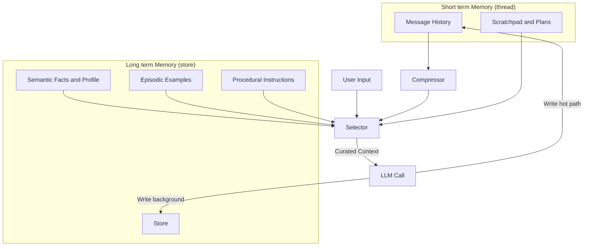

## Why Context Engineering Matters

Modern agents interleave LLM calls with tool use, scratchpads, and persistence. While foundation models keep improving, their outputs are limited by a **finite context window** — think of it as the RAM for an LLM “CPU.”

* If context is managed poorly, agents suffer:

  * **Context poisoning** → irrelevant or malicious details pollute reasoning.
  * **Context distraction** → too much noise reduces accuracy.
  * **Context confusion** → mixing different roles or sources derails logic.
  * **Context clash** → conflicting facts reduce consistency.

👉 Context engineering is the **discipline of filling the context window intelligently** — ensuring the right data, at the right time, in the right form.

It’s becoming the **#1 job of AI engineers** because bigger models and longer context lengths don’t solve the deeper issue: *which information matters most right now?*

:::warning Context Problems
When agents accumulate too much context, performance suffers in well-documented ways:

* **[Context poisoning](https://www.dbreunig.com/2025/06/22/how-contexts-fail-and-how-to-fix-them.html?ref=blog.langchain.com#context-poisoning)** → when a hallucination or bad data slips into context and contaminates reasoning.
* **[Context distraction](https://www.dbreunig.com/2025/06/22/how-contexts-fail-and-how-to-fix-them.html?ref=blog.langchain.com#context-distraction)** → when too much context overwhelms the model and lowers accuracy.
* **[Context confusion](https://www.dbreunig.com/2025/06/22/how-contexts-fail-and-how-to-fix-them.html?ref=blog.langchain.com#context-confusion)** → when irrelevant or superfluous details bias the response.
* **[Context clash](https://www.dbreunig.com/2025/06/22/how-contexts-fail-and-how-to-fix-them.html?ref=blog.langchain.com#context-clash)** → when different parts of the context contradict each other, reducing consistency.

These are risks of *long context windows in general*, regardless of whether memory is used.
:::

## The Four Core Strategies of Context Engineering

LangChain’s framework highlights four complementary strategies:

<iframe width="100%" height="315" src="https://www.youtube.com/embed/4GiqzUHD5AA?si=hDfyKwFfMz2h9IMM" title="YouTube video player" frameborder="0" allow="accelerometer; autoplay; clipboard-write; encrypted-media; gyroscope; picture-in-picture; web-share" referrerpolicy="strict-origin-when-cross-origin" allowfullscreen></iframe>

* Write Context
    * 
    * Store knowledge *outside* the context window for later reuse.
    * Examples: scratchpads for intermediate reasoning or plans; memories (short-term or long-term) for persistence across steps or sessions.
* Select Context
    * Choose the most relevant subset to bring back into the window.
    * Approaches: embeddings, retrieval rules, knowledge graphs, policies.
    * Challenge: *wrong selection feels like hallucination*, even if the model is accurate.
* Compress Context
    * 
    * Fit more signal into fewer tokens.
    * Techniques: summarisation, clustering, higher-level abstraction.
    * Benefits: reduces cost, latency, and distraction while retaining essentials.
* Isolate Context
    * Separate streams so they don’t interfere.
    * Examples: keep execution logs apart from system instructions; route different tasks through different subgraphs.

## Memory in Context Engineering

Among the four strategies, **memory is the backbone**. Without it, every LLM call starts from zero. With poorly designed memory, agents bloat, drift, or leak. With well-designed memory, agents become adaptive, personal, and persistent.

:::warning Failure Modes and Mitigations

Beyond generic context issues, persistent memory introduces its own design challenges:

* **Over-insertion vs over-updating** → if memory always creates new entries, it bloats; if it always overwrites, important history is lost. Use schema validation and evaluation tooling (e.g. LangSmith) to tune behaviour.
* **Leakage across tasks** → without namespace isolation, one thread’s memory can bleed into another. Scope memories tightly and enforce retrieval policies.
* **Cold vs hot confusion** → real-time (hot) memories may conflict with background-distilled summaries. A clear strategy for merging prevents clutter or contradictions.

These pitfalls are less about token limits and more about **how memories are written, organised, and recalled** in persistent systems.
:::

### Memory Types (What is Stored)

| Memory Type | What is Stored | Human Example              | Agent Example       |
| ----------- | -------------- | -------------------------- | ------------------- |
| Semantic    | Facts          | Things I learned in school | User profile, preferences, known facts |
| Episodic    | Experiences    | Things I did               | Past trips, previous tool-call traces |
| Procedural  | Instructions   | Instincts or motor skills  | Agent system prompt, planning policies |

These are **content categories**: the *kind* of information an agent can remember.

### Memory Scope (Where it is Stored)

* **Short-Term (Thread-Scoped)**
  * Lives only for the duration of a conversation or task.
  * Tracks **active state**: conversation history, scratchpads, retrieved docs, or temporary constraints.
  * Example: in a Kraków trip planning chat, short-term memory holds the itinerary draft, today’s budget, and intermediate search results.
* **Long-Term (Cross-Thread)**
  * Persists across sessions in a memory **store** organised as `(namespace, key, value)`.
  * Stores **durable knowledge and patterns** for reuse.
  * Example: remembering dietary restrictions, retaining past itineraries, updating planning rules after feedback.

### Memory Matrix: Scope × Type

| Scope → / Type ↓ | Semantic (Facts)                                                                                           | Episodic (Experiences)                                                                                                                                          | Procedural (Rules)                                                                                                           |
| ---------------- | ---------------------------------------------------------------------------------------------------------- | --------------------------------------------------------------------------------------------------------------------------------------------------------------- | ---------------------------------------------------------------------------------------------------------------------------- |
| **Short-Term**   | Facts only needed *for this conversation*.  Example: “User said the trip should cost less than £1,000.” | A temporary example used to guide behaviour in the current task.  Example: “Earlier in this chat, the user liked when the itinerary included evening walks.” | Temporary rule just for this session.  Example: “Format the answer as bullet points because the user asked right now.”    |
| **Long-Term**    | Facts remembered *across all conversations*.  Example: “User is vegetarian and lives in London.”        | Experiences carried forward from past interactions.  Example: “Last summer, the user booked a 3-day trip to Kraków and liked the food market tour.”          | Standing instructions that shape all responses.  Example: “Always include transport options when suggesting itineraries.” |

This **matrix view** shows the full design space of memory:
- **Type = what is stored.**
- **Scope = how long it is stored.**

Together, they determine whether a memory is ephemeral or persistent, factual or experiential, or whether it encodes data, behaviour, or policy.

:::info Explain in pain english
* **Short-term** is like your “working memory” — things you only need for the current conversation.
  * *Analogy:* remembering a restaurant order while you’re still at the table.
* **Long-term** is like your “personal history” — things you keep across sessions.
  * *Analogy:* remembering that your friend doesn’t eat pork, no matter when you next see them.
* **Semantic** = factual knowledge.
* **Episodic** = memories of past actions.
* **Procedural** = rules or “how to do things.”

So:
* A **short-term semantic memory** is: “Today’s budget is £1,000.” → only relevant for *this chat*.
    * A **short-term episodic memory** is: “Earlier today, user liked seeing museums in the itinerary.”
    * A **short-term procedural memory** is: “Summarise as bullet points (user asked just now).”
* A **long-term semantic memory** is: “User avoids pork.” → relevant in *every trip*.
    * A **long-term episodic memory** is: “In April, user went to Vienna and enjoyed local jazz clubs.”
    * A **long-term procedural memory** is: “Always suggest cultural options alongside food.”
:::

## Memory Lifecycle

Defining memory types and scope explains *what* and *where* information is stored.  
But in practice, building effective agents also requires managing the *lifecycle* of memory:  
- **Writing and updating** memories during or after interactions.  
- **Storing and retrieving** them in a structured way for later use.  

This section covers how memories are created, updated, stored, and recalled—  
turning abstract concepts like “semantic” or “episodic” memory into concrete design choices that affect cost, latency, and user trust.

### Writing and Updating Memories

Source: [Github - Memory](https://github.com/langchain-ai/langgraph/blob/main/docs/docs/concepts/memory.md)

* **In the hot path:**
  * Written during runtime (e.g., immediately saving a new preference).
  * Pros: immediate relevance; transparent to users.
  * Cons: adds latency; agent must multi-task.
* **In the background:**
  * Batch distillation (e.g., nightly jobs to merge profiles or curate exemplars).
  * Pros: no latency overhead; cleaner consolidation.
  * Cons: freshness lag; scheduling complexity.

👉 Best practice: use **hot path for critical facts**, background for larger-scale summarisation and consolidation.

### Storing and Retrieving Memories

Designing memory is not just about *what* to store, but also *how* to store, organise, and retrieve it efficiently. LangGraph provides a **key–value store abstraction** where every memory entry follows the schema:`(namespace, key, value)`

* **Namespace** – like a folder (e.g., `user_id`, `trip_id`, `application_context`).
* **Key** – like a filename, identifying a memory in that namespace (e.g., `"profile"`, `"trip-Apr2025"`).
* **Value** – a JSON object holding facts, examples, or instructions.

#### Search and Retrieval

Agents rarely need the *entire* memory store. Instead, they retrieve selectively:

* **Filter by namespace/labels** → ensures only the relevant user/thread context is considered.
* **Semantic search (vector embeddings)** → finds memories by meaning, not just key match.
* **Hybrid approaches** → combine metadata filters (“user=123, type=trip”) with semantic similarity (“budget trips in Europe”).

**Example:**  
User asks: *“Plan 3 days in Kraków with food and history focus.”*  
The retrieval pipeline might fetch:
- **Semantic facts**: `"diet": "no pork"`, `"budget": "mid"`.
- **Episodic traces**: past examples of 3-day cultural itineraries.
- **Procedural rules**: “Offer pacing options if >10km walking/day.”

#### The Retrieval Workflow

1. **Write to memory store** – store new facts, experiences, or rules as JSON.
2. **Select relevant items** – filter and rank them with embeddings.
3. **Compress / Summarise** – reduce long histories into concise frames like `{goals, constraints, outcomes}`.
4. **Isolate before injection** – facts become constraints, episodes become examples, rules become system instructions.

## Diagram: Memory-Centric Context Flow

* **User Input (U):** new query or instruction.
* **Message History (H):** short-term thread memory managed in agent state via checkpoints.
* **Scratchpad/Plans (W):** notes or intermediate reasoning (LangGraph supports scratchpads as part of state).
* **Semantic/Episodic/Procedural (P/E/I):** long-term memory types, stored as JSON docs in namespaces.
* **Store (LT):** the persistent backend (in-memory, DB-backed, or vector DB) that holds long-term memory.
* **Compressor (C):** summarisation/abstraction of histories to fit context windows.
* **Selector (S):** retrieval logic that decides what context to bring into the LLM (combining filters, embeddings, and policies).
* **LLM Call (LLM):** the model inference step.
* **Write hot path:** saving facts/preferences immediately to short-term state.
* **Write background:** saving, distilling, or merging into long-term store asynchronously.

## Practical Guidance for Builders

### Implementation Checklist

* **Design schema first:** define semantic, episodic, procedural slots.
* **Choose write strategy:** hot path for critical facts; background jobs for profiles/exemplars.
* **Add guardrails:** schema constraints, moderation, rollback/versioning.
* **Select precisely:** retrieval policies are as important as model choice.
* **Compress smartly:** don’t inject raw histories; summarise into goals, constraints, outcomes.
* **Isolate channels:** keep instructions, memory recall, and scratchpads separate.
* **Measure performance:** track “memory hit rate” and “user trust,” not just accuracy.

### Key Lessons

* **Context engineering is as critical as model tuning.** Bigger windows don’t fix bad selection.
* **Memory is the backbone.** Short-term = smooth conversation; long-term = durable knowledge.
* **Retrieval quality = user trust.** Wrong recalls feel like hallucinations.
* **Design for confidence, not just accuracy.** Schema, isolation, reversibility, and transparency are adoption drivers.

✅ **The real differentiator in agents isn’t smarter models, but smarter context engineering.**

## References

* [Arxiv – Cognitive Architectures for Language Agents (CoALA)](https://arxiv.org/pdf/2309.02427)
* [LangChain Blog – Context Engineering](https://blog.langchain.com/context-engineering-for-agents/)
