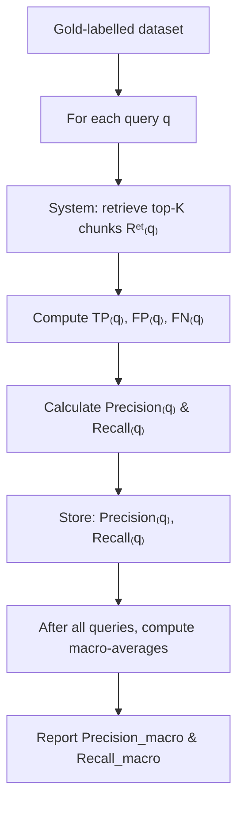

When you design a chunking strategy for a Retrieval‐Augmented Generation (RAG) pipeline, you ultimately want to know **how well** that strategy allows your system to locate the “right” piece of text (i.e. the relevant chunk) given a user’s query. Two of the most common metrics in Information Retrieval (IR) are **precision** and **recall**. In simple terms:

* **Precision** asks: *“Of all the chunks my system returned, how many were actually relevant?”*
* **Recall** asks: *“Of all the truly relevant chunks (the gold labels), how many did my system retrieve?”*

Below, we walk through each step of the evaluation process—from creating a gold dataset to computing macro‐averaged precision and recall—emphasising the areas where confusion often arises.

## Steps 

### 1. Preparing the Gold (Labelled) Dataset

Before you can compute precision/recall, you need a “ground‐truth” or **gold dataset**. In our context, that means for each query you know exactly which chunk ID(s) in your chunked documents contain the correct answer.

1. **Collect a representative set of documents.**
   Ideally, choose documents that mirror the variety (length, style, domain) of what your RAG system will handle in production. Aim for a few hundred if possible.

2. **Decide on evaluation queries.**
   For each document, write one or more sample queries whose answers lie **entirely within a single contiguous span of text** (so that they map neatly to one chunk, or perhaps two adjacent chunks).

   * *Example:* In a Wikipedia page about “London Transport,” you might ask “What is the average daily ridership of the London Underground?”

3. **Run your chunker on every document.**
   Suppose your chunker splits each document into fixed‐length segments (e.g. 1 000 characters with 200 characters overlap). After chunking, assign each segment a unique ID, such as `doc123_chunk_0`, `doc123_chunk_1`, …, `doc123_chunk_7`.

4. **Manually label the relevant chunks.**
   For each pair `(document, query)`, a human (or team of humans) inspects the chunked text and notes which chunk ID(s) fully contain the answer.

   * If the answer lies entirely within one chunk, that chunk ID is “relevant.”
   * If it straddles two chunks, you can either label both chunk IDs as relevant or decide to merge them first (and then re‐chunk).

   A simple **CSV/JSON table** might look like this:

   | document\_id | query                                         | relevant\_chunk\_ids          |
   | ------------ | --------------------------------------------- | ----------------------------- |
   | doc123       | What is the average daily ridership of the …? | \[doc123\_chunk\_4]           |
   | doc123       | Which tube lines intersect at King’s Cross?   | \[doc123\_chunk\_9]           |
   | doc456       | When was the Data Science meetup founded?     | \[doc456\_chunk\_2, chunk\_3] |

   That table—document IDs, queries, and lists of relevant chunk IDs—is your **gold dataset**.

### 2. Understanding True Positives (TP), False Positives (FP) and False Negatives (FN)

Even experienced practitioners sometimes get confused about TP, FP and FN. In our chunking context:

* **True Positives (TP₍q₎)** for a query *q*:
  The number of chunk IDs that **both** your system retrieved and are in the gold set.

  > TP = | \{retrieved\_chunk\_ids\} ∩ \{gold\_chunk\_ids\} |

* **False Positives (FP₍q₎)** for a query *q*:
  The number of chunk IDs that your system retrieved, but are **not** in the gold set.

  > FP = | \{retrieved\_chunk\_ids\} \ \ \{gold\_chunk\_ids\} |

* **False Negatives (FN₍q₎)** for a query *q*:
  The number of chunk IDs in the gold set that your system **failed** to retrieve.

  > FN = | \{gold\_chunk\_ids\} \ \ \{retrieved\_chunk\_ids\} |

> **Key point (often confusing):**
>
> * TP counts only the *overlap* between retrieved chunks and gold chunks.
> * FP counts “extra” chunks your system pulled that aren’t in the gold set.
> * FN counts the gold chunks you missed entirely.

If you imagine a simple Venn diagram of `{retrieved}` vs `{gold}`, TP is the intersection, FP is the slice of `{retrieved}` outside the intersection, and FN is the slice of `{gold}` outside. We ignore True Negatives (i.e. chunks that are neither retrieved nor gold), because the total number of non‐relevant chunks is typically enormous and unhelpful for IR metrics.

### 3. Calculating Precision and Recall for a Single Query

Given TP₍q₎, FP₍q₎, FN₍q₎ for a query *q*, define:

> **Precision₍q₎** = TP₍q₎ ⁄ (TP₍q₎ + FP₍q₎)
> **Recall₍q₎**    = TP₍q₎ ⁄ (TP₍q₎ + FN₍q₎)

* **Precision₍q₎** answers: *“Of all the chunks I retrieved for query *q*, what fraction truly contained the answer?”*
* **Recall₍q₎** answers: *“Of all the chunks that truly contained the answer for *q*, what fraction did I actually retrieve?”*

> **Watch out for division by zero!**
>
> * If your system retrieved no chunks (TP+FP = 0), define Precision₍q₎ = 0.
> * If there are no gold chunks (TP+FN = 0), it’s customary to set Recall₍q₎ = 0 (or skip that query if it never occurs).

### 4. Aggregating Across All Queries (Macro vs Micro)

When you have a collection of *N* evaluation queries, you want a single “overall” precision and recall. Two common methods:

1. **Macro-Averaging** (treats each query equally)

   > Precision\_macro = (1/|Q|) ∑₍q∈Q₎ Precision₍q₎
   > Recall\_macro    = (1/|Q|) ∑₍q∈Q₎ Recall₍q₎

   That is, compute precision/recall for each query, then average them.

   * **When to use:** If you care about performance on every individual query equally—especially helpful when some queries have multiple relevant chunks and some only one.
   * **Benefit:** A single query with hundreds of gold chunks doesn’t dominate the metric.

2. **Micro-Averaging** (aggregates counts first)

   > TP\_total = ∑₍q∈Q₎ TP₍q₎
   > FP\_total = ∑₍q∈Q₎ FP₍q₎
   > FN\_total = ∑₍q∈Q₎ FN₍q₎
   > Precision\_micro = TP\_total ⁄ (TP\_total + FP\_total)
   > Recall\_micro    = TP\_total ⁄ (TP\_total + FN\_total)

   * **When to use:** If you want to emphasise *absolute* retrieval counts. Queries with many relevant chunks carry more weight.
   * **Pitfall:** A few “easy” queries with many gold chunks can skew the overall score.

> **Most chunking‐strategy evaluations prefer Macro-Averaging** so that each query counts equally, regardless of how many chunks are labelled gold.

## Example Walkthrough

Let’s work through a small, concrete example. Suppose you have 3 evaluation queries *q₁*, *q₂* and *q₃*. The gold labels and system outputs are:

| Query | Gold chunk IDs | Retrieved chunk IDs |
| ----- | -------------- | ------------------- |
| *q₁*  | \{A, B}         | \{A, C}              |
| *q₂*  | \{D}            | \{D}                 |
| *q₃*  | \{E, F, G}      | \{F, H, I}           |

1. **Compute TP, FP, FN per query.**

   * For *q₁*:
     • TP₁ = | \{A, B\} ∩ \{A, C\} | = 1  (only “A” is correct)
     • FP₁ = | \{A, C\} \ \{A, B\} | = 1  (chunk “C” is a false positive)
     • FN₁ = | \{A, B\} \ \{A, C\} | = 1  (chunk “B” was relevant but missed)

   * For *q₂*:
     • TP₂ = | \{D\} ∩ \{D\} | = 1
     • FP₂ = | \{D\} \ \{D\} | = 0
     • FN₂ = | \{D\} \ \{D\} | = 0

   * For *q₃*:
     • TP₃ = | \{E, F, G\} ∩ \{F, H, I\} | = 1  (only “F”)
     • FP₃ = | \{F, H, I\} \ \{E, F, G\} | = 2  (“H” and “I” are spurious)
     • FN₃ = | \{E, F, G\} \ \{F, H, I\} | = 2  (“E” and “G” were missed)

2. **Compute Precision₍q₎ and Recall₍q₎ for each.**

   * For *q₁*:
     • Precision₁ = TP₁ / (TP₁ + FP₁) = 1 / (1 + 1) = 0.5
     • Recall₁    = TP₁ / (TP₁ + FN₁) = 1 / (1 + 1) = 0.5

   * For *q₂*:
     • Precision₂ = 1 / (1 + 0) = 1.0
     • Recall₂    = 1 / (1 + 0) = 1.0

   * For *q₃*:
     • Precision₃ = 1 / (1 + 2) = 0.333…
     • Recall₃    = 1 / (1 + 2) = 0.333…

3. **Macro-average (treat each query equally).**

   * Precision\_macro = (0.5 + 1.0 + 0.333…) / 3 ≈ 0.611
   * Recall\_macro    = (0.5 + 1.0 + 0.333…) / 3 ≈ 0.611

   Notice how each query’s score contributes equally.

4. **Micro-average (aggregate counts first).**

   * TP\_total = 1 + 1 + 1 = 3
   * FP\_total = 1 + 0 + 2 = 3
   * FN\_total = 1 + 0 + 2 = 3
   * Precision\_micro = 3 / (3 + 3) = 0.5
   * Recall\_micro    = 3 / (3 + 3) = 0.5

   You can see that micro‐averaging gives 0.5 for both, because it “weighs” queries with more chunks more heavily.

## Common Pitfalls and Clarifications

1. **Confusing FP with FN.**

   * **False Positive (FP):** Chunk **returned** but **not** in the gold set.
   * **False Negative (FN):** Chunk in the gold set that was **not** returned.

2. **Division–by–zero cases.**

   * If your system returns zero chunks for a query that has gold labels, Precision₍q₎ = 0 (because TP+FP = 0 implies numerator = 0).
   * If a query somehow has no gold labels (rare if every query is answerable), you can either skip it or define Recall₍q₎ = 0.

3. **Multiple relevant chunks per query.**

   * Some queries genuinely span more than one chunk (e.g. a long paragraph was split in half). In that case, your gold set might be `{chunk_4, chunk_5}`. A perfect system would retrieve both. Failing to retrieve one counts as a false negative; retrieving an extra chunk counts as a false positive.

4. **Precision\@K and Recall\@K.**

   * Often you restrict your system to return exactly the top K chunks (e.g. K = 3). Then you compute precision and recall on those top 3 only. That is, retrieved\_chunk\_ids = top‐3 suggestions.
   * You can report Precision\@1, Precision\@3, Recall\@1, Recall\@3, etc.

5. **F₁ Score (optional).**

   * If you want a **single metric** balancing precision and recall, you can compute the harmonic mean for each query:

     > F₁₍q₎ = 2 · (Precision₍q₎ · Recall₍q₎) / (Precision₍q₎ + Recall₍q₎)
   * Then macro-average F₁₍q₎ over all queries. However, F₁ can sometimes obscure whether your system favours precision or recall, so use with caution.

## Pseudocode Summary

Below is a Python‐styled pseudocode snippet showing how to calculate macro-averaged precision and recall once you have:

* `gold_labels`: a dictionary mapping each query → set of gold\_chunk\_ids
* `retrieve_chunks(query)` → list of chunk\_ids your system returns

```python
metrics = []
for q in gold_labels:
    # 1. Get the gold set and retrieved set (as Python sets)
    gold_set = set(gold_labels[q])          
    retrieved_set = set(retrieve_chunks(q))  

    # 2. Compute true positives (TP), false positives (FP), false negatives (FN)
    tp = len(gold_set & retrieved_set)          
    fp = len(retrieved_set - gold_set)       
    fn = len(gold_set - retrieved_set)       

    # 3. Compute precision and recall (avoid division by zero)
    precision_q = tp / (tp + fp) if (tp + fp) > 0 else 0.0
    recall_q    = tp / (tp + fn) if (tp + fn) > 0 else 0.0

    metrics.append((precision_q, recall_q))

# 4. Macro-averaged precision & recall:
P_macro = sum(p for p, r in metrics) / len(metrics)
R_macro = sum(r for p, r in metrics) / len(metrics)

print(f"Macro Precision: {P_macro:.3f}")
print(f"Macro Recall:    {R_macro:.3f}")
````

> **Note:** Replace `retrieve_chunks(q)` with however you actually fetch your top-K chunks (e.g. embedding search + BM25).

## Visual Flowchart



## Putting It All Together: Recommendations

1. **Label carefully.**
   The quality of your gold dataset directly drives the validity of your precision/recall scores. If annotators disagree, refine guidelines (e.g. “pick the chunk containing the first complete sentence of the answer”).
2. **Choose the right *K*.**
   * If you expect users only look at the top result, measure Precision\@1, Recall\@1.
   * If your RAG pipeline can fuse multiple retrieved chunks, measure Precision\@3 or Recall\@3.
3. **Use Macro-Averaging.**
   Unless you have a strong reason to weigh large‐gold‐chunk queries more heavily, macro-average to treat each query equally.
4. **Analyse failure cases.**
   * When recall is low, inspect whether the answer spanned a boundary (two chunks), suggesting you might need larger or semantically driven chunk sizes.
   * When precision is low, check if your retrieval model (BM25, embedding, LTR) is over‐fetching loosely related chunks.
5. **Report with context.**
   Include not just the final numbers—“Precision\_macro = 0.67; Recall\_macro = 0.54”—but also:
   * The average number of relevant chunks per query.
   * The average K used.
   * Any F₁ scores or Precision\@1/Recall\@1 breakdowns.

By carefully constructing a gold dataset of `(query ⇒ relevant_chunk_ids)`, and then counting **true positives**, **false positives**, and **false negatives**, you can compute **precision** and **recall** for each query. Macro‐averaging those per‐query scores gives you an overall sense of how well your chunking strategy allows the retrieval component to surface the correct chunk(s). As you experiment with different chunk sizes or semantic‐split approaches, these metrics will guide you to the strategy that best balances returning focused, relevant text (high precision) against covering all truly relevant pieces (high recall).
