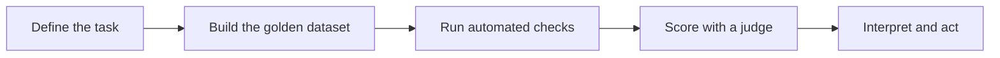

When applying evaluation, consider the following approaches:

1. **Offline Evaluation**  
   Suitable for prompts requiring a known reference answer (e.g., correctness checks).
2. **Online Evaluation**  
   Used for prompts without a strict reference, letting you assess the system in real-time scenarios.
3. **Pairwise Evaluation**  
   Compares answers from different RAG chains or configurations based on user-defined criteria such as format or style.

:::info Pointwise vs Pairwise Evaluation

Source: [Arxiv - Large Language Models for Information Retrieval](https://arxiv.org/abs/2308.07107)

Pointwise methods measure relevance between a query and a single document. Subcategories include relevance generation and query generation, both effective in zero-shot document reranking.
:::

## Evals as Acceptance Criteria, Not a QA Afterthought

The standard instinct is to build a system, see if it looks right, and test later. That ordering has a real cost: if a behavior has no eval, there is no reliable way to know whether that behavior is present, which means every subsequent change to the system is unverifiable.

Writing the eval suite before production code forces three things that are otherwise easy to defer:

- Stating what success means in measurable terms, instead of a vague intuition.
- Exposing design assumptions early, when they are still cheap to change.
- Providing a gate that can say whether a model swap, a prompt revision, or a new retrieval strategy actually improved the system, rather than just felt different.

An eval suite belongs at the start of the build, not at the end as a QA step.

### The Eval Workflow: From Task Definition to Result

A well-constructed eval workflow runs through five sequential stages, and each stage produces an artifact the next stage consumes.

| Stage | What happens | Output |
| --- | --- | --- |
| Define the task | State the behavior being evaluated in specific, measurable terms, and write the prompt used to test it. A vague definition produces a vague eval. | A task specification with a test prompt and pass criteria |
| Build the golden dataset | Assemble the inputs the system will actually encounter, including edge cases and counterexamples. If the dataset is not representative, the scores are not meaningful. | A labeled dataset with expected outputs |
| Run automated checks | Pass each prompt through the system and compare the output against the expected result. Reserve this stage for behaviors that are unambiguous: format compliance, schema validation, factual lookups against authoritative data. | A pass/fail record per item |
| Score with a judge | For behaviors that need interpretation — tone, reasoning quality, edge-case appropriateness — a model-based judge assesses outputs at scale. | A score per item, with reasoning |
| Interpret and act | Aggregate scores show where the system stands and whether a change moved it in the right direction. A change that raises the mean score while quietly degrading edge cases has not made the system better. | An overall score plus a per-category breakdown |

### Code-Based, Model-Based, and Human-Review Evals

Not every behavior can be checked the same way. Some behaviors have a single correct answer — valid JSON or not. Others depend on whether the output matches an expected tone or style. Picking the right grading tool for a given behavior matters for both accuracy and cost.

| Eval type | How it works | When to use it | Cost | Limitation |
| --- | --- | --- | --- | --- |
| Code-based | A function checks the output programmatically: schema validation, regex match, JSON parse, length check, assertion against authoritative data. | Any unambiguous behavior — format compliance, schema correctness, lookup accuracy, length constraints | Very low — milliseconds per check, no API call | Cannot assess anything that requires interpretation |
| Model-based (LLM-as-judge) | A judge model receives the original prompt, the system output, and a scoring rubric, then returns a score and reasoning. | Response quality, instruction following, reasoning accuracy, safety, handling of ambiguous inputs | Medium to high — one API call per item, at the judge model's rate | Judges can be inconsistent on borderline cases; forcing the judge to produce reasoning alongside the score is what makes that inconsistency detectable |
| Human review | A person scores the output against a rubric, structured or open-ended. | High-stakes or novel behaviors where neither a function nor a judge model can be trusted yet; also useful for calibrating a judge | High — the most expensive, least scalable option | Slow, not viable at scale beyond a sampled subset, and introduces its own inconsistency |

### The Grading Ladder

The grading method follows a deliberate ladder — reach for the cheapest reliable method first, and climb only when the behavior demands it.

1. **Code-based grading, wherever the behavior allows it.** Deterministic checks run in milliseconds, cost almost nothing, and never drift.
2. **LLM-as-judge, when the behavior needs interpretation.** Make it rigorous with detailed rubrics, constrained verdicts (a small fixed set of labels rather than a free-form score), calibration against human-labeled examples, and grading with a *different* model than the one being evaluated, to avoid self-preference.
3. **Human grading, as the last resort.** Reserve it for high-stakes or novel behaviors where neither code nor a calibrated judge is trustworthy yet.

:::warning[Judge calibration is the step teams skip]
An LLM judge is itself a system that can be wrong. Before trusting its verdicts, run it against a set of human-labeled outputs and confirm its agreement with human judgment is high enough to rely on. An uncalibrated judge produces confident scores that may not be good at all — which is worse than no automated grade, because it *looks* trustworthy.
:::

Favor volume over perfection: many cheap, automatically-gradable cases catch more regressions than a handful of painstakingly hand-graded ones, and the cheap set can run on every single change.

### Turning a Business Requirement into a Measurable Threshold

A requirement like "summarize claims accurately" doesn't tell you what to measure. Turning it into an eval criterion means:

- **Naming the behavior specifically.** "Summarize claims accurately" becomes "extract the filer's name, claim number, incident date, and claimed amount from each document."
- **Setting the threshold from the business requirement, not the prototype.** If the thresholds are 100% accuracy on structured fields, under 2% hallucination rate, and 99.5% schema compliance, those numbers should come from what the business actually needs — not from whatever the first prototype happened to achieve.
- **Naming the failure modes.** A fake claim number, a missing incident date, a value pulled from the wrong claim — each failure mode becomes its own category in the eval dataset.
- **Including adversarial inputs.** Documents with missing fields, handwritten sections, and unusual formatting all belong in the golden dataset. A golden dataset built only from clean inputs produces eval scores that don't predict production performance.

### Evals as the Gating Mechanism for Every Change

Every change to a production system — a model swap, a prompt revision, a context-strategy change, a retrieval-configuration update — should run through the eval suite before it reaches production. It is the only reliable way to know whether a change actually improved the system, and it backs the same discipline as the [delta-threshold release gates](/ai/agentic-system/prompting-vs-agentic-prompting#delta-thresholds-what-actually-makes-a-rubric-score-a-release-gate) covered elsewhere in this catalog.

A single-turn eval set won't reveal how a system holds up across a conversation. **Multi-turn evals** are a separate category that scores a whole conversation rather than one prompt-response pair — checking whether the system keeps prior context straight across turns, answers a follow-up without inventing details, and holds output quality as the conversation runs longer. Because the unit being scored is the whole conversation, multi-turn evals need their own golden dataset: full transcripts with known-good responses at each turn, covering the follow-ups, topic shifts, and lengths production will actually see.

:::danger[An eval suite is only as good as its last update]
A team revised a summarization prompt but didn't update the eval suite to match. The suite kept passing — because its golden dataset still reflected the *old* prompt's expected outputs, not the new behavior. Two days after the swap reached production, multi-clause sentences were being truncated in summaries that the stale eval had no way to catch. An eval suite that isn't updated alongside the system it measures provides false confidence, which is worse than no suite at all.
:::

Cost · Complexity · Risk

**Cost:** Every model-based eval is an API call, but under-evaluating is the bigger risk — a production-breaking change that slips through an undersized suite costs far more than the extra API calls a bigger one would need.

**Complexity:** Eval infrastructure is a parallel system to maintain: the golden dataset has to stay current, judge prompts need engineering and testing, and pass thresholds need revisiting as requirements change.

**Risk:** The highest-risk moment for a regression is exactly when an eval suite exists but is out of date — it creates the appearance of a safety net that isn't actually catching anything.

## 4 Different application-specific techniques

### 1. Agents
- **Definition & Role**  
  - Agents are LLM-driven systems that can take actions and use external tools based on user requests or conversation context.  
  - They often employ a planning-and-execution loop, determining when to consult APIs, perform calculations, or retrieve specific documents.
- **Evaluation Challenges**  
  - **Multi-Step Reasoning**: Agents must plan tasks effectively; improper step-by-step reasoning can lead to incorrect or suboptimal results.  
  - **Tool Integration**: An agent’s effectiveness depends on how accurately it invokes external tools.  
  - **Error Compounding**: A minor mistake early in the chain of thought can derail subsequent steps, making it tricky to evaluate correctness at each stage.
- **Evaluation Methods**  
  - **Step-by-Step Trace Analysis**: Examining the chain of thought and verifying each action (e.g., which APIs are called, which documents are retrieved) reveals where logic might fail.  
  - **Scenario Testing**: Setting up test scenarios (like booking a flight or summarizing search results) to see if the agent follows correct reasoning steps and returns the right final answer.  
  - **Human or Heuristic Checks**: Human judges or rule-based checks ensure the agent’s output is consistent with each intermediate action (e.g., confirming the correctness of tool usage).

### 2. Retrieval-Augmented Generation (RAG)
- **Core Idea**  
  - RAG systems retrieve relevant documents from a large corpus, then feed those documents to an LLM to produce a context-grounded answer.  
  - The goal is to reduce hallucination by anchoring responses in specific references.
- **Evaluation Focus**  
  - **Retriever Performance**: Ensuring the system fetches the right context. Common metrics include relevance, recall, precision, and Mean Reciprocal Rank (MRR).  
  - **Faithfulness & Accuracy**: Checking if the generated output truly reflects the retrieved info instead of introducing fabricated content.  
  - **End-to-End Quality**: Although retriever and generator can be evaluated separately, it’s often best to assess the final user-facing answer for correctness and completeness.
- **Methods & Best Practices**  
  - **Reference Answers**: For fact-based queries, compare the system’s output to a known gold-standard.  
  - **Document Relevance Checks**: Evaluate how well the retrieved documents match the original question.  
  - **LLM-as-Judge**: Employ a secondary model to grade correctness, groundedness, or relevance of the final answer.

### 3. Summarization
- **Purpose**  
  - Summaries distill lengthy text—articles, reports, transcripts—into a concise form.  
  - The challenge is ensuring the summary is both complete (capturing essential points) and accurate (no fabricated details).
- **Common Pitfalls**  
  - **Omission of Key Details**: Summaries can accidentally skip crucial information.  
  - **Hallucinations**: The model might invent facts not in the source text, undermining trust.  
  - **Length Constraints**: Some tasks require extremely short summaries, which risk omitting context or nuance.
- **Evaluation Strategies**  
  - **Reference-Based Metrics**: BLEU, ROUGE, and BERTScore measure overlap with a human-written summary. These provide a baseline but may miss subjective quality issues.  
  - **Expert Review**: Domain experts check fidelity, comprehensiveness, and clarity.  
  - **Quality Dimensions**: Focus on coverage (did it include main points?) and faithfulness (did it avoid factual errors or additions?).

### 4. Classification & Tagging
- **Application Scope**  
  - Encompasses tasks like labeling text with categories (e.g., sentiment analysis) or assigning tags (e.g., topics, entities, or user-defined attributes).  
  - May also involve multi-label classification, where each item can belong to multiple categories.
- **Key Considerations**  
  - **Label Consistency**: The system should maintain consistent use of labels across examples.  
  - **Granularity**: Labels can be too broad or too narrow, depending on user needs.  
  - **Edge Cases**: Overlapping categories or ambiguous content can lead to confusion and mislabeling.
- **Evaluation Metrics**  
  - **Precision, Recall, F1-score**: Traditional classification metrics help gauge the system’s correctness.  
  - **Confusion Matrix Analysis**: Identifies which categories are commonly misclassified.  
  - **Human Validation**: Humans can review borderline cases for more nuanced interpretation, especially in subjective categories like sentiment or style.

## What is reference-free?

When the documentation says “reference-free,” it means **you don’t have a single canonical or gold-standard answer** to compare against. In other words, there isn’t a labeled dataset that says “The correct answer must be X.” Instead, you might rely on:

- **Human or LLM-based judgment** to rate the quality of answers (e.g., is the response helpful, coherent, or relevant?).  
- **Task- or domain-specific heuristics** (e.g., checking if code compiles, or if an explanation covers certain keywords).

For instance, if you’re building a **creative writing LLM** or an **open-ended chatbot**, you often don’t have a “right answer” for each query—thus, you’re doing “reference-free” evaluation, focusing on subjective measures like clarity, helpfulness, or style rather than comparing to a single correct solution.

## TO-DO jotted

In the [documentation](https://docs.smith.langchain.com/evaluation/concepts#retrieval-augmented-generation-rag), “Offline evaluation” is described as a strategy for assessing prompts or outputs in a **non-live environment**, typically using a labeled dataset or reference answers. While RAG systems often use offline evaluation for checking retrieval accuracy or final answer correctness, **offline evaluation can be applied to any LLM application** — not just RAG. For example:

- **Agentic LLM applications**: You might have a multi-step reasoning agent that works with external tools. You could still perform offline tests on a set of known questions and reference answers or states to verify correctness.
- **Translation or Summarization tasks**: You can gather reference texts or ground-truth summaries and compare model outputs using automated metrics (ROUGE, BLEU, etc.) offline.
- **Open-ended conversation**: Even if there’s no single correct answer, you can still do a reference-free offline evaluation by rating quality or style using a known dataset of “good” conversation examples.

So, **offline evaluation** is not limited to only the RAG portion. It can be used to evaluate any part of an LLM-driven system where you want to test outputs or behaviors against a dataset or reference standard — or simply in a controlled setting outside live user interactions.
