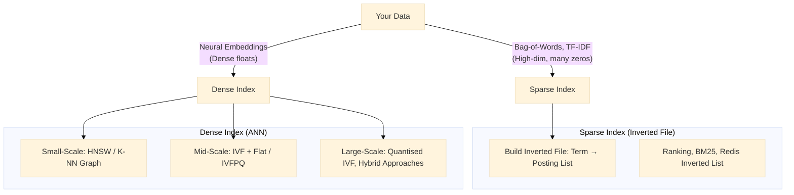
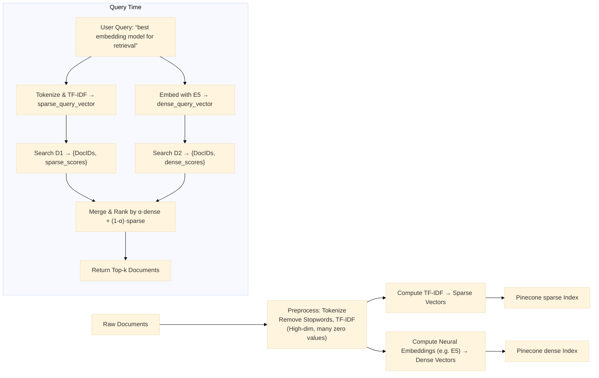

When building retrieval-augmented applications—semantic search, recommendations, similarity search—your choice of **index structure** in a vector database has a direct impact on latency, throughput and memory footprint. Common techniques include:

* **Flat (Brute-Force) Index**
* **Locality-Sensitive Hashing (LSH)**
* **Inverted File Index (IVF/IVFPQ)**
* **Hierarchical Navigable Small World (HNSW)**
* **Quantisation-based (PQ, OPQ, IVFPQ)**

Yet popular vector-DB services like [Pinecone](https://www.pinecone.io) present just **two high-level options**—*sparse* and *dense*—rather than naming each algorithm directly. In this post, we’ll:

1. **Review common index structures** and their pros/cons
2. **Explain Pinecone’s “sparse” vs. “dense” paradigm**
3. **Show how underlying algorithms map to those two categories**

## Common Index Structures

Below is a quick survey of well-known indexing techniques. Each can be classified as either an **exact** (guaranteed correct) or an **approximate** (probabilistic) search method.

### 1.1. Flat (Brute-Force) Index

* **How it works:** Store all vectors in a single array; at query time, compute cosine (or Euclidean) similarities against every entry, then sort.
* **Timing:** *O(n · d)* per query (n = number of vectors, d = dimension).
* **Pros:**
  * Exact nearest neighbours—no false negatives or positives.
  * Simple to implement and reason about.
* **Cons:**
  * Doesn’t scale: linear scan is too slow for millions of vectors.
  * High CPU/GPU cost if n is large.

### 1.2. Locality-Sensitive Hashing (LSH)

* **How it works:** Project each vector into multiple hash “buckets” such that similar vectors land in the same bucket with high probability. Search only within those buckets.
* **Timing:** Sub-linear average-case; may degrade if collision rates are high.
* **Pros:**
  * No costly tree traversal—just look up a few hash buckets.
  * Particularly effective for cosine similarity or L2 distance.
* **Cons:**
  * Approximate: might miss some true neighbours (false negatives).
  * Many hyperparameters (number of hash tables, bits per hash) to tune.
  * Often inefficient in high dimensions (d ≫ 1000).

### 1.3. Inverted File Index (IVF) & Product Quantisation (IVFPQ)

* **IVF (Inverted File) Alone:**
  1. **K-means clustering**: Partition all n vectors into k coarse clusters ("cells").
  2. **Build an “inverted list”:** For each cluster, store pointers to all vectors assigned there.
  3. **Query:** Find the nearest cluster(s) for the query vector, then scan only that cluster’s list.
* **IVFPQ (Inverted File + Product Quantisation):**
  1. After IVF’s clustering, compress each vector into a short code (e.g. 8 bytes) using Product Quantisation—split d-dim space into m subspaces, quantise each to 256 centroids.
  2. At query time, use Asymmetric Distance Computation (ADC): compute distance between uncompressed query and compressed codes.
* **Pros:**
  * **IVF**: Substantially reduces candidate set per query (O(n/k) instead of O(n)).
  * **IVFPQ**: Drastically smaller storage footprint and faster ADC since comparisons operate on 8–16B codes.
* **Cons:**
  * Approximate: both IVF’s coarse clustering and PQ’s quantisation introduce approximation error.
  * Tuning needed: number of clusters (k), code length, number of subspaces, distance metric.
  * Building IVF/IVFPQ can be expensive for very large n.

### 1.4. HNSW (Hierarchical Navigable Small World)

* **How it works:**
  1. Build a multi-layer graph where each node (vector) is linked to a small set of neighbours at each “level.”
  2. Top levels have few nodes (acting as “entry points”); bottom levels connect most nodes with short-range edges.
  3. Query: Greedy graph traversal—start at highest level, find nearest neighbour, then descend layers refining search.
* **Pros:**
  * State-of-the-art recall/latency trade-off.
  * Efficient for billion-scale datasets when properly tuned.
  * Supports dynamic inserts/deletes (though slower than static).
* **Cons:**
  * Building the graph is O(n · log n) and memory-heavy (each vector holds multiple neighbour pointers).
  * Requires fine-tuning of parameters (e.g. M = max neighbours, efConstruction, efSearch).
  * Dynamic updates can degrade performance if not rebalanced occasionally.

### 1.5. Quantisation-Only (OPQ, PQ)

* **Product Quantisation (PQ):** Compress each vector into a short code (8–32 bytes) by dividing d into m subspaces and quantising each. Distance approximate via ADC.
* **Optimised PQ (OPQ):** Learn a rotation of the vector space before PQ so that quantisation error is minimised.
* **How to search:**
  * Might still use IVF as a pre-filter, or run a flat scan over compressed codes (slower but smaller).
* **Pros:**
  * Very small storage overhead—especially suitable for memory-constrained setups.
  * Reasonable recall if code length and m are chosen well.
* **Cons:**
  * No inverted index, so queries need either full-scan of compressed codes (slow) or combination with IVF/HNSW.
  * Quantisation error degrades recall on lower-dimensional data.

### 1.6. Comparing Common Index Structures

| Index Type        | Exact vs. Approx. | Build Cost                   | Query Cost                     | Memory Usage        | Pros                                      | Cons                                                               |
| ----------------- | ----------------- | ---------------------------- | ------------------------------ | ------------------- | ----------------------------------------- | ------------------------------------------------------------------ |
| **Flat**          | Exact             | O(n)                         | O(n · d)                       | O(n · d)            | No approximation, trivial to implement    | Too slow for large n                                               |
| **LSH**           | Approximate       | O(n · L) (L = # hash tables) | Sublinear (depends on buckets) | O(n · L)            | Simple, decent for certain distances      | False negatives, poor high-dim performance                         |
| **IVF (k-means)** | Approximate       | O(n · k · t) (t = # iters)   | O(k + n/k)                     | O(n · d + k · d)    | Good trade-off, easy to shard/clustering  | Tuning k is tricky; approximation error in clustering              |
| **IVFPQ**         | Approximate       | IVF build + O(n · m · 256)   | O(m + n/k) (via ADC)           | O(n · code\_length) | Very efficient storage + speed            | Higher approximation; hyperparameters (m, k, code bits)            |
| **HNSW**          | Approximate       | O(n · log n)                 | O(log n · M) (M = neighbours)  | O(n · (d + M))      | Excellent recall/latency, dynamic inserts | Building is slow; memory heavy; tuning M, efConstruction, efSearch |

## Which one to use?

:::info If you want 100% recall/accuracy
Got for Brute-force index (FLAT) 
:::

| Index size           | Index Structures              |
| -------------------- | ----------------------------- |
| 100% recall/accuracy | Brute-force index (FLAT)      |
| 10MB - 2GB           | Inverted-file index (IVF)     |
| 2GB - 20GB           | Graph-based index (HNSW)      |
| 20GB - 200GB         | Hybrid index (HNSW_SQ,IVF_PQ) |
| 200GB+               | Disk index (DiskANN)          |

1. **Brute-Force Index**
   * Use only when you need **100 % recall and 100 % accuracy**.
   * Not recommended for any index larger than a few MB, because search is *O(n)* over all vectors.
2. **Inverted-File Index (e.g. IVF/BM25 or Redis Inverted List)**
   * Recommended for indexes sized **between 10 MB and 2 GB**.
   * Provides approximate search via inverted postings (bag-of-words + TF-IDF style).
   * Good if your data fits into memory and you want decent recall without graph complexity.
3. **HNSW (Hierarchical Navigable Small World) – Graph-Based Index**
   * Recommended once index > \~2 GB.
   * Scales well in memory and provides low-latency approximate nearest neighbours.
   * Often used for mid-to-large vector collections (millions of vectors) in CPU memory.
4. **Quantisation (for Mid-to-Large Scales)**
   * When “getting to the higher ends” of index size *(i.e. memory starts to be a bottleneck)*, apply quantisation:
     * **16-bit (e.g. bfloat16) quantisation**
     * **8-bit quantisation**
     * **4-bit quantisation**
     * Even **2-bit** quantisation has been tried and “works pretty well.”
   * Quantisation reduces memory footprint per vector, at the cost of slight recall degradation.
   * Useful when your HNSW or IVF graph is growing too large to fit in RAM.
5. **“DISK-Based” (DISN) Solutions**
   * If you have a **very, very large index** (“lots of vectors”), use a disk-based solution (e.g. **DiskANN**, **DISN**).
   * These solutions store most of the data/graph on SSDs and keep only critical navigational structures in RAM.
   * Trade-off: slightly higher latency than pure in-RAM HNSW, but handle billions of vectors.

## Pinecone’s “Sparse” vs. “Dense” Indexing

If you sign up for Pinecone, you’ll quickly notice their dashboard and API let you choose only:

* **Index Type = “sparse”**
* **Index Type = “dense”**

Why doesn’t Pinecone give you “IVF,” “HNSW,” “LSH,” etc.? The answer is twofold:

1. **User-Friendly Abstraction**
2. **Under-the-Hood Algorithm Selection**

### 2.1. What Pinecone Means by “Sparse” vs. “Dense”

* **Dense Index**
  * Designed for **floating-point embedding vectors**—the kind produced by neural models (**BERT, CLIP, OpenAI Ada, E5**, etc.).
  * Under the covers, Pinecone’s dense index is fundamentally HNSW, but when your dataset grows large enough, it will transparently fall back to an IVF + PQ style layout (or hybrid). References: [1](https://www.pinecone.io/learn/series/faiss/vector-indexes/?utm_source=chatgpt.com), [2](https://docs.pinecone.io/guides/index-data/indexing-overview?utm_source=chatgpt.com)
  * For you, a “dense” index implies:
    1. You’ll upload numerical embeddings (dense arrays of floats).
    2. Pinecone manages which ANN structure best fits your scale and desired performance.
* **Sparse Index**
  * Intended for **high-dimensional sparse vectors**, usually originating from term-frequency or **TF-IDF (bag-of-words)** representations.
  * Think of use cases like “keyword search” or “mixed sparse/dense recall.” Under the hood, Pinecone likely uses an **Inverted File Index** (as in traditional search engines) to rapidly find which documents contain which terms.
  * Sparse indexes excel when:
    * Your user queries use exact term matches (e.g. `'error code 500'`).
    * You need to combine lexical (sparse) and semantic (dense) retrieval (Pinecone lets you run a “hybrid” search that merges sparse score with dense similarities).

> **In short:**
>
> * **Dense** = “I’m storing continuous embeddings. You pick the ANN.”
> * **Sparse** = “I’m storing bag-of-words or TF-IDF vectors (mostly zeroes). Do an inverted index.”

:::info What is ANN and why use it?”
ANN stands for Approximate Nearest Neighbours. It’s a set of techniques for speeding up similarity search in high-dimensional spaces by sacrificing a tiny bit of accuracy in return for orders-of-magnitude less computation. Instead of comparing a query against every vector, you navigate an index—like a graph or inverted buckets—to locate near neighbours in milliseconds rather than seconds.
:::

:::info Exact vs Approximate Nearest Neighbour Search
1. **Exact Nearest Neighbour (NN) Search**
   * You compute the distance (e.g. Euclidean or cosine) between the query vector and *every* vector in your database, then pick the absolute smallest distance.
   * ✅ Guarantees 100 % recall/accuracy (the true nearest neighbour).
   * ❌ Becomes slow as your collection grows—search complexity is *𝑂(𝑁)* for 𝑁 vectors.
2. **Approximate Nearest Neighbour (ANN) Search**
   * You use a clever index (e.g. a graph, inverted list, quantised buckets) to avoid comparing against *every* vector. Instead, you navigate or prune large portions of the dataset and home in on likely neighbours.
   * ✅ Dramatically lower query‐time (often *sub-millisecond* for millions of vectors).
   * ❌ Does **not** guarantee you’ll always get the exact nearest neighbour—there’s a small chance you miss the absolute nearest and return a “very close” alternative instead.
:::

### 2.2. Why You Don’t See “IVF,” “HNSW,” etc.

1. **Simplified UX**
   * Pinecone’s goal is to let developers focus on **which kind of data** (sparse vs. dense) rather than **which algorithm**.
   * Algorithms like IVF, HNSW or PQ are internal implementation details—Pinecone may switch between them as your dataset grows or traffic patterns change, without requiring you to reindex.
2. **Dynamic Algorithm Selection**
   * Depending on your index’s size, query load, replication factor and consistency requirements, Pinecone will automatically spin up the best index variant:
     * **HNSW** for low-latency, high-recall scenarios with moderate storage overhead.
     * **IVFPQ** for billion-scale, where compression is key.
     * **Flat/HNSW hybrid** for smaller indices where exact recall matters.
   * As a managed service, Pinecone’s “dense” index might start as HNSW, but—once you surpass a threshold of, say, 100 million vectors—it could automatically transition to an IVFPQ-based approach to save memory and cost. You never have to worry about manually rebuilding your index.
3. **Maintenance & Labour**
   * If developers had to choose between HNSW vs. IVF vs. LSH, they’d need to:
     1. Benchmark each approach.
     2. Tune dozens of parameters (M, efConstruction, PQ code lengths, cluster counts, etc.).
     3. Rebuild indexes from scratch when switching algorithms.
   * By abstracting to “sparse”/“dense,” Pinecone eliminates that DevOps overhead, while guaranteeing the underlying implementation is state-of-the-art.

## How Underlying Algorithms Map to “Sparse” vs. “Dense”

* **Sparse Index**
  * Internally, Pinecone (or similar services) will:
    1. **Extract non-zero features** from each sparse vector (e.g. `{“error”: 3, “timeout”: 1}` → posting list).
    2. Maintain a classic **inverted index** (term → document IDs).
    3. Rank results by TF-IDF or BM25 scores.
* **Dense Index**
  * Depending on your dataset’s size and performance settings, Pinecone might deploy:
    1. **HNSW (Hierarchical K-NN Graph)** for sub-100 million vectors requiring high recall/low latency.
    2. **IVF + Flat** when you need faster build times than HNSW and are willing to tolerate slightly lower recall.
    3. **IVFPQ or hybrid quantised ANN** for billion-scale systems, trading a small amount of recall for major memory savings.

## Pros & Cons of Pinecone’s Abstraction

| Aspect                      | Pros                                                                                                                                                             | Cons                                                                                                                                         |
| --------------------------- | ---------------------------------------------------------------------------------------------------------------------------------------------------------------- | -------------------------------------------------------------------------------------------------------------------------------------------- |
| **Simplicity of UX**        | • Only two choices: “sparse” or “dense.”  • No need to learn IVF vs. HNSW vs. PQ.                                                                            | • You lose direct control of which ANN algorithm is used under the hood.                                                                     |
| **Managed Scalability**     | • Pinecone auto-scales index shards, replicas, and algorithm selection as data grows.  • No downtime to switch from HNSW → IVFPQ when you exceed thresholds. | • Harder to predict exactly which algorithm is in use at any given moment (though Pinecone’s documentation often details thresholds).        |
| **Parameter Tuning Hidden** | • Pinecone auto-tunes efSearch, M, PQ bits, number of clusters, etc.  • You only pick “pod size” and “replicas.”                                             | • If you absolutely need to specify, say, `efSearch=200` or `nlist=4096`, you can’t—Pinecone manages those values internally.                |
| **Performance Guarantees**  | • Pinecone promises low-latency (< 10 ms for 1M vectors on “standard” pods) and 99.9% uptime.                                                                    | • If Pinecone’s chosen ANN doesn’t match your specific data distribution, you might see suboptimal recall compared to a hand-tuned HNSW/IVF. |

## When to Use “Sparse” vs. “Dense” in Pinecone

1. **Purely Semantic (Embedding-Based) Search**
   * Choose **Dense Index**.
   * E.g. You embed your documents with E5 or OpenAI Ada, then store those 384/768-dim float vectors in Pinecone. Pinecone will pick an ANN that suits your index volume.
2. **Keyword/Hybrid Search**
   * If you need simple **lexical queries** (e.g. filter by metadata, search exact terms), choose **Sparse Index**.
   * Pinecone stores each document’s sparse representation (e.g. TF-IDF) and runs an inverted index for those.
   * You can then combine (dense + sparse) results by assigning weights to each score (e.g. 0.3·sparse\_score + 0.7·dense\_score).
3. **Long Documents with Mixed Retrieval**
   * Embed paragraphs for semantic recall, but also index full-text TF-IDF for exact phrase matches.
   * Two approaches:

     1. **Create two separate Pinecone indexes**: one “sparse” (TF-IDF) and one “dense” (embeddings). At query time, merge results.
     2. **Use Pinecone’s hybrid API** (if available), which accepts both sparse and dense vectors in a single call—Pinecone handles the merging internally.

## Putting It into Practice: Example Workflow

Below is a simplified **hybrid retrieval pipeline** leveraging Pinecone’s sparse and dense indexes.

1. **Offline Ingestion**

   * **Sparse index:** run TF-IDF on each doc (vector dimension = vocabulary size, mostly zeros).
   * **Dense index:** run a BERT-style encoder (e.g. E5) to get a 384- or 768-dim float array.
   * Store each representation in its respective Pinecone index.

2. **Query Time**

   * Preprocess the user’s query to produce both a sparse vector and a dense embedding.
   * Hit Pinecone’s sparse index → get a shortlist of lexical matches (e.g. based on BM25).
   * Hit Pinecone’s dense index → get semantic matches.
   * **Merge & Rank:** combine scores with a weight α ∈ \[0,1]. For instance, α = 0.7 emphasises semantic relevance, while 0.3 retains some lexical fidelity.

## Final Thoughts

* **Understanding Index Structures** (Flat, LSH, IVF/IVFPQ, HNSW, etc.) helps you reason about trade-offs: exact vs. approximate, memory vs. recall, build time vs. query time.
* **Pinecone’s “sparse” vs. “dense” abstraction** removes the need to pick (and later re-tune) a specific ANN algorithm. Instead, you decide whether your data is:
  * A high-dimensional **sparse bag-of-words** or TF-IDF vector → use a **sparse** index (inverted file under the hood).
  * A low-to-mid-dimensional **neural embedding** → use a **dense** index (Pinecone chooses HNSW, IVFPQ or similar automatically).
* This approach is ideal if you prefer to offload indexing complexity to a managed service. However, if you require **fine-grained control** (e.g. tune `M=48` in HNSW, or set `nlist=4096` in IVF), you may opt for a self-hosted solution (FAISS, Milvus, Weaviate, etc.).

By understanding both the **theoretical foundations** of Flat / LSH / IVF / IVFPQ / HNSW and the **practical abstractions** in Pinecone’s API, you can make informed decisions that strike the right balance between recall, latency and operational simplicity.
