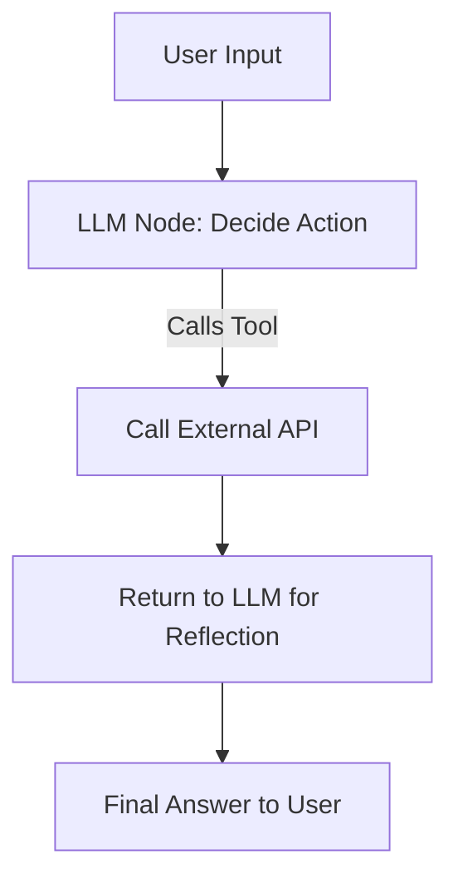

#  Why LangGraph is Better Suited than Airflow or Prefect for LLM Applications

In the evolving landscape of AI applications, particularly those involving Large Language Models (LLMs), choosing the right orchestration framework is more than a tooling decision—it's an architectural one. A recent interview question from a CTO challenged me to defend my use of LangGraph over traditional orchestrators like Airflow or Prefect. It prompted a deeper look at the paradigms underlying these tools, and why LangGraph fits better in the context of LLM-driven applications.

## Understanding the Paradigms

Source: [LangGraph](https://blog.langchain.dev/langgraph/)

Before diving into comparisons, let’s look at three core orchestration paradigms:

### 1. **Static DAGs (Airflow, Prefect)**
- Built on Directed Acyclic Graphs.
- Nodes represent static tasks. Transitions are fixed before execution.
- Ideal for batch pipelines (ETL, data movement).
- No loops, limited conditional logic.

**Definition:** A Static DAG is a predetermined, acyclic task graph where each node executes in a fixed order, typically used for repeatable workflows. It supports data persistence but is not designed for contextual decision-making or dynamic runtime logic.

**Example use case:** Run nightly data extraction from a warehouse, transform it, and load into dashboards.

### 2. **Dynamic Graphs / Finite State Machines (LangGraph)**
- Nodes can branch based on runtime conditions.
- Supports loops, memory, conditional transitions.
- Event-driven and reactive.
- Designed with LLM workflows in mind.

**Definition:** A Dynamic FSM is a runtime-evolving state machine where state transitions depend on real-time inputs or outputs, supporting agent-style reasoning, memory updates, and decision-based flow control.

**Example use case:** An LLM agent that decides whether to search Google, query a database, or ask for clarification, based on user input.

### 3. **Modular Toolkits (LangChain)**
- Not orchestration tools on their own.
- Provide building blocks: memory, prompt templates, tools.
- Often used inside orchestration systems.

**Definition:** A modular toolkit provides reusable LLM components, such as memory modules or prompt chains, that can be composed but require external control flow logic or a higher-level orchestration layer.

**Example use case:** A single interaction chain: user input → tool call → LLM → output.

## LLM Awareness: Why Traditional DAGs Fall Short

Traditional orchestrators treat tasks as isolated black boxes. This is great for standard pipelines, but problematic for LLMs, where:

- **State evolves dynamically**: an agent may re-ask or revise a query.
- **Memory must be passed and updated**: context is critical.
- **Tool use is dynamic**: you don’t always know what tool the LLM will invoke next.
- **Looping is frequent**: an LLM might take several iterations to reach a final answer.

These behaviours don’t fit into static, acyclic workflows.

## What is Memory in an agentic system

All orchestrators can persist data, but "supporting memory" in LLM workflows means more:

- **Memory as state**: memory is passed from node to node and influences decisions within the same runtime context.
- **Context injection**: memory is directly injected into LLM prompts to affect reasoning and outputs.
- **State mutation**: memory is actively modified by nodes at runtime (e.g., adding new facts or reflecting on previous results).

Airflow and Prefect can persist intermediate results (e.g., via XCom or databases), but do not offer first-class support for evolving, context-aware memory. In LangGraph, memory is a core runtime feature that shapes how nodes behave.

## Why LangGraph Stands Out

LangGraph builds a true finite state machine for LLMs. It introduces primitives that map directly to LLM use cases:

- **State-aware nodes** that can mutate memory or context.
- **Dynamic routing** based on LLM output or intermediate results.
- **Looping logic**, essential for ReAct-style agents.
- **Streaming and interactivity**, critical for user-facing applications.

**Example: Tool Calling Agent Workflow**

This kind of control flow is nearly impossible to express elegantly in Airflow or Prefect.

## A Real-World Comparison

| Feature                      | Definition                                                                 | Airflow / Prefect        | LangGraph                   |
|-----------------------------|----------------------------------------------------------------------------|---------------------------|-----------------------------|
| Workflow Type               | Structure of task orchestration                                           | Static DAG                | Dynamic FSM                 |
| LLM Awareness               | Ability to react to model outputs and behaviours                          | ❌                       | ✅                         |
| Supports Memory             | Runtime-passed, updated memory affecting control flow and prompts         | ❌ (manual workaround)  | ✅ (native feature)        |
| Branching on LLM Output     | Changing flow dynamically based on model output                          | ❌                       | ✅                         |
| Agent-style Looping         | Model-driven iteration within flow                                       | ❌                       | ✅                         |
| Real-time Streaming         | Continuous output rendering as model generates                           | ❌                       | ✅                         |
| Debugging LLM Context       | Visualisation or inspection of evolving state                            | Manual                    | Built-in                    |

## Conclusion

LLM-native applications demand orchestration that reflects how LLMs actually work: reactively, iteratively, and contextually. LangGraph isn’t just a convenient API wrapper. It’s a state machine framework designed from the ground up for intelligent workflows.

When comparing LangGraph to Airflow or Prefect, the question isn’t which is better in general. It’s which is better for **dynamic, reasoning-centric, real-time applications** — and in that space, LangGraph wins hands down.

Would you use a hammer to tighten a screw? Probably not. Use LangGraph where it fits: LLMs.

