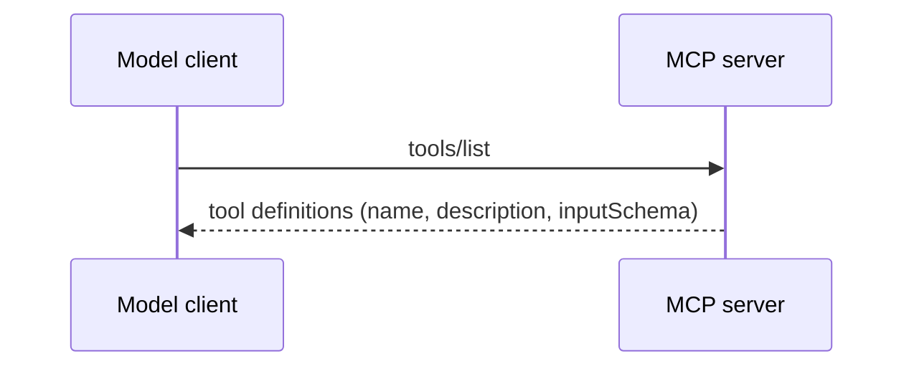
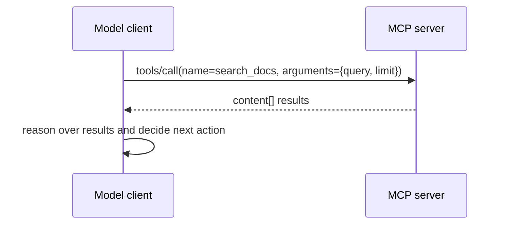
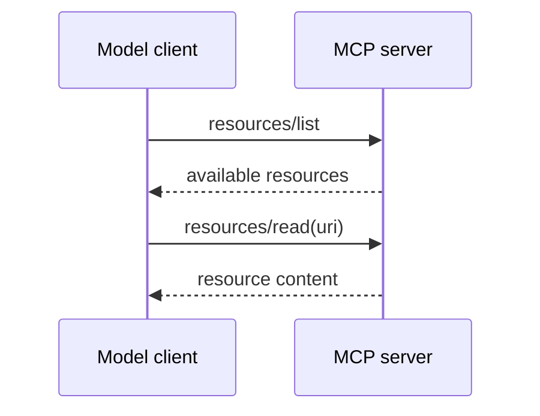
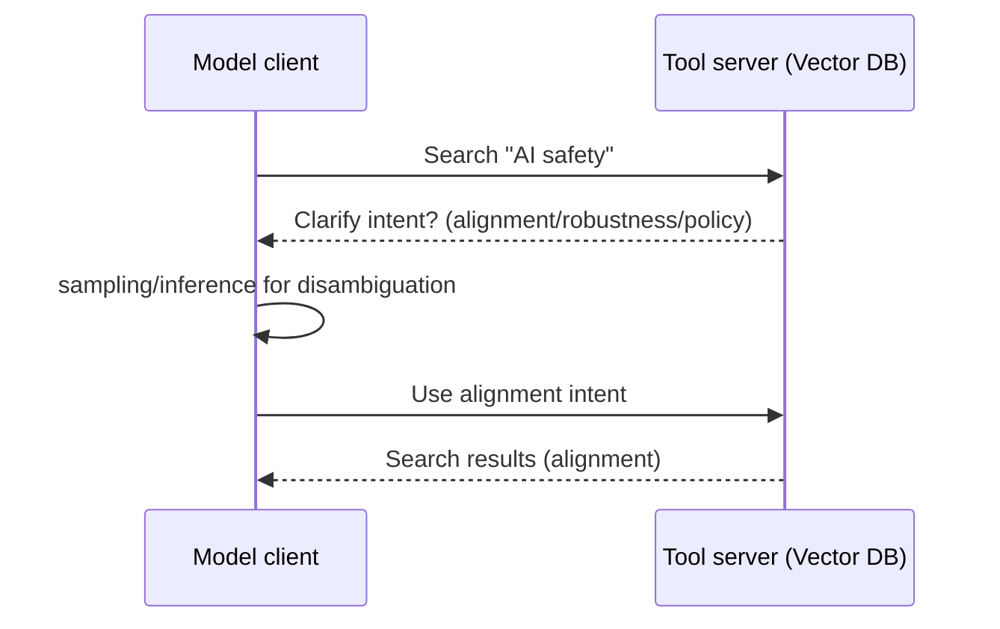
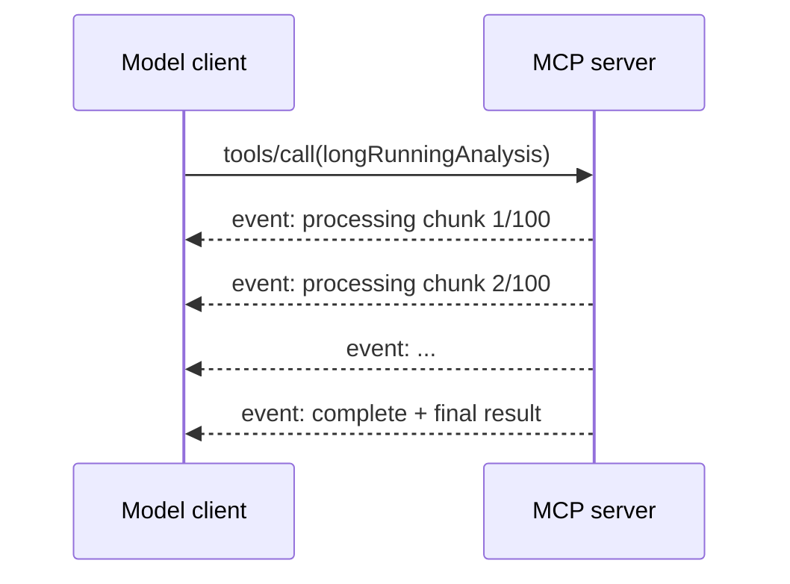
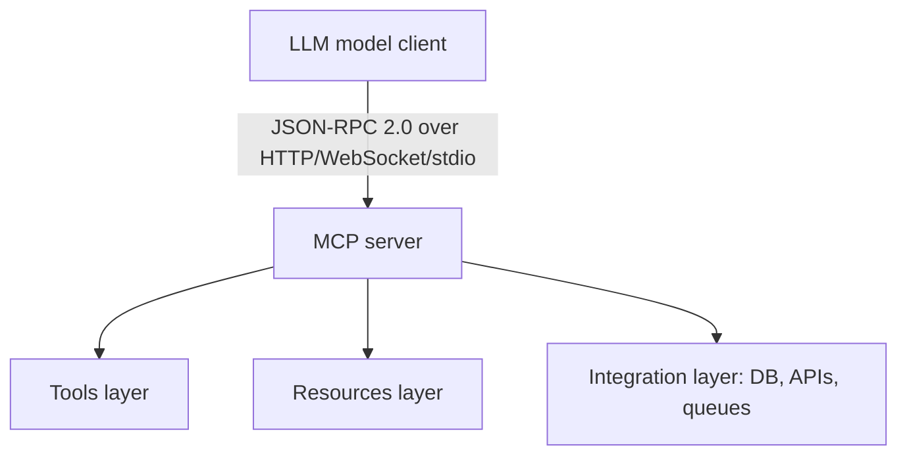

# Model Context Protocol (MCP) Architecture

> **TL;DR**
> - **MCP** is a standardized protocol (JSON-RPC 2.0 based) for composing models with tools, resources, and external systems.
> - **Core idea**: Tools are first-class abstractions; models discover and invoke tools via a well-defined interface rather than hand-coded integrations.
> - **Key features**: tool discovery, sampling (model inference), result transports (streaming, batch), bidirectional communication, and resource access.
> - **Production use**: Enable models to access databases, APIs, and services with composable, auditable, type-safe interactions.

## What Is MCP?

The **Model Context Protocol** is an open specification for standardizing how language models interact with external tools, resources, and services. Rather than embedding tool integrations directly into model behavior or application code, MCP defines a **protocol layer** that decouples model inference from tool implementations.

**Core design principles:**
- **Standardization**: One protocol for all tool interactions; tools expose a uniform interface.
- **Composability**: Stack multiple tools, data sources, and models without custom glue code.
- **Transparency**: Tools are discoverable and self-documenting (via schema, descriptions, validation).
- **Bidirectional**: Client (model) and server (tool provider) can initiate communication.
- **Streaming**: Supports long-running operations and progressive result delivery without blocking.

## Protocol Foundation: JSON-RPC 2.0

MCP is built on **JSON-RPC 2.0**, a lightweight RPC specification:

```json
{
  "jsonrpc": "2.0",
  "id": "request-1",
  "method": "tools/list",
  "params": {}
}
```

Response:
```json
{
  "jsonrpc": "2.0",
  "id": "request-1",
  "result": {
    "tools": [
      {
        "name": "search_docs",
        "description": "Search knowledge base by keyword",
        "inputSchema": {
          "type": "object",
          "properties": {
            "query": { "type": "string" },
            "limit": { "type": "integer", "default": 10 }
          },
          "required": ["query"]
        }
      }
    ]
  }
}
```

**Advantages of JSON-RPC 2.0:**
- Lightweight and language-agnostic.
- Request-response and notification semantics.
- Error handling with standard error codes.
- No heavy dependencies (XML, WSDL).

## Core MCP Capabilities

### 1. Tool Discovery & Invocation

#### Discovery
A model queries available tools:



Request body sent by the model:

```json
{
  "jsonrpc": "2.0",
  "id": "1",
  "method": "tools/list",
  "params": {}
}
```

Server response with the tool registry:

```json
{
  "jsonrpc": "2.0",
  "id": "1",
  "result": {
    "tools": [
      {
        "name": "search_docs",
        "description": "Search the knowledge base by keyword. Returns top relevant passages.",
        "inputSchema": {
          "type": "object",
          "properties": {
            "query": { "type": "string", "description": "Search query string" },
            "limit": { "type": "integer", "default": 10, "description": "Max results to return" }
          },
          "required": ["query"]
        }
      },
      {
        "name": "query_db",
        "description": "Run a read-only SQL query against the analytics database.",
        "inputSchema": {
          "type": "object",
          "properties": {
            "sql": { "type": "string", "description": "SELECT statement only" }
          },
          "required": ["sql"]
        }
      }
    ]
  }
}
```

Each tool definition includes:
- **name**: Unique identifier (e.g., `search_docs`, `query_db`).
- **description**: Natural language description of what the tool does (used by the model to decide whether to call it).
- **inputSchema**: JSON Schema defining required parameters, types, and validation rules.

#### Invocation
The model decides to call a tool and sends a request:



Request body sent by the model to invoke a tool:

```json
{
  "jsonrpc": "2.0",
  "id": "2",
  "method": "tools/call",
  "params": {
    "name": "search_docs",
    "arguments": {
      "query": "machine learning best practices",
      "limit": 5
    }
  }
}
```

Server response — results are returned **back to the model**, not directly to the user. The model then decides its next action:

```json
{
  "jsonrpc": "2.0",
  "id": "2",
  "result": {
    "content": [
      { "type": "text", "text": "Result 1: Prefer smaller batch sizes during fine-tuning to reduce gradient noise." },
      { "type": "text", "text": "Result 2: Always separate train/val/test splits before any preprocessing to avoid leakage." }
    ],
    "isError": false
  }
}
```

The model reads `result.content`, reasons over it, and decides the next step — whether to call another tool, combine results, or respond to the user.

### 2. Resource Access

Beyond tools (which are actions), MCP supports **resources** (which are data):



List request:

```json
{
  "jsonrpc": "2.0",
  "id": "3",
  "method": "resources/list",
  "params": {}
}
```

List response:

```json
{
  "jsonrpc": "2.0",
  "id": "3",
  "result": {
    "resources": [
      {
        "uri": "file:///knowledge-base/architecture.md",
        "name": "Architecture Overview",
        "mimeType": "text/markdown"
      },
      {
        "uri": "db://analytics/schema",
        "name": "Analytics DB Schema",
        "mimeType": "application/json"
      }
    ]
  }
}
```

Read request and response for a specific resource:

```json
// Request
{
  "jsonrpc": "2.0",
  "id": "4",
  "method": "resources/read",
  "params": {
    "uri": "file:///knowledge-base/architecture.md"
  }
}

// Response
{
  "jsonrpc": "2.0",
  "id": "4",
  "result": {
    "contents": [
      {
        "uri": "file:///knowledge-base/architecture.md",
        "mimeType": "text/markdown",
        "text": "# System Architecture\n\nThe platform consists of three layers..."
      }
    ]
  }
}
```

Resources are read-only or append-only (depending on schema). This is useful for:
- Reading configuration files.
- Accessing large reference documents (e.g., API docs, compliance policies).
- Exposing database schemas without full query access.

### 3. Sampling (Model Inference)

MCP supports **bidirectional sampling**: not only do models call tools, but tool servers can request model inference. This enables:

- **Server-side reasoning**: A tool server query might require the model to interpret ambiguous user input before executing.
- **Feedback loops**: Tool results are fed back to the model model, which may refine its approach.

**Example workflow:**



The tool server initiates a **sampling request** back to the model to resolve ambiguity:

```json
// Tool server → Model: sampling request
{
  "jsonrpc": "2.0",
  "id": "5",
  "method": "sampling/createMessage",
  "params": {
    "messages": [
      {
        "role": "user",
        "content": {
          "type": "text",
          "text": "The query 'AI safety' is ambiguous. Which interpretation should I use?\n(a) ML alignment  (b) adversarial robustness  (c) AI policy/governance"
        }
      }
    ],
    "maxTokens": 50
  }
}

// Model → Tool server: sampling response
{
  "jsonrpc": "2.0",
  "id": "5",
  "result": {
    "role": "assistant",
    "content": {
      "type": "text",
      "text": "(a) ML alignment"
    },
    "stopReason": "endTurn"
  }
}
```

### 4. Streaming & Progressive Results

MCP supports **streaming** for long-running operations:



The initial `tools/call` request is identical to a synchronous call. The server signals streaming support via the `Content-Type: text/event-stream` response header. Each event follows the SSE wire format:

```
event: message
data: {"jsonrpc":"2.0","method":"notifications/progress","params":{"progressToken":"task-1","progress":1,"total":100,"message":"Processing chunk 1"}}

event: message
data: {"jsonrpc":"2.0","method":"notifications/progress","params":{"progressToken":"task-1","progress":2,"total":100,"message":"Processing chunk 2"}}

event: message
data: {"jsonrpc":"2.0","id":"6","result":{"content":[{"type":"text","text":"Analysis complete. Key finding: ..."}],"isError":false}}
```

The final event carries the `id` from the original request and a full `result` body — the model knows the stream is done when it receives a message with a matching `id`.

The model receives partial results progressively and can:
- Display progress to the user.
- Decide to cancel if progress appears stuck.
- Stream results to the client without waiting for completion.

### 5. Roots: Context Anchoring

**Roots** allow a tool server to specify which files or directories it has access to (a **capability constraint**):

```mermaid
flowchart LR
  R[Declared roots] --> D[/data/documents]
  R --> C[/config/settings]
  M[Model client] -->|resources/read within roots only| S[MCP server]
  M -.blocked.-> X[/etc/secrets]
```

This prevents accidental access to sensitive files and clarifies tool boundaries.

## Architecture: Client-Server Model



**Communication transports:**
- **HTTP**: Polling or webhooks (good for stateless, scalable services).
- **WebSocket**: Bidirectional streaming; good for real-time interactions.
- **Stdio**: Direct subprocess communication (common for local development and testing).

## MCP vs. Alternative Tool Standards

| Feature | MCP | OpenAI Function Calling | Anthropic Tool Use | Custom APIs |
|---------|-----|------------------------|-------------------|------------|
| **Standardization** | Yes (open spec) | Proprietary (OpenAI) | Proprietary (Anthropic) | No |
| **Tool Discovery** | Built-in | Embedded in request | Embedded in request | Manual |
| **Bidirectional** | Yes | No | No | Maybe |
| **Streaming** | Yes | Limited | Limited | Custom |
| **Resource Access** | Yes | No | No | Maybe |
| **Multi-model** | Yes | OpenAI only | Anthropic only | Maybe |
| **Composability** | High | Low | Low | Varies |

MCP's strength is **composability across models and tool providers**. OpenAI and Anthropic tools are tightly coupled to their models. MCP allows an organization to write tool implementations once and use them with any MCP-compatible model.

## Production Implementation Patterns

### 1. Tool Design

**Principle**: Make tool contracts explicit and easy to validate.

**Good tool definition:**
```json
{
  "name": "query_customer_db",
  "description": "Query customer database by ID or email",
  "inputSchema": {
    "type": "object",
    "properties": {
      "customer_id": {
        "type": "string",
        "description": "UUID or numeric customer ID"
      },
      "email": {
        "type": "string",
        "format": "email",
        "description": "Customer email address"
      }
    },
    "oneOf": [
      { "required": ["customer_id"] },
      { "required": ["email"] }
    ]
  }
}
```

**Common pitfalls:**
- Vague descriptions ("Get data") that the model can't use to make routing decisions.
- Unbounded parameter spaces (e.g., no limit on result size) that lead to expensive queries.
- Missing error semantics (what happens if customer not found?).

### 2. Error Handling & Validation

MCP defines **error responses** with codes and messages:

```json
{
  "jsonrpc": "2.0",
  "id": "request-1",
  "error": {
    "code": -32600,
    "message": "Invalid params",
    "data": {
      "detail": "customer_id must be a valid UUID"
    }
  }
}
```

**Strong validation:**
- Validate input against the declared schema before executing.
- Return detailed error messages so the model understands what went wrong and can retry or try an alternative tool.

### 3. Rate Limiting & Quotas

MCP servers often need to protect downstream systems from overload:

- **Per-tool rate limiting**: Limit calls to expensive tools (e.g., `compute_embedding` max 10/sec).
- **Per-client quotas**: Allocate token budgets per model or application.
- **Backpressure**: If a tool is saturated, return a 429 (Too Many Requests) error; the model should back off.

:::tip
Communicate rate limits in tool metadata so the model can make intelligent decisions (e.g., batch queries instead of one-at-a-time).
:::

### 4. Observability & Auditing

MCP interactions must be logged and monitored:

- **Request logging**: Log every tool call with input, output, latency, and outcome.
- **Tracing**: Correlate MCP calls with model invocations (use correlation IDs).
- **Metrics**: Track tool success rates, latencies, and error types.
- **Audit trails**: For compliance (e.g., who accessed what data, when).

**Recommended logging:**
```json
{
  "timestamp": "2025-05-01T10:30:00Z",
  "correlation_id": "req-abc123",
  "tool_call": {
    "name": "query_customer_db",
    "arguments": { "customer_id": "..." },
    "status": "success",
    "latency_ms": 145,
    "resources_consumed": { "rows": 1, "tokens": 0 }
  }
}
```

### 5. Version Management

Tool definitions evolve; MCP supports versioning:

```json
{
  "name": "query_customer_db",
  "version": "2.0",
  "description": "Query customer database (v2: added email_verified filter)",
  "inputSchema": { ... }
}
```

**Strategy:**
- Always include a `version` field.
- Maintain backward compatibility within major versions (don't remove required params).
- Announce deprecations ahead of time.

### 6. Security & Authorization

MCP doesn't define authentication directly; instead:

- **Use TLS** for all HTTP/WebSocket transports.
- **Implement authentication** at the MCP server level (e.g., API keys, OAuth tokens passed in request headers).
- **Enforce authorization** per tool (e.g., model A can call tools X and Y, model B can call only X).
- **Sanitize inputs** to prevent injection attacks (SQL, command injection, prompt injection).

:::danger
**Tool injection risks**: If a model can name any tool, it might try to call internal tools (e.g., "_admin_reset_database"). Validate tool names against a whitelist.
:::

## When to Use MCP

**Use MCP if:**
- You have multiple tools/APIs that models will interact with; standardization reduces glue code.
- You want to compose tools across multiple models (Claude, GPT, open-source models).
- You need streaming or bidirectional communication.
- Observability and auditing are critical.

**Simpler alternatives:**
- **Single function calls**: If you have one or two tools, direct function calls or a simple REST API may be easier.
- **Stateless tools**: If tools don't require coordination, a simple webhook can suffice.
- **Single model**: If locked into one model (e.g., only Claude), native tool definitions are tighter.

## Roadmap & Future Directions

As of 2025, MCP is evolving toward:

- **Composite results**: Better support for tools returning complex structured data (tables, graphs).
- **Tool composition**: Standardized way for tools to call other tools.
- **Caching**: MCP servers advertise which results can be cached and for how long.
- **Cost reporting**: Models can query estimated cost before calling expensive tools.

:::note See also on AWS
For how MCP is implemented in managed AWS infrastructure — AgentCore Gateway standardizing tool discovery across a fleet, and the Lambda-vs-ECS deployment decision for stateless vs stateful MCP servers — see [AgentCore](/aws/ai/bedrock#agentcore) and [Agentic Orchestration Patterns](/aws/ai/evaluation-and-agents#agentic-orchestration-patterns).
:::

## References & Further Reading

- **MCP Specification**: https://modelcontextprotocol.io/
- **MCP Python SDK**: https://github.com/anthropics/mcp-py
- **MCP Specifications & Examples**: https://github.com/modelcontextprotocol/specification
- **Anthropic Docs on Tool Use**: https://docs.anthropic.com/
