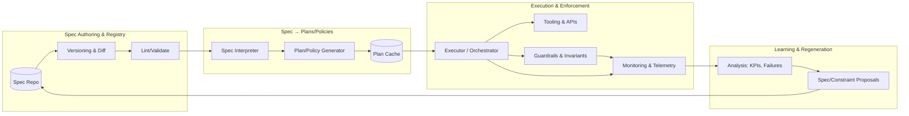
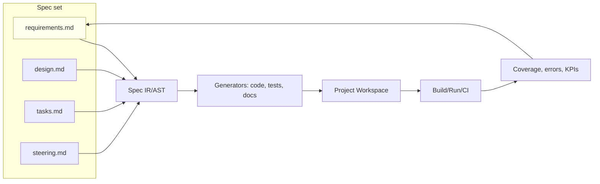
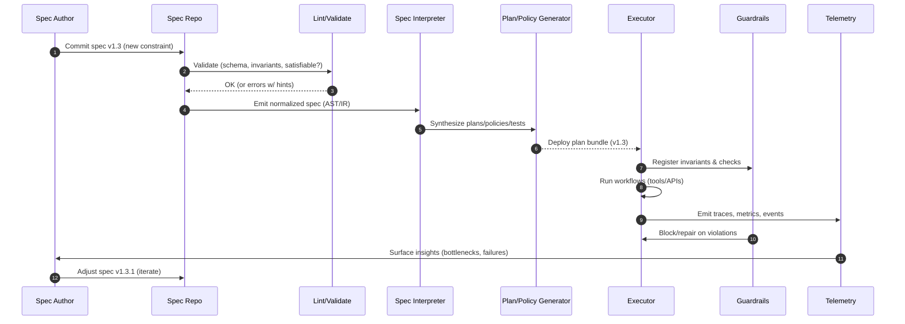
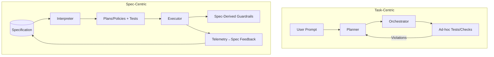

# Spec-Centric Agentic System Architecture

Most agentic systems today are **task-centric**: the agent breaks down a user request into steps, executes them, and refines as it goes. This works, but it’s fragile. A small change in goals or constraints often breaks the chain.

A new design pattern is emerging: **spec-centric agentic architecture**.

## What It Means

Instead of making *tasks* or *code* the source of truth, spec-centric systems treat the **specification** — a structured description of goals, constraints, and invariants — as the primary artifact.

* Agents generate workflows, plans, and validation directly from the spec.
* If the spec changes, downstream behavior is regenerated.
* Tests, guardrails, and monitoring are derived from the spec rather than bolted on later.

This goes beyond model-driven engineering: the spec isn’t just a static diagram, it’s a living control surface for autonomous systems.

## Why It Matters

* **Alignment**: No drift between intent and execution.
* **Adaptability**: Update the spec → regenerate plans and behaviors.
* **Autonomy**: Agents can self-repair when APIs, tools, or rules change.
* **Reuse**: Specs are modular and versioned, like software components.

## Beyond Code Generation

The idea started in AI-assisted software, where specs generate code/tests/docs. But it generalises:

* **Travel planning**: Spec = “7-day cultural trip, £4,000 budget, vegetarian meals.” Agents generate and adapt itineraries.
* **Business process automation**: Spec = “Onboard a new hire in ≤5 days with compliance checks.” Agents orchestrate IT/HR workflows.
* **Marketing ops**: Spec = “Campaign with ROAS > 2.0 targeting Gen Z.” Agents generate targeting, tracking, reporting.

## Architectural View

A spec-centric agentic system typically includes:

1. **Spec Manager** – versioned specs with constraints and goals.
2. **Interpreter** – generates plans/policies from the spec.
3. **Executor** – runs tasks, re-plans when needed.
4. **Validation Engine** – enforces spec-derived constraints.
5. **Feedback Loop** – updates specs based on telemetry or human input.



*Figure 1: High-level flow of a spec-centric agentic system.*

## Example: Spec in Code Generation

AWS Kiro, an AI-native IDE, uses multiple Markdown files to define specs:

* `requirements.md` – functional requirements and acceptance criteria
* `design.md` – architecture and component design
* `tasks.md` – implementation tasks
* `steering.md` – conventions and style enforcement

### Example Requirements Spec

```md
## Requirements

### Requirement 1  
**User Story:** As a data analyst, I want to upload data files from my local directory, so that I can analyze my data without sending it to external servers.

#### Acceptance Criteria  
1. WHEN the user accesses the application THEN the system SHALL display a file upload interface  
2. WHEN the user selects one or more data files THEN the system SHALL validate the file format and size:  
   - uploaded files should be JSON files with a single JSON object  
   - the object must contain a `"raw"` array, each element with a `"type"` field  
3. WHEN valid files are selected THEN the system SHALL load the data into memory and display a progress bar  
4. IF the file format is unsupported THEN the system SHALL display an error message  
5. WHEN data is successfully loaded THEN the system SHALL show confirmation in the status bar  
```

### Example Design Spec

```md
# design.md

## Architecture Overview

- Stateless REST API backend (FastAPI or Node.js)  
- PostgreSQL for persistence  
- JWT for authentication  
- React frontend with `/login` and `/upload` routes  
- Middleware for auth & rate limiting
```

### Example Tasks Spec

```md
# tasks.md
1. Build file upload UI in React  
2. Validate JSON schema client-side  
3. Implement backend `/upload` API  
4. Handle validation & error messages  
5. Integrate JWT authentication  
6. Write unit and integration tests  
7. Add monitoring and logging  
```

### Example Steering Spec

```md
# steering.md
- API routes must use snake_case  
- All errors return JSON with `{ "error": "<code>", "message": "<text>" }`  
- Logs must be structured JSON  
```



*Figure 2: Example spec-to-code workflow (AWS Kiro-style).*

## Challenges

* Designing specs that are expressive but usable.
* Versioning and migrating specs without breaking workflows.
* Ensuring explainability: tracing behavior back to spec fragments.
* Integrating with multi-agent coordination.



*Figure 3: Lifecycle of a spec update — from commit to enforcement and feedback.*

## Task-Centric vs Spec-Centric



*Figure 4: Task-centric vs spec-centric architectures at a glance.*

## Takeaway

Spec-centric isn’t a framework you install; it’s a **design pattern for agentic systems**. It moves the source of truth from *code or tasks* to *specs*, enabling systems that are more consistent, adaptable, and maintainable.

As agents take on more autonomy, specs will increasingly become the anchor point — whether you’re building a code generator, a travel planner, or a business automation system.

## References

* [From Code-Centric to Spec-Centric (ainativedev.io)](https://ainativedev.io/news/from-code-centric-to-spec-centric)
* [Hands-On with Kiro: AWS’s Spec-Driven AI IDE (devclass.com)](https://devclass.com/2025/07/15/hands-on-with-kiro-the-aws-preview-of-an-agentic-ai-ide-driven-by-specifications)
* [AWS Kiro Spec-Driven Development (infoq.com)](https://www.infoq.com/news/2025/08/aws-kiro-spec-driven-agent)
* [Tessl: AI Native Software Development](https://tessl.io/blog/announcing-our-series-a-for-ai-native-software-development)
