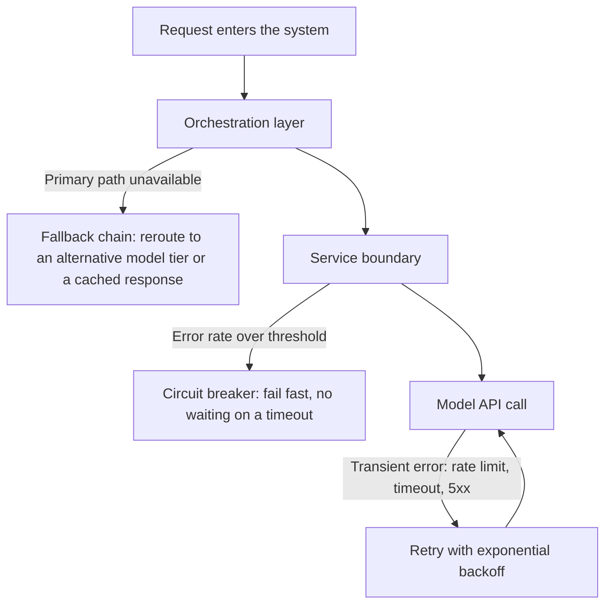

A working prototype answers one question: can the system do this at all? It says almost nothing about whether the system can afford to do it at the volume a real deployment generates, respond fast enough under real load, or keep working when a dependency has a bad day. That gap between a proof of concept (POC) and a production system has four dimensions — cost, latency, reliability, and failure modes — and all four are invisible in a demo.

## Where a POC and a Production System Differ

A POC is built to demonstrate capability. It runs at low volume, on clean inputs, with a patient user watching. A production system runs at whatever volume the business actually generates, on real inputs, for users with no tolerance for a slow or wrong answer.

| Dimension | Why it's invisible in a demo | What it looks like when it fails |
| --- | --- | --- |
| Cost | A POC running a few dozen requests a day produces a negligible bill. Monthly cost at production volume is a different calculation entirely. | The billing dashboard shows a number that exceeds the budget signed off at project approval, and the architecture has to be renegotiated after deployment. |
| Latency | A demo typically runs one request at a time. p95 latency under concurrent load is a different number than median latency on a single request. | SLA breaches and user abandonment — latency that felt fine in a demo is unacceptable in a real-time, user-facing workflow. |
| Reliability | A POC has no retry logic, no fallback, and no circuit breaker. When it fails, the developer just tries again — there are no real users waiting on the other end. | A single transient failure takes the entire user-facing workflow down instead of degrading gracefully. |
| Failure modes | A demo is tested on the inputs the developer expected. Production raises the inputs nobody thought to test, and those failure modes are specific to the chosen architecture. | Silent degradation, fabricated output on an edge-case input, or complete failure on an input class that was never exercised. |

A POC is also the first signal on whether the system moves the business metric it was built to improve, and that signal is worth capturing deliberately, before modeling cost. A cost profile that fits the budget attached to a system that doesn't move the metric that matters is still a failed deployment.

## Cost and Latency Modeling

The cost and latency model gets built *before* the architecture is finalized, from three inputs: call volume (requests per day or month), token budget per request (input tokens plus expected output tokens), and model tier. From those three, a monthly cost estimate can be checked against the budget ceiling before a single line of code is written.

The token budget is where most cost models go wrong. It's tempting to calculate the average token count on the inputs at hand and treat that as the distribution — but real token distributions are usually skewed: most requests are short, and a tail of long requests consumes a disproportionate share of the total cost. A model built on the average alone can underestimate cost by a factor of two or three once that tail shows up at scale.

Latency behaves the same way. Median latency describes the middle of the pack, but SLA breaches come from the slow tail, which is why **p95** (the latency value below which 95% of requests complete) is a more useful design target than the median — it forces the design to account for the requests that are actually going to cause a problem.

**Caching** is the single most effective cost-and-latency lever when a system prompt is long and stable — see [Prompt/Prefix Caching](/ai/agentic-system/caching) for the mechanics. Savings scale with both the length of the cached prefix and how often it's reused, so a long, stable prefix reused across a high volume of requests is where the effective savings are largest. The risk is a consistency window: if the cached content needs to reflect live state, caching can quietly serve something that's gone stale, which is the same live-state boundary covered in [Retrieval vs. Tool Calls](/ai/llm/rag/rag-foundations#retrieval-vs-tool-calls-stable-knowledge-and-live-state).

## Reliability Controls: What Sits Where

Three reliability controls address different failure scenarios, and each belongs at a different layer of the call stack. Placing one in the wrong layer means protecting the wrong part of the system while leaving the right part exposed.

- **Transient error recovery with exponential backoff**, close to the API call itself. When a call returns a transient error — a rate limit, a timeout, a 5xx — the system retries with progressively longer delays between attempts, so a brief hiccup doesn't turn into a flood of retries that prolongs the outage. Set the maximum attempts and total wait time against how much delay the use case can actually tolerate.
- **Circuit breakers**, at the service boundary. A circuit breaker watches the error rate on a downstream dependency and trips once errors cross a threshold; once tripped, requests fail immediately instead of waiting out a timeout, so one degraded dependency doesn't consume the calling system's capacity.
- **Fallback chains**, in the orchestration layer. If the primary model or endpoint is unavailable, the system automatically routes to an alternative — a different model tier, or a cached response — instead of surfacing an error to the user. Fallback behavior belongs in the eval suite, not just in code review, because an untested fallback path is a hope, not a control.

## Failure Modes by Architecture Type

Different architectures fail differently, and the mitigation has to match the failure mode, not the architecture's reputation.

| Architecture | What breaks first | Mitigation |
| --- | --- | --- |
| Agent | Unbounded tool use and growing context — an agent with no budget or turn limit runs up cost and latency invisibly until a single request blows through the ceiling. | Per-turn token budgets, a maximum tool-call count, explicit stopping criteria, and a minimal tool set. Eval the agent's stopping behavior, not just its output quality. |
| RAG | Retrieval-quality drift — the index falls out of alignment with the corpus as documents are added or removed without reindexing, or a refresh schedule creates staleness for anything that's actually live state. | Keep retrieval quality in the eval loop; monitor precision and recall as system metrics, not just output quality; keep live-state queries out of the retrieval layer entirely (see [Retrieval vs. Tool Calls](/ai/llm/rag/rag-foundations#retrieval-vs-tool-calls-stable-knowledge-and-live-state)). |
| Document-processing pipeline (evaluator-optimizer) | No exception path for low-confidence extractions — a pipeline that routes every document through the same flow produces wrong outputs on edge cases at the same rate it produces correct ones on clean documents. | Add confidence scoring to extraction; route low-confidence results to a human review queue instead of straight downstream; include edge cases and difficult documents in the eval set. |
| Orchestrator-workers | Failure boundaries blur between the orchestrator and its subagents, traces fragment across the two, and a dropped subagent can fail silently at synthesis. | Define which failures are recoverable at the subagent boundary (retry or flag) versus unrecoverable at the orchestrator; propagate a shared trace ID; reconcile coverage at synthesis so returned results equal dispatched units — see [Agent-to-Agent Communication Architectures](/ai/agentic-system/agent-to-agent) for the retry/fallback mechanics in more depth. |

## Model Version Pinning

Pinning applies to every architecture in the table above equally — it's an operational discipline, not an architecture choice. Pin the model version in configuration, track the provider's deprecation schedule, and maintain a version-update runbook so a forced upgrade is a planned event instead of an incident.

Cost · Complexity · Risk

**Cost:** A POC's cost profile does not predict the production bill. Model cost before committing to an architecture, not after the first billing cycle.

**Complexity:** Retries, fallback chains, and circuit breakers are much harder to retrofit into a system that wasn't designed for them. Build reliability in from the start rather than scrambling after the first incident.

**Risk:** A system with no fallback and no circuit breaker has exactly one point of failure — the primary model endpoint. When it goes down at peak load, there is no recovery path: the whole user-facing workflow fails instead of degrading gracefully.
