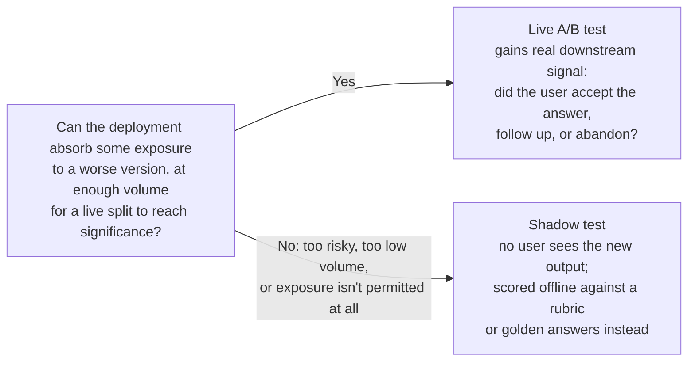

[Enterprise Integration](/ai/agentic-system/production/enterprise-integration) gets a system into the stack. The next question is whether it's performing the way it should once it's there, and whether a proposed change actually improves it. Observability answers the monitoring question; structured experimentation answers the improvement question. Without both, a team is either flying blind or shipping changes it can't actually measure.

## Structured A/B Testing

An experiment on a live model-backed system follows the same shape as any other experiment: a hypothesis, a treatment group, a control group, a metric, and a sample size large enough for the result to mean something. What's different from traditional software A/B testing is that model outputs are probabilistic, which makes results noisier and interaction effects harder to control.

A usable hypothesis names the treatment, the metric, the threshold for success, and any constraint on secondary metrics — "the new prompt is better" fails on every count. A workable version reads more like: *"replacing the summarize instruction with an instruction to extract the three most important action items will increase task success rate by at least 5%, without degrading p95 latency."*

| Component | What it requires | What goes wrong when it's missing |
| --- | --- | --- |
| Hypothesis | A specific, falsifiable statement naming the treatment, the expected direction of the primary metric, and any constraint on secondary metrics. | Without one, any result can be read as a win — there's always some metric that moved in the right direction if enough of them are checked after the fact. |
| Treatment/control assignment | Random assignment to treatment or control, consistent for a given user or session to avoid contamination. | Non-random assignment means the groups aren't comparable; if treatment happens to receive simpler queries, an apparent win may just be an input-distribution artifact. |
| Primary metric | One metric, chosen before the experiment runs. Choosing it after seeing results is outcome-shopping. | An unspecified primary metric turns an experiment into a retrospective correlation — a much weaker basis for a decision than a real test. |
| Sample size | Calculated from the minimum detectable effect, the baseline value, and the required confidence level. Model output variance is higher than deterministic software, so the required sample is larger. | An underpowered experiment can't distinguish a real effect from noise — a team that runs until it sees what it wants will find it, whether or not it's real. |

### Reading Results Without Overclaiming

Statistical significance means a result is unlikely to be chance, given the sample size. Whether the effect is large enough to *matter* is a separate question — a change can be significant and still too small to justify the operational cost of shipping and maintaining a new version. Two questions belong in front of every "winner" declaration: is the effect large enough to justify the overhead of maintaining the new version, and did any secondary metric quietly get worse? A prompt change that improves task success while raising cost 30% is not automatically a net win.

Model experiments carry a failure mode classical A/B tests don't have as sharply: **interaction effects between the treatment and specific input types**. A change that improves typical inputs can degrade rare edge-case inputs that barely show up during the test window but appear constantly during a future seasonal spike — which is why the test period's input distribution has to be checked against what production will actually see, not just against "enough total requests."

### Shadow Testing: Validating Before Any User Sees It

A live A/B test exposes some real users to the new version before the experiment closes, which means a regression reaches some of them before anyone decides to stop. **Shadow testing** avoids that exposure: the new version runs in parallel against a copy of live traffic, every user still gets the current version's response, and the new version's outputs are logged and scored offline, with the deployment decision made before a single user has seen it.

Choose a live test when the deployment can carry a small, bounded amount of exposure and traffic is high enough to reach significance in a reasonable window — the payoff is measuring against real user behavior, including whether a live answer got accepted or triggered a follow-up. Choose shadow testing when a single bad output carries too much risk, traffic is too low to support a live split before the change is needed, or exposing users to an unvalidated change isn't permissible at all — the cost is losing that downstream signal, so scoring has to rely on an offline rubric or golden answers instead of real behavior.

## Observability at Scale

Production observability needs to answer four questions, and each needs its own layer of instrumentation: what is the system doing, how well is it performing, when did it change, and why did it change?

- **Request-level tracing.** Every request should produce a trace with model, model version, input/output token counts, latency, stop reason, and any tool calls made — this is the raw material everything else is built from.
- **Metric aggregation.** Roll the request-level data up into dashboard metrics: cost per request, latency p50 and p95, task success rate where a downstream acceptance signal exists, and error rate by type. Per-request decomposition matters here — an aggregate metric can look healthy while a small fraction of requests quietly consumes most of the budget.
- **Anomaly detection.** Threshold alerts on the metrics that matter for the deployment — a cost spike well above the recent average, a p95 that crosses the SLA. Gradual drift in the distribution of outputs over time is harder to catch with threshold alerts and needs periodic distribution comparison instead.
- **Change attribution.** When a metric moves, the instrumentation should be able to tell apart **model drift** (behavior on stable inputs changed), **data drift** (the input distribution changed), and a **model-update effect** (the model version changed and behaves differently on existing inputs) — these three causes need different fixes, and mixing them up produces the wrong one.

### A Failure Taxonomy

Instrumentation tells you a metric moved; diagnosis tells you what kind of failure moved it, and the common classes call for genuinely different fixes:

- **Prompt failure** — the instruction was ambiguous or underspecified and the model filled the gap. Fix the prompt, not the model.
- **Hallucination** — confident, fluent content that isn't grounded in the input or a reliable source. Fix this through grounding (retrieval, tool use, verification), not through a stronger instruction.
- **Model mismatch** — the chosen tier is wrong for the task, or was swapped without re-evaluation. Fix through model selection, gated by an eval (see [Evaluation](/ai/agentic-system/evaluation)).
- **Orchestrator-workers failure** — in multi-agent systems, a recoverable subagent failure looks different from an unrecoverable orchestrator failure, and attribution needs a trace spanning both; see [Agent-to-Agent Communication Architectures](/ai/agentic-system/agent-to-agent) for the failure-boundary detail.

### Connecting Observability to the Business Metric

The people who funded the deployment aren't reading a request-level trace — they're reading a KPI dashboard tracking the outcome the deployment was meant to improve. The observability stack needs a translation layer connecting technical metrics (latency, task success rate, error rate) to the business metrics they actually drive (handle time, first-contact resolution, satisfaction score). Build that mapping when the system is designed, not after the first business review — without it, the first question about what's driving a change in a business metric requires a retrospective reconstruction instead of a query someone can just run.

:::warning[A 6-point gain that was noise]
A team compared 50 sessions of a revised prompt against 50 sessions of the current one. Task success rate came out 68% versus 62%, and the new version shipped as the winner. Two weeks later, the task success rate on the new version had settled at 61% — the apparent gain had evaporated. Three problems compounded: the sample was far too small for a 6-point difference on a high-variance metric to be distinguishable from noise; the two 50-session groups happened to differ in input complexity, so part of the "improvement" was really an artifact of which inputs landed where; and the metric was chosen because it moved in the right direction, not before the test ran — if it had moved the other way, a different metric would likely have been picked instead. An underpowered test with a metric chosen after the fact produces confirmation of whatever was already believed, not evidence.
:::

Cost · Complexity · Risk

**Cost:** Running an experiment without a pre-specified primary metric means a result favorable enough to justify shipping can always be found somewhere. An underpowered test that looks like a win still costs the team the ongoing overhead of maintaining a version that's no better than what it replaced.

**Complexity:** Observability instrumentation added after the first incident means the root-cause question can't be answered from the log data that already exists. Building it correctly the first time costs less than reconstructing it retroactively.

**Risk:** Aggregate-only observability can look perfectly healthy while a small fraction of requests consumes most of the budget and produces wrong outputs. Aggregate metrics catch the obvious failures; per-request decomposition is what catches the non-obvious ones.
