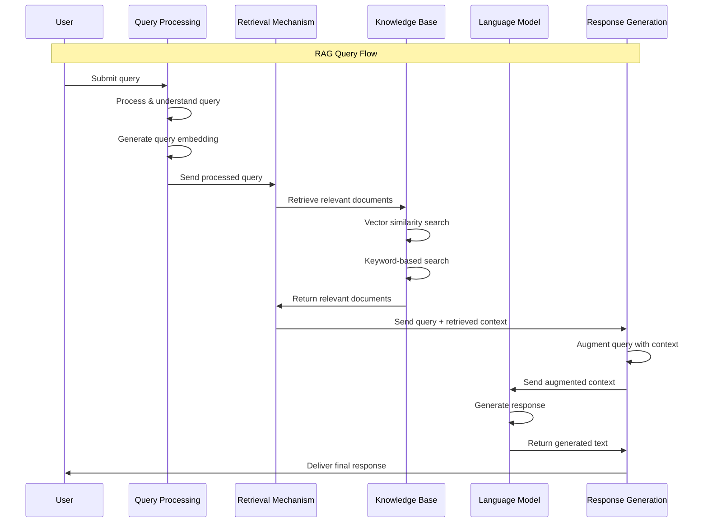

## High-level overview

Creating a Retrieval-Augmented Generation (RAG) application involves several key components that work together to enhance the generation capabilities of a language model with relevant information retrieved from a knowledge base. Below are the primary components you should consider for the backend part of a RAG application:

1. Data Ingestion
    - **Source Identification**: Determine the sources of data you need (e.g., databases, web scraping, APIs).
    - **Data Processing**: Clean and preprocess the data to ensure consistency and quality.
    - **Indexing**: Use search engines like Elasticsearch or OpenSearch to index the data for efficient retrieval.
2. Knowledge Base
    - **Document Store**: A database that stores the preprocessed documents (e.g., Elasticsearch, OpenSearch, Pinecone, Weaviate).
    - **Vector Store**: A database optimized for storing and querying high-dimensional vectors, often used for semantic search (e.g., Faiss, Pinecone).
3. Embedding Generation
    - **Embedding Models**: Models like BERT, Sentence Transformers, or specialized embedding models to convert text into vector representations.
    - **Batch Processing**: Efficiently generate embeddings for large batches of data.
4. Retrieval Mechanism
    - **Vector Search**: Retrieve relevant documents based on their vector similarity to the query vector.
    - **Traditional Search**: Use keyword-based search to retrieve relevant documents.
    - **Hybrid Search**: Combine vector and keyword search to improve retrieval accuracy.
5. Language Model Integration
    - **Pre-trained Language Models**: Use models like GPT-3, T5, or other LLMs capable of generating text.
    - **Fine-tuning**: Customize the language model on domain-specific data if necessary.
6. Query Processing
    - **Query Understanding**: Preprocess and understand the user’s query to form an effective retrieval strategy.
    - **Query Embedding**: Convert the query into a vector representation for vector search.
7. Response Generation
    - **Contextual Augmentation**: Integrate retrieved documents with the original query to form a rich context.
    - **Generation**: Use the language model to generate a response based on the augmented context.

## Embedding

> Reference: [Embeddings: The Language of LLMs and GenAI](https://quantumblack.medium.com/embeddings-the-language-of-llms-and-genai-b74c2bef105a)

Embeddings play a crucial role in Generative AI (GenAI) and Large Language Models (LLMs), extending their potential beyond popular applications like ChatGPT and Bard. These embeddings are dense vectors that represent data in a high-dimensional space, allowing for the identification of similar items and the understanding of context or intent. This capability is foundational for various tasks such as Natural Language Processing (NLP), Natural Language Understanding (NLU), recommendation systems, and graph networks.

Transformers, a neural network architecture introduced in "[Attention is All You Need](/ai/llm/#transformers)" form the basis of most embedding models. They use attention mechanisms to weigh the relevance of different inputs, handling long sequences effectively by considering the entire sequence context. LLMs use transformers to create embeddings, which are then applied in predictive models like recurrent neural networks (RNNs) or long short-term memory (LSTMs) networks. This process allows the model to generate the most probable output based on the training data. GenAI models extend these capabilities to multiple data modalities, including text, images, video, and audio, using embeddings to interpret input and generate relevant outputs.

Creating embeddings can be approached by building custom models or using/fine-tuning pre-trained models. Custom models can be trained through supervised, unsupervised, or semi-supervised learning. Pre-trained models provide a quick start and can be fine-tuned for specific applications, such as adapting to company-specific terminology or enhancing tasks like code completion.

Embeddings enable intelligent search and similarity analysis. For example, in identifying company similarities, embeddings facilitate an ontological understanding of data, surpassing simple keyword searches. This method allows for a more accurate and intuitive understanding of similarity across languages, regions, and industries. Vector databases like Pinecone, Chroma, or Milvus are recommended for handling large-scale high-dimensional embeddings efficiently.

Indexing multi-modal data, such as audio, video, and text, into a centralized knowledge base becomes feasible with transformer models. This approach supports intelligent, context-aware searches, significantly reducing the manual effort traditionally required for adding metadata.

## Choose the right model

### For embedding (TODO)

### For text generation (TODO)

### Transformer architecture for both embedding and generation?

It is not strictly necessary to use a model that employs Transformer architecture for both embedding and text generation tasks in a Retrieval-Augmented Generation (RAG) system. However, there are several reasons why it is beneficial to use models that share similar architectures, such as Transformers, for both tasks:

1. **Consistency in Representations**:
   - Transformer-based models generate embeddings that are well-suited for understanding the context and nuances of the text. Using similar architectures ensures that the embeddings and the generated text are more likely to be compatible in terms of understanding context and semantics.
2. **Ease of Fine-tuning**:
   - Transformer models, like BERT for embeddings and GPT-3 for text generation, can be fine-tuned on specific tasks or datasets. This fine-tuning can lead to more coherent and contextually relevant outputs.
3. **Performance**:
   - Transformers have been shown to perform exceptionally well across various NLP tasks, including text classification, translation, summarization, and question answering. Their self-attention mechanism allows them to capture long-range dependencies, making them powerful for both retrieval and generation.

While using Transformer models for both tasks has its advantages, mixing different types of models can still yield effective results. For example, you might use:

- **Sentence-BERT (Transformer-based)** for embedding and **GPT-3 (Transformer-based)** for generation.
- **Faiss (non-Transformer)** for efficient retrieval with embeddings generated by **BERT** or **SBERT**.
- **CLIP (Transformer-based)** for embedding multimodal data and **T5 (Transformer-based)** for generation.

## Should I use the Same LLM for Both Retrieval and Generation?

It is technically possible to use a single LLM for both embeddings (retrieval) and text generation in a Retrieval-Augmented Generation (RAG) system. **However, the industrial standard is to use specialised models for each task.**

### Why Specialisation?

- **Embedding Models**:  
  Models like BERT are designed to capture semantic meaning in a single, compact vector. This makes them effective for retrieving relevant information.
- **Generative Models**:  
  Models such as GPT-3 spread input information over several hidden states to generate coherent text. This distributed representation is not ideal for producing embeddings.

### Supporting Evidence from Literature

The following points are well supported in the research literature: [Text and Code Embeddings by Contrastive Pre-Training](https://arxiv.org/pdf/2201.10005.pdf) by [OpenAI](https://openai.com/blog/introducing-text-and-code-embeddings):

- **Generative models' limitations for embeddings**:  
  "In generative models, the information about the input is typically distributed over multiple hidden states of the model. While some generative models can learn a single representation of the input, most autoregressive Transformer models do not."  
  This indicates why a model optimised purely for generation often falls short when used as an embedding extractor.
- **Purpose-built Embedding Models**:  
  "Embedding models are explicitly optimised to learn a low dimensional representation that captures the semantic meaning of the input."  
  This confirms the need to use models built for the task of embedding.

