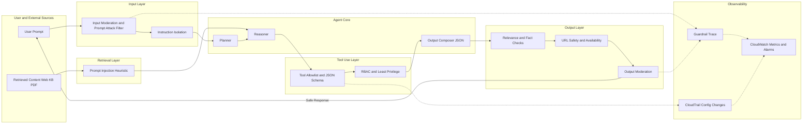

# Safeguarding Agentic Systems

Agentic systems (plan, retrieve, call tools, act) are high-leverage—and high-risk. This guide distills **defense-in-depth** patterns you can ship today, mapping conceptual guardrails to concrete implementation (especially on AWS Bedrock).

## Threats → Layers → Controls (one mental model)

**Direct** prompt injection (user tries to jailbreak) and **indirect** prompt injection (malicious text inside webpages/PDFs/KB) are the core threats. Design countermeasures at each choke point—**Input, Retrieval, Tool Use, Output, Observability**—so one miss doesn’t become a breach.

**Guardrail Layers vs Threats**

| **Layer**         | **What It Protects**                   | **Threats Mitigated**                                          | **Typical Controls**                                                                           |
| ----------------- | -------------------------------------- | -------------------------------------------------------------- | ---------------------------------------------------------------------------------------------- |
| **Input**         | User prompts & uploads                 | Direct prompt injection; illegal/toxic content; PII            | Dual moderation (input), Prompt-Attack filter, instruction isolation, rate limits              |
| **Retrieval**     | External/KB text fed to the LLM        | Indirect prompt injection; hidden instructions; malicious HTML | Sanitize HTML/scripts; allow/deny domain lists; PI heuristics; “facts-only” summarization      |
| **Tool Use**      | APIs/DBs/emails the agent can call     | Unauthorized actions; data exfiltration                        | Tool allowlist; JSON-schema validation; RBAC/IAM scoping; human-in-the-loop for sensitive ops  |
| **Output**        | What reaches users or triggers actions | Harmful/off-topic/false responses; jailbreak leakage           | Dual moderation (output); relevance & fact-check validators; URL checks; schema-locked results |
| **Observability** | Posture & drift                        | Silent bypass; misconfig                                       | Guardrail trace; CloudTrail on config changes; CloudWatch dashboards/alerts; anomaly detection |

**Defense-in-Depth Flow**

## Guardrails in practice (catalog + visuals)

Source: [datacamp: Top 20 LLM Guardrails With Examples](https://www.datacamp.com/blog/llm-guardrails)

Guardrails fall into five major categories. Each maps to different risks in an agentic system, and each can be implemented with either **managed services** (like Bedrock Guardrails) or **custom validators** (LangChain/LangGraph nodes, regex, or lightweight LLMs).

### 🔒 Security & Privacy

These guardrails protect against unsafe or unauthorized content entering or leaving your system. They typically include filters for toxic or offensive language, detection and redaction of personally identifiable information (PII), and prompt injection shields.
**Example:** Bedrock Guardrails can redact phone numbers from user input before the model sees them. In custom stacks, you might run Microsoft Presidio to flag SSNs or emails.

### 🎯 Response & Relevance

Even if an LLM is polite, it can still drift off-topic or fabricate irrelevant details. Response validators ensure the model answers the question asked, provides citations, and that any URLs it includes actually resolve.
**Example:** Compute cosine similarity between the input query embedding and the generated answer embedding to reject “off-topic” answers. Use a simple HTTP HEAD request to verify URLs.

### 📝 Language Quality

Output should be clear, professional, and free from low-quality artifacts. Language quality guardrails detect duplicated sentences, ensure readability is within a target level, and verify translations are accurate.
**Example:** A validator LLM grades readability (e.g., “Is this answer clear for a non-technical reader?”) or detects if the model output accidentally repeated a phrase 3+ times.

### ✅ Content Validation & Integrity

These controls verify that structured claims in the output are consistent, accurate, and safe to show. They block competitor mentions, check price quotes against a pricing API, or confirm that references exist in the knowledge base.
**Example:** If the model claims “The ticket price is \$125,” a content validator can query the official API and refuse to pass through mismatched values.

### ⚙️ Logic & Functionality

Finally, logic guardrails focus on whether the model’s structured outputs are valid for downstream use. This includes schema validation for JSON tool calls, logical flow checks (e.g., “departure time can’t be after arrival time”), and OpenAPI response validation.
**Example:** Use a JSON schema to validate tool calls—if invalid, reject or repair with a repair-prompt before invoking the tool.

## Inputs & Retrieval as a single gate (stop junk early)

**Dual moderation + instruction isolation** at ingress prevents a lot of nonsense. For RAG, treat retrieved text as **untrusted code**:

* Strip scripts/HTML, drop base64 blobs, kill `<style>`/hidden text.
* Run **PI heuristics** (regex + small LLM) and **quarantine or summarize to facts**.
* Maintain allow/deny domain lists; attribute sources for later fact checks.

Source: [AWS: Safeguard your generative AI workloads from prompt injections](https://aws.amazon.com/blogs/security/safeguard-your-generative-ai-workloads-from-prompt-injections/)

## Tool calls & outputs (where incidents actually happen)

Tool invocation is the riskiest part of an agentic system because it can create real-world effects — from sending an email to deleting a database record. That means the model’s freedom must be tightly constrained:

* **Tool allowlist + JSON schema lock**
  Only expose a curated set of tools, and validate every tool call against a strict schema. Reject or repair malformed calls before they touch an API.
  *Example:* A payment tool that expects `{"amount": 100, "currency": "USD"}` will reject `{ "amount": "delete all" }`.
* **RBAC/IAM per tool**
  Scope each tool to the minimum privileges it needs. Even if a malicious prompt slips through, IAM boundaries prevent escalation.
  *Example:* A “Calendar read” tool role should never have `DeleteEvent` permission.
* **Human-in-the-loop (HITL)**
  Route sensitive operations (fund transfers, account deletions) to a manual approval queue.
  *Example:* Wire transfers require operator confirmation before execution.
* **Output validators before commit**
  Don’t trust the model blindly. Run relevance checks, fact validation, URL availability checks, and readability scoring before persisting results or invoking tools.
## Regulated-Industry Constraints That Rule Out Options First

Everything above assumes the deployment surface is already decided. In a regulated environment, that assumption doesn't hold — some constraints eliminate an entire class of surface, model route, or vendor before cost, latency, or ergonomics ever get a vote. It helps to separate the decision into three layers that get chosen for different reasons and by different stakeholders: the **user-facing surface** (what a person or system directly talks to), the **developer integration layer** (what a team's code is written against — an SDK, an API, a protocol), and the **hosting/delivery route** (whose infrastructure the request actually runs on — a vendor directly, or through a cloud provider's managed offering). Treating those three as one decision is a common and avoidable mistake: a surface built for engineers ends up in front of non-technical staff, or a compliance question aimed at the hosting route gets answered by pointing at the user-facing surface instead.

The constraints below are the ones worth naming explicitly and confirming with current documentation before any other tradeoff applies, because each one can rule out an otherwise-reasonable option outright:

- **Attorney-client privilege** — a consumer-facing chat surface is often disqualified outright for privileged legal work, regardless of how good its answers are, because the surface itself may not carry the contractual and data-handling guarantees privilege depends on.
- **HIPAA (PHI handling)** — protected health information requires a route with an executed business-associate agreement (or equivalent) covering the exact service and configuration in use; a BAA covering one product or route does not automatically extend to another.
- **GDPR and data residency** — where personal data is processed and stored, and whether it can leave a given jurisdiction, can rule out a hosting route independent of anything about model quality.
- **FedRAMP / government** — government workloads typically require a specific authorized hosting boundary, and a feature or model available on a vendor's general-availability route is not automatically available on the authorized one.
- **Internal data-residency policy** — even without an external regulation, an organisation's own policy can rule out a route the same way a legal requirement would; it should be treated with the same seriousness, not as a soft preference.

:::danger[These are eliminations, not scores]
Governance constraints don't get weighed against cost or latency — they remove options from consideration before either of those comparisons starts. A route that fails a compliance requirement isn't "less optimal"; it isn't a candidate.
:::

### Worked Example: A Document-Review System Under Privilege Constraints

A firm needs to review long contracts against a standard playbook, flag risky clauses, and draft redlines, but attorney-client privilege rules out any consumer-facing surface, and the firm already has SSO and an approved model gateway in place. A defensible shape looks like this:

- A thin internal application built on a direct API or SDK, sitting behind the firm's own SSO and routed through the already-approved gateway — not a general-purpose chat product, because the privilege constraint ruled that out at the first layer.
- A parallelised workflow that reviews the contract section by section, with an evaluator step enforcing a strict schema on the flagged-clause output, rather than a single open-ended pass over the whole document.
- The playbook stays inside the firm's own systems as a versioned source of truth, retrieved per clause at call time — the model classifies and drafts against it, but the playbook itself is never treated as something the model should "know" from training.
- A capable default model handles extraction, classification, and draft redlines with context loaded progressively rather than all at once, and any extra reasoning effort is enabled only for the clause types where a measured accuracy gap justifies the added cost.
- A senior reviewer signs off on every output, and low-confidence clauses are surfaced prominently rather than buried in the same list as everything else.

Each rejected alternative fails a single load-bearing decision: a consumer-facing surface fails the privilege constraint outright; loading the entire playbook into every request abandons the versioned-source-of-truth principle for no real benefit; and an open-ended, unbounded agent replaces a process whose steps are already known and reviewable with one that's harder to audit for no corresponding gain in capability.
## Implementing these patterns on AWS

The defense-in-depth layers above apply to any stack. For the concrete AWS implementation — `CreateGuardrail`/`UpdateGuardrail`, attaching guardrails at runtime via `guardrailConfig`, versioning with CDK/CloudFormation, and the CloudTrail/CloudWatch/guardrail-trace monitoring stack — see the AWS-specific pages:

- **[Amazon Bedrock Guardrails](/aws/ai/bedrock#guardrails)** — versioning, detect-only mode, prompt-attack filter, PII redaction, cross-account enforcement
- **[Responsible AI & Security on AWS](/aws/ai/responsible-ai-and-security)** — IAM controls, PII/PHI service selection (Comprehend vs Macie vs Guardrails), and the CloudTrail vs Model Invocation Logging vs guardrail-tracing distinction

