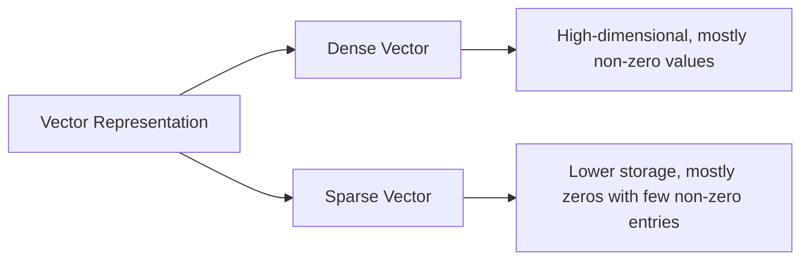
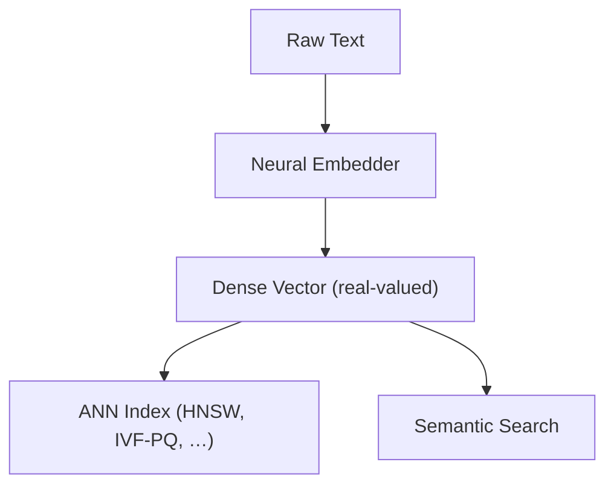

## Sparse vs Dense Index



### Dense Index
- **What it is:**  
  Dense indexing is used for vectors where nearly every element carries a value—these represent continuous, high‑dimensional embeddings, typically produced by neural networks.
- **Usage:**  
  Ideal for applications where semantic meaning is captured in every dimension of the vector. For example, text embeddings where each number contributes some notion of context or meaning.
- **Analogy:**  
  Imagine a dense index as a full‑colour image where every pixel holds a piece of the picture.

:::info Why Dense Indexes for LLM Embeddings?
1. **Continuous, high‑dimensional space**  
   Neural embed­ders output real‑valued vectors (e.g. `[0.12, –0.03, 1.27, …]`) in which **every** dimension carries subtle semantic signals.  
2. **Smooth similarity landscape**  
   Nearby points in this space interpolate meaning smoothly—e.g.  
   ```
   vec("king") – vec("man") + vec("woman") ≈ vec("queen")
   ```  
   Approximate nearest‑neighbour (ANN) structures like HNSW or IVF‑PQ are optimised for these dense vectors.
3. **Semantic arithmetic**  
   Real‑valued dimensions support vector arithmetic and permit fine‑grained semantic shifts along learned axes (gender, tense, topic, …).


:::

### Sparse Index
- **What it is:**  
  Sparse indexing is designed for vectors that contain many zero (or near‑zero) values, with only a few non‑zero entries carrying information. This is common in representations like bag‑of‑words or TF‑IDF.
- **Usage:**  
  Best for scenarios where only a handful of discrete features matter—e.g. keyword matching in search engines.
- **Analogy:**  
  Think of a sparse index as a dot‑to‑dot drawing where only specific points matter and the majority of the canvas remains blank.

## Similarity Metrics

When querying vector databases like Pinecone, you choose a metric that determines how similarity between vectors is computed.

| **Metric**     | **Description**                                                                                                                                             | **When to Use**                                                                                            | **Example**                                                                                                           |
|----------------|-------------------------------------------------------------------------------------------------------------------------------------------------------------|-------------------------------------------------------------------------------------------------------------|-----------------------------------------------------------------------------------------------------------------------|
| **Cosine**     | Computes the cosine of the angle between two vectors. Emphasises direction rather than magnitude, useful when vectors are normalised.                        | When you care more about orientation or semantic similarity regardless of scale.                            | Comparing sentence embeddings to find articles about the same topic, irrespective of length or word count.            |
| **Euclidean**  | Measures the straight‑line (L2‑norm) distance between two vectors. Sensitive to magnitude differences.                                                      | When absolute distance is important, as with spatial coordinates or raw feature‑space distances.             | Locating the nearest stores to a customer on a map (latitude/longitude embeddings).                                    |
| **Dot Product**| Calculates the inner product of two vectors, combining magnitude and direction. Closely related to cosine if vectors are normalised.                         | When vector magnitude carries meaning (e.g. popularity, confidence).                                         | Recommending products where popularity (magnitude) and similarity both matter—higher‑rated items get a bigger boost.  |

## Dimension

- **Definition:**  
  The dimension of a vector refers to the number of elements (or features) it contains. For example, an embedding with a 256‑dimension vector has 256 features.
- **Impact of Dimension Variations:**  
  - **Lower dimension (e.g. 256):**  
    Captures less detail but is more computationally efficient and less storage intensive.  
  - **Higher dimension (e.g. 1024):**  
    Captures more nuanced features, potentially improving accuracy, at the cost of more storage and compute and the risk of the curse of dimensionality.
- **AWS Titan Text Embeddings V2 Example:**  
  Choosing between 256, 512 or 1024 dimensions is a trade‑off:
  - **256‑dim:** Faster, lighter, but may miss subtle signals.  
  - **1024‑dim:** Richer semantics, but heavier on resources.
- **Analogy:**  
  Consider dimension as the number of pixels in an image: more pixels (higher dimension) provide a higher resolution, while fewer pixels yield a simpler, coarser image.

## Choosing an Indexing Strategy by Query Pattern

Chunking and indexing answer two different design questions, and it is worth keeping them separate before picking either one. The chunking approach — fixed-token, sentence, paragraph, hierarchical, or semantic — is chosen by the **structure of the source documents**; that decision tree lives in [Chunking Strategies](/ai/agentic-system/chunking). The indexing strategy — dense, sparse, or hybrid — is chosen by the **shape of the queries the system will actually see**, and that is the decision this section covers.

| Query pattern | What the query hinges on | Indexing strategy that earns its place |
| --- | --- | --- |
| Paraphrase, intent, or open-ended conceptual questions | Meaning, not exact wording | Dense (embeddings) |
| Exact identifiers, codes, names, or clause references | Literal token overlap | Sparse (keyword, e.g. BM25) |
| A mixed query set that includes both of the above | Both signals, on different requests | Hybrid |

The most common miss I see is reaching for a dense-only index because most queries "sound conversational," then discovering that a meaningful slice of real traffic is exact-target lookup. Consider a query set that mixes:
- an exact-clause lookup such as *"find the termination clause in the Acme contract"*, where the contract name and the clause type act as near-literal tokens a sparse index is built to catch, and
- an open-ended conceptual question such as *"how did we approach X?"*, where there is no single right keyword and a dense index has to do the work of matching meaning instead of wording.

Neither a dense-only nor a sparse-only index covers both of those well. A dense-only index can dilute "Acme" and "termination" into a vector that no longer discriminates sharply between contracts; a sparse-only index has no way to match "how did we approach X" against a passage that never uses the word "approach." That is the case hybrid indexing exists for, and it is why a query set with genuinely mixed patterns is the strongest justification for the extra moving part. Combining the two ranked lists into one is a separate problem from choosing dense vs. sparse in the first place — the mechanics of that fusion step (including Reciprocal Rank Fusion) are covered in [From Keywords to Hybrid Search](/ai/llm/rag/retrieval-engineering#reciprocal-rank-fusion-combining-rankings-without-fighting-score-scales), so I won't repeat the maths here.

### The Trade-off: Quality and Latency vs. Maintenance

Every indexing decision trades against the same three things: retrieval quality, latency, and ongoing maintenance cost. The pattern I keep seeing is:
- **Smaller chunks plus hybrid indexing** tend to raise quality and latency together — more granular candidates give both the dense and sparse signal more precise units to match against, but there are more index entries to search and an extra fusion step to run on every query.
- **Larger chunks plus dense-only indexing** lower latency and maintenance — fewer, bigger vectors mean a smaller index and no fusion step — but they miss exact-match queries, because folding a specific identifier into a large chunk's embedding dilutes the very signal a sparse index would have caught directly.

There is no universally correct point on that spectrum. The right answer is the one that fits the query patterns a given corpus actually receives, stated as an explicit trade-off rather than assumed by default. If a system has never actually measured its query mix, that measurement — not a bigger embedding model — is usually the highest-leverage next step.
