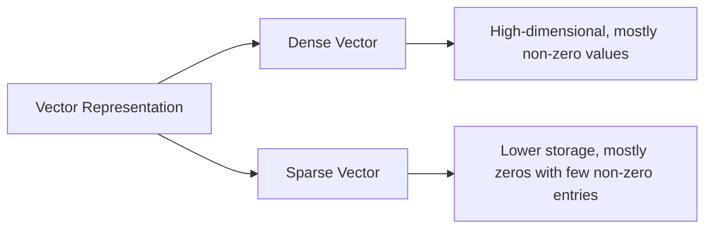
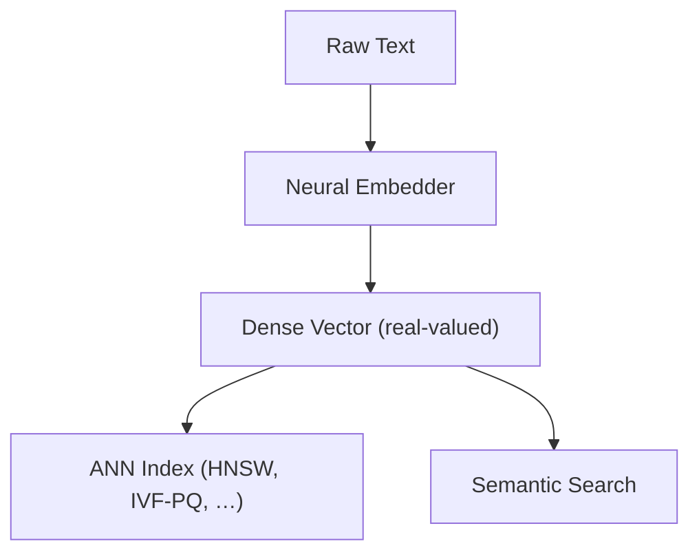

## Sparse vs Dense Index



### Dense Index
- **What it is:**  
  Dense indexing is used for vectors where nearly every element carries a value—these represent continuous, high‑dimensional embeddings, typically produced by neural networks.
- **Usage:**  
  Ideal for applications where semantic meaning is captured in every dimension of the vector. For example, text embeddings where each number contributes some notion of context or meaning.
- **Analogy:**  
  Imagine a dense index as a full‑colour image where every pixel holds a piece of the picture.

:::info Why Dense Indexes for LLM Embeddings?
1. **Continuous, high‑dimensional space**  
   Neural embed­ders output real‑valued vectors (e.g. `[0.12, –0.03, 1.27, …]`) in which **every** dimension carries subtle semantic signals.  
2. **Smooth similarity landscape**  
   Nearby points in this space interpolate meaning smoothly—e.g.  
   ```
   vec("king") – vec("man") + vec("woman") ≈ vec("queen")
   ```  
   Approximate nearest‑neighbour (ANN) structures like HNSW or IVF‑PQ are optimised for these dense vectors.
3. **Semantic arithmetic**  
   Real‑valued dimensions support vector arithmetic and permit fine‑grained semantic shifts along learned axes (gender, tense, topic, …).


:::

### Sparse Index
- **What it is:**  
  Sparse indexing is designed for vectors that contain many zero (or near‑zero) values, with only a few non‑zero entries carrying information. This is common in representations like bag‑of‑words or TF‑IDF.
- **Usage:**  
  Best for scenarios where only a handful of discrete features matter—e.g. keyword matching in search engines.
- **Analogy:**  
  Think of a sparse index as a dot‑to‑dot drawing where only specific points matter and the majority of the canvas remains blank.

## Similarity Metrics

When querying vector databases like Pinecone, you choose a metric that determines how similarity between vectors is computed.

| **Metric**     | **Description**                                                                                                                                             | **When to Use**                                                                                            | **Example**                                                                                                           |
|----------------|-------------------------------------------------------------------------------------------------------------------------------------------------------------|-------------------------------------------------------------------------------------------------------------|-----------------------------------------------------------------------------------------------------------------------|
| **Cosine**     | Computes the cosine of the angle between two vectors. Emphasises direction rather than magnitude, useful when vectors are normalised.                        | When you care more about orientation or semantic similarity regardless of scale.                            | Comparing sentence embeddings to find articles about the same topic, irrespective of length or word count.            |
| **Euclidean**  | Measures the straight‑line (L2‑norm) distance between two vectors. Sensitive to magnitude differences.                                                      | When absolute distance is important, as with spatial coordinates or raw feature‑space distances.             | Locating the nearest stores to a customer on a map (latitude/longitude embeddings).                                    |
| **Dot Product**| Calculates the inner product of two vectors, combining magnitude and direction. Closely related to cosine if vectors are normalised.                         | When vector magnitude carries meaning (e.g. popularity, confidence).                                         | Recommending products where popularity (magnitude) and similarity both matter—higher‑rated items get a bigger boost.  |

## Dimension

- **Definition:**  
  The dimension of a vector refers to the number of elements (or features) it contains. For example, an embedding with a 256‑dimension vector has 256 features.
- **Impact of Dimension Variations:**  
  - **Lower dimension (e.g. 256):**  
    Captures less detail but is more computationally efficient and less storage intensive.  
  - **Higher dimension (e.g. 1024):**  
    Captures more nuanced features, potentially improving accuracy, at the cost of more storage and compute and the risk of the curse of dimensionality.
- **AWS Titan Text Embeddings V2 Example:**  
  Choosing between 256, 512 or 1024 dimensions is a trade‑off:
  - **256‑dim:** Faster, lighter, but may miss subtle signals.  
  - **1024‑dim:** Richer semantics, but heavier on resources.
- **Analogy:**  
  Consider dimension as the number of pixels in an image: more pixels (higher dimension) provide a higher resolution, while fewer pixels yield a simpler, coarser image.


