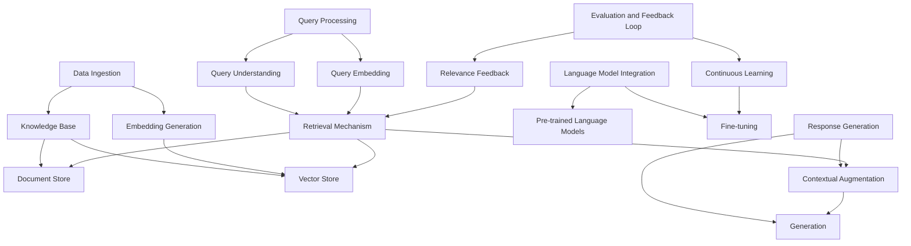

## High-level overview

Creating a Retrieval-Augmented Generation (RAG) application involves several key components that work together to enhance the generation capabilities of a language model with relevant information retrieved from a knowledge base. Below are the primary components you should consider for the backend part of a RAG application:

1. Data Ingestion
    - **Source Identification**: Determine the sources of data you need (e.g., databases, web scraping, APIs).
    - **Data Processing**: Clean and preprocess the data to ensure consistency and quality.
    - **Indexing**: Use search engines like Elasticsearch or OpenSearch to index the data for efficient retrieval.
2. Knowledge Base
    - **Document Store**: A database that stores the preprocessed documents (e.g., Elasticsearch, OpenSearch, Pinecone, Weaviate).
    - **Vector Store**: A database optimized for storing and querying high-dimensional vectors, often used for semantic search (e.g., Faiss, Pinecone).
3. Embedding Generation
    - **Embedding Models**: Models like BERT, Sentence Transformers, or specialized embedding models to convert text into vector representations.
    - **Batch Processing**: Efficiently generate embeddings for large batches of data.
4. Retrieval Mechanism
    - **Vector Search**: Retrieve relevant documents based on their vector similarity to the query vector.
    - **Traditional Search**: Use keyword-based search to retrieve relevant documents.
    - **Hybrid Search**: Combine vector and keyword search to improve retrieval accuracy.
5. Language Model Integration
    - **Pre-trained Language Models**: Use models like GPT-3, T5, or other LLMs capable of generating text.
    - **Fine-tuning**: Customize the language model on domain-specific data if necessary.
6. Query Processing
    - **Query Understanding**: Preprocess and understand the user’s query to form an effective retrieval strategy.
    - **Query Embedding**: Convert the query into a vector representation for vector search.
7. Response Generation
    - **Contextual Augmentation**: Integrate retrieved documents with the original query to form a rich context.
    - **Generation**: Use the language model to generate a response based on the augmented context.
8. Evaluation and Feedback Loop
    - **Relevance Feedback**: Collect feedback from users on the relevance of responses to improve the system.
    - **Continuous Learning**: Continuously fine-tune the retrieval and generation models based on feedback.

## Embedding

> Reference: [Embeddings: The Language of LLMs and GenAI](https://quantumblack.medium.com/embeddings-the-language-of-llms-and-genai-b74c2bef105a)

Embeddings play a crucial role in Generative AI (GenAI) and Large Language Models (LLMs), extending their potential beyond popular applications like ChatGPT and Bard. These embeddings are dense vectors that represent data in a high-dimensional space, allowing for the identification of similar items and the understanding of context or intent. This capability is foundational for various tasks such as Natural Language Processing (NLP), Natural Language Understanding (NLU), recommendation systems, and graph networks.

Transformers, a neural network architecture introduced in "[Attention is All You Need](/ai/llm/#transformers)" form the basis of most embedding models. They use attention mechanisms to weigh the relevance of different inputs, handling long sequences effectively by considering the entire sequence context. LLMs use transformers to create embeddings, which are then applied in predictive models like recurrent neural networks (RNNs) or long short-term memory (LSTMs) networks. This process allows the model to generate the most probable output based on the training data. GenAI models extend these capabilities to multiple data modalities, including text, images, video, and audio, using embeddings to interpret input and generate relevant outputs.

Creating embeddings can be approached by building custom models or using/fine-tuning pre-trained models. Custom models can be trained through supervised, unsupervised, or semi-supervised learning. Pre-trained models provide a quick start and can be fine-tuned for specific applications, such as adapting to company-specific terminology or enhancing tasks like code completion.

Embeddings enable intelligent search and similarity analysis. For example, in identifying company similarities, embeddings facilitate an ontological understanding of data, surpassing simple keyword searches. This method allows for a more accurate and intuitive understanding of similarity across languages, regions, and industries. Vector databases like Pinecone, Chroma, or Milvus are recommended for handling large-scale high-dimensional embeddings efficiently.

Indexing multi-modal data, such as audio, video, and text, into a centralized knowledge base becomes feasible with transformer models. This approach supports intelligent, context-aware searches, significantly reducing the manual effort traditionally required for adding metadata.

### Storage: AWS OpenSearch vs AWS Kendra

The key difference between Amazon OpenSearch (formerly CloudSearch) and Amazon Kendra lies in their underlying technologies and target use cases. OpenSearch, based on Solr, is a keyword search engine suitable for structured data and requires data to be formatted in JSON or XML batches. It primarily returns lists of documents based on keyword matching.

In contrast, Amazon Kendra is an ML-powered search engine designed for unstructured data such as Word documents, PDFs, HTML, PPTs, and FAQs. Kendra excels at handling natural language queries and providing specific answers rather than just document lists. Additionally, Kendra offers out-of-the-box connectors for popular repositories like SharePoint, S3, Salesforce, and ServiceNow, facilitating automatic content indexing directly into Kendra.

Therefore, Kendra is better suited for enterprise search applications or website searches requiring deeper language understanding, while OpenSearch is more appropriate for structured data and keyword-based search scenarios.

## Choose the right model

### For embedding

### For text generation

### Same model for embedding and generation?

The answer is yes, in theory you can use the same model for both embedding and text generation in a RAG application, though it involves certain trade-offs. The primary reason not many practitioners use the same model for both embedding and text generation tasks in Retrieval-Augmented Generation (RAG) applications is due to the distinct optimization requirements for each task. Embedding models, like BERT, are optimized for capturing semantic similarity and relevance, making them effective for information retrieval. In contrast, text generation models, such as GPT-3, are designed to produce coherent and contextually appropriate responses, focusing on fluency and coherence.

:::infoFurther material
To understand this topic further, there is a [research paper](https://arxiv.org/pdf/2201.10005.pdf) by [OpenAI](https://openai.com/blog/introducing-text-and-code-embeddings) that explain this more.

Generative, auto-regressive models **aren't well suited for embeddings** because their understanding of the input is spread out over multiple hidden states. You need to train a model whose specific purpose is to produce embeddings. Typically this is a transformer encoder, and in such cases you take the hidden state from the last layer of the last "end of sequence" token. This means that the model's understanding is concentrated in a single place.

Relevant excerpts from the paper below.

Generative models aren't well suited for performing predictions:

> In generative models, the information about the input is typically distributed over multiple hidden states of the model. While some generative models can learn a single representation of the input, most autoregressive Transformer models do not

You need a purpose-built embeddings model:

> Embedding models are explicitly optimized to learn a low dimensional representation that captures the semantic meaning of the input

You use a transformer encoder, and use the hidden state from the last layer of the last token:

> Given a training pair (x, y), a Transformer (Vaswani et al., 2017) encoder E is used to process x and y independently. The encoder maps the input to a dense vector representation or embedding (Figure 2). We insert two special token delimiters, [SOS] and [EOS], to the start and end of the input sequence respectively. The hidden state from the last layer corresponding to the special token [EOS] is considered as the embedding of the input sequence.
:::

### Transformer architecture for both embedding and generation?

It is not strictly necessary to use a model that employs Transformer architecture for both embedding and text generation tasks in a Retrieval-Augmented Generation (RAG) system. However, there are several reasons why it is beneficial to use models that share similar architectures, such as Transformers, for both tasks:

1. **Consistency in Representations**:
   - Transformer-based models generate embeddings that are well-suited for understanding the context and nuances of the text. Using similar architectures ensures that the embeddings and the generated text are more likely to be compatible in terms of understanding context and semantics.
2. **Ease of Fine-tuning**:
   - Transformer models, like BERT for embeddings and GPT-3 for text generation, can be fine-tuned on specific tasks or datasets. This fine-tuning can lead to more coherent and contextually relevant outputs.
3. **Performance**:
   - Transformers have been shown to perform exceptionally well across various NLP tasks, including text classification, translation, summarization, and question answering. Their self-attention mechanism allows them to capture long-range dependencies, making them powerful for both retrieval and generation.

While using Transformer models for both tasks has its advantages, mixing different types of models can still yield effective results. For example, you might use:

- **Sentence-BERT (Transformer-based)** for embedding and **GPT-3 (Transformer-based)** for generation.
- **Faiss (non-Transformer)** for efficient retrieval with embeddings generated by **BERT** or **SBERT**.
- **CLIP (Transformer-based)** for embedding multimodal data and **T5 (Transformer-based)** for generation.

## Hosting a model in AWS

Amazon SageMaker Jumpstart allows users to host custom machine learning models with extensive customization and control over infrastructure, making it suitable for complex projects. It includes pre-trained models for various domains and offers tools for training and inference. Amazon Bedrock, on the other hand, is a fully managed service providing API access to pre-built AI models, aimed at rapid deployment and ease of use without needing infrastructure management. Bedrock is ideal for standard tasks and integrates seamlessly with AWS services but offers less customization and model choice compared to Jumpstart.

| Criteria                    | Amazon SageMaker JumpStart                                                                                                                                                                                                      | Amazon Bedrock                                                                                                                                                                                |
|-----------------------------|---------------------------------------------------------------------------------------------------------------------------------------------------------------------------------------------------------------------------------|-----------------------------------------------------------------------------------------------------------------------------------------------------------------------------------------------|
| Use Case & Customization    | Designed for comprehensive control over custom models with extensive customization options.                                                                                                                                     | Simplified approach with seamless integration with hosted models, offering limited customization.                                                                                             |
| Development Time & Training | Requires a longer development cycle due to custom model creation and training, supporting user-provided data.                                                                                                                    | Accelerates development by leveraging pre-trained models, eliminating the need for custom training.                                                                                           |
| Scalability & Cost Control  | Provides robust scalability options and granular cost control through resource allocation.                                                                                                                                      | Scalability influenced by AWS-hosted models with less flexibility in managing costs.                                                                                                          |
| Model & Integration Options | Allows selection from a wide array of models and frameworks with flexible integration options, requiring more configuration effort.                                                                                             | Restricted to pre-built models within Bedrock, offering seamless integration with AWS services.                                                                                               |
| Maintenance & Security      | Users manage model versions, updates, and security settings, ensuring tailored control.                                                                                                                                         | AWS handles updates and maintenance, providing robust security measures for hosted models.                                                                                                    |
| Data & RAG Integration      | Users manage data and training workflows independently, providing flexibility to integrate Retrieval-Augmented Generation (RAG) models as needed.                                                                               | No additional training data required for pre-trained models; RAG integration depends on the availability of such models within Bedrock.                                                      |

## Multi-agent and Single-agent system

In the context of Large Language Models (LLMs), a single-agent approach involves one agent (or model) handling all tasks within an application. This approach is simpler and easier to manage, making it suitable for straightforward applications. However, it can become inefficient or overwhelmed when dealing with complex, multifaceted tasks. Conversely, a multi-agent approach employs multiple specialized agents, each optimized for specific tasks, working collaboratively. This method enhances efficiency and scalability for large-scale, complex applications. Despite its complexity, requiring coordination and a task orchestrator, it offers greater flexibility and robustness in managing diverse tasks.

## Query Processing and Response Generation

- Receive Query: API Gateway receives the user query.
- Generate Query Embedding: Embed the query using the embedding model.
- Retrieve Documents: Search for the closest embeddings in OpenSearch.
- Generate Response: Pass the retrieved documents to the LLM for response generation.