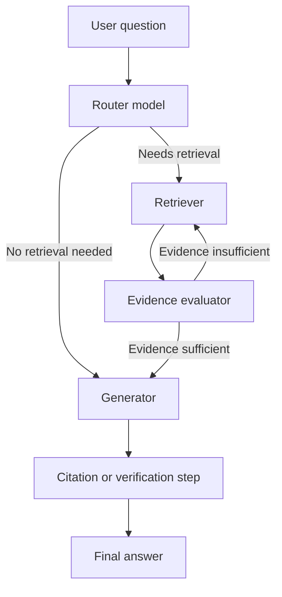

# Generation Systems for RAG: Prompting, Hallucinations, and Evaluation

By the time a RAG system reaches the generation step, a lot of work has already happened. The retriever has searched the knowledge base, ranked chunks, and chosen the context that seems most relevant.

But retrieval only creates the conditions for a good answer. It does not guarantee one.

The LLM still has to read the retrieved material, decide what matters, ignore distractions, structure a response, and stay grounded while doing it. That is why the generation layer deserves its own chapter. Once retrieval is working, this is the next place where product quality is won or lost.

The big lesson of this module is simple: a good retriever can hand the model useful evidence, but the model still needs to *use* that evidence well.

## Why the Generation Layer Deserves Separate Attention

It is tempting to think that once a retriever is strong, the rest of the system is almost solved. In practice, that is not true.

Even with good retrieval, the generation side can still fail in several ways:

1. the model may ignore part of the evidence,
2. it may over-focus on irrelevant retrieved text,
3. it may answer fluently but not faithfully,
4. it may cite poorly or not at all,
5. it may produce long, expensive, unstable outputs because the prompt structure is weak.

That means generation is not just "call the LLM." It is the problem of making the model behave consistently and use context the way the application needs.

## What Matters About Transformers in Practice

I do not need to implement a transformer to build a RAG system, but I do need to understand a few properties of transformer-based LLMs because they explain so much real behavior.

1. **LLMs process tokens, not whole answers.** The model does not first figure out the perfect response and then write it down. It processes tokenized input, builds contextual representations through attention and feedforward layers, and generates the output token by token. That matters because each new token is influenced by the prompt, the retrieved context, and the tokens generated earlier in the same completion.
2. **Attention is why retrieved context can help.** The attention mechanism lets each token consider other tokens in the prompt. That is why retrieved documents can actually influence the answer instead of just sitting in the prompt as dead text. When the model works well, it can connect the user's question to the relevant pieces of retrieved evidence and generate a response that reflects those relationships.
3. **Generation is still probabilistic.** This is one of the most important reminders in all of RAG. The model is not deterministically reading facts out of the context like a database lookup. It is generating a sequence of probable next tokens. That is why grounded systems can still hallucinate, drift, or choose strange phrasings even when the right evidence is present.
4. **Long prompts are expensive.** Transformers are computationally expensive, and prompt length matters. The more tokens I include, the more work the model must do. That affects latency and cost directly. So prompt design is not just about quality. It is also about computational discipline.

## Decoding and Sampling Controls

A large language model does not select the next token in a purely fixed way unless I force it to. By default, generation involves probabilistic choice.

This randomness is not necessarily bad. It is part of why LLMs can sound flexible and natural. But in RAG, especially for factual question answering, I usually want to control it carefully.

The useful mental model here is that decoding settings are not "creative writing knobs" only. They are reliability settings. They change how boldly or conservatively the model moves through the space of possible next tokens.

If retrieval already gave me strong evidence, I usually want the model to stay fairly close to that grounded path. If the task is open-ended ideation, I may tolerate or even prefer more variation. So these settings should be chosen in relation to the job the model is doing, not just by habit.

### Greedy Decoding: Maximum Predictability, Limited Flexibility

The most extreme option is greedy decoding, where the model always chooses the most probable next token.

The upside is determinism. The same prompt yields the same response.

The downside is that the output can become stiff, repetitive, and sometimes brittle. If the model falls into an awkward repetitive path, greedy decoding does not give it much room to escape.

That is why greedy decoding can be useful for debugging or narrow deterministic tasks, but it is not always the best everyday setting.

### Temperature: The Main Dial for Randomness

Temperature changes the sharpness of the token probability distribution.

- Lower temperature makes the distribution more spiky and conservative.
- Higher temperature flattens it and gives lower-probability tokens a better chance.

In practical terms:

- lower temperature usually helps when I want factual, stable, low-variance output,
- higher temperature can be useful when I want exploratory or creative language.

For RAG question answering, code generation, and grounded explanations, I usually lean toward lower temperature because I want the model to stay close to the highest-likelihood grounded continuation.

### Top-k and Top-p: Trimming the Nonsense Tail

Even after choosing a temperature, the model's token distribution often has a long tail of weak, low-sense options.

Top-k sampling says: only consider the top $k$ candidate tokens.

Top-p sampling says: consider as many top tokens as needed to reach cumulative probability $p$.

Top-p is often more adaptive because the allowed token pool changes depending on how confident the model already is.

That makes it easier to keep outputs flexible when the model is uncertain and more constrained when it is confident.

### Repetition Penalties and Logit Biasing

Some generation issues are not about the whole probability curve. They are about specific token behaviors.

1. **Repetition penalties** reduce the chance that the model keeps reusing the same word or phrase over and over. That can help outputs sound less stuck and less mechanical.
2. **Logit biasing** lets me push specific tokens up or down in likelihood. That is useful in narrow situations such as:

- discouraging profanity,
- nudging a classifier toward a fixed label set,
- biasing formatting tokens.

These are not everyday tools for all RAG systems, but they are useful reminders that not every generation issue requires prompt changes alone.

## Choosing an LLM for RAG Workloads

Model selection is one of the most important choices in the generation layer, but it should be treated as an engineering choice rather than a branding choice.

### Quantitative factors that matter

The main measurable factors are:

- model quality on relevant tasks,
- latency and time-to-first-token,
- context window size,
- cost,
- operational stability.

Larger models are often more capable, but they are also slower and more expensive. Newer models are often stronger, but they may also be costlier or less stable in deployment.

### Benchmarks help, but only if they are relevant

A benchmark is useful only if it resembles the work my system actually does.

If my RAG system does not generate code, then code-heavy leaderboards tell me less than they tell a coding assistant team.

This is why generic leaderboards are only a starting point. The better question is: how does the model behave on *my* prompts, *my* contexts, and *my* evaluation set?

### Benchmarks saturate over time

Another important lesson is that benchmarks age quickly. Once most strong models score near the top, the benchmark stops being useful for differentiation.

So choosing a model is never a permanent decision. It is a current best-fit decision that will likely be revisited as the model landscape changes.

## Building the Augmented Prompt

Prompt engineering sounds abstract until I look at what is actually sent to the model.

In most production systems, the prompt is not a single ad hoc string. It is a structured template built from several components.

The common layout is:

1. system prompt,
2. optional conversation history,
3. retrieved context,
4. the user's current question.

That structure matters because the model does not "know" which text is supposed to be instruction, which is supposed to be evidence, and which is supposed to be the user's actual request unless I signal those roles clearly.

When prompt construction is weak, generation quality becomes hard to debug. A bad answer might come from weak retrieval, but it might also come from the fact that the prompt buried the user's question under too much context, failed to mark the source material clearly, or mixed old chat history with the current task in a confusing way.

### Prompt template

A prompt template is the repeatable skeleton I use to assemble these pieces. The point of a template is not style for its own sake. The point is experimental control.

If I want to know whether a new grounding instruction helped, or whether moving retrieved context above or below the latest user question improved outcomes, I need a stable template so I can change one variable at a time.

### An example of a messages-based augmented prompt

The important thing in this pattern is not the syntax alone. It is the separation of stable instructions, prior conversation state, and retrieved evidence so the model sees each role clearly.

```python
messages = [
    {"role": "system", "content": system_prompt},
    *chat_history,
    {
        "role": "user",
        "content": f"Question: {query}\n\nRetrieved context:\n{retrieved_context}",
    },
]
```

Using a stable template matters because it makes behavior easier to debug, compare, and evaluate. If the prompt structure changes constantly, it becomes much harder to attribute improvements or regressions.

### The system prompt: high-level behavioral control

The system prompt is where I put stable instructions about how the model should behave.

This might include:

- tone and style,
- formatting expectations,
- citation rules,
- refusal rules,
- instructions to stay grounded in retrieved content.

In a RAG setting, the system prompt is one of the first places I can express the application's safety and grounding policy.

For example, I can tell the model:

- answer using retrieved sources when available,
- do not invent unsupported facts,
- say when evidence is insufficient,
- cite relevant source snippets.

The system prompt does not guarantee compliance, but it strongly shapes the behavior of the generation step.

## Advanced Prompting Techniques: Useful, but Not Free

Once a basic prompt template works, I can add more advanced techniques. But each one increases prompt complexity, token cost, or both.

That means advanced prompting should be earned by evidence, not added by default.

Another way to say this is that advanced prompting should solve a concrete failure mode. If I do not know what it is fixing, it is probably just making the prompt longer.

### In-Context Learning and Few-Shot Examples

One powerful technique is giving the model examples of what a good answer looks like.

If I include one example, that is one-shot prompting.

If I include several, that becomes few-shot prompting.

This can be useful for teaching:

- response format,
- preferred tone,
- citation style,
- how to handle certain kinds of questions.

In a RAG setting, I can even retrieve example question-answer pairs from a dataset of successful past interactions. That turns examples themselves into a kind of retrieved context.

This can work well, but it also lengthens prompts quickly. So I only want to keep it if evaluation says it is worth the cost.

### Reasoning-Oriented Prompting

Another family of techniques encourages the model to reason more explicitly.

This may mean asking it to:

- think step by step,
- outline a plan first,
- separate reasoning from the final answer,
- use a scratchpad-style structure internally.

### An example of sampling controls

This kind of helper is useful when I want response style to be configurable in one place instead of scattering temperature and sampling decisions across the codebase.

```python
kwargs = generate_params_dict(
    query,
    temperature=0.5,
    top_p=0.5,
)

response = llm.generate(**kwargs)
```

### An example of explicit reasoning instructions

This pattern is useful when the task benefits from a more deliberate answer structure and I want the prompting logic to make that structure obvious.

```python
reasoning_prompt = """
Answer using only retrieved context.
First, reason step by step in short bullets.
Then provide a concise final answer.
"""

messages = [
    {"role": "system", "content": reasoning_prompt},
    {"role": "user", "content": query_with_context},
]
```

This can improve quality on harder tasks, especially when the model needs to combine multiple facts or reason carefully across documents.

But it also increases token usage and sometimes introduces verbose internal structure that is not necessary for simpler prompts.

### Reasoning Models Change the Prompting Strategy

Some newer models are explicitly designed as reasoning models. These models often generate internal reasoning tokens before producing the final user-visible answer.

That can make them better at complex tasks such as:

- coding,
- mathematics,
- multi-step planning,
- deeper evidence synthesis.

But they are also usually slower and more expensive.

Another practical difference is that some old prompt tricks become less useful. For reasoning models, telling them to "think step by step" may add less value because that behavior is already built into the model.

So the right approach is not to pile on more prompt complexity blindly. It is to prompt in the style the model family actually responds well to.

## Context Window Management Is Not Optional

Every improvement to prompting seems to want more tokens.

Retrieved chunks add tokens.

Few-shot examples add tokens.

Long chat histories add tokens.

Reasoning traces may add tokens.

That means context management is a core generation concern, not a side issue.

In single-turn systems, the main question is simple: does every piece of prompt content justify its cost? If a prompt component does not improve performance, it should probably be removed.

In multi-turn systems, the problem becomes harder. Long chat histories can carry stale context that no longer helps the current question. Retrieved chunks from old turns may become irrelevant noise. So practical rules are:

- keep only history relevant to the current turn,
- do not keep stale retrieved chunks around by default,
- summarize older history if necessary,
- avoid carrying internal reasoning artifacts into future turns unless they are truly needed.

If I ignore this, the system becomes slower, more expensive, and often less stable.

## Hallucinations and Grounding

RAG reduces hallucinations, but it does not eliminate them.

This is important because some people implicitly expect retrieval to solve the problem completely. It does not.

The model is still a text generator. If it sees incomplete evidence, ambiguous evidence, weakly relevant evidence, or misleading context, it can still produce claims that are unsupported or wrong.

### A Concrete Hallucination Example

Imagine a customer asks whether an online store offers student discounts.

The retriever finds documents about two real discounts:

- senior discounts,
- new-customer discounts.

The model is also prompted to be helpful.

That combination can produce a plausible but false answer like:

"Yes, student discounts are available with a valid student ID, similar to the 10 percent discount offered to seniors and new customers."

The answer sounds coherent. It even sounds helpful. But it is invented.

That is exactly what makes hallucinations dangerous.

### Why There Is No Perfect Hallucination Fix

This is the uncomfortable truth: there is no perfect general solution that guarantees zero hallucinations.

What I can do instead is reduce the risk, detect unsupported claims more reliably, and design the system so unsupported answers are less likely and less harmful.

### Practical Hallucination Controls

The best practical controls usually include:

1. instructing the model to ground factual claims in retrieved evidence,
2. asking it to cite or attribute claims,
3. explicitly allowing refusal when evidence is insufficient,
4. penalizing unsupported claims in evaluation,
5. adding post-generation verification when stakes are high.

Self-consistency is interesting as a secondary defense: I can generate multiple responses and look for consistency across them, and if hallucinated facts vary, inconsistency may expose the problem. But it is expensive and not always reliable, so I do not think of it as the main production defense.

Grounding and citation are usually stronger defaults. The better baseline is to tell the model clearly that factual claims should be based on retrieved information and to encourage or require citation behavior. That increases the chance that the answer remains tied to the evidence and makes human inspection easier. The catch is that citations can themselves be hallucinated, which is why external attribution systems or citation evaluation may still matter.

### Evaluating Citation Quality and Faithfulness

Once I care about grounding, I need metrics that focus on grounding.

Two important ideas are:

- faithfulness: are claims supported by retrieved evidence?
- citation quality: do cited sources actually match the claims?

These matter more in RAG than in many ordinary chat systems because grounding is supposed to be part of the system's value proposition.

If the model produces elegant answers but fails on faithfulness, the RAG pipeline is not really doing its job.

## Evaluating LLM Performance in RAG

The evaluation logic for the generator should stay aligned with the generator's role.

The retriever's job is to find relevant context.

The LLM's job is to turn that context into a high-quality answer.

If the retriever is weak, no amount of prompt tuning will fully save the system. So generator evaluation should always be interpreted together with retrieval evaluation, not as a substitute for it.

### Why Generator Evaluation Often Uses LLMs as Judges

Many generation qualities are hard to score with simple code.

For example:

- Is the answer actually relevant to the question?
- Does it rely on the retrieved documents appropriately?
- Does it ignore irrelevant retrieved content?
- Are the citations sensible?

These are nuanced judgments, which is why LLM-as-a-judge approaches are so common here.

Libraries like Ragas are useful because they package repeatable metrics for this kind of evaluation.

### Useful Generation-Side Metrics

Some of the most useful metrics include:

- response relevancy,
- faithfulness,
- citation correctness,
- robustness to irrelevant context.

I also still care about real user feedback, because offline metrics are not the same thing as actual satisfaction.

## Agentic RAG on the Generation Side

As RAG systems mature, generation often becomes more modular.

Instead of one single monolithic model call, an agentic workflow may split the job into components such as:

- a router,
- a query rewriter,
- an evaluator,
- a generator,
- a citation checker.

This is useful because different tasks have different needs. A routing task may be handled well by a small cheap model, while final answer synthesis may deserve a stronger one.

The easiest way to understand this kind of system is as a routing workflow rather than as one giant prompt. The diagram below shows a simple agentic generation path where the system chooses whether to retrieve, checks whether the evidence is enough, and only then drafts and verifies the answer.



What matters in this workflow is not the exact boxes. It is the design principle: different model calls can specialize in different responsibilities instead of forcing one model invocation to do everything.

Useful workflow patterns include:

- sequential workflows,
- conditional workflows,
- iterative workflows,
- parallel workflows with later synthesis.

These patterns can improve quality, but they also add latency, orchestration complexity, and more places where evaluation is needed.

So agentic RAG should usually be added after the simpler pipeline is well understood.

## RAG and Fine-Tuning Solve Different Problems

People sometimes frame RAG and fine-tuning as alternatives, but that is a misleading comparison.

They help in different ways:

1. **RAG is best for knowledge injection.** If I need the model to use new, private, or changing information, retrieval is the cleanest answer.
2. **Fine-tuning is best for behavior and specialization.** If I want the model to become more specialized in a domain, adopt a particular style, or perform a narrow task more consistently, fine-tuning is often the better fit.

That is why they are often combined.

For example, I may use RAG to inject current evidence and use a fine-tuned model to make better use of that evidence in a specific task setting.

### A practical decision rule

When I am unsure which approach to reach for, the quickest decision rule is this:

- if the problem is missing or changing knowledge, start with RAG,
- if the problem is unstable behavior, weak formatting, or poor task specialization, think about fine-tuning,
- if both problems are present, the right answer may be a combination rather than a choice between them.

## What This Means to Me as a Builder

The practical lesson from the generation side is this:

the generation layer is where evidence becomes behavior.

Retrieval decides what the model sees.

Prompting, sampling, context management, and evaluation decide how well the model uses what it sees.

If I want a trustworthy RAG system, I cannot stop at retrieval quality alone. I also need to make the model grounded, stable, and measurable.

## Key Takeaways

By the end of this module, I should be able to explain the following clearly:

1. Transformer-based LLMs can use retrieved context because attention lets tokens influence one another across the prompt.
2. Generation is still probabilistic, which is why grounding does not eliminate hallucinations automatically.
3. Temperature, top-p, and related sampling settings shape how conservative or exploratory the model behaves.
4. A strong prompt template combines system instructions, retrieved context, and user input in a consistent way.
5. Hallucination control is mostly about grounding, citation, refusal behavior, and evaluation rather than a single perfect trick.
6. Generator evaluation should focus on relevance, faithfulness, citation behavior, and robustness to noisy context.
7. RAG and fine-tuning are complementary: one injects knowledge, the other shapes behavior.

## What to Read Next

Next comes the production layer: once retrieval and generation both work, the hard problem becomes operating the whole system safely and predictably under real traffic.