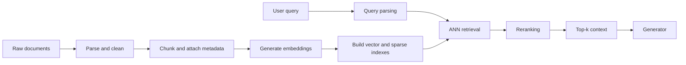

# Production Retrieval Systems: Vector DB, ANN, Chunking, and Reranking

Once retrieval works on a small corpus, the next problem is no longer "can I retrieve something useful?" It becomes "can I keep retrieval useful when the corpus is large, the latency budget is tight, and the product still needs to feel responsive?"

That is the point where retrieval engineering turns into production systems engineering.

In early prototypes, it is easy to focus only on ranking quality. But production retrieval has to satisfy several constraints at once:

1. return relevant evidence,
2. do it fast enough for interactive use,
3. scale to large corpora,
4. keep prompt cost under control,
5. remain debuggable when results get worse.

This module is where those concerns start to come together. The main ideas are not just "use a vector database" or "add chunking." The real lesson is that large-scale retrieval depends on choosing the right system structure so semantic search stays both fast and precise enough to help generation.

The easiest way to keep the whole chapter in view is to look at the production retrieval path end to end. A real system does not jump from raw documents straight to an answer. It parses and chunks documents, creates embeddings, builds indexes, rewrites messy user input into a retriever-friendly query, retrieves quickly, and often reranks before generation ever starts.



The value of this picture is that it makes the dependency chain visible. If any stage is weak, the later stages inherit the damage. A vector database cannot rescue bad chunking. A reranker cannot fully rescue a broken query parse. And a strong generator still depends on the quality of what survives retrieval.

## Why Production Retrieval Looks Different from Demo Retrieval

In a toy system, semantic retrieval is straightforward.

1. Embed every document.
2. Embed the query.
3. Compare the query vector to every document vector.
4. Return the closest results.

That is conceptually clean, and it works well when the corpus is small.

The problem is that the cost grows with corpus size. If I have 1,000 vectors, checking all of them is trivial. If I have 1,000,000,000 vectors, it becomes completely different. Even if each distance computation is cheap, doing it a billion times per query is not a realistic design for an interactive RAG product.

That is why production retrieval needs specialized infrastructure and indexing strategies.

## Why Vector Databases Exist

A vector database is not just a normal database with embeddings stored in one extra column. It is a database designed around vector operations as a first-class concern.

That matters because semantic retrieval depends on tasks that ordinary relational databases were not really built to optimize:

- storing large collections of high-dimensional vectors,
- computing nearest-neighbor relationships efficiently,
- building and serving ANN indexes,
- combining vector search with filtering and metadata constraints.

I *can* prototype semantic retrieval in a traditional database or even in memory. But when corpus size and query load increase, that setup usually breaks first on latency and throughput.

At a practical level, a vector database helps with:

1. efficient vector storage,
2. approximate nearest-neighbor indexing,
3. fast query serving,
4. metadata-aware retrieval,
5. operational tools for ingestion and updates.

This is why vector databases became standard in modern RAG systems. The embedding-based part of retrieval is too central to treat as an awkward afterthought.

Another practical reason they matter is operational ergonomics. In production I do not just need a place to store vectors. I need a system that can update indexes, attach metadata, expose search parameters, and serve queries under load. That operational layer is part of the product, not just part of the infrastructure.

## Exact k-NN vs Approximate Nearest Neighbors

To understand why ANN matters, I need to compare it to the naive baseline.

### Exact k-nearest neighbors

Exact k-nearest neighbors, or exact k-NN, does the obvious thing. For a given query vector, it computes the similarity or distance to every document vector in the corpus, sorts the results, and returns the closest $k$.

The advantage is correctness: if I truly check everything, I know I found the best matches according to the chosen metric.

The downside is runtime. Exact search scales linearly with corpus size.

If I double the number of vectors, I roughly double the work.

That is acceptable at small scale, but it becomes painful very quickly.

### Approximate nearest neighbors

Approximate nearest neighbors, or ANN, changes the goal slightly. Instead of guaranteeing the absolute nearest results, it tries to find results that are *very close* while being dramatically faster.

That sounds like a compromise, and it is. But it is a practical one.

In production, the question is rarely "did I find the mathematically perfect top result?" The real question is more like:

"Did I find a very strong candidate set fast enough that the rest of the pipeline can still work well?"

ANN is usually the answer because it sacrifices a little theoretical optimality in exchange for huge latency gains.

:::info[Important trade-off]

ANN is not primarily about elegance. It is about turning semantic retrieval from an interesting prototype into something I can serve at scale.

:::

## The Core Intuition Behind Proximity Graph Search

One useful way to understand ANN is through proximity graphs.

Imagine every document vector as a node. Instead of comparing the query to every vector in the corpus, I connect each vector to some nearby neighbors. Now I have a graph where local movement tends to keep me inside semantically related regions.

At search time, I can start from some entry point and walk the graph by repeatedly moving toward neighbors that look closer to the query. That means I explore only a tiny part of the total corpus rather than exhaustively scoring everything.

This is the basic intuition behind navigable small world style methods.

It is not guaranteed to find the absolute best point, because local greedy movement can miss a better path elsewhere in the graph. But in practice, if the graph is built well, the results are usually very strong and much faster than exact search.

## HNSW: Why It Is So Common in Production

Hierarchical Navigable Small World, or HNSW, is one of the most common ANN indexing approaches used in production vector databases.

The easiest way to think about HNSW is as a multi-level graph. The top layers are sparse, contain fewer nodes, and let the search make large jumps across the space. The lower layers are denser and let the search refine its position once it is already in the right neighborhood. So the search process works a bit like this:

1. start high up in a coarse map,
2. make big moves to reach the rough area of the query,
3. descend to denser layers,
4. make smaller local improvements,
5. return the best candidates from the bottom layer.

That is why HNSW is often so fast. It does not waste time exploring the entire vector space in detail. It uses the hierarchy to get close quickly, then refine locally.

Teams use HNSW because it offers a strong balance of low latency, strong practical retrieval quality, mature support in vector database products, and good behavior on large corpora. The limit is that it is still approximate. If the graph is imperfect or the search parameters are too aggressive, I may miss the absolute best vector. That is important to remember because ANN quality is never only about the embedding model. It also depends on index structure and search settings.

## What Has to Happen Before a Vector Database Is Actually Useful

It is easy to talk about retrieval as if I can simply "load documents into a vector database" and be done. In reality, the ingestion path determines much of the final quality.

A realistic ingestion pipeline usually includes:

1. document parsing and cleanup,
2. chunking,
3. metadata assignment and inheritance,
4. embedding generation,
5. optional sparse indexing for keyword retrieval,
6. ANN index construction.

Each of those steps matters.

If parsing is sloppy, I may embed boilerplate or corrupted text.

If chunking is poor, I may destroy the meaning structure before retrieval even begins.

If metadata is not propagated correctly, filters and downstream citations become harder.

If embeddings are generated inconsistently, semantic ranking gets noisy.

In other words, production retrieval starts long before the first query arrives.

## Chunking Is One of the Most Important Design Decisions

Chunking is often treated like a preprocessing detail, but it has an outsized effect on retrieval quality and generation quality.

The core reason is simple: embedding models and LLM prompts both operate on bounded pieces of text. So I need to decide what the retrievable unit of knowledge should be.

If I choose badly, the whole system becomes harder to tune.

## Why Whole-Document Embeddings Usually Fail

Imagine a knowledge base made of 1,000 books, where each book becomes one embedding vector.

That vector has to represent the meaning of the entire book at once.

This is usually too coarse.

A single book may contain many topics, examples, definitions, and tangents. Compressing all of that into one vector blurs the distinctions between the parts I actually care about.

Even if retrieval somehow returns the right book, sending an entire book to the LLM is clearly not practical. The context window fills up immediately, and most of the text is irrelevant to the question.

So retrieval usually needs smaller units.

## The Two Chunking Failure Modes

Chunking has two classic failure modes:

1. **Chunks are too large.** Each embedding averages across too many ideas, retrieval becomes less specific, prompt cost rises quickly, and irrelevant text rides along with relevant text.
2. **Chunks are too small.** Important context gets split apart, evidence becomes fragmented, retrieval may look acceptable numerically while generation quality drops, and the model may receive isolated facts without the surrounding explanation needed to use them well.

The goal is not to maximize or minimize chunk size in the abstract. The goal is to find a unit that is specific enough for retrieval but complete enough for downstream reasoning.

## Fixed-Size Chunking with Overlap

The simplest baseline is fixed-size chunking.

For example, I might split text into chunks of 500 characters or a fixed number of tokens.

This is attractive because it is easy to implement and easy to reason about.

But fixed-size splitting creates an obvious problem: boundaries often fall in awkward places. A sentence may be cut in half, or a key paragraph may be split right at the point where the concept becomes clear.

That is why overlap is commonly added.

If each chunk overlaps with the next, text near a boundary still appears together with enough surrounding context in at least one chunk. Overlap increases redundancy, which means more vectors and more storage, but it often improves retrieval quality enough to justify the cost.

A beginner-friendly default is to use moderately sized chunks with overlap, then inspect failures. If the retriever keeps finding the right topic but not the precise answer span, chunks may be too large. If the generator receives fragments that feel decontextualized or repetitive, chunks may be too small or overlap may be too aggressive.

The following example shows a practical fixed-size chunker with overlap. It is a useful baseline because it is simple, easy to tune, and good enough to expose whether chunking is the real bottleneck before I reach for more advanced strategies.

```python
from langchain.text_splitter import RecursiveCharacterTextSplitter

splitter = RecursiveCharacterTextSplitter(
    chunk_size=500,
    chunk_overlap=100,
    separators=["\n\n", "\n", " ", ""],
)
chunks = splitter.split_text(document_text)
```

## Recursive and Structure-Aware Chunking

Fixed-size chunking is a strong baseline, but it ignores document structure.

Many corpora contain natural boundaries that are better than arbitrary character counts:

- paragraphs in prose,
- headings and sections in HTML,
- function or class boundaries in code,
- clauses and tables in structured documents.

Recursive splitting tries to respect these structures by preferring more meaningful separators first and only falling back to smaller splits when necessary.

This often produces chunks that are easier for both retrieval and generation to use because the chunks align more closely with coherent units of meaning.

Chunking is not only about embedding efficiency. It is about deciding what counts as a reusable fact unit in my system.

If I am indexing legal clauses, I may want different boundaries than if I am indexing API docs or chat transcripts.

So chunking is deeply tied to corpus type, question type, and generation strategy.

This is why chunking is one of the highest-leverage tuning decisions in RAG. It sits upstream of both retrieval quality and prompt usefulness. When chunking is wrong, everything downstream looks strangely harder than it should.

## Querying a Vector Database in Practice

Once the corpus has been chunked, embedded, and indexed, retrieval can actually happen.

The common flow is:

1. embed the query,
2. run ANN search over the vector index,
3. apply metadata constraints,
4. return top candidates.

That sounds simple, but even this stage contains important design choices. How many candidates should I fetch before reranking? Should filters be applied before or after search? Should the system prefer recall at this stage and let reranking handle precision later? These are production design questions, not just API questions.

The useful part of a near-text query is not the API surface by itself, but the retrieval sequence it captures: query the index, apply filters, and inspect the returned content.

```python
response = collection.query.near_text(
    query=search_string,
    filters=where_filter,
    limit=top_k,
)
for obj in response.objects:
    print(obj.properties["content"])
```

The exact API varies by provider, but the conceptual pattern is similar across systems.

## Why Query Parsing Matters Before Retrieval

Users rarely write clean retrieval queries. They mix background context, intent, constraints, and informal language all into one message.

For example, a prompt might contain:

- the actual task,
- a date or version constraint,
- a product name,
- some irrelevant side commentary,
- abbreviations or typos.

If I pass that raw text directly into retrieval, the system may still work, but it is often leaving quality on the table.

Query parsing helps by turning a messy user message into something more retrieval-friendly.

This is particularly important because user prompts are often written for another human, not for a search system. A person can infer that "the latest EU billing guidance for enterprise customers" implies a region filter, a subject area, and a freshness preference. A retriever does better when those constraints are surfaced more explicitly.

Common query parsing operations include typo normalization, abbreviation expansion, entity extraction, constraint extraction, decomposition into subqueries, and rewriting into clearer search language.

The benefit is not just cosmetic. A parsed query can make the important parts explicit. If the user asks, "show me the latest EU billing guidance for enterprise customers," the retriever may benefit from explicitly recognizing:

- region = EU,
- topic = billing guidance,
- customer segment = enterprise,
- freshness preference = latest.

That makes both filtering and ranking more reliable.

## Reranking: The Quality Layer After Fast Retrieval

A production retriever often works in stages.

The first stage is optimized for speed and recall. Its job is to bring back a reasonably strong candidate set quickly.

The second stage can spend more compute deciding which of those candidates are actually the best evidence.

That second stage is reranking.

This matters because fast retrieval methods are good at surfacing plausible candidates, but they are not always perfect at ordering them for the exact downstream question.

Imagine the first-stage retriever returns 20 chunks that are all somewhat relevant. Some mention the right topic generally. Others directly answer the question. Others are only tangentially related.

If I pass those straight into generation, I risk giving the model a blurry evidence set.

Reranking tries to sharpen the result set so the highest positions are occupied by the chunks that are most directly useful.

## Cross-Encoders vs ColBERT-Style Rerankers

There are several ways to rerank, but two useful mental models are cross-encoders and ColBERT-style methods.

1. **Cross-encoder rerankers** look at the query and document together and score the pair jointly. This often gives very strong relevance quality because the model can attend directly across the query and the candidate chunk instead of relying only on precomputed embeddings. The downside is cost. Joint scoring is much more expensive than first-stage bi-encoder retrieval, so I usually only apply it to a relatively small candidate set.
2. **ColBERT-style rerankers** try to preserve richer token-level interactions than ordinary dense retrieval while staying cheaper than full cross-encoding. They often occupy a middle ground: better quality than simple embedding-only ranking, cheaper than cross-encoding every possible candidate, and still more expensive than stage-one ANN retrieval.

The usual production pattern is:

1. fast ANN retrieval gets top-$N$ candidates,
2. reranker scores only those candidates,
3. the final top-$k$ goes to generation.

The important point is that reranking is usually a selective quality investment. I do not rerank the whole corpus. I rerank a manageable candidate set that has already been narrowed down by a faster retrieval layer.

This example shows the shape of a two-stage retrieval call where a fast vector search returns candidates and a reranker sharpens the final ordering before generation.

```python
response = collection.query.near_text(
    query=user_query,
    limit=top_k,
    rerank=reranker,
)
```

## Production Retrieval Is Always a Trade-off Problem

One of the main things this module should make clear is that production retrieval cannot be judged by one metric alone.

If I improve recall but latency doubles, the product may become unusable.

If I make chunk sizes tiny and retrieval looks sharper, I may increase prompt fragmentation and hurt final answer quality.

If I add a heavy reranker, I may improve ranking quality but blow the serving budget.

So production retrieval tuning is always multi-objective.

The dimensions I usually need to track together are:

- retrieval quality,
- end-to-end latency,
- token cost,
- answer quality downstream,
- operational complexity.

That is what makes this chapter different from the [previous post, From Keywords to Hybrid Search](/ai/llm/rag/retrieval-engineering). The previous post was largely about *how to rank*. This one is about *how to keep ranking useful under production constraints*.

## What This Means to Me as a Builder

The practical takeaway from this chapter is this:

production retrieval is not one algorithm. It is a pipeline.

The vector database gives me scalable semantic search.

ANN gives me acceptable latency.

Chunking determines what unit of knowledge is even retrievable.

Query parsing improves the search request before retrieval begins.

Reranking improves the final candidate order before generation sees it.

If any one of those steps is weak, the whole system can degrade.

## Key Takeaways

By the end of this module, I should be able to explain the following clearly:

1. Exact vector search becomes too slow at large corpus sizes.
2. Vector databases exist because vector storage, ANN indexing, and vector query serving need specialized infrastructure.
3. HNSW speeds retrieval by using a hierarchical graph that makes coarse moves first and fine moves later.
4. Chunking is a core retrieval decision because it controls both semantic specificity and downstream prompt usefulness.
5. Query parsing improves retrieval by separating intent and constraints from messy user language.
6. Reranking exists because fast first-stage retrieval is not always the best final ordering for generation.
7. Production retrieval must be judged across quality, latency, and cost together.

## What to Read Next

Next comes the generator side of the system: once retrieval can reliably deliver good evidence, the remaining question is how to make the model use that evidence faithfully, consistently, and efficiently.