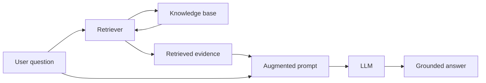

# RAG Foundations in Practice

When I first look at Retrieval-Augmented Generation, the idea sounds almost too simple: search for useful documents, attach them to the prompt, and let the model answer with that extra context.
That summary is technically correct, but it hides the reason RAG matters so much in practice. The real value of RAG is not that it adds one extra component to an LLM system. The real value is that it changes what the system is allowed to know at runtime.
Without retrieval, an LLM can only rely on two things:
- the prompt I send right now,
- whatever statistical patterns the model absorbed during pretraining or later fine-tuning.

That is a hard limitation. If the answer depends on my private codebase, last week's product policy, today's incident report, or a niche internal document that was never in public training data, the model does not have that knowledge unless I explicitly provide it.
RAG is the engineering pattern that solves this gap. It pairs an LLM with a knowledge source and a retrieval step so the model can receive relevant evidence at inference time instead of being forced to guess from general memory.
This note is intentionally written as a true foundation, not a checklist. By the end, I want to be able to explain:
- why RAG still matters even though models are getting larger,
- what kinds of products actually benefit from it,
- how the architecture works step by step,
- why hallucinations happen in the first place,
- why retrieval quality is often the real bottleneck.

<!-- NOTEBOOKLM_DIAGRAM: concept=llm-with-vs-without-retrieval; type=image; goal=contrast a plain LLM answering from training memory alone against a RAG system that injects retrieved evidence at runtime, highlighting what knowledge each can and cannot access; complexity=beginner -->

## Why RAG Exists

The easiest mistake when learning RAG is to think of it as a fancy add-on for LLMs. It is more accurate to think of it as a response to a structural limitation in language models.
An off-the-shelf LLM is not a live database. It does not look facts up the way a search engine does. It generates text token by token by predicting what is likely to come next given the input and what it learned during training.
That creates three practical problems that show up in almost every real deployment:
- **The model does not know private data.** If I ask about internal design docs, my team's deployment process, or repository-specific APIs, an LLM cannot know those things unless I place them in the prompt or build a system that can retrieve them.
- **The model does not stay fresh automatically.** Training ends at some point, but the world keeps moving. Product docs change, policies change, prices change, and incidents happen after the model was trained.
- **The model is optimized for plausible continuation, not fact checking.** If the model lacks evidence, it still produces an answer. It does not stop and say, "I am missing the required internal document." It keeps generating the most plausible continuation it can.

:::info[Core framing]

RAG is a system pattern that separates fact access from language generation.

The retriever is responsible for finding evidence. The LLM is responsible for turning that evidence into a useful answer.

:::

That division of labor is why RAG is so useful. Instead of asking a single model to be both a writer and a perfect memory system, I let retrieval handle evidence access and let the model handle synthesis.

## Why RAG Still Matters Even with Bigger Context Windows

It is tempting to think that larger context windows make RAG less necessary. If a model can read hundreds of thousands of tokens, why not just throw everything into the prompt?
In some small cases, that can work. But it does not remove the need for retrieval, because bigger windows do not solve three separate system-design problems:
- **Selection.** The main problem is not only whether the model can read a lot. The main problem is deciding what it should read. Most real knowledge bases are too large, too noisy, and too dynamic to dump wholesale into every prompt. If I include too much irrelevant material, I waste tokens, increase latency, and make it harder for the model to focus on the right evidence.
- **Freshness.** Even if a large prompt can hold a lot of material, someone still has to fetch the right material at runtime. That is retrieval.
- **Access control.** In real systems, different users are allowed to see different information. Retrieval pipelines can enforce those rules. A giant static prompt usually cannot.

So bigger context windows help, but they do not replace RAG. They mostly change the optimization problem. I may be able to send more retrieved evidence than before, or use larger chunks, but I still need a system that finds the right evidence in the first place.

<!-- NOTEBOOKLM_DIAGRAM: concept=context-window-cost-vs-selection; type=image; goal=show why dumping an entire knowledge base into a large context window increases cost, latency, and distraction, versus retrieving a small selected evidence set; complexity=beginner -->

## Where RAG Creates Real Product Value

RAG is easiest to understand when attached to concrete applications. A lot of explanations make it sound abstract, but the pattern becomes obvious when I look at what the knowledge source is and why the model cannot rely on pretraining alone.

### Codebase assistants and code generation

This is one of the clearest examples. A model may know Python, TypeScript, React, or distributed systems in a general sense, but that is not enough to write code safely inside a specific repository.
If I ask it to add a feature in my project, the model needs to know things like:
- what services already exist,
- what internal types and interfaces are called,
- how configuration is wired,
- what naming conventions and patterns the codebase already uses,
- which files are the real integration points.

Those are not generic programming facts. They are local project facts. A RAG system built on top of the repository can retrieve relevant files, class definitions, configs, and examples so the model writes code that is aligned with the project instead of inventing an architecture.
This is the difference between "write me a login handler" and "write a login handler that respects this auth middleware, this session model, and this validation layer."

### Company-grounded chatbots

A support chatbot is only useful if it answers with the company's real policies, product behavior, and troubleshooting steps. A fluent but generic answer is often worse than no answer, because it sounds trustworthy while being wrong.
RAG helps because I can treat product docs, policy docs, pricing notes, and troubleshooting playbooks as the knowledge base. Then the model is not speaking from vague internet memory. It is responding from the company's actual documents.

### Legal, medical, and compliance-heavy domains

These are domains where precision matters and where the source material may be recent, private, and highly specialized. In these cases, an LLM without retrieval is usually too risky. The system needs access to the relevant case file, policy clause, journal article, or protocol excerpt.
RAG does not magically make the answer correct, but it creates a path to traceability. I can inspect what documents were retrieved and judge whether the answer was grounded in the right evidence.

### AI-assisted web search

Modern search products often look like retriever-plus-generator systems. The search layer finds relevant sources, and the model turns them into a concise answer. That is basically internet-scale RAG.
The important lesson here is that RAG is not only for private company data. It is also a useful pattern whenever the answer depends on selecting and synthesizing evidence from a large corpus.

### Personal productivity assistants

Even a small corpus can be valuable if it contains dense context. My notes, emails, calendar entries, and project documents might be far more useful to me than a massive public dataset, because they contain exactly the context needed for my work.
This is a useful reminder: RAG is not only about scale. It is about relevance.

<!-- NOTEBOOKLM_DIAGRAM: concept=rag-application-landscape; type=image; goal=map the five RAG application types (code assistants, company chatbots, regulated domains, AI web search, personal assistants) against their knowledge-base type and why pretraining alone is insufficient; complexity=beginner -->

## The Basic Architecture of a RAG System

At a high level, a RAG system has three important parts:
- an LLM,
- a knowledge base,
- a retriever.

The user experience often looks the same as ordinary chat: I type a question and get a response. Internally, though, the system does more work.
The flow is easier to remember when I picture it as a simple pipeline rather than as a paragraph of prose.

The key thing to notice in this diagram is that the LLM is not directly connected to the knowledge base. It only sees what the retrieval step decides to place into the augmented prompt. That is why retrieval quality has such a large downstream effect.
In practice, the runtime flow usually looks like this:
- **The user sends a query.** This might be a question, an instruction, or a conversational message such as "Why are hotel prices in Vancouver unusually high this weekend?"
- **The retriever searches the knowledge base.** The system does not send the raw question straight to the LLM. First, it asks the retriever to find documents that may help answer the question. Depending on the system, those documents may be internal documentation, product policies, ticket histories, code files, articles, personal notes, or web pages.
- **The system creates an augmented prompt.** The original user question is combined with the retrieved material. The prompt might effectively become: "Answer the following question: why are hotel prices in Vancouver unusually high this weekend? Here are several relevant articles and reports. Use them when answering." The retrieved snippets are then appended.
- **The LLM generates a response using both prompt and evidence.** Now the model has something it did not have before: relevant runtime context. It can still draw on its pretrained general knowledge, but it is no longer forced to rely on that alone.

The architecture looks simple, but it changes the model's operating conditions completely. Instead of writing from memory only, the model can write from memory plus retrieved evidence. That is the core of grounding.

## A Worked Example: Why the Architecture Helps

Suppose a user asks:
"Why are hotel prices in Vancouver unusually high this weekend?"
If I ask a plain LLM with no retrieval, several things can happen:
- it may guess based on general tourism knowledge,
- it may mention seasonality, events, or demand spikes,
- it may sound reasonable but have no actual evidence.

Now imagine the retriever pulls in:
- an event schedule showing a major conference,
- local tourism data showing occupancy spikes,
- an article about a cruise departure weekend,
- a city event calendar.

Once those are inserted into the prompt, the answer changes quality. The model can now say that prices are high because multiple large events are happening at once, point to occupancy pressure, and maybe even cite the specific source snippets.
The difference is not just factual accuracy. It is explanatory confidence backed by evidence.

## Why RAG Improves Answers

The most obvious benefit is that it makes missing information available to the model. But that is only the start. In practice, RAG improves answers in four different ways:
- **It reduces unsupported guessing.** If the right evidence is retrieved, the model has less reason to fill gaps with plausible fiction.
- **It makes freshness tractable.** Updating the knowledge base is usually much easier than retraining a model. I can add new documents, re-index them, and the system becomes aware of new information without changing the model weights.
- **It makes answers easier to audit.** Because the answer is grounded in retrieved material, I can inspect those retrieved documents and ask whether the answer followed from them.
- **It lets each part of the system do what it is good at.** The retriever narrows a huge information space. The model turns the selected evidence into a useful human-readable answer. That specialization is important because retrieval and generation are different jobs.

## How LLMs Actually Generate Text

To understand why RAG helps, I need a more concrete picture of what an LLM is doing. Three properties matter most here:
- **LLMs generate tokens, not ideas.** The model does not first decide on a perfect answer and then print it. It generates one token at a time. A token is often a word fragment rather than a whole word, so a fluent paragraph is really a long sequence of next-token predictions.
- **Generation is autoregressive.** Each new token depends on the tokens that came before it. This means early choices shape later choices, and a slightly different prompt or slightly different context can push the answer down a very different path.
- **The model is optimizing plausibility.** This is the part many beginners miss. The model is not internally checking truth the way a careful researcher would. It is trying to continue the text in the most probable way according to its training and the input context. That is why fluent language is not the same thing as reliable knowledge.

<!-- NOTEBOOKLM_DIAGRAM: concept=autoregressive-token-generation; type=image; goal=illustrate how an LLM generates text one token at a time, with each new token conditioned on the prompt plus previously generated tokens (autoregressive loop); complexity=beginner -->

The generation mechanics, sampling controls, and grounding implications are developed further in [Generation Systems for RAG](/ai/llm/rag/generation-systems-for-rag).

## What Hallucinations Really Are

The word "hallucination" is useful, but it can also be misleading if I imagine the model as malfunctioning in some bizarre way.
Usually, a hallucination is just the model doing exactly what it was trained to do: produce probable text when it lacks the facts required for a correct answer.
If I ask about a private company process the model has never seen, it does not have an internal lookup table of truth. It has patterns about what a company process usually sounds like. So it generates a likely-looking answer.
:::warning[Important]

An LLM is not fundamentally a truth engine. It is a probability engine for text generation.

When correctness matters, the system needs a way to provide evidence.

:::

RAG helps because it changes the prompt from "answer this from memory" to "answer this while looking at these retrieved documents." That does not eliminate hallucinations entirely, but it greatly improves the model's chances of staying tied to reality.

## Retrieval Quality Is the Real Bottleneck

One of the most important lessons in RAG engineering is that bad retrieval can quietly ruin the whole system.
When users see a poor final answer, they often blame the generator. But many failures start earlier. In practice, I usually look for three retrieval failure modes first:
- **Missing the key evidence.** If the retriever never finds the crucial document, the LLM cannot cite or reason from it.
- **Retrieving too much noise.** If the system sends many loosely related chunks, the model gets distracted. It may anchor on irrelevant text, miss the right evidence, or produce a confused synthesis.
- **Poor ranking.** Even if the right document is technically present, it may be buried too low in the returned set or crowded out by weaker candidates.

This is why retrieval is not a minor implementation detail. It is often the main determinant of whether a RAG system feels trustworthy.

:::tip[Practical habit]

I treat retrieval configuration as a living production system, not a one-time setup task. Chunking, ranking, filtering, and top-k settings all need evaluation and tuning.

:::

<!-- NOTEBOOKLM_DIAGRAM: concept=retrieval-failure-modes; type=image; goal=show the three retrieval failure modes (missing key evidence, too much noise, poor ranking) and how each degrades the final generated answer; complexity=intermediate -->

## Why RAG Is Usually Better Than Retraining for Fresh Knowledge

Beginners often ask why I would bother building a retrieval pipeline instead of simply fine-tuning or retraining a model on my documents.
The answer is that these approaches solve different problems:
- **Retraining or fine-tuning changes model behavior.** That can be useful when I want the model to adopt a style, follow a task pattern, or perform better on a domain-specific task.
- **RAG changes the model's available evidence at runtime.** That is better when the main problem is access to changing or private information.

If a policy changes tomorrow, updating the indexed knowledge base is usually much cheaper and faster than rebuilding model weights.
So I think of RAG less as a competitor to fine-tuning and more as a complementary tool. RAG is usually the first answer when the problem is freshness, privacy, or traceable grounding.
A simple decision rule helps here. If the thing I need to change is the model's behavior, format, or task specialization, I think about fine-tuning. If the thing I need to change is what evidence the model can access at runtime, I think about retrieval. That distinction is not perfect, but it is a useful first pass when designing a system.

## Agentic RAG: The Next Step Up in Flexibility

A simple RAG system retrieves once and generates once. That is already useful, but harder problems often benefit from more deliberate workflows.
This is where agentic RAG becomes interesting.
Instead of one retrieval step, a system may decide:
- whether it needs retrieval at all,
- whether to search internal data or the web first,
- whether the first retrieval results are insufficient,
- whether to reformulate the query and search again,
- whether to combine multiple tools or data sources.

For example, an agentic system might first search internal runbooks, then notice that the answer also depends on current service status, then query an incident dashboard, and only after that produce a response.
This can make the system much more capable, but it comes with trade-offs.
:::warning[Trade-off]

Agentic RAG can improve answer quality on multi-step tasks, but it also increases latency, orchestration complexity, evaluation difficulty, and failure surface area.

:::

That is why I usually treat simple retrieve-then-generate pipelines as the baseline. Only when they clearly plateau do I reach for more agentic behavior.

<!-- NOTEBOOKLM_DIAGRAM: concept=simple-vs-agentic-rag; type=image; goal=compare a single retrieve-then-generate pipeline against an agentic loop that decides whether to retrieve, re-queries when evidence is insufficient, and combines multiple tools; complexity=intermediate -->

## What This Means to Me as a Builder

Stripped down to its practical core, RAG teaches me one design principle:
I should not expect a general-purpose model to already know the facts that matter to my application.
If the answer depends on local, fresh, private, or auditable knowledge, I need a system that can fetch that knowledge at the moment the question is asked.
That is the point of RAG.
It is not magic, and it does not remove the need for careful evaluation. But it gives me a workable architecture for turning a fluent general model into a grounded application.

## Key Takeaways

By this point, I should be able to explain the following in plain language:
- A plain LLM does not automatically know my private or current data.
- RAG solves that by retrieving relevant documents and placing them into the prompt.
- The retriever and the LLM perform different jobs and should be treated as different system components.
- Hallucinations are not random glitches; they are a natural result of text generation without sufficient evidence.
- Retrieval quality is often the main driver of final answer quality.

If I cannot explain those five ideas clearly, I do not really understand RAG yet.

:::note See also on AWS
For how this maps to managed AWS services — Bedrock Knowledge Bases, Q Business, Kendra, and when to reach for each — see [RAG & Vector Stores](/aws/ai/rag-and-vector-stores) and the [AWS AI service-selection map](/aws/ai).
:::

## Conclusion

RAG makes LLM systems more useful by giving them access to evidence that is private, recent, or domain-specific at the exact moment a user asks a question. Instead of relying only on what the model absorbed during training, the system retrieves relevant material from a knowledge base and augments the prompt with it. That retrieval step grounds the response, improves freshness, and makes answers easier to audit.
Once this system-level picture is clear, the next question stops being "what is RAG?" and becomes "what makes retrieval actually work well in practice?"

## What to Read Next

Continue to [Retrieval Engineering](/ai/llm/rag/retrieval-engineering), where I unpack keyword search, semantic search, hybrid retrieval, and evaluation in enough detail to understand why some retrievers feel sharp and others feel unreliable.
