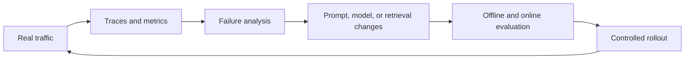

# RAG in Production: Observability, Trade-offs, and Security

Building a prototype proves that a RAG idea can work. Running it in production is a different problem entirely.
In a notebook or a demo, I can control the dataset, the prompt style, and the test questions. In production, users bring messy inputs, edge cases, malicious attempts, and expectations about latency, reliability, and correctness. That changes everything.
This final module is about what happens when a RAG system becomes real software with real consequences.
The underlying lesson is that production RAG is not mainly about one clever model choice. It is about operating a system that can be measured, debugged, improved, and protected under real conditions.

## Why Production Is Harder Than Prototyping

When a RAG system moves into production, several new pressures appear at once:
- **More traffic means systems pressure.** As request volume rises, throughput, latency, memory usage, and compute costs start to matter much more.
- **Real users are unpredictable.** No matter how much pre-launch testing I do, real users will ask questions I did not anticipate. Some will be messy. Some will be adversarial. Some will expose gaps in the knowledge base or routing logic.
- **Real-world data is messy.** Knowledge bases often include incomplete metadata, inconsistent formatting, duplicate information, PDFs, slides, images, and badly structured content. Prototypes often hide this problem. Production does not.
- **The cost of mistakes is real.** A bad answer in a notebook is just a bad answer. A bad answer in production can create customer confusion, reputational damage, policy risk, financial loss, or compliance issues.

That is why production RAG requires observability and governance, not just model quality.

<!-- NOTEBOOKLM_DIAGRAM: concept=prototype-vs-production-pressures; type=image; goal=contrast a controlled prototype environment against production pressures (traffic scale, unpredictable users, messy data, real business risk) that stress a RAG system; complexity=beginner -->

## Observability Is the First Production Capability

If I cannot see how the system is behaving, I cannot improve it responsibly.
Observability in RAG needs to cover both traditional software metrics and AI-specific quality metrics.
- **Software metrics** tell me whether the system is operationally healthy. These include end-to-end latency, per-component latency, throughput, error rates, token usage, and memory or compute consumption.
- **Quality metrics** tell me whether the system is functionally useful. These include retrieval quality, generation quality, faithfulness and citation behavior, user satisfaction and feedback, and robustness on known edge cases.

Without both kinds of signals, I am either blind to operations or blind to quality.
The production loop becomes much easier to reason about when I see it as a feedback cycle rather than as isolated tasks.



This is the real operational rhythm of a healthy RAG system. Traffic creates evidence. Observability turns that evidence into diagnosis. Diagnosis drives changes. Evaluation decides whether those changes are real improvements. Then the cycle starts again.

## A Useful Evaluation Framework: Scope and Evaluator Type

One simple way to think about production evals is with two dimensions:
- scope,
- evaluator type.

<!-- NOTEBOOKLM_DIAGRAM: concept=scope-evaluator-eval-grid; type=image; goal=show a 2x3 grid with scope (component-level vs system-level) on one axis and evaluator type (code-based, human feedback, LLM-as-a-judge) on the other, placing example evals in each cell; complexity=intermediate -->

### Scope: system-level vs component-level

System-level evals tell me how the overall product is doing.
Component-level evals help me debug where problems originate.
For example, an end-to-end answer quality issue may actually be caused by the retriever, reranker, or prompt construction rather than the core generation model.

### Evaluator type: code, humans, or LLMs

Different evals use different mechanisms.

#### Code-based evals

These are usually the cheapest and easiest to run.
Examples include:
- latency,
- throughput,
- JSON schema validity,
- token counts,
- regression checks on structured outputs.

#### Human feedback

This is more expensive, but often the highest-value signal.
Examples include:
- thumbs up or thumbs down,
- manual annotations,
- curated relevance labels,
- issue reports from real users.

#### LLM-as-a-judge evals

These sit in the middle. They are more flexible than code and cheaper than human review, but they still need careful calibration.
They work best when given clear rubrics and constrained evaluation tasks, not vague open-ended grading.
This framework helps because it prevents me from relying on only one type of evidence.

## Traces and Logs: How I Debug Real Failures

When a user reports a bad answer, aggregate dashboards are not enough. I need to see the path that request took through the system.
That is what traces are for.
A useful trace should show:
- the original user input,
- any rewritten query,
- retrieved documents,
- reranker effects,
- the final prompt sent to the LLM,
- the output and relevant metadata.

<!-- NOTEBOOKLM_DIAGRAM: concept=rag-trace-spans; type=image; goal=show a single request traced as nested spans through the RAG pipeline (query parse, retrieve, rerank, augment prompt, generate) with per-stage latency, so a failure can be localized; complexity=intermediate -->

### An example of tracing a RAG pipeline

The useful part of this snippet is that it makes every major stage visible. Once each step is wrapped in a span, I can see where latency accumulates and where failures actually begin.

```python
with tracer.start_as_current_span("rag_pipeline"):
    with tracer.start_as_current_span("retrieving_documents"):
        docs = retriever(query)
    with tracer.start_as_current_span("augment_prompt"):
        prompt = build_prompt(query, docs)
    with tracer.start_as_current_span("generate"):
        answer = llm(prompt)
```

This is one of the most valuable production tools because it lets me move from "the system answered badly" to "this specific stage failed in this specific way."

## Custom Evaluation Datasets from Real Traffic

Early in development, synthetic benchmark prompts are useful. But once the system has real users, the most valuable eval data often comes from the system's own traffic.
That means building custom datasets from real prompts and storing enough context to replay and analyze them later.
At minimum, I should usually store:
- the input prompt,
- the final response.

If I want component-level evaluation, I should also store things like:
- retrieval outputs,
- reranker outputs,
- rewritten queries,
- prompt templates used,
- model identifiers,
- key metadata about the request.

This is what allows me to answer questions like:
- Do refund questions work better than shipping delay questions?
- Are failures concentrated in one product area?
- Did a routing model send the request down the wrong path?

## Why Custom Datasets Matter So Much

The biggest value of a custom eval set is not just that it is realistic. It is that it is _specific to my product_.
Generic public benchmarks may tell me whether a model is good in general. A custom dataset tells me whether my system works for the prompts my users actually ask.
That is the dataset that should usually gate major prompt, model, retriever, or routing changes before rollout.

## Cost vs Quality: Make the Trade-off Explicit

In production, cost is not an abstract concern. It is a systems design variable.
The two largest cost centers in many RAG systems are:
- LLM inference,
- vector database memory and compute.

### LLM-side cost controls

Useful levers include:
- smaller models,
- quantized models,
- shorter prompts,
- lower top-k retrieval,
- more concise outputs,
- routing only complex prompts to expensive models.

### An example of budget-aware generation

This is a compact way to express a real production idea: control retrieval depth and output length together so cost and latency stay tied to an explicit budget.

```python
def answer_with_budget(query: str, top_k: int = 4, max_tokens: int = 256):
    docs = retriever(query, top_k=top_k)
    prompt = build_prompt(query, docs)
    return llm(prompt, max_tokens=max_tokens)
```

### Dedicated endpoints vs per-token APIs

At low or bursty traffic, per-token APIs are often the simplest path.
At high sustained traffic, renting dedicated hardware can become cheaper and more reliable because I am paying for reserved capacity instead of metered token usage.
The important point is not that one is always better. It is that the right cost model depends on traffic shape.

<!-- NOTEBOOKLM_DIAGRAM: concept=per-token-vs-dedicated-cost; type=image; goal=plot per-token API cost (linear with usage) against dedicated hourly hardware cost (flat) to show the crossover point where sustained high traffic makes dedicated endpoints cheaper; complexity=intermediate -->

## Quantization: Compression as a Production Tool

<!-- NOTEBOOKLM_DIAGRAM: concept=quantization-compression-analogy; type=image; goal=use the image-compression analogy (24-bit vs 12-bit vs 6-bit) alongside 32-bit vs 8-bit vs 1-bit vectors to show how quantization shrinks size with graceful quality loss; complexity=intermediate -->

Quantization is one of the most practical production techniques because it reduces memory and can improve speed while often preserving most useful quality.
- **For LLMs,** quantized weights reduce memory footprint and often enable faster inference on the same hardware.
- **For embeddings,** quantization reduces the memory cost of vector storage and can accelerate search.

The trade-off is some quality loss, but in many cases the drop is small enough to be worth it.

### How integer quantization works in practice

The intuition is simple: replace high-precision floating-point values with a smaller numeric vocabulary.
For example, with 8-bit quantization, each value is mapped into one of 256 discrete buckets. A common per-dimension workflow is:
- find min and max values for that dimension,
- compute bucket width from that range,
- store the bucket index instead of the original float,
- dequantize approximately at runtime when needed.

This is lossy compression, so it introduces quantization error. The production question is whether that error is acceptable for the latency and memory gains on my workload.

<!-- NOTEBOOKLM_DIAGRAM: concept=integer-quantization-bucketing; type=image; goal=show one embedding dimension's float range being divided into 256 equal buckets, with an original float snapped to its bucket index and dequantized back to an approximate value; complexity=intermediate -->

### Binary and ultra-low-bit quantization

At the extreme end, vectors can be represented with very low precision, including binary-style encodings where each dimension keeps only sign-like information.
The upside is dramatic memory reduction and fast distance operations. The downside is lower representational fidelity, which can hurt recall or ranking quality on nuanced retrieval tasks.
In practice I treat binary or ultra-low-bit settings as a tiered option for high-volume or cold-path retrieval, then evaluate whether quality stays above my acceptance threshold.
For embedding systems, one especially useful idea is Matryoshka-style representation learning. The goal is to train embeddings so that the early dimensions still carry useful information even when the vector is truncated. That gives me another compression lever: I can store or search shorter prefixes of the same embedding when I need lower cost or lower latency, instead of retraining a separate small embedding model.
This is useful because it gives me two knobs instead of one:
- precision knob through quantization,
- dimensionality knob through truncation.

Together they let me tune storage, latency, and quality with finer control than model swapping alone.

<!-- NOTEBOOKLM_DIAGRAM: concept=matryoshka-nested-embeddings; type=image; goal=show a Matryoshka embedding where early dimensions carry the most information, so truncating to the first N dimensions preserves usable meaning at lower cost, like nested dolls; complexity=advanced -->

### An example of a quantization experiment loop

The point of this example is not just to try lower-precision settings, but to evaluate them systematically so speed, memory, and answer quality can be compared in one place.

```python
configs = [
  {"precision": "fp16"},
  {"precision": "int8"},
  {"precision": "int4"},
]
for cfg in configs:
  metrics = run_eval_suite(model_config=cfg)
  print(cfg, metrics["latency_ms"], metrics["faithfulness"])
```

The key is to treat quantization as an evaluated trade-off, not as an automatic default.

## Latency vs Quality: Optimize in the Right Order

Latency matters differently depending on the use case.
An e-commerce assistant may need fast responses even if they are not perfect.
A medical or legal assistant may accept higher latency in exchange for higher quality.
So the first question is always: what latency can the product tolerate?
One of the most useful production heuristics is that most latency comes from transformer calls. If I need to cut latency, I usually start with transformer-based components first, because they are often the biggest contributors. That usually means optimizing in this order:
- the main generation model,
- auxiliary LLM components such as routers, rewriters, or rerankers,
- the retrieval path,
- caching opportunities.

Caching is another practical latency tool. If similar prompts recur often, caching can let me bypass expensive generation entirely or route the cached result through a smaller model for slight personalization. That can deliver large wins when the product has repetitive traffic patterns.
Another strong latency pattern is conditional routing. A lightweight router model or classifier can decide whether a request needs the expensive generation path at all. Simple factual questions with obvious retrieval hits may be handled by a smaller cheaper model, while ambiguous or synthesis-heavy questions go to the stronger path. That often matters more than shaving a few milliseconds off one component.
Retrieval is usually not the biggest latency source, but there are still useful techniques:
- binary or lower-precision vector representations,
- sharding,
- better index tuning,
- careful memory placement.

The rule here is not to guess. I should measure component-level latency before deciding where to cut.

<!-- NOTEBOOKLM_DIAGRAM: concept=latency-optimization-order; type=image; goal=show where latency accumulates across a RAG pipeline (dominated by transformer/LLM calls) and the recommended optimization order from core LLM to auxiliary models to retrieval to caching; complexity=intermediate -->

## Vector Database Cost and Storage Tiering

Vector databases often expose different storage layers such as RAM, disk, and object storage.
These layers differ strongly in speed and cost.
That means part of production optimization is deciding what data really needs to live in expensive fast memory.
For example:
- ANN indexes may need to stay in RAM,
- chunk text may be fine on slower storage,
- colder tenant data may be moved out of the hottest tier until needed.

This is where multi-tenancy can help operationally as well as for access control. If tenant boundaries are explicit, I can manage storage and loading policy more deliberately.
The deeper lesson is that production storage design is about matching cost to access pattern. Hot indexes and frequently accessed vectors deserve expensive fast memory. Rarely touched content usually does not. If I treat all data as equally hot, I will often overpay for speed I am not actually using.

<!-- NOTEBOOKLM_DIAGRAM: concept=vector-db-storage-tiering; type=image; goal=show the RAM/disk/object-storage tiers ordered by speed and cost, mapping HNSW indexes to RAM and colder chunk text or tenant data to cheaper tiers based on access pattern; complexity=intermediate -->

## Security in RAG Is Mostly About Knowledge-Base Protection

The knowledge base is often the main reason the system exists. It contains private, proprietary, or high-value information.
So RAG security is largely about making sure that information is only available to the right users and is not leaked through the retrieval or generation pipeline.

## Authentication, Authorization, and Tenant Isolation

The first line of defense is ordinary application security:
- authentication,
- authorization,
- transport security,
- encryption at rest and in transit.

But RAG introduces one especially important lesson:
metadata filtering is not enough to serve as the sole security boundary.
For personalization, metadata filters are useful.
For hard security separation, tenant isolation and stronger access boundaries are more reliable.

## The External LLM Boundary Is a Real Risk Boundary

When I send retrieved document chunks to an external LLM provider, those chunks leave my controlled environment.
Even if the provider has strong policies, the system boundary has still changed. My private context is now being transmitted and processed outside my direct infrastructure.
That is why some environments require:
- on-prem deployment,
- private VPC deployment,
- self-hosted models,
- stricter provider agreements.

The right decision depends on the sensitivity of the data and the organization's risk tolerance.

<!-- NOTEBOOKLM_DIAGRAM: concept=external-llm-risk-boundary; type=image; goal=show the trust boundary where retrieved private chunks leave the controlled environment and travel to an external LLM provider over the public internet, and how on-prem/self-hosted deployment keeps them inside; complexity=intermediate -->

## Vector Database Security Has Some Unique Challenges

Traditional databases can encrypt stored content, which helps defend against direct unauthorized access.
Vector databases complicate this slightly because vector search needs workable vector representations available for search operations.
That means there are cases where even if chunk text is encrypted, the dense vectors still represent useful semantic information.
There is ongoing research showing that text reconstruction or leakage from vector representations may be possible in some circumstances.
This is not a reason to panic, but it is a reason to treat vector stores as sensitive infrastructure and not assume embeddings are harmless just because they are not plain text.

## Multimodal RAG Expands Both Capability and Complexity

A lot of enterprise knowledge is not stored as clean text. It lives in:
- PDFs,
- slides,
- charts,
- screenshots,
- images.

Multimodal RAG aims to bring those into the same broad retrieval and generation pipeline.
This matters because a lot of the most valuable enterprise information is not stored as clean prose. It may be trapped in screenshots, charts, architecture slides, dense PDF pages, or mixed-layout documents where the meaning depends on both text and visual arrangement. A text-only RAG pipeline leaves that material mostly inaccessible.

<!-- NOTEBOOKLM_DIAGRAM: concept=multimodal-shared-embedding-space; type=image; goal=show a multimodal embedding model placing text and images in one shared vector space, so an image of a dog and the word dog land near each other while unrelated concepts sit apart; complexity=intermediate -->

### What changes in multimodal RAG

Two major components must become multimodal:
- the embedding model,
- the generator.

The embedding model must map text and image-like content into a shared or comparable space.
The generator must be able to interpret non-text inputs, which is why vision-capable LLMs matter here.
In practice, there are two broad strategies. One is to convert visual material into text first with OCR, layout extraction, or captioning, then feed that text into a mostly text-native pipeline. The other is to use native multimodal embeddings and vision-capable generators so retrieval and synthesis can stay closer to the original visual structure. The first path is simpler. The second usually preserves more layout and diagram meaning.

### Why PDFs and slides are tricky

A PDF page or slide is often very information-dense. One page can contain text, tables, charts, captions, and layout cues.
That means the same chunking problem returns in a new form. A single embedding for the entire page is often too coarse.
So multimodal retrieval also needs chunking strategies, sometimes at the level of page regions or grids.
That increases vector count and system complexity, but it can unlock much more of the organization's actual knowledge.

<!-- NOTEBOOKLM_DIAGRAM: concept=pdf-rag-grid-patch-scoring; type=image; goal=show a dense PDF page split into a grid of square patches, each embedded as a vector, with query tokens finding best-matching patches (ColBERT-style late interaction) to score the page; complexity=advanced -->

## What This Means to Me as a Builder

The practical idea at the center of this module is this:
production RAG is an operational discipline.
I need enough observability to see failures.
I need enough evaluation to know whether changes help.
I need enough cost and latency control to keep the system viable.
I need enough security to protect the reason the system exists at all.
And I need enough flexibility to adapt as data, traffic, and models change.

## Key Takeaways

By the end of this module, I should be able to explain the following clearly:
- Production RAG introduces new problems in traffic, unpredictability, business risk, and data messiness.
- Observability must cover both standard software metrics and AI quality metrics.
- Traces and custom datasets are essential for diagnosing failures and evaluating changes against real traffic.
- Cost and latency should be treated as explicit trade-offs against quality, not as afterthoughts.
- Quantization, routing, shorter prompts, and storage tiering are practical production levers.
- RAG security is mostly about protecting knowledge-base access and treating external model calls as real trust boundaries.
- Multimodal RAG expands capability, but also increases storage, chunking, and evaluation complexity.

:::note See also on AWS
For how these production concerns map onto managed AWS services — event-driven ingestion pipelines, and IAM/PII/logging controls — see [Event-Driven AI Architectures](/aws/ai/event-driven-architectures) and [Responsible AI & Security](/aws/ai/responsible-ai-and-security).
:::

## Closing Thought

Production RAG is not about finding one perfect configuration and freezing it. It is about building a system that can be observed, tested, tuned, and defended as usage evolves.
That is the real end state of the course: not just understanding how to build RAG, but understanding how to operate it responsibly.
