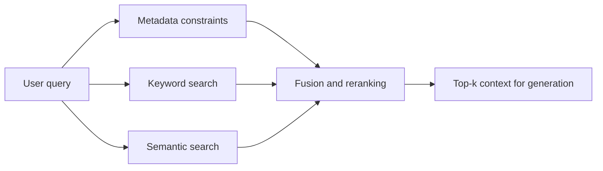

# From Keywords to Hybrid Search

If the [previous post, RAG Foundations in Practice](/ai/llm/rag/rag-foundations), explains why RAG exists, this chapter is where the system stops being conceptual and starts becoming an engineering problem.

The retriever sounds simple on paper: find documents that help answer the user's prompt. But once I think about what that means in practice, the problem becomes much harder.

Users do not write clean database queries. They write conversational requests, vague requests, underspecified requests, and sometimes requests that do not even contain the right keywords. Meanwhile, the knowledge base may contain long reports, code files, FAQs, emails, tickets, internal policies, and web pages, all written for humans rather than for search systems.

The retriever has to turn that mess into a short list of evidence that the LLM can actually use.

This note is meant to be read like a proper chapter, not a glossary. I want it to answer questions like:

1. what retrieval is really trying to optimize,
2. why metadata, keyword, and semantic search all matter,
3. what BM25 is actually fixing,
4. what cosine similarity and related metrics mean in practice,
5. how hybrid ranking works,
6. how I know whether retrieval is improving.

## What a Retriever Is Really Trying to Do

It is easy to say that a retriever should "find relevant documents," but that sentence hides several competing goals.

A good retriever must:

1. find documents that are genuinely relevant,
2. avoid returning a lot of irrelevant noise,
3. rank the best evidence high enough that it survives top-k truncation,
4. do all of that fast enough that the product still feels responsive.

Those goals conflict with each other. If I retrieve too broadly, I may improve recall but overwhelm the model with junk. If I retrieve too narrowly, I may improve precision but miss the one document that actually matters.

This is why retrieval engineering matters so much. The retriever is not just a lookup helper. It is the part of the system deciding what evidence the model gets to see.

## The High-Level Shape of a Modern Retriever

In a lot of production RAG systems, retrieval is not done by one single technique. It is usually a combination of methods that compensate for each other's weaknesses.

The common mental model is:

1. metadata filtering applies hard constraints,
2. keyword search captures exact-match evidence,
3. semantic search captures meaning-based evidence,
4. a fusion step combines those signals into one final ranking.

This is often called hybrid retrieval.

The reason hybrid retrieval is so common is simple: exact-match search and meaning-based search fail in different ways. If I combine them well, they can rescue each other.

The retrieval path is easier to study if I can see where each signal enters the system.



This is a useful picture because it shows why hybrid retrieval is not one algorithm. It is a layered decision process. Metadata filters define eligibility, keyword search captures literal overlap, semantic search captures meaning, and the fusion layer decides what evidence survives into the prompt.

## Metadata Filtering: The Hard Guardrail Layer

Metadata filtering is the simplest part of the pipeline, but it is also one of the most important.

Metadata does not describe a document's meaning. It describes facts about the document, such as:

- department,
- region,
- language,
- access level,
- publication date,
- source type,
- tenant or customer ID.

Suppose I run an internal company chatbot. The knowledge base may contain engineering docs, HR policies, legal documents, and customer-facing knowledge base articles. Even before I ask which documents are semantically relevant, I may already know that some of them should never be considered for this user.

That is what metadata filtering is for. In practice, it matters for three reasons and fails in one predictable way:

1. **It enforces strict inclusion and exclusion rules.** If a document should never be visible to a user outside a region or tenant, metadata filtering can enforce that deterministically.
2. **It gives me predictable behavior.** I can reason about why a document was eligible or ineligible before ranking ever starts.
3. **It makes debugging easier.** When the candidate pool is constrained explicitly, retrieval failures become easier to isolate.

The limit is that metadata filtering does not actually understand document content. It can narrow the candidate set, but it cannot tell me whether a specific document answers the user's question well. So I should think of metadata filtering as the guardrail layer, not the whole retriever.

:::info[Practical framing]

Metadata filtering answers "is this document even eligible?" It does not answer "is this the best evidence for the question?"

:::

## Keyword Search: Why Old Search Still Matters

A lot of people meet semantic search and then assume keyword search is outdated. That is a mistake.

Keyword search is still essential because many real queries depend on exact wording. Error codes, API names, class names, config flags, product names, regulation numbers, and internal acronyms often need literal matches.

If a user searches for a specific Kubernetes field name or a payment processor error code, a retriever that ignores exact terms can fail badly.

### The basic idea behind keyword retrieval

Keyword search treats both the prompt and each document as bags of words. That means it focuses on which terms appear and how often, rather than on the full semantic meaning of the sentence.

This may sound crude, but it solves an important problem very well: exact lexical overlap.

If the query contains a rare, high-signal term, documents containing that term are often worth ranking aggressively.

### TF-IDF intuition

The logic behind TF-IDF is easier to understand in words than in formulas.

- TF, or term frequency, says: if a word appears many times in a document, it may be important to that document.
- IDF, or inverse document frequency, says: if a word appears in almost every document, it is not very informative.

So TF-IDF rewards words that are important inside this document but uncommon across the whole corpus.

That is why a word like "pizza" is usually more informative than a word like "the." The second appears everywhere; the first actually helps discriminate between documents.

### Why TF-IDF is useful but incomplete

TF-IDF gives a strong baseline, but it has two common weaknesses.

First, repeated mentions of a keyword can be rewarded too linearly. A document that says the same keyword 20 times is not necessarily twice as useful as one that says it 10 times.

Second, long documents can be penalized too aggressively or too awkwardly depending on how the normalization is handled.

That is where BM25 becomes more practical.

## BM25: Why It Usually Beats Plain TF-IDF

BM25 is best understood as a more mature scoring rule for sparse keyword retrieval.

It keeps the core idea of keyword matching, but fixes two things that matter a lot in practice:

1. **Term frequency saturation.** Repeating a keyword more times should help, but only up to a point. Imagine two documents about chocolate cake. One uses the word "chocolate" 8 times and another uses it 16 times. The second document might be somewhat more relevant, but not automatically twice as relevant. BM25 captures this diminishing return.
2. **Better document length normalization.** Long documents naturally have more opportunities to contain a keyword. Pure term counts can unfairly reward them. But at the same time, I do not want to punish long documents so aggressively that detailed high-quality material never surfaces. BM25 normalizes for document length in a more balanced way than simpler schemes.

The difference becomes easier to feel in a concrete example.

Suppose my cooking corpus contains two kinds of documents:

- recipe cards with 60 words,
- cookbook chapters with 6000 words.

Now a user searches for "chocolate."

One short recipe card says "chocolate" 3 times. That is 5 percent of the document.

One long cookbook chapter says "chocolate" 30 times. That is only 0.5 percent of the document.

If I use naive density-based intuition, the short card dominates. But that may be the wrong answer. The long chapter could be far more useful because it contains the full chocolate cake technique, substitutions, frosting notes, and troubleshooting steps.

BM25 helps the long document compete fairly instead of being crushed simply because it is long.

:::tip[Practical default]

If my corpus contains documents with very different lengths, BM25 is usually a better sparse retrieval default than plain TF-IDF.

:::

### A minimal BM25 retrieval example

This small example shows the core sparse-retrieval loop: initialize the BM25 retriever, build the index once, and then retrieve the top matching documents for a tokenized query.

```python
BM25_RETRIEVER = bm25s.BM25(corpus=corpus)
BM25_RETRIEVER.index(TOKENIZED_DATA)
results, scores = BM25_RETRIEVER.retrieve(tokenized_query, corpus=corpus, k=top_k)
```

## Where Keyword Search Fails

Keyword search is strong when the same important words appear in both the query and the relevant document. But many real queries do not work that way.

Suppose the query says:

"How can I make the app feel faster during navigation?"

The best document might talk about:

"reducing route transition latency with optimistic rendering and cache warming."

Those texts are about the same concept, but they may share few important keywords. Keyword search can miss that relationship.

This is the problem semantic search is trying to solve.

## Semantic Search: Retrieving by Meaning

Semantic search represents queries and documents as dense vectors produced by an embedding model. The key idea is that texts with similar meaning end up near each other in vector space.

That means the retriever can find relevant material even when the query and the document do not use the same words.

This is why semantic search helps with:

- paraphrases,
- synonyms,
- broader conceptual matches,
- natural conversational wording.

### Why embeddings matter

An embedding model takes text and maps it to a point in a high-dimensional space. I cannot visualize hundreds or thousands of dimensions directly, but I can still reason about what the geometry means.

If two texts are embedded close together, the model is claiming they express similar meaning.

If they are far apart, the model is claiming they are semantically different.

### A simple intuition

Imagine these two sentences:

1. "He spoke softly in class."
2. "He whispered quietly during class."

These are not word-for-word identical, but their meaning is very close. A good embedding model should place them near each other.

Now compare them with:

3. "Her daughter brightened the gloomy day."

That third sentence should land much farther away because it is about something else entirely.

## How Embedding Models Learn This Behavior

This part can feel mysterious unless I understand the training idea.

Embedding models are often trained using contrastive learning. The rough goal is:

- pull similar texts together,
- push dissimilar texts apart.

### Positive and negative pairs

A positive pair contains texts that should be close in meaning.

Examples:

- "good morning" and "hello"
- a query and the document that correctly answers it
- a support ticket title and the troubleshooting note that resolves it

A negative pair contains texts that should not be close.

Examples:

- "good morning" and "GPU memory fragmentation mitigation strategy"
- a billing question and an unrelated HR policy

Training repeatedly adjusts the model so positive pairs move closer in embedding space and negative pairs move farther apart.

That is why semantic search can retrieve a document that says "happy" when the user asked about "glad," or match "route feels slow" with a document about "navigation latency."

## Similarity Measures: What They Actually Mean

This is where a lot of notes become too compressed. Listing cosine similarity, dot product, and Euclidean distance without interpretation is not enough. If I am learning this for the first time, I need to know what each measure is telling me and why retrieval systems care.

### Cosine similarity

Cosine similarity measures how aligned two vectors are in direction.

What this means in practice:

- if two vectors point in almost the same direction, cosine similarity is high,
- if they point in unrelated directions, cosine similarity is near zero,
- if they point in opposite directions, cosine similarity is negative.

Why this is useful:

Cosine similarity mostly cares about the pattern of the representation rather than its raw size. In retrieval, that often lines up well with the idea of semantic similarity.

### Intuition example

Take two vectors:

- A = [10, 10]
- B = [100, 100]

These are very far apart in absolute distance, but they point in the same direction. Cosine similarity treats them as highly similar because their geometry says they express the same pattern, only at different magnitudes.

That is why cosine similarity is such a common default in embedding retrieval.

### Dot product

Dot product rewards both directional alignment and magnitude.

This means two vectors can get a large dot product not only because they point in similar directions, but also because one or both are large in magnitude.

What this means to me:

If my embedding model is designed so vector magnitude carries useful information, dot product can be a strong choice. But if I only care about semantic direction and do not want magnitude to influence ranking too much, cosine similarity is often easier to reason about.

### Euclidean distance

Euclidean distance is the straight-line distance between two points.

This is the most intuitive geometric measure because it literally asks, "how far apart are these points?"

The issue is that in high-dimensional spaces, raw distance can behave less intuitively. Many points can all end up far from each other, and direction often becomes more informative than absolute distance for ranking semantic neighbors.

So Euclidean distance is not wrong, but in many retrieval setups it is less commonly used as the default ranking measure than cosine similarity.

:::info[What this really means in practice]

If I read that cosine compares direction, dot product uses direction plus magnitude, and Euclidean measures straight-line distance, the practical takeaway is this:

- cosine asks "are these texts shaped similarly in semantic space?"
- dot product asks "are they shaped similarly, and does magnitude also strengthen the match?"
- Euclidean asks "are the points literally close together?"

For many embedding-based retrievers, cosine is the easiest strong default because it focuses on semantic alignment.

:::

### A minimal dense retrieval example

This example shows the essential dense-search path: encode the query, compare it against stored embeddings, and keep only the highest-scoring candidates.

```python
query_embedding = model.encode(query_clean, convert_to_tensor=True)
cosine_scores = [cosine_similarity(query_embedding, x) for x in embeddings]
top_indices = np.argsort(cosine_scores)[::-1][:top_k]
```

## One Important Rule About Embeddings

Vectors are only meaningfully comparable when they were produced by the same embedding model version.

That rule matters because the vector space itself is learned. If I switch models, I am no longer working inside the same geometry.

So if one document was embedded with model version A and another with model version B, comparing them directly can produce nonsense. They may have the same number of dimensions, but the spaces are not aligned.

:::warning[Important]

If I upgrade embedding models in production, I usually need to re-embed the corpus so queries and documents live in the same vector space again.

:::

## Why Hybrid Search Usually Wins

Keyword and semantic retrieval are not competing philosophies so much as complementary signals.

Keyword retrieval is strong when exact wording matters.
Semantic retrieval is strong when meaning matters more than wording.

Many real queries need both.

### Example

Suppose a user asks about a specific error code plus a conceptual symptom:

"Why does ERR-491 happen during payment retries?"

The exact code is a strong keyword signal. But the best document may describe retry-state corruption or idempotency issues in language that is not phrased exactly like the query. Keyword search and semantic search each contribute different evidence.

That is why modern retrievers often run both.

Another way to put this is that keyword and semantic retrieval cover different failure surfaces. Keyword retrieval is often stronger when the user knows the exact term. Semantic retrieval is often stronger when the user knows the idea but not the vocabulary. Hybrid retrieval works well because real users produce both kinds of queries.

## Reciprocal Rank Fusion: Combining Rankings Without Fighting Score Scales

Once I have a keyword ranking and a semantic ranking, I need to combine them.

One problem appears immediately: the score scales are often not directly comparable. A BM25 score and a cosine similarity score do not mean the same thing numerically.

This is why rank-based fusion methods are attractive.

Reciprocal Rank Fusion, or RRF, works with document positions in ranked lists rather than trying to compare raw scores across different retrieval systems.

The core idea is simple: if a document appears near the top of either ranking, it should receive meaningful credit, and if it appears reasonably high in both rankings, that is an even stronger signal. Suppose one document ranks 2nd in keyword search and 10th in semantic search. It should still survive the fusion step because at least one retriever thought it was very important. RRF gives it credit from both lists, with higher positions contributing more.

RRF is popular because it is simple, robust, less sensitive to incompatible score scales, and often strong enough without much complexity. Many systems also add a weighting mechanism so semantic or keyword retrieval can count more heavily depending on the task. If exact identifiers matter a lot, I may weight keyword search more. If users ask broad natural-language questions, I may weight semantic search more. The right balance depends on the product and corpus, which is why tuning matters.

## Retrieval Evaluation: How I Know If Retrieval Is Actually Improving

It is very easy to make retrieval changes that feel smarter but do not actually improve outcomes.

So before tuning, I need evaluation.

At minimum, retrieval evaluation needs three things:

1. a set of representative queries,
2. the ranked documents returned for each query,
3. ground-truth relevance judgments.

Without those, I am mostly tuning by intuition.

## Precision and Recall: The Fundamental Trade-off

Precision and recall are common because they capture two different failure modes.

1. **Precision@k asks:** "Of the top k documents I retrieved, how many were actually relevant?" This tells me how noisy the results are.
2. **Recall@k asks:** "Of all the relevant documents that exist, how many did I manage to retrieve in the top k?" This tells me how much important evidence I am missing.

The trade-off is easiest to see in a simple example. Suppose there are 10 relevant documents in the corpus. If I retrieve 5 documents and all 5 are relevant, precision is high, but I may still have poor recall because I missed the other 5 relevant ones. If I retrieve 20 documents and 9 are relevant, recall improves, but precision may fall because I brought in more noise. That trade-off is normal.

### A simple precision and recall helper

When I want a quick retrieval sanity check, a small helper like this makes the metric definitions explicit instead of hiding them behind a library call.

```python
def precision(tp, tn, fp, fn):
    return tp / (tp + fp) if (tp + fp) > 0 else 0.0

def recall(tp, tn, fp, fn):
    return tp / (tp + fn) if (tp + fn) > 0 else 0.0
```

## MAP and MRR: Looking Beyond Raw Inclusion

Precision and recall tell me whether relevant documents were retrieved. But they do not fully tell me how well they were ranked.

That is where MAP and MRR become useful.

1. **Mean Average Precision (MAP)** rewards systems that place relevant documents high in the ranking, not merely somewhere in the returned set. This matters because in RAG, the model only sees the top part of the ranking. A relevant document at rank 37 is often effectively invisible.
2. **Mean Reciprocal Rank (MRR)** focuses on how early the first relevant result appears. This is especially useful when the most important question is, "does the retriever get at least one strong piece of evidence into the very top of the list?" If the first relevant result is at rank 1, that is excellent. If it is at rank 8, the retriever is much less helpful for a top-k constrained generator.

Taken together, these metrics answer different questions: recall tells me whether I am missing relevant material, precision tells me whether I am returning too much junk, MAP tells me whether relevant documents are ranked consistently high, and MRR tells me whether the top of the list is strong.

## A Practical Tuning Sequence

Retrieval systems expose many knobs: chunk size, tokenization, BM25 settings, embedding model, vector index parameters, fusion weights, top-k, reranking, and more.

If I tune everything at once, I learn nothing.

So a more disciplined sequence is:

1. verify metadata constraints and access filters,
2. establish a strong sparse baseline with BM25,
3. add or improve semantic retrieval,
4. tune hybrid fusion and top-k,
5. re-run the same evaluation set after each change.

:::tip[Process rule]

Change one retrieval axis at a time and keep the benchmark set fixed. Otherwise, I cannot tell which adjustment produced the gain or regression.

:::

## What This Means to Me as a Builder

The practical lesson of this chapter is straightforward:

retrieval quality is not a magical property of "using embeddings." It comes from combining the right signals, choosing the right ranking behavior, and evaluating changes against real queries.

If my retriever only understands exact keywords, it misses paraphrases.

If it only understands broad semantics, it can miss crucial exact identifiers.

If it has no evaluation, I will not know whether my tweaks helped or merely changed the failure mode.

Good retrieval comes from disciplined trade-offs.

## Key Takeaways

By the end of this module, I should be able to explain the following clearly:

1. Metadata filtering enforces hard constraints but does not rank meaning.
2. Keyword search is still essential because exact lexical matches often matter.
3. BM25 improves on TF-IDF by handling repeated keywords and document length more realistically.
4. Semantic search works by embedding texts into vector space and ranking by similarity.
5. Cosine similarity, dot product, and Euclidean distance describe different geometric notions of closeness, and cosine is often the most practical default for retrieval.
6. Hybrid retrieval usually works best because lexical and semantic signals complement each other.
7. Precision, recall, MAP, and MRR are the tools that tell me whether retrieval is actually improving.

## What to Read Next

Next: [Production Retrieval Systems](/ai/llm/rag/production-retrieval-systems), where the focus shifts from ranking ideas to the production machinery that keeps retrieval fast, scalable, and useful under real constraints.