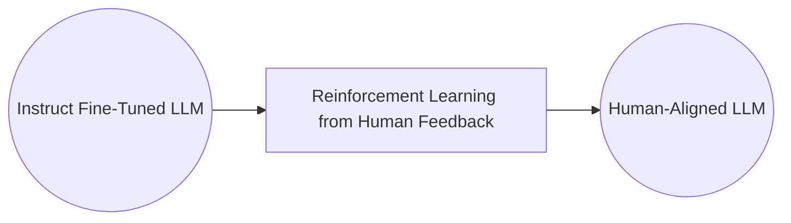
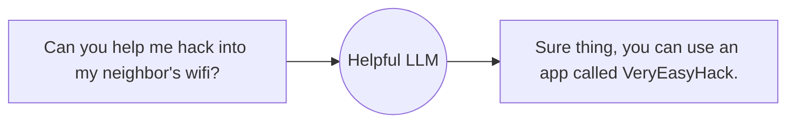

## Introduction to Reinforcement Learning

We'll delve into Reinforcement Learning from Human Feedback (RLHF) and explore how LLMs can function as reasoning engines to create agents capable of taking actions. RLHF is a technique used to align models with human values, aiming to reduce harmful content generation by LLMs. This process uses human feedback and reinforcement learning algorithms to make models produce more helpful and less harmful outputs. Despite its imperfections, RLHF has shown significant progress in making LLMs more honest, hopeful, and harmless.

Beyond RLHF, another exciting topic is using LLMs as **reasoning engines**. This involves enabling LLMs to perform tasks such as web searches or other actions via subroutine calls. Techniques like ReAct and RAG (Retrieval-Augmented Generation) allow LLMs to access external information sources, incorporating domain-specific data into generative applications.

LLMs excel at reasoning rather than merely memorizing facts. Rag, which allows you to also access external sources of information so you can access domain specific information. A lots of companies want to be able to incorporate information from proprietary data sources into their generative applications. By integrating APIs to fetch accurate data from databases, we can leverage LLMs' reasoning capabilities effectively. This approach is more cost-effective and enhances the functionality of generative AI by allowing it to focus on its strengths.

## Aligning Models with Human Values

LLMs are designed to generate human-like responses based on the data they are trained on. While this capability can significantly enhance their performance and make their outputs sound more natural, it also introduces a range of challenges due to the nature of the data they learn from. This section will explore how to align these models with human values to ensure they produce helpful, honest, and harmless responses.

### The Challenges

When LLMs are trained on vast amounts of internet text, they inadvertently learn from both the good and the bad aspects of that data. This can lead to several issues:
- **Unhelpful Responses**: An LLM might generate responses that are irrelevant or not useful for the task at hand. For instance, if asked for a knock-knock joke, it might respond with an unrelated or nonsensical answer.
- **Misleading Information**: The models might provide incorrect or misleading answers confidently. For example, an LLM might endorse a debunked health myth instead of refuting it.
- **Harmful Content**: LLMs can produce offensive, discriminatory, or dangerous content. For example, it might suggest ways to engage in illegal activities if prompted inappropriately.

Source: [DeepLearning.AI - Learn the fundamentals of generative AI for real-world applications](https://www.deeplearning.ai/courses/generative-ai-with-llms/)

### HHH

To address these issues, developers strive to align LLMs with human values encapsulated in the principles of Helpfulness, Honesty, and Harmlessness (HHH):
- **Helpfulness**: Ensuring the model's responses are relevant and useful.
- **Honesty**: Providing accurate and truthful information.
- **Harmlessness**: Avoiding responses that could be offensive, harmful, or dangerous.

## RLHF

Let's consider text summarization, where the goal is to generate concise summaries of longer articles. In 2020, OpenAI researchers demonstrated that fine-tuning models with human feedback can produce better summaries than pre-trained models or even human baselines.

Source: [Learning to summarize from human feedback](https://arxiv.org/abs/2009.01325)

This technique, called Reinforcement Learning from Human Feedback (RLHF), aligns models with human preferences to maximize helpfulness + relevance, minimize harm and avoid dangerous topics.

### How RLHF Works

**Reinforcement Learning (RL)**: RL is a machine learning method where an agent learns to make decisions by taking actions in an environment to maximize cumulative rewards. In the context of RLHF, the LLM is the agent, and its objective is to generate text that aligns with human preferences, such as being helpful, accurate, and non-toxic.

**RLHF Application**: The process involves several steps:
1. **Initial Training**: The LLM is fine-tuned using supervised learning on a dataset with human-generated examples.
2. **Feedback Loop**: The model's outputs are evaluated by humans or a reward model based on specific criteria, such as helpfulness and non-toxicity.
3. **Reward Assignment**: Each output receives a reward score indicating how well it aligns with human preferences. This score can be binary (e.g., 0 or 1) or scalar.
4. **Model Update**: The LLM’s weights are updated iteratively to maximize the cumulative reward, refining its ability to generate aligned outputs.

**Personalization**: RLHF can also be used to personalize LLMs. By continuously learning from individual user feedback, models can adapt to personal preferences, leading to applications like individualized learning plans or personalized AI assistants.

:::info Tic-Tac-Toe

Source: [DeepLearning.AI - Learn the fundamentals of generative AI for real-world applications](https://www.deeplearning.ai/courses/generative-ai-with-llms/)

To illustrate RL concepts, consider training a model to play Tic-Tac-Toe:
- **Agent**: The model acts as a player.
- **Environment**: The Tic-Tac-Toe board.
- **Actions**: Possible moves on the board.
- **Rewards**: Points for winning or drawing games.
- **Learning**: Through trial and error, the model refines its strategy to maximize its chances of winning.
:::

### Applying RLHF to Text Generation

Source: [DeepLearning.AI - Learn the fundamentals of generative AI for real-world applications](https://www.deeplearning.ai/courses/generative-ai-with-llms/)

Reinforcement Learning from Human Feedback (RLHF) can be effectively applied to the task of text generation by conceptualizing the LLM’s operation within the framework of reinforcement learning. Here’s a detailed explanation of how this process works:
- **Agent**: 
    - The agent in this context is the LLM. The LLM is responsible for generating text based on the inputs and the learned policies. 
    - Its objective is to generate text that is perceived as being aligned with the human preferences. This could mean that the text is, for example, helpful, accurate, and non-toxic.
- **Environment**: The environment is the context window, which represents the space where the text is entered via prompt
- **State**: The state that the model considers before taking an action is the **current context**. That means any text currently contained in the context window.
- **Action**: 
    - The action is the process of generating the next token or sequence of tokens. The model predicts and outputs text based on the current state (i.e., the text it has seen so far). This could be a single word, a sentence, or longer text, depending on the specific task and the model's configuration.
    - The **action space** encompasses all possible tokens that the model can generate. Essentially, it is the model’s vocabulary, which includes every word or token that the model has been trained to recognize and use. The action space is vast and represents all potential continuations of the given input.
    - How an LLM decides to generate the next token in a sequence, depends on the statistical representation of language that it learned during its training. At any given moment, the action that the model will take, meaning which token it will choose next, depends on **the prompt text in the context** and the probability distribution over **the vocabulary space**. 
- **Rewards**: In RLHF, rewards are typically determined based on human evaluations or a reward model that has been trained to assess the quality and alignment of the outputs with human preferences. The rewards can be:
    - **Human Feedback** (time consuming and expensive.): 
        - Direct evaluations from humans who assess the generated text based on criteria like helpfulness, accuracy, and non-toxicity. These evaluations provide high-quality feedback but are resource-intensive.
        - This feedback can be represented as a scalar value, either a zero or a one.   
    - **Reward Model** (a practical and scalable alternative than Human Feedback): 
        - The secondary model trained on human feedback by your traditional supervised learning methods to evaluate the model’s outputs. This model assigns reward scores to the generated text, reflecting how well the output aligns with desired attributes. 
        - The reward model allows for scalable and consistent evaluations.

:::warning The sequence of actions and states is called a rollout, not playout
Note that in the context of language modeling, the sequence of actions and states is called a rollout, instead of the term playout that's used in classic reinforcement learning. 
:::

## Obtaining Feedback from Humans

The process of fine-tuning a Large Language Model (LLM) with Reinforcement Learning from Human Feedback (RLHF) involves several steps to ensure that the model aligns with human values. This section outlines the key stages of obtaining human feedback and preparing the data for training a reward model.

### Selecting a Model and Preparing Data

To begin, choose an LLM capable of performing the task you are interested in, such as text summarization or question answering. Starting with an instruct model that has already been fine-tuned across multiple tasks can be beneficial. Use this model along with a prompt dataset to generate various responses for each prompt. The prompt dataset consists of multiple prompts, each processed by the LLM to produce a set of completions.

Source: [DeepLearning.AI - Learn the fundamentals of generative AI for real-world applications](https://www.deeplearning.ai/courses/generative-ai-with-llms/)

The next step is to gather feedback from human labelers on the completions generated by the LLM. This involves:
- **Criteria Selection**: Decide the criteria on which the completions will be assessed, such as **helpfulness**, **honesty**, or **toxicity**.
- **Ranking Responses**: Human labelers rank the completions based on the chosen criteria. For example, given a prompt "My house is too hot," labelers might rank completions on how helpful they are in solving this issue.

### Example of Feedback Process

Source: [DeepLearning.AI - Learn the fundamentals of generative AI for real-world applications](https://www.deeplearning.ai/courses/generative-ai-with-llms/)

Consider a prompt "My house is too hot," and the LLM generates three completions:
1. Completion 1: "There is nothing you can do about a hot house."
2. Completion 2: "You can cool your house with air conditioning."
3. Completion 3: "It is not too hot."

You probably would likely rank Completion 2 as the most helpful, followed by Completion 1, and rank Completion 3 last due to its unhelpful and dismissive nature. 

:::warning Ensuring Quality of Feedback
To ensure high-quality feedback:
- **Detailed Instructions**: Provide clear and comprehensive instructions to the labelers. This includes guidance on how to rank responses, use of internet resources for fact-checking, and handling ties or nonsensical answers.
    - 
    Source: [arxiv: Scaling Instruction-Finetuned Language Models - P.53](https://arxiv.org/abs/2210.11416)
- **Consensus Building**: Assign the same prompt-completion sets to **multiple labelers** to establish consensus and mitigate the impact of any individual labeler's misunderstanding or error.
:::

### Preparing Data for Training

Source: [DeepLearning.AI - Learn the fundamentals of generative AI for real-world applications](https://www.deeplearning.ai/courses/generative-ai-with-llms/)

After collecting human feedback, the data must be prepared for training the reward model:

- **Pairwise Comparisons** (The middle rectangle): Convert the ranking data into pairwise comparisons. For example, if three completions are ranked as 2, 1, 3 (where 1 is the most preferred), generate pairs such as (Completion 2, Completion 1), (Completion 2, Completion 3), and (Completion 1, Completion 3).
- **Assign Rewards** (The most right rectangle): Assign a reward of 1 to the preferred completion in each pair and 0 to the less preferred one. Reorder the prompts to ensure the preferred completion is listed first. This is an important step because the reward model expects the preferred completion, which is referred to as $y_j$ first. 

This structured data is then used to train the reward model, which will automate the evaluation of model completions during the reinforcement learning fine-tuning process. Although gathering ranked feedback is more complex than thumbs-up/thumbs-down feedback, it provides richer data for training the reward model, resulting in better-aligned LLMs.

## Reward Model

At this stage, you have everything needed to train the reward model. While it has required significant human effort up to this point, the reward model will eventually replace human labelers in the loop. This model will automatically choose the preferred completion during the RLHF process, eliminating the need for further human intervention.

### Training the Reward Model

Source: [DeepLearning.AI - Learn the fundamentals of generative AI for real-world applications](https://www.deeplearning.ai/courses/generative-ai-with-llms/)

The reward model is usually another language model, such as `BERT`, trained using supervised learning methods on the pairwise comparison data from the human labelers' assessments of the prompts. The training process involves the following steps:

- **Pairwise Comparison Data**: The data consists of pairs where the human-preferred completion is labeled as $ y_j $ and the less preferred one as $ y_k $.
- **Learning Objective**: For a given prompt $ X $, the reward model learns to favor the human-preferred completion(the system reordered the preferred one as the first one as you've seen on **Assign Rewards** step above) $ y_j $ while minimizing the log-sigmoid of the reward difference, $ r_j - r_k $. This helps the model distinguish between the preferred and less preferred completions.

### Using the Reward Model

Once trained, the reward model can act as **a binary classifier**, providing logits across positive and negative classes. Logits are the unnormalized model outputs before applying any activation function, such as Softmax. 

Source: [DeepLearning.AI - Learn the fundamentals of generative AI for real-world applications](https://www.deeplearning.ai/courses/generative-ai-with-llms/)

For instance, if you want to detoxify your LLM and ensure it doesn't produce hate speech, the reward model will classify completions into:
- **Not Hate (Positive Class)**: The desired outcome.
- **Hate (Negative Class)**: The outcome to avoid.

The reward value used in RLHF is derived from the largest value of the positive class logits. Applying a Softmax function to these logits will yield probabilities, which can then be used to identify the likelihood of a completion belonging to each class. 

- **Good Reward**: A high probability for a non-toxic completion indicates a successful classification by the reward model.
- **Bad Reward**: A high probability for a toxic completion indicates a failure in classification.

The reward model is a powerful tool for aligning LLMs with human values. It replaces the need for continuous human feedback by automatically assessing and preferring human-aligned completions. 

## Fine-Tuning with Reinforcement Learning

Bringing everything together, we now look at how to use the reward model in the reinforcement learning process to update the LLM weights and produce a human-aligned model. The process involves several steps to ensure the model generates responses aligned with human values. Below is the steps overview.

1. **Start with a well-performing LLM**: Ensure the base model is already competent in the task.
2. **Generate prompt-completion pairs**: Use the instruct LLM to generate responses.
3. **Evaluate with the reward model**: Get reward values based on human feedback.
4. **Update weights iteratively**: Use reinforcement learning to improve alignment.
5. **Define stopping criteria**: Use thresholds or maximum steps to finalize training.

Source: [DeepLearning.AI - Learn the fundamentals of generative AI for real-world applications](https://www.deeplearning.ai/courses/generative-ai-with-llms/)

### Initial Setup

Start with an LLM that already performs well on your task of interest. This model will undergo reinforcement learning fine-tuning with the reward model.

### Process Steps

1. **Prompt Generation**: Pass a prompt from your dataset to the instruct LLM, which generates a completion. For example, given the prompt "A dog is," the LLM might generate "a furry animal."
2. **Reward Evaluation**: Send the prompt-completion pair to the reward model. The reward model, trained on human feedback, evaluates the pair and returns a reward value. A higher reward value indicates a more aligned response (e.g., 0.24), while a lower value indicates less alignment (e.g., -0.53).
3. **Weight Update**: Pass the reward value and the prompt-completion pair to the reinforcement learning algorithm, which updates the LLM weights. This step moves the model towards generating more aligned, higher-reward responses. The updated model is referred to as the RL updated LLM.
4. **Iteration**: Repeat these steps for multiple iterations or epochs. Over time, the LLM should produce increasingly aligned completions, as indicated by improving reward scores.

### Stopping Criteria

The iterative process continues until the model meets predefined evaluation criteria, such as reaching a threshold value for helpfulness or completing a maximum number of steps (e.g., 20,000 steps). Once achieved, the model is referred to as the human-aligned LLM.

:::info Reinforcement Learning Algorithm

Source: [DeepLearning.AI - Learn the fundamentals of generative AI for real-world applications](https://www.deeplearning.ai/courses/generative-ai-with-llms/)

Reinforcement learning algorithm are methods used to train an agent to make decisions by interacting with an environment. The agent learns to optimize its actions based on feedback (rewards) received from the environment, with the goal of maximizing cumulative reward over time. RL algorithms can be broadly categorized into value-based methods, policy-based methods, and actor-critic methods. A popular choice is **Proximal Policy Optimization (PPO)**.

PPO is a policy-based RL algorithm that improves the stability and reliability of policy updates by using a clipped objective function. This clipping mechanism prevents the new policy from deviating too far from the old policy, ensuring stable and efficient learning.

The "Proximal" in Proximal Policy Optimization refers to the constraint that limits the distance between the new and old policy, which prevents the agent from taking large steps in the policy space that could lead to catastrophic changes in behavior.
:::

## Reward Hacking

Reinforcement Learning with Human Feedback (RLHF) is a process used to align Large Language Models (LLMs) with human preferences. This involves using a reward model to evaluate the LLM's completions and a reinforcement learning algorithm, like Proximal Policy Optimization (PPO), to update the model based on these evaluations.

:::info TL;DR
- **Human Feedback Scaling**: Essential as the need for aligned models grows.
- **Constitutional AI**: Enables models to self-supervise by following predefined rules, reducing reliance on human feedback.
- **Implementation**: Involves supervised learning and reinforcement learning from AI feedback, ensuring models generate high-quality, aligned responses.
- **Future Research**: Stay updated with emerging methods and best practices in model alignment.

By leveraging Constitutional AI and similar methods, researchers can efficiently scale the feedback process and improve the alignment of LLMs with human values and preferences.
:::

### Reward Hacking

An issue that can arise in this process is reward hacking. This occurs when the model learns to maximize the reward in ways that don't align with the original objective, often by generating exaggerated or nonsensical responses that score highly on the reward model but are of low quality. Below is an example of reward hacking:

- **Scenario**: Training an LLM to reduce toxicity.
- **Problem**: The LLM might start adding exaggerated positive phrases to avoid toxicity, resulting in unnatural or grammatically incorrect responses.
- **Consequence**: The model's outputs become less useful despite high reward scores.

Source: [DeepLearning.AI - Learn the fundamentals of generative AI for real-world applications](https://www.deeplearning.ai/courses/generative-ai-with-llms/)

### Preventing Reward Hacking

> TL;DR - KL-Divergence is a mathematical measure of the difference between two probability distributions. PPO used KL divergence to introduce a constraint that limits the changes to the LLM weights to prevent dramatic changes from the original model.

To mitigate reward hacking, the initial LLM (reference model) is used as a performance benchmark. This model’s weights are frozen and not updated during training. The KL divergence, a measure of how much two probability distributions differ, is used to compare the outputs of the reference model and the updated model.

- **KL Divergence Calculation**:
   - Compares the outputs of the reference LLM and the updated LLM.
   - Penalizes the updated LLM if it diverges too much from the reference.
   - (**Don't worry too much** about the details of how this works. The KL divergence algorithm is included in many standard machine learning libraries and you can use it without knowing all the math behind it. )
- **Implementation**:
   - Both models process the same prompts, generating completions.
   - KL divergence is calculated for each generated token.
   - A penalty term based on KL divergence is added to the reward calculation, discouraging significant divergence(Prevent it shifts too far from the reference LLM and generates completions that are too different).

Source: [DeepLearning.AI - Learn the fundamentals of generative AI for real-world applications](https://www.deeplearning.ai/courses/generative-ai-with-llms/)

**KL divergence**

Source: [DeepLearning.AI - Learn the fundamentals of generative AI for real-world applications](https://www.deeplearning.ai/courses/generative-ai-with-llms/)

KL-Divergence, or Kullback-Leibler Divergence, is a concept often encountered in the field of reinforcement learning, particularly when using the Proximal Policy Optimization (PPO) algorithm. It is a mathematical measure of the difference between two probability distributions, which helps us understand how one distribution differs from another. In the context of PPO, KL-Divergence plays a crucial role in guiding the optimization process to ensure that the updated policy does not deviate too much from the original policy.

In PPO, the goal is to find an improved policy for an agent by iteratively updating its parameters based on the rewards received from interacting with the environment. However, updating the policy too aggressively can lead to unstable learning or drastic policy changes. To address this, PPO introduces a constraint that limits the extent of policy updates. This constraint is enforced by using KL-Divergence.

To understand how KL-Divergence works, imagine we have two probability distributions: the distribution of the original LLM, and a new proposed distribution of an RL-updated LLM. KL-Divergence measures the average amount of information gained when we use the original policy to encode samples from the new proposed policy. By minimizing the KL-Divergence between the two distributions, PPO ensures that the updated policy stays close to the original policy, preventing drastic changes that may negatively impact the learning process.

A library that you can use to train transformer language models with reinforcement learning, using techniques such as PPO, is TRL (Transformer Reinforcement Learning). In [this link](https://huggingface.co/blog/trl-peft) you can read more about this library, and its integration with PEFT (Parameter-Efficient Fine-Tuning) methods, such as LoRA (Low-Rank Adaption). The image shows an overview of the PPO training setup in TRL.

### Efficiency with Parameter-Efficient Fine-Tuning (PEFT)

Note that you now need **two full copies of the LLM** to calculate the KL divergence, the frozen reference LLM, and the oral updated PPO LLM. This is still a relatively compute expensive process. To reduce the computational load, Parameter-Efficient Fine-Tuning (PEFT) can be used:
- **PEFT**: Updates only a subset of model parameters (adapters), rather than the full model weights.
- **Benefit**: Reduces memory footprint by approximately half and allows using the same underlying LLM for both the reference and updated models. 

Source: [DeepLearning.AI - Learn the fundamentals of generative AI for real-world applications](https://www.deeplearning.ai/courses/generative-ai-with-llms/)

### Performance Assessment

Once you have aligned your model using Reinforcement Learning with Human Feedback (RLHF), it is crucial to assess the model's performance. This can be done by quantifying the reduction in toxicity using a dataset like the dialogue summarization dataset. The key metric is the toxicity score, which represents the probability of generating toxic or hateful responses. A successful RLHF alignment should reduce this score. Steps to Evaluate a Reward Model:

Source: [DeepLearning.AI - Learn the fundamentals of generative AI for real-world applications](https://www.deeplearning.ai/courses/generative-ai-with-llms/)

1. **Create Baseline Toxicity Score**:
   - Use the original instruct LLM to generate completions for the summarization dataset.
   - Evaluate these completions with a reward model that assesses toxic language.
   - Calculate the average toxicity score across all completions to establish a baseline.
2. **Evaluate Human-Aligned Model**:
   - Use the newly aligned LLM to generate completions for the same summarization dataset.
   - Evaluate these new completions with the same reward model.
   - Calculate the average toxicity score for the new completions.
3. **Compare Scores**:
   - Compare the baseline toxicity score (original model) with the new toxicity score (human-aligned model).
   - A decrease in the toxicity score indicates that the RLHF process has successfully reduced the model's tendency to generate toxic responses.

By following these steps, you can quantitatively assess the effectiveness of your RLHF alignment in improving the model's adherence to human preferences, specifically in reducing undesirable outputs like toxic language.

## Scaling Human Feedback in RLHF

Aligning Large Language Models (LLMs) using Reinforcement Learning with Human Feedback (RLHF) requires significant human effort, especially for training the reward model. This process typically involves large teams of labelers evaluating numerous prompts, which is resource-intensive. As the demand for models and use cases grows, scaling human feedback becomes **a limited resource**. One promising method to address this challenge is Constitutional AI.

### Constitutional AI

Constitutional AI, proposed by researchers at Anthropic in 2022, allows models to self-supervise by adhering to a set of predefined rules and principles (the constitution). This method helps scale feedback and mitigate unintended consequences of RLHF.

- **Self-Critique and Revision**: The model is trained to critique and revise its responses based on constitutional principles, balancing competing interests like helpfulness and harmlessness.
- **Example Scenario**:
   - **Problem**: A model aligned for helpfulness might provide instructions for illegal activities, like hacking WiFi.
   - **Solution**: Constitutional principles guide the model to recognize and avoid harmful advice.
- **Customizable Rules**: 
    - Users can define rules that suit their specific domain and use case, beyond the examples provided in the original research.
    - 
    Source: [DeepLearning.AI - Learn the fundamentals of generative AI for real-world applications](https://www.deeplearning.ai/courses/generative-ai-with-llms/)

### Implementing Constitutional AI

Source: [DeepLearning.AI - Learn the fundamentals of generative AI for real-world applications](https://www.deeplearning.ai/courses/generative-ai-with-llms/)

1. **Phase 1: Supervised Learning**:
   - **Red Teaming**: Generate harmful responses to prompts and ask the model to critique and revise these responses according to the constitution.
   - **Training Data**: Build a dataset from the original harmful responses and their revised, compliant versions.
2. **Phase 2: Reinforcement Learning from AI Feedback (RLAIF)**:
   - **Model-Generated Feedback**: Use the fine-tuned model to generate and evaluate responses based on constitutional principles, creating a preference dataset.
   - **Training the Reward Model**: Use this dataset to train a reward model and further fine-tune the LLM with reinforcement learning algorithms like PPO.
