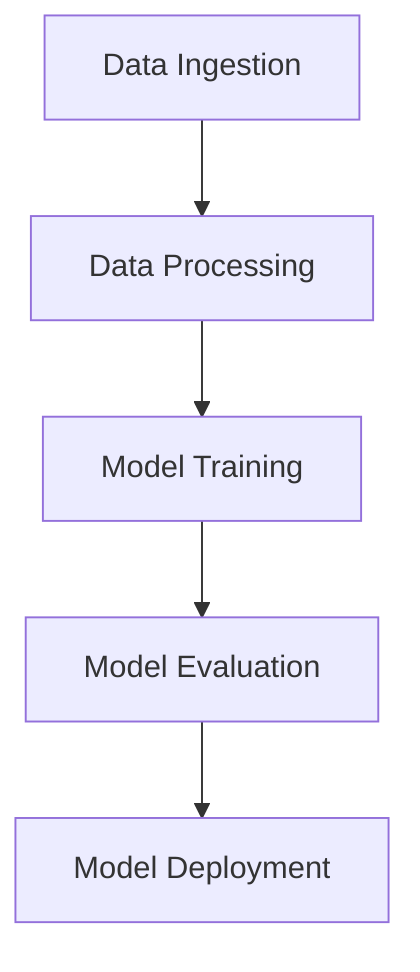
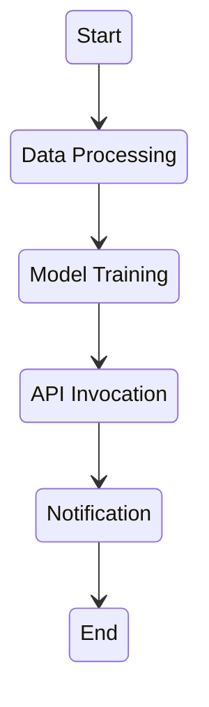

## Model deployment options

SageMaker separates "how a model is hosted" from "how a model is trained," and picking the right hosting option is mostly about traffic pattern and cost:

- **Real-time endpoints**: A persistent, fully managed HTTPS endpoint for low-latency, synchronous predictions. Supports auto scaling and multi-AZ deployment for high availability. Best for steady, latency-sensitive traffic (e.g., a live recommendation API).
- **Multi-Model Endpoints (MME)**: Host many models behind a single endpoint, loading them into memory on demand and evicting less-used ones. This dramatically reduces cost when you have many models with sparse, unpredictable individual traffic (e.g., one model per customer/tenant) that don't each justify a dedicated endpoint.
- **Serverless Inference**: A fully managed endpoint that scales to zero and provisions compute automatically per request, with no capacity to manage. Best for intermittent or unpredictable traffic where paying for idle provisioned capacity isn't justified, at the cost of cold-start latency.
- **Asynchronous inference**: Queues requests and processes them in the background, returning results to S3 rather than synchronously — for large payloads or long-running inference jobs (e.g., large batch documents, video) that don't fit a real-time request/response cycle.
- **Batch Transform**: A one-off or scheduled job that runs inference over an entire dataset at once and writes results to S3, with no persistent endpoint running afterward — the right choice when there's no need for on-demand predictions at all.

:::tip Exam wording cues
- "Many models, each with low/sporadic traffic, minimize cost" → **Multi-Model Endpoints**.
- "Unpredictable traffic, don't want to pay for idle capacity" → **Serverless Inference**.
- "Large payloads / long processing time, no need for immediate response" → **Asynchronous inference**.
- "Run inference once over a whole dataset, no endpoint needed afterward" → **Batch Transform**.
:::

## Safe rollout on real-time endpoints: variants, A/B testing, and shadow testing

A single real-time endpoint isn't limited to hosting one model version — it can host multiple **ProductionVariants** behind the same URL, each assigned a traffic weight, which is what makes safe model rollout possible without any client-side changes:

- **Multi-variant A/B testing**: Deploy the candidate model as a second variant alongside the current production variant, split live traffic between them by weight (a common split is a small percentage, e.g. 5-10%, to the candidate), and compare business or quality metrics between the two before shifting all traffic to the winner.
- **Blue/green with automatic rollback**: Deploy the new variant, monitor its CloudWatch alarms during a bake period, and automatically roll back to the previous variant if error rates or latency regress — the same safe-deployment pattern used for regular application code, applied to a model endpoint.
- **Shadow testing**: Mirror a copy of live production traffic to a candidate variant, but never return the candidate's predictions to users — only capture and compare them offline. This validates a candidate model's real-world behavior with zero user-facing risk, at the cost of paying for double inference capacity during the test window.

:::warning Exam trap
A/B testing changes what some fraction of real users actually see; shadow testing never does. If a scenario emphasizes validating a new model against live traffic with **zero risk to production responses**, that's shadow testing, not a canary or an A/B split — shadow testing observes, it doesn't roll anything out.
:::

## Model monitoring

**Amazon SageMaker Model Monitor** continuously watches deployed endpoints for quality degradation without requiring you to build custom monitoring logic:

- **Data quality drift**: Detects when incoming inference data statistically diverges from the training data baseline (e.g., a feature's distribution shifts over time).
- **Model quality drift**: Compares live predictions against ground truth labels (when available) to detect accuracy degradation.
- **Bias drift**: Monitors for emerging bias in predictions post-deployment, complementing the pre-deployment bias checks done by SageMaker Clarify.
- **Feature attribution drift**: Detects when the relative importance of input features shifts, which can signal that the model's learned relationships no longer match production reality.

Model Monitor jobs run on a schedule, compare captured inference data against a baseline computed from training data, and publish violations to CloudWatch — from which you can trigger alarms or retraining pipelines.

:::warning Exam trap
Model Monitor detects **drift after deployment**; it does not by itself retrain or redeploy a model. Automated retraining requires wiring Model Monitor's CloudWatch alarms into a pipeline (e.g., a SageMaker Pipeline or Step Functions workflow) that triggers retraining.
:::

When a monitoring schedule starts reporting a wave of new violations right after a legitimate change — a retrained model, a new upstream data source, a shifted user base — the usual root cause isn't a sudden data-quality problem, it's that the **baseline statistics are now stale** relative to the new normal. The fix is to recompute the baseline from a current, representative dataset, not to loosen the violation thresholds until the alerts stop; raising thresholds just hides genuine future drift instead of correctly recalibrating what "normal" means.

### SageMaker Clarify: bias and explainability

Model Monitor's four drift categories work at the level of statistics and predictions; **SageMaker Clarify** adds a layer underneath that, focused on *why* a model behaves the way it does and whether it behaves fairly:

- **Feature attribution drift**: Uses SHAP (SHapley Additive exPlanations) values to compute how much each input feature contributed to a prediction, then compares that attribution pattern over time against a baseline — a shift here can mean the model's learned relationships no longer match production reality, even if raw accuracy hasn't visibly dropped yet.
- **Bias detection**: Computes fairness metrics (such as demographic parity and equalized odds) across protected attributes, both before training (on the raw data) and after deployment (via scheduled bias-drift monitoring jobs that publish violations to EventBridge), to catch discriminatory outcomes across groups.
- **Class imbalance handling**: When one outcome class is rare (fraud, defect, churn), overall accuracy can look excellent while the model still misses nearly every rare-class case — the real signal is recall or false-negative rate on the minority class, not accuracy. SMOTE (Synthetic Minority Oversampling), other oversampling techniques, and class-weighted loss functions are the standard mitigations, applied before or during training rather than after the fact.

:::danger Exam trap
Feature attribution drift is Clarify's job, not Model Quality Monitor's — Model Quality Monitor compares predictions to ground-truth labels (accuracy/recall/F1 over time), while Clarify explains *why* predictions look the way they do. A question describing "the relative importance of input features has shifted" is asking about Clarify, even if it's phrased as a monitoring question.
:::

## Training and hyperparameter tuning

Getting a good model into production starts well before deployment, and SageMaker's training-time tooling is aimed at making that phase faster, cheaper, and less error-prone:

- **Managed Spot Training**: Runs training jobs on spare EC2 capacity at a steep discount versus on-demand pricing, with SageMaker automatically checkpointing progress and resuming after an interruption — a good fit whenever a training job can tolerate being paused and resumed rather than needing to run start-to-finish uninterrupted.
- **FSx for Lustre**: A high-throughput, parallel file system that can front a large S3 training dataset, avoiding the read-throughput bottleneck of streaming directly from S3 when many GPU workers are reading training data simultaneously.
- **Automatic Model Tuning (hyperparameter tuning)**: Runs many training jobs across a hyperparameter search space and picks the best-performing configuration. **Early stopping** terminates clearly underperforming trials before they finish, saving compute, and a **warm start** of type `TRANSFER_LEARNING` seeds a new tuning job with the results of a previous one instead of searching from scratch — useful when a similar tuning problem has already been solved once.
- **SageMaker Data Wrangler**: A UI-driven tool for importing, visualizing, and cleaning data (outlier detection, missing-value handling) before it ever reaches a training job, reducing the amount of custom preprocessing code needed for common data-quality issues.
- **AWS Glue Data Quality gating**: Before a training job (or a Knowledge Base ingestion) runs at all, Glue Data Quality rules (written in DQDL) can block a dataset that fails validation. This is where a specific, easy-to-miss distinction matters: a rule like `ColumnValues "field" != NULL` only catches missing values — it does **not** catch empty strings, since an empty string `""` is a value, not a null. Catching empty or whitespace-only text requires a length-based rule such as `ColumnLength "field" > 0`; DQDL explicitly distinguishes NULL, EMPTY, and WHITESPACES_ONLY as three separate conditions.

:::danger Exam trap
`ColumnValues != NULL` passing does not mean a text column is clean — empty strings sail right through a null check. If a scenario is about catching blank/empty text fields specifically, the answer is a `ColumnLength` rule, not a null check.
:::

On the model-quality side, the classic overfitting signature — training loss keeps improving while validation performance stalls or gets worse — is addressed by *reducing* model complexity or training duration: stronger regularization, shallower/smaller trees, or earlier stopping. More epochs or deeper trees almost always make an already-overfit model worse, not better, since they give the model more capacity to memorize training-set noise.

## No-code and low-code tooling: SageMaker Canvas and JumpStart

Not every SageMaker workload needs a custom training pipeline. **SageMaker Canvas** is a no-code, UI-driven model builder aimed at business analysts — it automatically selects an appropriate algorithm and tunes hyperparameters from a dataset, and can pull in AWS Glue DataBrew for data preparation, without anyone on the team writing training code. **SageMaker JumpStart** takes a different shortcut: it's a catalog of pre-trained foundation models and classical ML models that can be deployed or fine-tuned directly, for teams that want a proven starting point instead of training a model from zero.

## Human-in-the-loop: Ground Truth and Amazon A2I

**SageMaker Ground Truth** manages human labeling workflows for building training datasets, while **Amazon Augmented AI (A2I)** applies the same idea at inference time: when a model's confidence in a prediction falls below a defined threshold, A2I routes that specific case to a human reviewer instead of returning a possibly-wrong automated answer, typically orchestrated through EventBridge and Lambda so the low-confidence case is queued, reviewed, and the result is fed back into the calling application automatically.

## Governance: lineage tracking, Feature Store, and Model Cards

As an ML workflow moves toward production, being able to answer "where did this model come from, and can we trust it" becomes its own requirement, separate from the model's raw accuracy:

- **ML Lineage Tracking**: Automatically records the artifacts (datasets, preprocessing jobs, training jobs, model packages) and the associations between them as a directed graph, giving programmatic, audit-ready traceability from a deployed model all the way back to the data it was trained on.
- **SageMaker Feature Store**: A centralized repository for engineered features, with both an online store (low-latency lookups for real-time inference) and an offline store (bulk access for training and batch jobs) — so the same feature definition and computed values are reused consistently between training and serving instead of being recomputed slightly differently in each place.
- **Model Cards**: Structured documentation attached to a model package — intended use, risk rating, training-data provenance, evaluation results, and responsible-AI considerations — retrievable programmatically (via `DescribeModelCard`) so a CI/CD pipeline can gate promotion on a model actually having complete, up-to-date documentation, not just a passing accuracy score.

For the broader compliance and data-governance picture (Lake Formation permissions, CloudTrail vs. model invocation logging, encryption), see [Responsible AI & Security](./responsible-ai-and-security.md).

## Machine learning workflow orchestration: SageMaker Pipelines vs AWS Step Functions

Both services can orchestrate multi-step ML workflows, but they differ in scope and how ML-aware they are.

### SageMaker Pipelines

**Purpose:** Purpose-built for automating and orchestrating end-to-end machine learning workflows within SageMaker.

**Features:**
- Pre-built ML-specific steps: data processing, model training, hyperparameter tuning, model evaluation, and model registration.
- Deep integration with other SageMaker features like SageMaker Model Registry, Experiments, and Feature Store.
- Native support for conditional execution based on model evaluation metrics (e.g., only register a model if accuracy exceeds a threshold).

**Example Use Case:**
- Automating the entire ML lifecycle: data preprocessing, training, evaluating, and deploying a model, with lineage tracking built in.

### AWS Step Functions

**Purpose:** A general-purpose orchestration service to coordinate distributed applications and microservices using visual workflows.

**Features:**
- Built-in error handling, retry logic, and conditional branching.
- Integrates with a wide range of AWS services, including Lambda, ECS, DynamoDB, SNS, SQS, and more.
- Visual Workflow: Provides a visual interface to design and monitor workflows.

**Example Use Case:**
- Orchestrating complex workflows that might include data processing, invoking APIs, managing data pipelines, and integrating multiple AWS services.

### Key differences

| Feature                     | SageMaker Pipelines                      | AWS Step Functions                        |
|-----------------------------|------------------------------------------|-------------------------------------------|
| **Primary Focus**           | Machine Learning                         | General-purpose workflow orchestration    |
| **Integration**             | Deep integration with SageMaker services | Broad integration across AWS services     |
| **Pre-built Steps**         | ML-specific steps (e.g., training, tuning)| Generic steps for various use cases       |
| **Workflow Definition**     | Step-based ML workflows                  | State machine-based workflows             |
| **Error Handling & Branching**| Basic support                          | Advanced error handling and conditional branching |
| **Versioning**              | Yes, with focus on ML artifacts          | No inherent versioning for workflows      |
| **Use Cases**               | End-to-end ML lifecycle automation       | Orchestration of diverse applications and services |

### Choosing the right tool

- **Use SageMaker Pipelines if:**
  - You are focused on building and automating ML workflows.
  - You need tight integration with SageMaker's ML capabilities.
  - You want built-in components for common ML tasks.

- **Use AWS Step Functions if:**
  - You need to orchestrate a variety of AWS services or custom services.
  - Your workflow includes non-ML tasks or services.
  - You require advanced workflow control with error handling and branching.

Both services can be used together in scenarios where you need the specific ML capabilities of SageMaker Pipelines within a broader application workflow managed by Step Functions.

### Example diagrams

#### SageMaker Pipelines

#### AWS Step Functions

These diagrams illustrate how each tool can be used to define a workflow, with SageMaker Pipelines focused on ML steps and Step Functions providing a more flexible orchestration capability.
