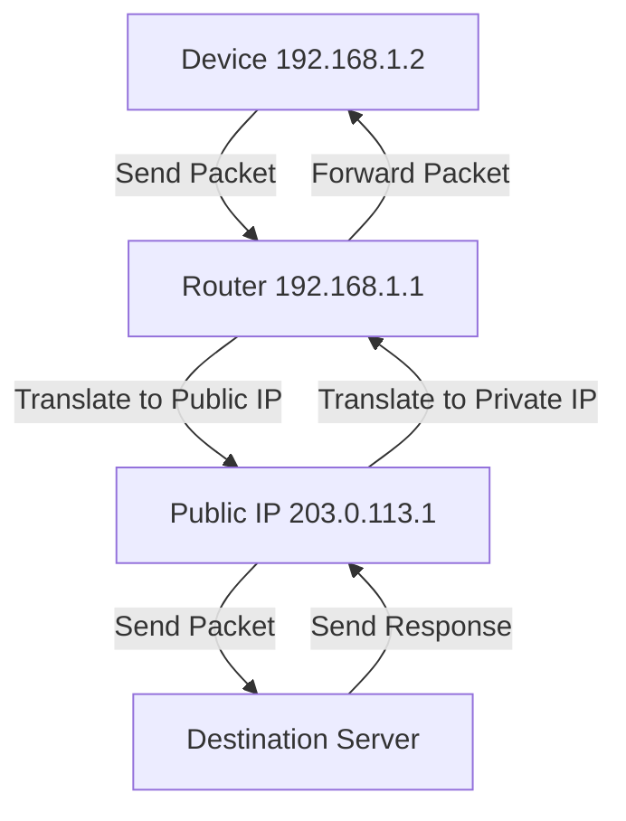
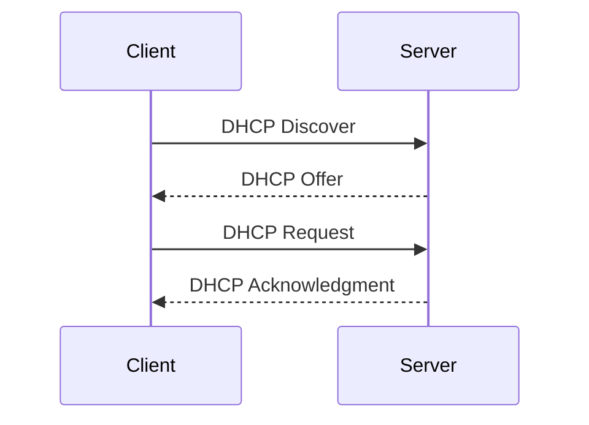

## Network Address Translation (NAT)

Network Address Translation (NAT) is a method used by routers to translate private (local) IP addresses within a local network to a single public IP address before packets are sent out to the internet. NAT is essential for conserving the limited number of IPv4 addresses and for enhancing security by hiding internal network structures from external networks.



### Types of NAT

1. **Static NAT:**
   - Maps a specific private IP address to a specific public IP address.
   - Commonly used for servers that need a consistent public IP address.
2. **Dynamic NAT:**
   - Maps a private IP address to a public IP address from a pool of available addresses.
   - The mapping changes dynamically.
3. **PAT (Port Address Translation) or NAT Overload:**
   - Maps multiple private IP addresses to a single public IP address by using different ports.
   - **Most common typ**e of NAT used in home networks.

### Workflow

NAT modifies the IP addresses in the headers of IP packets while they are in transit. Here’s a detailed workflow of how NAT functions in a typical home network scenario using PAT:

1. **Initial Setup**
   - **Local Devices:** Devices within a home network have private IP addresses (e.g., 192.168.1.2, 192.168.1.3).
   - **Router:** The router has a private IP address on the local side (e.g., 192.168.1.1) and a public IP address assigned by the ISP (e.g., 203.0.113.1).
2. **Sending a Request**
   1. **Device Initiates Connection:**
      - Your computer (192.168.1.2) wants to access a website.
      - It sends an HTTP request packet with its private IP address (192.168.1.2) as the source IP and the website’s IP address as the destination IP.
   2. **Router Receives Packet:**
      - The router receives the packet from the computer.
      - The packet contains the source IP address (192.168.1.2) and source port (e.g., 12345), along with the destination IP address and port (e.g., 80 for HTTP).
3. **NAT Translation**
   1. **IP and Port Mapping:**
      - The router changes the source IP address from 192.168.1.2 to its own public IP address, 203.0.113.1.
      - It also changes the source port from 12345 to a unique port number that it tracks (e.g., 54321).
      - The router maintains a NAT table that maps the internal IP and port (192.168.1.2:12345) to the external IP and port (203.0.113.1:54321).
   2. **Packet Forwarding:**
      - The modified packet is sent to the destination server with the source IP address 203.0.113.1 and source port 54321.
4. **Receiving the Response**
   1. **Server Sends Response:**
      - The destination server processes the request and sends a response back to the public IP address 203.0.113.1 on port 54321.
   2. **Router Receives Response:**
      - The router receives the incoming packet with the destination IP address 203.0.113.1 and destination port 54321.
      - It looks up its NAT table to find the original internal IP and port (192.168.1.2:12345).
5. **NAT Reverse Translation**
   1. **Reverting IP and Port:**
      - The router changes the destination IP address back to the internal IP address 192.168.1.2.
      - It also reverts the destination port to 12345.
   2. **Packet Forwarding:**
      - The router forwards the packet to the original requesting device (192.168.1.2).
6. **Device Receives Response**
   - The device receives the response packet and processes it, completing the communication.

## Dynamic Host Configuration Protocol (DHCP)

Dynamic Host Configuration Protocol (DHCP) is a network management protocol used to automate the process of configuring devices on IP networks. It enables devices (clients) to receive IP addresses and other necessary network settings automatically from a DHCP server, reducing the need for manual configuration.



### Key Components of DHCP

1. **DHCP Server:**
   - A network server that automatically provides and assigns IP addresses, default gateways, and other network parameters to client devices.
   - The DHCP server maintains a pool of available IP addresses and leases them to clients.
2. **DHCP Client:**
   - Any device (such as a computer, smartphone, or printer) that connects to a network and requests network configuration information from a DHCP server.
3. **DHCP Lease:**
   - The temporary assignment of an IP address to a DHCP client.
   - Leases are time-bound, meaning the client must renew the lease periodically to continue using the assigned IP address.

:::info Lease Renewal
- **T1 Timer:** When 50% of the lease time has passed, the client attempts to renew the lease by sending a DHCP Request directly to the DHCP server that granted the lease.
- **T2 Timer:** If the client receives no response by 87.5% of the lease time, it attempts to rebind by broadcasting a DHCP Request to any available DHCP server.
- If the client fails to renew the lease before it expires, it must stop using the IP address and start the process over with a DHCP Discover message.
:::

### DHCP Workflow

1. DHCP Discover
   - When a device (DHCP client) connects to a network, it broadcasts a DHCP Discover message to locate available DHCP servers.
   - This message contains the device's MAC address and requests an IP address and other network configuration settings.
2. DHCP Offer
   - Any DHCP server on the network that receives the Discover message responds with a DHCP Offer message.
   - The Offer message includes an available IP address, the subnet mask, the default gateway, the DNS server addresses, and the lease duration.
3. DHCP Request
   - The client selects one of the offers (usually the first one it receives) and responds with a DHCP Request message.
   - This message indicates which offer it has accepted and formally requests the IP address and configuration settings.
4. DHCP Acknowledgment
   - The DHCP server acknowledges the request with a DHCP Acknowledgment (ACK) message.
   - The ACK message confirms the lease and includes the lease duration, along with the assigned IP address and other configuration information.
   - The client then configures its network interface with the provided settings.

## Examples 

### Sending an email

It's kind of like when you send email data packages sent from your laptop will be attached with the local IP address labeled as sender and Youtube server’s domain name as the receiver. 

When packages reach the router NAT will change your local IP address to the public IP address and the router will send the modified packages to the Youtube server.


### Does your ISP using CGNAT or 

#### Public IP Address
Regardless of the NAT type your ISP is using, your connection to the internet will ultimately have a public IP address. However, the method by which this public IP address is assigned and used can vary:

- **No NAT(Public IP Direct Assignment):** Your device is assigned a public IP address directly.
- **Single NAT (Common NAT):** The router or gateway in the local network is assigned a single public IP address by the ISP. The router then assigns private IP addresses to devices within the local network and uses NAT to translate these private IPs to the single public IP for internet access.
- **Carrier-Grade NAT (CGNAT):** Multiple customers share the same public IP address provided by the ISP, and each customer’s router assigns private IP addresses to devices within their local networks.

#### Steps to Identify the Type of NAT

Here are detailed steps to identify the type of NAT your ISP is using:

1. Check Your Public IP Address
   1. Open a web browser.
   2. Go to a website like [whatismyip.com](https://www.whatismyip.com/).
   3. Note down the public IP address displayed.
2. Access Your Router's Admin Interface
   1. Open a web browser.
   2. Type the default IP address of your router in the address bar (usually `192.168.1.1` or `192.168.0.1`).
   3. Log in with your router's admin credentials (default username and password can usually be found on the router or in its manual).
3. Check WAN or Internet Settings
   1. Navigate to the section of the router settings where WAN or Internet settings are displayed.
   2. Look for the IP address assigned to the WAN/Internet port of your router.
4. Compare IP Addresses
   - If the WAN IP address shown in the router matches the public IP address you noted earlier, your router is assigned a public IP address directly (No NAT or Single NAT).
   - If the WAN IP address is within the `100.64.0.0` - `100.127.255.255` range, your ISP is using CGNAT. The private IP ranges (e.g., `192.168.x.x`, `10.x.x.x`, `172.16.x.x`) are typically used within local networks and are distinct from the CGNAT range.

:::info IP range
- **CGNAT range**: 100.64.0.0 - 100.127.255.255
- **Private IP ranges for local networks**:
   - 10.0.0.0 - 10.255.255.255
   - 172.16.0.0 - 172.31.255.255
   - 192.168.0.0 - 192.168.255.255

Private IP ranges are used based on the size of the network. 
- Class A (`10.0.0.0/8`) 
   - It is for large enterprise or cloud environments like AWS VPCs. 
   - Total IP address: `2^(32 - 8) = 2^24 = 16,777,216`
- Class B (`172.16.0.0/12`) 
   - It suits medium-sized networks, such as corporate networks with departmental subnets. 
   - Total IP address: `2^(32 - 12) = 2^20 = 1,048,576`
- Class C (`192.168.0.0/16`) 
   - It is ideal for small networks or home use, like home routers using `192.168.1.x`. 
   - Total IP address: `2^(32 - 16) = 2^16 = 65,536`

Each range is chosen based on the number of required IP addresses and the scale of the network. AWS often uses `10.x.x.x` for its vast address space, while home networks commonly use `192.168.x.x`.
:::

:::info Perform a Traceroute to check if your ISP uses CGNAT or single NAT
Using `traceroute google.com` can help you determine the type of NAT your ISP is using. Here is a detailed step-by-step process to analyze the traceroute results to understand your ISP's NAT type:

Here's an example of what the output might look like and how to interpret it:

```plaintext
traceroute to google.com (142.250.182.206), 30 hops max, 60 byte packets
 1  192.168.1.1 (192.168.1.1)  1.123 ms  1.088 ms  1.077 ms
 2  100.127.200.1 (100.127.200.1)  8.912 ms  8.877 ms  8.862 ms
 3  100.127.192.1 (100.127.192.1)  9.761 ms  9.719 ms  9.694 ms
 4  203.0.113.1 (203.0.113.1)  10.458 ms  10.416 ms  10.384 ms
 5  198.51.100.1 (198.51.100.1)  11.364 ms  11.327 ms  11.295 ms
 6  192.0.2.1 (192.0.2.1)  12.265 ms  12.233 ms  12.210 ms
 7  72.14.194.1 (72.14.194.1)  13.170 ms  13.132 ms  13.099 ms
 8  216.239.41.1 (216.239.41.1)  14.037 ms  14.003 ms  13.968 ms
 9  216.239.40.1 (216.239.40.1)  15.867 ms  15.832 ms  15.796 ms
10  142.250.182.206 (google.com)  16.761 ms  16.727 ms  16.692 ms
```

### Interpreting the Results

1. **First Hop:**
   - Typically, the first hop is your local router. If it shows a private IP address like `192.168.x.x`, `10.x.x.x`, or `172.16.x.x`, it indicates that your local network is using private IP addresses assigned by your router.
2. **Subsequent Hops:**
   - Look at the IP addresses of the next few hops.
3. **Identifying CGNAT / Single NAT or No NAT :**
   - **Identifying CGNAT:** If you see IP addresses in the range `100.64.0.0/10` (which includes addresses from `100.64.0.0` to `100.127.255.255`), it indicates that your ISP is using CGNAT. In the example above, the second and third hops (`100.127.200.1` and `100.127.192.1`) fall within this range, confirming the use of CGNAT.
   - **Identifying Single NAT or No NAT:** If the first few hops after your local router are public IP addresses (not in the `100.64.0.0/10` range or other private ranges), your ISP is not using CGNAT. Instead, your router is likely using Single NAT, where your ISP assigns a public IP address directly to your router.
:::