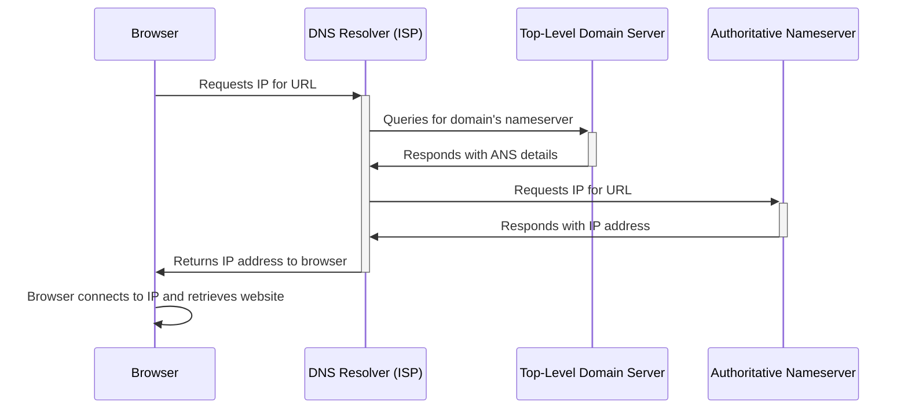

> A very good resource to understand DNS in comic: [A fun and colorful explanation of how DNS works.](https://howdns.works/)

The Domain Name System (DNS) is like the internet's phonebook; it translates human-friendly domain names like www.example.com into IP addresses like 192.0.2.1 that computers use to identify each other on the network. Whenever you enter a website address in your browser, DNS servers take that domain name and look up the corresponding IP address so the browser can load the correct webpage. Think of it as asking for directions to a friend's house; you get their street name, which you understand, and DNS gives you the precise map coordinates for your GPS to navigate to their location.

Below is a flow diagram to give you a high level overview of all the component discussed in the following sections.

## What is a Domain Name System (DNS)?

Source: [What is a Recursive DNS server?](https://www.cloudns.net/blog/recursive-dns-server/)

The initial activity of the web page loading process is centered around DNS lookup and translation.Let’s take a step-by-step look at what DNS does behind the scenes:

- When you launch a web browser and type https://www.sai-tai.com into the address bar, the request for https://www.sai-tai.com is routed to a DNS resolver.
- The DNS resolver for the ISP forwards the request for https://www.sai-tai.com to a DNS root name server, and the root name server redirects to TLD server.
- The DNS resolver for the ISP forwards the request this time to one of the TLD name servers for .com domains (.com domains redirects to the authoritative name server.)
- The DNS resolver makes a request to the authoritative name server for the relevant IP address, and the authoritative name server sends the IP address to the DNS resolver.
- Once the browser receives the IP address, the browser makes an HTTP request.
- The server at that IP address (sai-tai in this example) will return the webpage to be rendered in the browser.

To understand how DNS works, it's important to take understand below components.

### Recursive Nameserver / DNS resolver

The term "nameserver" generally refers to a server on the Internet that is responsible for translating domain names into IP addresses. Each domain has at least one nameserver that is responsible for maintaining that domain's DNS records. Nameservers play a crucial role in the Domain Name System (DNS), which is the system used to resolve human-friendly domain names into machine-readable IP addresses.

A recursive DNS resolver is the DNS server that processes the initial request and connects with the higher-level authority for established domain details.

The browser and the OS both searched their cache first to see if they knew the IP for dnsimple.com. But since they didn't, the OS is calling the resolver.

*The resolver server is usually your **ISP (Internet Service Provider)** *. The resolvers knows where to locate the root server. The root server knows where to locate the .COM Top-Level Domain(TLD) servers. 

### Root server

> TL;DR - The root server told DNS resolver where to find the Top level domain server(e.g. .COM, .ORG, .NET).

Root servers are the top-level of the DNS hierarchy. They are a network of hundreds of servers distributed worldwide, which are responsible for directing queries to the right TLD servers, such as those for .com, .org, .net, and country-specific domains like .uk or .jp. There are 13 logical root servers, labeled A through M, but each operates from multiple locations using anycast addressing to provide a robust, distributed service.

They are scattered around the globe and operated by 12 independent organisations. They are named `letter`.root-servers.net where `letter` ranges from A to M. [Root Servers](https://www.iana.org/domains/root/servers)
- a.root-servers.net
- b.root-servers.net
- c.root-servers.net
- etc...

This doesn't mean that we have only 13 physical servers to support the whole internet! Each organisation provides multiple physical servers distributed around the globe.

When your browser needs to find the IP address of a domain like www.example.com, it might start by asking a root server, "Where do I find information on .com domains?" The root server won't know the actual IP address for 'www.example.com', but it can direct the querying server to the authoritative servers for the .com TLD.

### Authoritative Nameserver

An "Authoritative nameserver," is a specific type of nameserver that holds the definitive records for a domain. When a nameserver is authoritative, it means that it has the power to answer queries for records in its own domain based on its dataset(no cached values), without having to refer to another source for the information . 

When a nameserver return the list of name servers, it is usually more than one name server attached to any domain for distributing workload and failover.

For "www.example.com," the process would eventually lead to the authoritative nameserver for "example.com" after the .com TLD server. This nameserver will have the final answer, providing the actual IP address associated with 'www.example.com' so the browser can connect to the appropriate server hosting the website.

:::info How could a Nameserver make the connection?
When you register a domain, you typically specify the authoritative nameservers that hold the DNS records for your domain, which may then be queried by DNS resolver as part of the process of resolving your domain to its corresponding IP address.

With the help of the **Domain Registrar**, a Nameserver can linkup the domain names to its respective IP addresses.

1. When a domain is purchased, the domain registrar reserves the name..
2. The domain registrar communicates to the TLD registry the authoritative name servers.

If you want to know who are the authoritative name servers for your domain, run a WHOIS query. 
- [ICANN Lookup](https://lookup.icann.org/en/lookup)
- [Who.is](https://who.is/whois/google.com)
:::

:::infoAuthoritative Nameserver vs. Recursive Nameserver
Here are the key differences:

**Authoritative Nameserver**:
  - Holds data that is definitive or "authoritative" for a particular domain or suite of domains.
  - Responds to DNS lookups with answers that have been configured by the domain owner.
  - Does not need to query other nameservers to provide the DNS information; it has the data stored locally.
  - Can provide authoritative answers for specific record types, such as A records (addresses), MX records (mail exchange), etc.
  - Is often updated directly by the domain owner through a registrar or DNS hosting service.

**Recursive Nameserver** aka. **DNS resolver**:
  - Could be any server that participates in the DNS system.
  - Might not have definitive information about a domain and may need to refer to other nameservers or caches to respond to queries.
  - Includes caching nameservers, which store DNS query results for a certain period to improve lookup efficiency and reduce the load on authoritative nameservers.
  - DNS resolver are responsible for fetching the response to a DNS query on behalf of a client, possibly by querying multiple nameservers in the process.
:::

### Top level domain

> TL;DR - The top-level domain server give **DNS resolver** the Authoritative name servers addresses.

The top level domain contains the suffix of a domain name, such as .com, .org, and .net. The coordination of most top-level domains (TLDs) belong to the Internet Corporation for Assigned Names and Numbers (ICANN). The .COM TLD was one of the first created in 1985. Other type of TLDs include:
1. Country code TLDs. Usually, their 2 letter ISO code: .JP, .FR
2. Internationalized country code TLDs: .中国, .香港
3. Generic TLDs: .NET, .ORG, .EDU, etc...
4. Infrastructure TLDs: .ARPA, mostly used for reverse DNS lookups. (Using IP address to find its domain)

TLDs return a list of name servers to a DNS resolver, e.g.
- ns1.dnsimple.com 
- ns2.dnsimple.com 
- ns3.dnsimple.com 
- ns4.dnsimple.com

:::caution Glue records

Since 'ns1.dnsimple.com' is a subdomain of 'dnsimple.com', how could we resolve 'ns1.dnsimple.com' without resolving 'dnsimple.com' first?

The answer is **Glue Records**. When the resolver asked the .COM TLD about dnsimple.com, extra information was attached to that response. The resolver got at least one IP address for each name server which means the resolver not only got the name of the authoritative name server, it also got the IP address.

- ns1.dnsimple.com [192.124.10.51]
- ns2.dnsimple.com [162.159.25.4]
- ns3.dnsimple.com [50.31.242.53]
- ns4.dnsimple.com [162.159.27.4]

Thus breaking the blow circular dependency. 

:::

## Steps to resolve a domain

Specifically, the uses the following steps, though a local cache on a browser or operating system can bypass some of these steps.

1. **Initiate query by user**: The web browser's user initiates the query by typing a domain name, clicking on a hyperlink or loading a bookmark. The query is set into the internet to a recursive DNS resolver.

2. **Resolve TLD**: The resolver queries an authoritative nameserver(**root server**), which generates a Top-Level Domain (TLD) response that identifies the domain's suffix (.com, .org, etc.) and forwards the request.

3. **Resolve nameserver**: The TLD server responds with appropriate IP address of the domain's nameserver.

4. **Resolve IP address**: With the nameserver identified, the recursive DNS resolver queries the domain's nameserver. The nameserver responds with the proper IP address.

5. **Data transfer**: With the IP address identified, the browser can request data to be transferred for the target page and/or assets using hypertext transfer protocol (HTTP).

Source: [What is a Domain Name System (DNS)?](https://www.oracle.com/cloud/networking/dns/what-is-dns/#how)

## Round-robin DNS

> TL;DR - Round-robin DNS is a load balancing technique that involves using several different IP addresses for a single domain name.

Round-robin DNS is a load balancing technique where the balancing is done by a type of DNS server called an authoritative nameserver, rather than using a dedicated piece of load-balancing hardware. Round-robin DNS can be used when a website or service has their content hosted on several redundant web servers; when the DNS [authoritative nameserver](https://www.cloudflare.com/learning/dns/dns-server-types#authoritative-nameserver) is queried for an IP address, the server hands out a different address each time, operating on a rotation. This is particularly useful when the redundant web servers are geographically separated, making traditional load-balancing difficult. Round-robin is known for it’s ease of implementation, but it also has strong drawbacks.

A DNS server with round-robin enabled will have **multiple different [A records](https://www.cloudflare.com/learning/dns/dns-records/dns-a-record/), each with the same domain name but a different IP address**. Each time the DNS server is queried, it sends the IP address to which it most recently responded with to the back of the queue, operating on a loop. The IP addresses in a round-robin DNS server are like baseball players in a batting lineup: each one gets a turn and then is moved to the back of the line.

### What are the drawbacks of Round-Robin DNS?

The round-robin method doesn’t always provide evenly-distributed load balancing because of both DNS [caching](https://www.cloudflare.com/learning/cdn/what-is-caching/) and [client-side](https://www.cloudflare.com/learning/serverless/glossary/client-side-vs-server-side/) caching. If a user makes a DNS query to a particularly high traffic [recursive resolver](https://www.cloudflare.com/learning/dns/dns-server-types#recursive-resolver) for a particular website, that resolver will cache the website’s IP, potentially sending a heavy amount of traffic to that one IP.

Another drawback is that round-robin cannot be depended upon for site reliability; if one of the servers goes down, the DNS server will still keep that server’s IP in the round-robin rotation. So if there are 6 servers and one is taken offline, one in six users will be denied service. In addition, round-robin DNS does not account for server load, transaction time, geographical distance, and other factors that traditional load balancing can be configured for.

Some advanced round-robin services have methods to overcome a few of the drawbacks, such as the ability to detect unresponsive servers and take them out of the round-robin rotation, but there is no way around the caching issue. 

### The other alternative to Round-Robin?

One alternative to Round-robin DNS is the use of a load balancer. While Round-robin DNS distributes traffic evenly across multiple servers by rotating the order of IP addresses returned for a domain, a load balancer is a dedicated device or software component designed to balance the traffic load across servers in a more intelligent and efficient manner. Load balancers have advanced algorithms and capabilities to distribute traffic based on various factors such as server health, current load, and performance metrics.

There are different types of load balancers available, including:

1. Hardware load balancers are dedicated devices specifically designed for load balancing. They offer high performance, scalability, and advanced features such as SSL offloading, session persistence, and health checks. These load balancers are typically used in large-scale deployments.

2. Software load balancers are software-based solutions that run on standard servers or virtual machines. They leverage software algorithms to distribute traffic across multiple servers. Software load balancers provide flexibility, cost-effectiveness, and can be deployed in various environments, including on-premises or in the cloud.

3. Application Load Balancer (ALB) operate at the application layer (Layer 7) of the OSI model. They can perform advanced routing decisions based on HTTP headers, content, or other application-specific parameters. ALBs are commonly used in web applications to distribute traffic based on specific URL patterns or application behavior.

4. Network Load Balancer (NLB) operate at the transport layer (Layer 4) of the OSI model. They distribute traffic based on IP addresses and port numbers. NLBs are suitable for scenarios that require high throughput and low latency, such as TCP/UDP-based protocols.

Load balancers offer advantages over Round-robin DNS, including:

- More intelligent traffic distribution based on server health and performance.
- Enhanced scalability and flexibility.
- Support for advanced features like SSL termination, session persistence, and health checks.
- Centralized management and control.
- Real-time monitoring and analytics.

It's important to note that while load balancers provide advanced traffic distribution capabilities, DNS-based load balancing is often used in conjunction with load balancers to achieve high availability and fault tolerance. DNS-based load balancing can be utilized to distribute traffic across multiple load balancer instances or geographic locations.

## DNS record types

There are several types of DNS records that serve different purposes and provide specific information about domain names and network resources. Here are some of the commonly used DNS record types:

1. A/AAAA Record
    - A (Address) Record maps **a domain or subdomain to an IPv4 address**. It translates a domain name to the corresponding IP address to facilitate the routing of network traffic.
    - AAAA (IPv6 Address) Record is similar to the A record but is used for mapping a domain name to an IPv6 address. It enables the translation of a domain name to its corresponding IPv6 address.

2. CNAME (Canonical Name) Record is used to create **an alias or nickname for a domain or subdomain**. It points a domain or subdomain to another domain name, allowing multiple names to resolve to the same IP address. 

:::infoNo Top node for a CNAME record
You should keep in mind that the DNS protocol does not allow you to create a CNAME record for the top node of a DNS namespace, also known as the zone apex.  e.g. create `CNAME` record like: `example.com` but you can create `CNAME` record like:  `www.example.com`, `newproduct.example.com`
:::

4. MX (Mail Exchanger) specifies the mail server responsible for handling email delivery for a domain. It maps the domain name to the mail server's hostname or IP address.

5. TXT (Text) Record stores arbitrary text information about a domain. It is commonly used for adding human-readable information or verification data, such as SPF (Sender Policy Framework) records, DKIM (DomainKeys Identified Mail) records, or other text-based information.

6. NS (Name Server) Record identifies the authoritative DNS servers for a particular domain. It specifies the DNS servers that are responsible for storing and providing the DNS records for a domain. A domain will often have multiple NS records which can indicate primary and backup name servers for that domain. 

    Example of an NS record:

    |example.com   |record type:   |value:   |TTL(Time to live)   |
    |---|---|---|---|
    |@   |NS   |ns1.exampleserver.com   |21600   |

    source: [What is a DNS NS record?](https://www.cloudflare.com/learning/dns/dns-records/dns-ns-record/#:~:text=NS%20stands%20for%20'name%20server,example.com)

7. SOA (Start of Authority) Record contains administrative information about a domain. It includes details such as the primary authoritative name server for the domain, contact information for the domain administrator, and other important parameters.

8. PTR (Pointer) Record is used in reverse DNS (rDNS) to map an IP address to a domain name. It helps determine the domain name associated with a given IP address.

These are just a few examples of DNS record types. There are also other record types like SRV (Service) records for specifying specific network services, SPF (Sender Policy Framework) records for email authentication, and more. Each record type serves a specific purpose in the DNS system and helps facilitate various aspects of network communication and resource resolution.