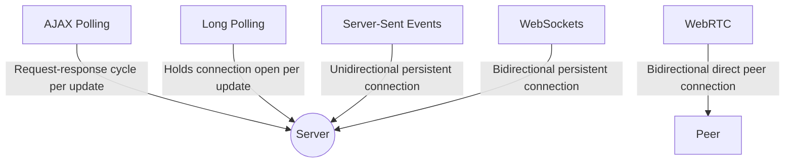

## Why don't we just use HTTP?

WebSocket is a newer communications protocol designed as an alternative which helps solve some key issues. HTTP was designed to be strictly unidirectional; the client must always request data from the server, and only one HTTP request can be sent per session. Lots of modern applications require longer session times and/or continuous updates from the server. Long-polling, a technique that keeps client-server connections open longer, helps, but it doesn't solve the problem --- and it's very resource-intensive.

The WebSocket protocol works similarly to HTTP, but with some improvements (and tradeoffs.) It allows servers to send data to clients in a standardized way *without first receiving a request*, and it allows for multiple messages to be passed back and forth over the *same connection*. It's fully compatible with HTTP (and HTTPS), and it's much less computationally demanding than polling.

There are some drawbacks to WebSocket as compared to HTTP, namely:

- WebSocket has no built-in, standardized API semantics like HTTP's status codes or request methods.
- Keeping communications open between each client and server is more resource-intensive and adds complexity.
- It's less widespread, so development can take longer.

Most WebSocket use cases require real-time data. In a system design interview, consider WebSocket vs. HTTP for applications where updates are frequent, and up-to-date information is critical. Think messaging services, gaming, and trading platforms.

Certainly! WebSockets are popular for real-time bi-directional communication between a client (like a web browser) and a server. However, there are alternative technologies and techniques that can be used to achieve real-time communication. I'll explain a few, including Long Polling, which you mentioned, and provide you with a markdown formatted document that includes these technologies.

## Real-Time Communication Technologies

Real-time communications on the web are crucial for numerous applications such as chat apps, live sports updates, stock tickers, and more. Here are some common technologies that enable real-time communication, similar to WebSockets:

### 1. AJAX Polling

AJAX polling is a technique where the client regularly sends HTTP requests to the server to check for new updates.

- Simple to implement with regular HTTP requests.
- Can cause unnecessary network load and latency because each poll is a new HTTP request, regardless of whether there is new data.

### 2. Long Polling

Long Polling is an improvement over standard polling, where the server holds the connection open until new data is available.

- More efficient than standard polling because it reduces the number of HTTP requests.
- Still not as efficient as WebSockets since connections are reopened after each piece of data is retrieved.

### 3. Server-Sent Events (SSE)

Server-Sent Events are a one-way communication channel where the server can push updates to the client as they become available.

- Simple to use and built on top of standard HTTP.
- Only allows unidirectional communication from server to client; not a two-way channel like WebSockets.

### 4. WebRTC

WebRTC enables peer-to-peer communication between web browsers without needing intermediate servers once the connection is established.

- Ideal for video/audio streaming and direct file transfers.
- More complex to implement and manage compared to WebSockets.

### Comparing the Technologies

Here's a simple comparison using a mermaid diagram showing the directionality and persistence of connection for each technology:

Each technology has its use cases and trade-offs. WebSockets are preferable for full-duplex communication that needs constant updates in both directions. SSE is suitable for unidirectional updates (like push notifications). Long Polling and AJAX Polling might be used in situations where WebSockets are overkill or when you need to support legacy systems. WebRTC excels in scenarios where direct peer-to-peer communication is required, such as video calling.

Always consider the specific needs of your application, such as support for legacy systems, infrastructure overhead, and complexity, before choosing the right technology for real-time communication.