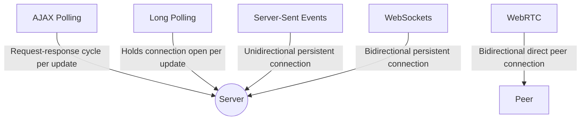
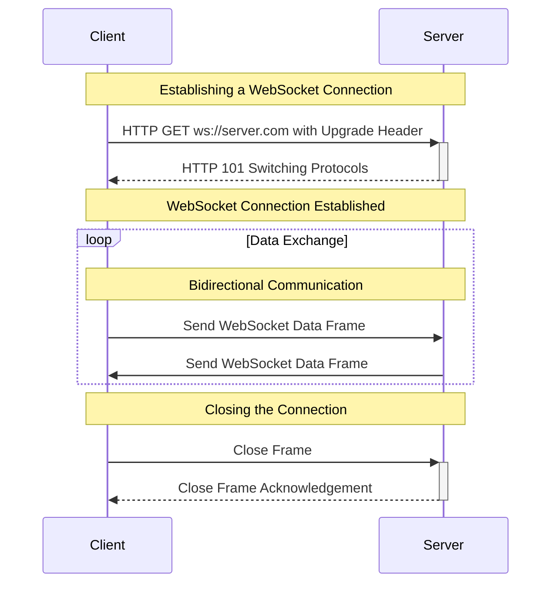

## Real-Time Communication Technologies

Real-time communications on the web are crucial for numerous applications such as chat apps, live sports updates, stock tickers, and more. Here are some common technologies that enable real-time communication, similar to WebSockets.

### HTTP/Standard Polling (AJAX)

HTTP polling is a technique where the client regularly sends HTTP requests to the server to check for new updates.

- Simple to implement with regular HTTP requests.
- Can cause unnecessary network load and latency because each poll is a new HTTP request, regardless of whether there is new data.


### Long Polling

Long Polling is an improvement over standard polling, where the server holds the connection open until new data is available.

- More efficient than standard polling because it reduces the number of HTTP requests. It solves the latency issue of standard polling 
- Still not as efficient as WebSockets since connections are reopened after each piece of data is retrieved.


### Server-Sent Events (SSE)

Server-Sent Events are a one-way communication channel where the server can push updates to the client as they become available.

- Simple to use and built on top of standard HTTP.
- Only allows unidirectional communication from server to client; not a two-way channel like WebSockets.


### WebRTC

[WebRTC](https://webrtc.org/getting-started/overview) enables peer-to-peer communication between web browsers without needing intermediate servers once the connection is established.

- Ideal for video/audio streaming and direct file transfers.
- More complex to implement and manage compared to WebSockets.

### Comparing the Technologies

Here's a simple comparison using a mermaid diagram showing the directionality and persistence of connection for each technology:



Each technology has its use cases and trade-offs. WebSockets are preferable for full-duplex communication that needs constant updates in both directions. SSE is suitable for unidirectional updates (like push notifications). Long Polling and AJAX Polling might be used in situations where WebSockets are overkill or when you need to support legacy systems. WebRTC excels in scenarios where direct peer-to-peer communication is required, such as video calling.

Always consider the specific needs of your application, such as support for legacy systems, infrastructure overhead, and complexity, before choosing the right technology for real-time communication.

## Why do we need websocket?

> WebSocket open a connection within a session, but unlike long pulling which provides one way communication, it's bi-directional communication. Rather than the usual request/response lifecycle, with a client asking a server for resources, WebSockets allow for messages to be sent in either direction. 

WebSocket is a newer communications protocol designed as an alternative which helps solve some key issues. HTTP was designed to be strictly unidirectional; the client must always request data from the server, and only one HTTP request can be sent per session. Lots of modern applications require longer session times and/or continuous updates from the server. Long-polling, a technique that keeps client-server connections open longer, helps, but it doesn't solve the problem --- and it's very resource-intensive. 

By default, a single server can handle 65,536 socket connections just because it’s the max number of TCP ports available. So as WS connections have a TCP nature and each WS client takes one port we can definitely say that number of websocket connections is also limited.

The WebSocket protocol works similarly to HTTP, but with some improvements (and tradeoffs.) It allows servers to send data to clients in a standardized way *without first receiving a request*, and it allows for multiple messages to be passed back and forth over the *same connection*. It's fully compatible with HTTP (and HTTPS), and it's much less computationally demanding than polling.

There are some drawbacks to WebSocket as compared to HTTP, namely:

- WebSocket has no built-in, standardized API semantics like HTTP's status codes or request methods.
- Keeping communications open between each client and server is more resource-intensive and adds complexity.
- It's less widespread, so development can take longer.

Most WebSocket use cases require real-time data. In a system design interview, consider WebSocket vs. HTTP for applications where updates are frequent, and up-to-date information is critical. Think messaging services, gaming, and trading platforms.

### A WebSocket connection flow

:::infoTL;DR
WebSocket connections are initiated via a regular HTTP request from the client that indicates it would like to switch, or upgrade, to talking via a WebSocket connection. It's *kind of* like sending someone a Slack message asking if they want to hop on a quick video call --- it's still communicating over the computer, and you're using one method to initiate the next.
:::



This diagram represents the flow of events in a typical WebSocket connection:

1. **Initial Handshake:** The client opens a connection by sending a special HTTP GET request with an `Upgrade` header to indicate it wants to start a WebSocket connection. The URL scheme used is either `ws://` for unencrypted connections or `wss://` for encrypted ones.

    ```plaintext
    GET /chat HTTP/1.1
    Host: server.com
    Upgrade: websocket
    Connection: Upgrade
    Sec-WebSocket-Key: x3JJHMbDL1EzLkh9GBhXDw==
    Sec-WebSocket-Protocol: chat, superchat
    Sec-WebSocket-Version: 13
    Origin: http://example.com
    ```

2. **Server Response:** If the server supports WebSocket protocol and accepts the connection, it will return a `HTTP 101 Switching Protocols` response, which includes a `Sec-WebSocket-Accept` header, confirming the establishment of the connection.

    ```plaintext
    HTTP/1.1 101 Switching Protocols
    Upgrade: websocket
    Connection: Upgrade
    Sec-WebSocket-Accept: HSmrc0sMlYUkAGmm5OPpG2HaGWk=
    Sec-WebSocket-Protocol: chat
    ```

3. **WebSocket Connection Established:** Once the handshake is successful, the connection is upgraded from HTTP to WebSocket, and both the client and the server can send and receive messages in real-time. WebSocket protocol supports bidirectional communication, meaning that either side can send data independently.

4. **Data Exchange:** After the connection is established, the client and server can exchange data frames back and forth. The communication can be text or binary data, and multiple messages can be sent without needing to establish new connections for each message.

5. **Closing the Connection:** Either the client or the server can begin the process of closing the WebSocket connection by sending a special control frame called a "close frame." The other side, upon receiving the close frame, replies with a close frame as an acknowledgment, and then the TCP connection is terminated.

This is a simplified flow, and there are additional technical nuances like handling errors, extending protocols with extensions, ping/pong frames for keep-alive, etc., but the sequence above outlines the essential stages of a WebSocket connection.

### Why build from scratch?

If you are building a simple messaging app and want to learn deeply about WebSockets, starting from scratch can be a valuable experience. However, in a production environment where you need to quickly iterate and provide stable features, using a library like socket.io or ws is generally recommended. They come with many benefits that will potentially save you development time, handling edge cases, and provide a better overall experience for your users. 

For a real-time messaging application that requires reliability, ease of use, and quick development, the use of libraries is usually the more pragmatic choice.

Feature / Aspect | WebSocket Protocol | Libraries (socket.io/ws)
--- | --- | ---
Development Speed | Slower, due to manual implementation | Faster, with built-in features
Learning Curve | Steep, good for understanding the protocol | Easier, with abstracted details
Feature Set | Basic, only what the WebSocket offers | Extended, with additional features and community plugins
Control | Full control over implementation | Depends on library's design and API
Scalability | Manual scalability considerations | Some built-in solutions, but scalability also depends on library
Compatibility | Requires WebSocket support in clients | Offers fallbacks for non-WebSocket environments
Community Support | Limited to the WebSocket standard | Wider, due to popularity of libraries like socket.io
Maintainability | Potentially harder, manual updates and fixes | Easier, community-driven updates and fixes