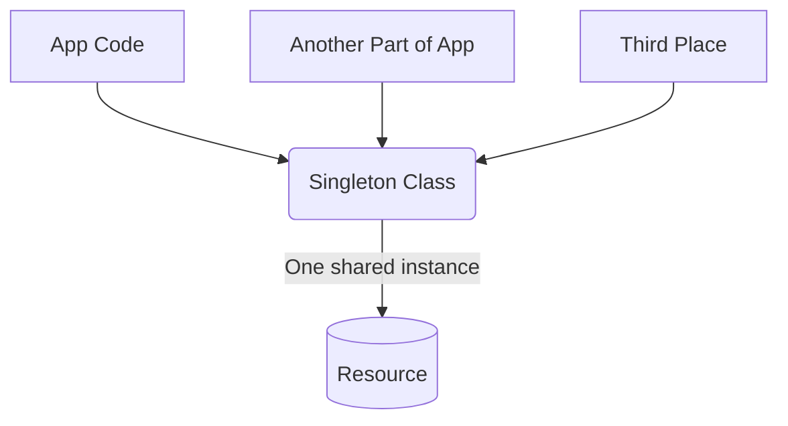

Here's a comprehensive explanation of all the network issues we encountered:

## Network Issues Summary

### 1. **Hardcoded Interface Names: `eth0` vs `ens5`**

**What happened:**
- The NAT instance was configured with hardcoded `eth0` interface name in the iptables rules
- Modern EC2 instances (Amazon Linux 2023) use `ens5` as the primary network interface name
- Older EC2 instances used `eth0` as the network interface name

**Root cause in code:**
```typescript
// In common-resources-stack.ts (original broken version)
natInstanceUserData.addCommands(
    'iptables -t nat -A POSTROUTING -o eth0 -j MASQUERADE',  // ← WRONG!
    'iptables -A FORWARD -i eth0 -o eth0 -m state --state RELATED,ESTABLISHED -j ACCEPT',
    // ...
);
```

**Why this broke NAT:**
- The NAT instance was trying to masquerade traffic through `eth0` (which doesn't exist)
- The actual interface was `ens5`
- Without proper MASQUERADE rules, outbound traffic from Lambda functions wasn't getting source NAT translation
- Result: Lambda functions couldn't establish connections to external APIs

**Fix applied:**
```typescript
// Fixed version - dynamically detects interface
natInstanceUserData.addCommands(
    'PRIMARY_INTERFACE=$(ip route | grep default | awk \'{print $5}\' | head -n1)',
    'iptables -t nat -A POSTROUTING -o $PRIMARY_INTERFACE -j MASQUERADE',
    // ...
);
```

### 2. **Missing Default Routes in Private Subnet Route Tables**

**What happened:**
- Private subnet route tables were missing `0.0.0.0/0` routes pointing to the NAT instance
- Lambda functions in private subnets had no path to reach the internet

**Why routes were missing:**
Looking at lines 156-162 in common-resources-stack.ts:

```typescript
this.vpc.privateSubnets.forEach((subnet, index) => {
    new ec2.CfnRoute(this, `PrivateSubnet${index}ToNatInstanceRoute`, {
        routeTableId: subnet.routeTable.routeTableId,
        destinationCidrBlock: '0.0.0.0/0',
        instanceId: natInstance.instanceId,
    });
});
```

**This CDK code should have created the routes, but it failed because:**

1. **Timing issue**: The NAT instance might not have been fully ready when CDK tried to create the routes
2. **CDK resource dependency**: The route creation might have failed due to improper dependency ordering
3. **AWS API eventual consistency**: Sometimes route creation can fail on first attempt

**Manual fix required:**
```bash
# We had to manually create the missing routes
aws ec2 create-route --route-table-id rtb-06b99a13b5f3d08bd --destination-cidr-block 0.0.0.0/0 --instance-id i-0165387f4a7d691ed
aws ec2 create-route --route-table-id rtb-021da90f287238d0f --destination-cidr-block 0.0.0.0/0 --instance-id i-0165387f4a7d691ed
```

### 3. **Understanding Route Tables and Private Subnets**

**Why do we need multiple route tables?**

1. **Public Subnets** (Route Table 1):
   - `10.0.0.0/16` → `local` (VPC internal traffic)
   - `0.0.0.0/0` → Internet Gateway (direct internet access)

2. **Private Subnets** (Route Tables 2 & 3):
   - `10.0.0.0/16` → `local` (VPC internal traffic)  
   - `0.0.0.0/0` → NAT Instance (internet via NAT)
   - VPC Endpoints routes (for AWS services)

**Why separate route tables?**
- **Security isolation**: Private subnets should never have direct internet access
- **Cost optimization**: VPC endpoints for AWS services avoid internet routing
- **Traffic control**: Different subnets can have different routing policies

**The `0.0.0.0/0` route purpose:**
- This is the "default route" - where to send traffic when no other route matches
- In private subnets, this MUST point to the NAT instance for internet access
- Without this route, Lambda functions can't reach external APIs (Google Maps, etc.)

### 4. **Network Flow Architecture**

**Correct traffic flow:**
```
Lambda (Private Subnet) 
  ↓ 
Route Table: 0.0.0.0/0 → NAT Instance 
  ↓ 
NAT Instance (Public Subnet)
  ↓ 
iptables MASQUERADE on ens5
  ↓ 
Internet Gateway
  ↓ 
Google Maps API
```

**What was broken:**
1. **Missing route**: Lambda → ❌ (no 0.0.0.0/0 route)
2. **Wrong interface**: NAT Instance iptables using `eth0` instead of `ens5`

### 5. **Key Lessons Learned**

1. **Never hardcode network interface names** - Always detect dynamically
2. **CDK route creation can fail** - Have monitoring/alerts for missing routes
3. **Test connectivity end-to-end** - Don't assume CDK deployment means everything works
4. **Use VPC Flow Logs** - Would have helped debug traffic flow issues faster
5. **NAT instance troubleshooting requires SSM** - Direct SSH not available in private setups

### 6. **Prevention for Future**

**Improved CDK code should include:**
```typescript
// Add explicit dependencies
const natInstanceRoute = new ec2.CfnRoute(this, `PrivateSubnet${index}ToNatInstanceRoute`, {
    routeTableId: subnet.routeTable.routeTableId,
    destinationCidrBlock: '0.0.0.0/0',
    instanceId: natInstance.instanceId,
});

// Add custom resource to verify route creation
// Add CloudWatch alarms for NAT instance health
// Add VPC Flow Logs for debugging
```

**Monitoring additions:**
- CloudWatch alarms on NAT instance CPU/Network
- VPC Flow Logs to track rejected connections  
- Lambda custom metrics for API call success rates
- Route table change notifications

This comprehensive network issue stemmed from both **infrastructure configuration** (wrong interface names, missing routes) and **deployment reliability** (CDK not creating routes consistently). The fix required both manual intervention and code improvements for future deployments.


---

MASQUERADE is an iptables target in Linux that performs Network Address Translation (NAT) for outbound connections. Let me explain what it does in the context of your NAT instance:

## What MASQUERADE Does

**MASQUERADE** is a special type of Source NAT (SNAT) that:

1. **Replaces the source IP address** of outgoing packets with the IP address of the outgoing network interface
2. **Automatically detects the interface IP** - unlike SNAT which requires a fixed IP address
3. **Maintains connection state** to properly route return traffic back to the original sender

## In Your NAT Instance Context

Looking at your NAT instance configuration:

```bash
iptables -t nat -A POSTROUTING -o $PRIMARY_INTERFACE -j MASQUERADE
```

Here's what happens step by step:

### 1. **Outbound Traffic Flow**
```
Lambda (10.0.1.50) → wants to reach maps.googleapis.com
   ↓
NAT Instance receives packet: SRC=10.0.1.50, DST=maps.googleapis.com
   ↓
MASQUERADE rule transforms: SRC=35.179.137.252 (NAT public IP), DST=maps.googleapis.com
   ↓
Packet sent to internet with NAT instance's public IP as source
```

### 2. **Return Traffic Flow**
```
maps.googleapis.com responds to 35.179.137.252
   ↓
NAT Instance receives response: SRC=maps.googleapis.com, DST=35.179.137.252
   ↓
NAT table lookup finds original connection: 10.0.1.50 → maps.googleapis.com
   ↓
MASQUERADE reverses transformation: SRC=maps.googleapis.com, DST=10.0.1.50
   ↓
Packet forwarded back to Lambda in private subnet
```

## Why MASQUERADE vs SNAT?

| Aspect | MASQUERADE | SNAT |
|--------|------------|------|
| **IP Detection** | Automatic (uses interface IP) | Manual (requires fixed IP) |
| **Dynamic IPs** | Works with changing IPs | Requires reconfiguration |
| **Performance** | Slightly slower (IP lookup) | Faster (fixed IP) |
| **Use Case** | DHCP, dynamic interfaces | Static IP scenarios |

## Your Specific Implementation

In your CDK user data script:

```typescript
'PRIMARY_INTERFACE=$(ip route | grep default | awk \'{print $5}\' | head -n1)',
'iptables -t nat -A POSTROUTING -o $PRIMARY_INTERFACE -j MASQUERADE'
```

**Why this works perfectly**:
1. **Dynamic Interface Detection**: Automatically finds `ens5` (not hardcoded `eth0`)
2. **Automatic IP Handling**: MASQUERADE uses whatever IP is assigned to `ens5`
3. **Robust for Reboots**: Works even if the interface IP changes

## Connection Tracking

MASQUERADE relies on Linux's **connection tracking** (`conntrack`) to maintain the NAT table:

```bash
# View active NAT connections
sudo cat /proc/net/nf_conntrack | grep ESTABLISHED

# Example entry:
# ipv4 tcp 6 431999 ESTABLISHED src=10.0.1.50 dst=142.250.191.106 sport=45678 dport=443 
# src=142.250.191.106 dst=35.179.137.252 sport=443 dport=45678 [ASSURED] mark=0
```

This shows:
- **Original**: Lambda (10.0.1.50:45678) → Google (142.250.191.106:443)
- **Reply**: Google (142.250.191.106:443) → NAT (35.179.137.252:45678)

## Troubleshooting MASQUERADE

When you run:
```bash
sudo iptables -t nat -L POSTROUTING -n -v
```

You should see something like:
```
Chain POSTROUTING (policy ACCEPT 55 packets, 3956 bytes)
 pkts bytes target     prot opt in     out     source               destination         
   55  3956 MASQUERADE  all  --  *      ens5    0.0.0.0/0            0.0.0.0/0
```

The **increasing packet/byte counts** prove MASQUERADE is actively processing traffic from your private subnet resources.

## Summary

MASQUERADE is the "smart" version of NAT that automatically handles IP address translation without needing to know the exact outgoing IP address, making it perfect for your NAT instance that needs to handle traffic from multiple private subnet resources and route it through a single public interface.


----


Absolutely! Here’s a concise, easy-to-understand blog post about the **Singleton pattern** in software design, using analogies, a comparison table, and a simple diagram for clarity.

---

# What is the Singleton Pattern?

*A Practical Guide for Python and Beyond*

---

## Introduction

The **Singleton pattern** is one of the simplest and most well-known design patterns in software engineering. But despite its simplicity, it’s often misunderstood or misused. So, what is it, when should you use it, and how do you implement it in Python?

---

## What is the Singleton Pattern?

**Singleton** is a *creational* design pattern that ensures a class has only **one instance** and provides a global access point to it.

### **Real-world Analogy**

Think of the **Singleton** like a government issuing a passport.
There is only **one official passport office** for a country, no matter how many times you request it. All citizens go to the same place for their passport needs.

---

## Why Use the Singleton Pattern?

* **Shared resource:** Useful when you need a single point of access for things like logging, configuration, or connection pools.
* **Consistency:** Ensures that all parts of your code use the *same* instance, avoiding confusion or conflict.

---

## Singleton Pattern in Practice

### **Example Use Cases**

* Logging objects (one logger shared across an app)
* Configuration managers
* Database connections (sometimes)

---

## Singleton Pattern vs. Other Patterns

| Pattern       | Number of Instances | Example Use             |
| ------------- | ------------------- | ----------------------- |
| **Singleton** | 1                   | Logger, Config Manager  |
| Factory       | Many                | Object creation logic   |
| Prototype     | Many (clones)       | Copying complex objects |

---

## Diagram



---

## How to Implement a Singleton in Python

There are several ways, but here’s a simple approach using a **class variable**:

```python
class Singleton:
    _instance = None

    def __new__(cls, *args, **kwargs):
        if not cls._instance:
            cls._instance = super().__new__(cls)
        return cls._instance

# Usage:
s1 = Singleton()
s2 = Singleton()
print(s1 is s2)  # Output: True
```

**Note:**
Every time you instantiate `Singleton()`, you actually get the *same* object.

---

## When *Not* to Use Singleton

* If your app might need multiple independent instances (e.g., testing, parallel processes)
* In multi-threaded apps, unless the singleton is made thread-safe
* Overusing singletons can make code harder to test and maintain

---

## Summary

* The **Singleton pattern** ensures a class has only **one instance**.
* It’s useful for global shared resources like loggers or configuration.
* Use it thoughtfully: too many singletons can cause “hidden dependencies” in your codebase.

---

## Further Reading

* [Refactoring Guru: Singleton Pattern](https://refactoring.guru/design-patterns/singleton)
* [Python Docs: Singleton Recipes](https://wiki.python.org/moin/PythonDesignPatterns/SingletonPattern)

---

*If you have questions or want to see more Python-specific examples or anti-patterns, let me know in the comments!*
