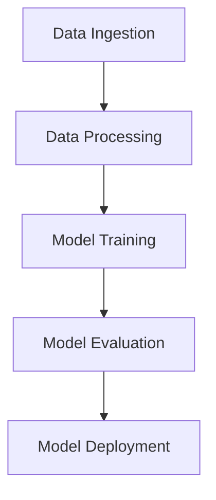
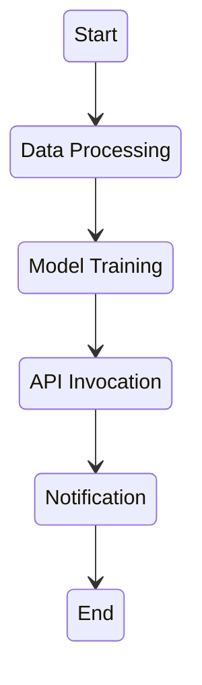

## TO-DO
- Model Monitoring?
- Model Deployment
    - Endpoints: Deploy trained models to fully managed endpoints for real-time predictions.
    - Multi-Model Endpoints: Serve multiple models from a single endpoint, optimizing cost and management overhead.
    - Serverless Inference: Deploy models without managing infrastructure, perfect for intermittent or unpredictable traffic patterns.

## Machine learning workflow

**Purpose:**
- Specifically designed for machine learning (ML) workflows.
- Integrates deeply with SageMaker and other AWS ML services.

**Features:**
- **Built-in ML Components:** Pre-built steps for common ML tasks (e.g., data processing, training, model evaluation).
- **Pipeline Structure:** Define ML workflows using a series of steps, such as data preprocessing, training, and model deployment.
- **Versioning:** Tracks versions of pipelines, steps, and artifacts.
- **Automation:** Automates end-to-end ML workflows, from data ingestion to model deployment.
- **Integration with SageMaker:** Seamless integration with SageMaker's training, tuning, and hosting services.
- **Optimization:** Built to optimize ML-specific tasks, providing easy management and monitoring of ML experiments.

**Example Use Case:**
- Automating the entire ML lifecycle, including data preprocessing, model training, hyperparameter tuning, and deployment within the SageMaker environment.

### AWS Step Functions

**Purpose:**
- General-purpose orchestration service for coordinating the components of distributed applications and microservices.
- Not limited to ML workflows.

**Features:**
- **Flexibility:** Can coordinate any AWS service, custom service, or third-party service.
- **State Machines:** Define workflows as state machines with states like Pass, Fail, Wait, Choice, Parallel, and Map.
- **Error Handling:** Built-in error handling, retry logic, and conditional branching.
- **Integration:** Integrates with a wide range of AWS services, including Lambda, ECS, DynamoDB, SNS, SQS, and more.
- **Visual Workflow:** Provides a visual interface to design and monitor workflows.

**Example Use Case:**
- Orchestrating complex workflows that might include data processing, invoking APIs, managing data pipelines, and integrating multiple AWS services.

### Key Differences

| Feature                     | SageMaker Pipelines                      | AWS Step Functions                        |
|-----------------------------|------------------------------------------|-------------------------------------------|
| **Primary Focus**           | Machine Learning                         | General-purpose workflow orchestration    |
| **Integration**             | Deep integration with SageMaker services | Broad integration across AWS services     |
| **Pre-built Steps**         | ML-specific steps (e.g., training, tuning)| Generic steps for various use cases       |
| **Workflow Definition**     | Step-based ML workflows                  | State machine-based workflows             |
| **Error Handling & Branching**| Basic support                          | Advanced error handling and conditional branching |
| **Versioning**              | Yes, with focus on ML artifacts          | No inherent versioning for workflows      |
| **Use Cases**               | End-to-end ML lifecycle automation       | Orchestration of diverse applications and services |

### Choosing the Right Tool

- **Use SageMaker Pipelines if:**
  - You are focused on building and automating ML workflows.
  - You need tight integration with SageMaker's ML capabilities.
  - You want built-in components for common ML tasks.

- **Use AWS Step Functions if:**
  - You need to orchestrate a variety of AWS services or custom services.
  - Your workflow includes non-ML tasks or services.
  - You require advanced workflow control with error handling and branching.

Both services can be used together in scenarios where you need the specific ML capabilities of SageMaker Pipelines within a broader application workflow managed by Step Functions.

### Example Diagrams

#### SageMaker Pipelines

#### AWS Step Functions

These diagrams illustrate how each tool can be used to define a workflow, with SageMaker Pipelines focused on ML steps and Step Functions providing a more flexible orchestration capability.
