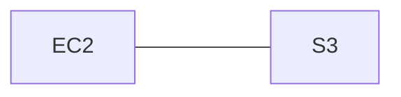

## STS

### How to use STS to decode authorization failure message when making AWS CLI commands?

Use STS `decode-authorization-message`

If a user is not authorized to perform an action that was requested, the request returns a Client.UnauthorizedOperation response (an HTTP 403 response). The message is encoded because the details of the authorization status can constitute privileged information that the user who requested the operation should not see. 

To decode an authorization status message, a user must be granted permissions via an IAM policy to request the `DecodeAuthorizationMessage` (`sts:DecodeAuthorizationMessage`) action.

## AssumeRole

### Cross account sharing (to an AWS account)

To grant cross-account permissions, you need to attach an identity-based permissions policy to an IAM role. For example, the AWS account A administrator can create a role to grant cross-account permissions to AWS account B as follows:

1. The account A administrator creates an IAM role and attaches a permissions policy—that grants permissions on resources in account A—to the role.
2. The account A administrator attaches a trust policy to the role that identifies account B as the **principal** who can assume the role.
3. The account B administrator delegates the permission to assume the role to any users in account B. This allows users in account B to create or access queues in account A.

:::warning
Remember it isn't a service principal, but IAM user principals. For more [details](https://docs.aws.amazon.com/IAM/latest/UserGuide/reference_policies_elements_principal.html).
:::

### External ID for cross-account role assumption (confused deputy prevention)

When you let a **third party** (another company, a SaaS vendor, or a monitoring tool) assume a role in your account, a normal trust policy only checks *who* is assuming the role, not *on whose behalf*. This opens the door to the **confused deputy problem**: the third party is trusted by you, but it also serves other customers, so it could be tricked into using its own role to access a different customer's resources (including yours) if it isn't told which specific external customer's role to assume.

AWS's fix is the `sts:ExternalId` condition key. The account granting access adds a condition on the trust policy that requires the caller to supply a specific, hard-to-guess External ID (usually generated by the third party per customer) when calling `AssumeRole`. The third party stores this ID and sends it back on every assume-role call for that specific customer.

```json
// Trust policy on the role in *your* account, granted to a third-party SaaS vendor
{
  "Version": "2012-10-17",
  "Statement": [
    {
      "Effect": "Allow",
      "Principal": { "AWS": "arn:aws:iam::999999999999:root" },
      "Action": "sts:AssumeRole",
      "Condition": {
        "StringEquals": { "sts:ExternalId": "your-unique-customer-id" }
      }
    }
  ]
}
```

:::danger Exam trap: External ID is for third-party/cross-account SaaS access, not general cross-account roles
You only need the External ID condition when a **third party** assumes a role into your account on behalf of many different customers (the classic confused-deputy scenario). For a simple cross-account role between two accounts you control, External ID isn't required, though it's still a good defense-in-depth practice.
:::

### EC2 assume a role

I'm creating a role named `my-app-role` which contains several policies ,one of them is s3 policy that can access my s3 amazon resource "configuration-for-app" and has an explicit `GetObject` permission. Since the app runs on ec2 - the trusted relations in this requirements between these services would be..


```mermaid
flowchart LR
    EC2 <--- S3
```

My application that runs on ec2 can assume that role (`my-app-role`) and accessing (with the correct policy in it) to s3 and get the configuration file.

```json
// A policy from my-app-role
{
  "Version": "2012-10-17",
  "Statement": [
    {
      "Effect": "Allow",
      "Action": "s3:GetObject",
      "Resource": "arn:aws:s3:::configuration-for-app/*"
    }
  ]
}
```

```json
// trusted policy(resource-based policy) from S3 bucket
{
  "Version": "2012-10-17",
  "Statement": [
    {
      "Sid": "",
      "Effect": "Allow",
      "Principal": {
        "Service": "ec2.amazonaws.com"
      },
      "Action": "sts:AssumeRole"
    }
  ]
}
```
I grant permissions (assume-role of "my-app-role") `<x>` to service **principal** `<y>` (my ec2 principal ( `ec2.amazonaws.com` ) which runs applications) in order to accomplish operation`<z>` (get the s3 configuration file from bucket "configuration-for-app" the role contains this specific s3 policy).
