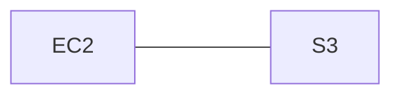

## Cross account sharing (to an AWS account)

To grant cross-account permissions, you need to attach an identity-based permissions policy to an IAM role. For example, the AWS account A administrator can create a role to grant cross-account permissions to AWS account B as follows:

1. The account A administrator creates an IAM role and attaches a permissions policy—that grants permissions on resources in account A—to the role.
2. The account A administrator attaches a trust policy to the role that identifies account B as the **principal** who can assume the role.
3. The account B administrator delegates the permission to assume the role to any users in account B. This allows users in account B to create or access queues in account A.

:::caution
Remember it isn't a service principal, but IAM user principals. For more [details](https://docs.aws.amazon.com/IAM/latest/UserGuide/reference_policies_elements_principal.html).
:::


## EC2 assume a role

I'm creating a role named `my-app-role` which contains several policies ,one of them is s3 policy that can access my s3 amazon resource "configuration-for-app" and has an explicit `GetObject` permission. Since the app runs on ec2 - the trusted relations in this requirements between these services would be..



My application that runs on ec2 can assume that role (`my-app-role`) and accessing (with the correct policy in it) to s3 and get the configuration file.

```json
// A policy from my-app-role
{
  "Version": "2012-10-17",
  "Statement": [
    {
      "Effect": "Allow",
      "Action": "s3:GetObject",
      "Resource": "arn:aws:s3:::configuration-for-app/*"
    }
  ]
}
```

```json
// trusted policy(resource-based policy) from S3 bucket
{
  "Version": "2012-10-17",
  "Statement": [
    {
      "Sid": "",
      "Effect": "Allow",
      "Principal": {
        "Service": "ec2.amazonaws.com"
      },
      "Action": "sts:AssumeRole"
    }
  ]
}
```
I grant permissions (assume-role of "my-app-role") `<x>` to service **principal** `<y>` (my ec2 principal ( `ec2.amazonaws.com` ) which runs applications) in order to accomplish operation`<z>` (get the s3 configuration file from bucket "configuration-for-app" the role contains this specific s3 policy).
