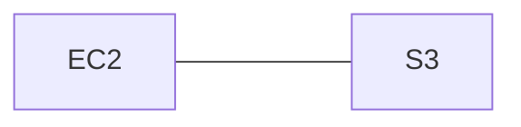

## Cross account sharing (to an AWS service)

You may check the updated blog in this [link](https://aws.amazon.com/premiumsupport/knowledge-center/lambda-function-assume-iam-role/). A Lambda function can assume an IAM role in another AWS account to do either of the following:
- **Access resources**—For example, [accessing an Amazon Simple Storage Service (Amazon S3) bucket](https://aws.amazon.com/premiumsupport/knowledge-center/lambda-execution-role-s3-bucket/) or other services like AWS DynamoDB.
- **Do tasks**—For example, [starting and stopping instances](https://aws.amazon.com/premiumsupport/knowledge-center/start-stop-lambda-eventbridge/).

:::info 
- **Execution role**—The primary role in account A that gives the Lambda function permission to do its work.
- **Assumed role**—A role in account B that the Lambda function in account A assumes to gain access to cross-account resources.
:::

To have your Lambda function assume an [IAM role](https://docs.aws.amazon.com/IAM/latest/UserGuide/id_roles.html) in another AWS account, do the following:

### Step 1 - Home account create a role

Configure the **home account**(111111111111) that hosts Lambda function's **[execution role](https://docs.aws.amazon.com/lambda/latest/dg/lambda-intro-execution-role.html)** to allow the function to assume an IAM role in another AWS account(222222222222).

```json
{
    "Version": "2012-10-17",
    "Statement": {
        "Effect": "Allow",
        "Action": "sts:AssumeRole",
        "Resource": "arn:aws:iam::222222222222:role/role-on-source-account"
    }
}
```

### Step 2 - Modify cross-account IAM role's trust policy

Modify your **cross-account** IAM role's **[trust policy](https://docs.aws.amazon.com/IAM/latest/UserGuide/roles-managingrole-editing-console.html#roles-managingrole_edit-trust-policy)** to allow your Lambda function to assume the role(222222222222).

```json
{
    "Version": "2012-10-17",
    "Statement": [
        {
            "Effect": "Allow",
            "Principal": {
                "AWS": "arn:aws:iam::111111111111:role/my-lambda-execution-role"
            },
            "Action": "sts:AssumeRole"
        }
    ]
}
```
### Step 3 - Use STS to assume the role
3. Add the [AWS Security Token Service (AWS STS) AssumeRole API call](https://docs.aws.amazon.com/STS/latest/APIReference/API_AssumeRole.html) to your Lambda function's code.


## Cross account sharing (to an AWS account)

To grant cross-account permissions, you need to attach an identity-based permissions policy to an IAM role. For example, the AWS account A administrator can create a role to grant cross-account permissions to AWS account B as follows:

1. The account A administrator creates an IAM role and attaches a permissions policy—that grants permissions on resources in account A—to the role.
2. The account A administrator attaches a trust policy to the role that identifies account B as the **principal** who can assume the role.
3. The account B administrator delegates the permission to assume the role to any users in account B. This allows users in account B to create or access queues in account A.

:::caution
Remember it isn't a service principal, but IAM user principals. For more [details](https://docs.aws.amazon.com/IAM/latest/UserGuide/reference_policies_elements_principal.html).
:::


## Example

### Example 1

I'm creating a role named `my-app-role` which contains several policies ,one of them is s3 policy that can access my s3 amazon resource "configuration-for-app" and has an explicit `GetObject` permission. Since the app runs on ec2 - the trusted relations in this requirements between these services would be..



My application that runs on ec2 can assume that role (`my-app-role`) and accessing (with the correct policy in it) to s3 and get the configuration file.

```json
// A policy from my-app-role
{
  "Version": "2012-10-17",
  "Statement": [
    {
      "Effect": "Allow",
      "Action": "s3:GetObject",
      "Resource": "arn:aws:s3:::configuration-for-app/*"
    }
  ]
}
```

```json
// trusted policy(resource-based policy) from S3 bucket
{
  "Version": "2012-10-17",
  "Statement": [
    {
      "Sid": "",
      "Effect": "Allow",
      "Principal": {
        "Service": "ec2.amazonaws.com"
      },
      "Action": "sts:AssumeRole"
    }
  ]
}
```
I grant permissions (assume-role of "my-app-role") `<x>` to service **principal** `<y>` (my ec2 principal ( `ec2.amazonaws.com` ) which runs applications) in order to accomplish operation`<z>` (get the s3 configuration file from bucket "configuration-for-app" the role contains this specific s3 policy).
