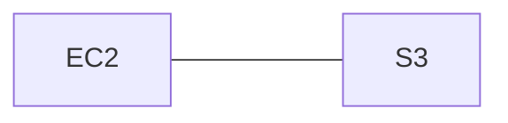

## Managing access to IAM roles

Let's dive into how you can control access to IAM roles by understanding the policy types that you can apply to an IAM role.

There are three circumstances where policies are used for an IAM role:

- Trust policy -- The [trust policy](https://docs.aws.amazon.com/IAM/latest/UserGuide/id_roles_terms-and-concepts.html#term_trust-policy) defines which principals can assume the role, and under which conditions. A trust policy is a specific type of [*resource-based policy*](https://docs.aws.amazon.com/codepipeline/latest/userguide/security_iam_resource-based-policy-examples.html) for IAM roles. The trust policy is the focus of the rest of this blog post. The IAM service supports **only one type of resource-based policy** called a **role trust policy**, which is attached to an IAM role.
- Identity-based policies ([inline and managed](https://docs.aws.amazon.com/IAM/latest/UserGuide/access_policies_managed-vs-inline.html)) -- These policies define the permissions that the user of the role is able to perform (or is [denied from performing](https://docs.aws.amazon.com/IAM/latest/UserGuide/reference_policies_evaluation-logic.html#AccessPolicyLanguage_Interplay)), and on which resources.
- Permissions boundary -- A [permissions boundary](https://docs.aws.amazon.com/IAM/latest/UserGuide/access_policies_boundaries.html) is an advanced feature for using a managed policy to set the maximum permissions for a role. A principal's permissions boundary allows it to perform only the actions that are allowed by both its identity-based permissions policies and its permissions boundaries. You can use permissions boundaries to [delegate permissions management tasks, such as IAM role creation, to non-administrators](https://aws.amazon.com/blogs/security/how-to-let-builders-create-iam-resources-while-improving-security-and-agility-for-your-organization/) so that they can create roles in self-service.

## IAM role vs IAM user


Source: [A foolproof guide to AWS IAM Roles](https://www.archerimagine.com/articles/aws/aws-iam-roles.html)

IAM roles are used for three main purposes: 
- One AWS service using another service, like EC2 instance accessing S3, 
- Non-AWS users needing temporary access to AWS resources in a hybrid environment,
- Developers needing cross-account access to resources. 

IAM roles act like "**hats**" granting permissions when worn and reverting to the original state when removed. An example can be - An EC2 instances should use IAM roles instead of storing IAM user credentials. A role can be attached during instance creation but not after. Only one IAM role can be attached to an EC2 instance at a time.

To simplify, use IAM roles for resources and temporary access by physical users, while IAM users are for permanent user accounts. IAM roles and IAM users serve different purposes in managing access and permissions in AWS.

## Identity vs Resource-based AWS IAM Policies

> Reference: [Identity vs Resource-based AWS IAM Policies](https://sonalake.com/latest/identity-vs-resource-based-aws-iam-policies/)


IAM Roles and Resource Based Policies are two different approaches for granting access to AWS resources across different accounts.

IAM Roles involve assigning permissions to a role in one account that can be assumed by a user or service in another account. By assuming the role, the user or service inherits the permissions associated with that role, but they relinquish their original permissions. This means they can perform actions allowed by the role but cannot use their own permissions.

Resource Based Policies, on the other hand, are attached directly to the AWS resource itself, such as an S3 bucket. These policies define the permissions for specific principals, allowing them to access the resource without assuming a role. The principal retains their original permissions and can access the resource using the resource-based policy.

When there is a need for a user in Account A to scan a DynamoDB table in Account A and write to an S3 bucket in Account B, **using a resource-based policy is preferred**. This avoids the need to assume a role and allows the user to perform both actions without giving up their original permissions.

Resource-based policies are supported by various AWS services and resources, including Amazon S3 buckets, SNS topics, SQS topics, Lambda functions, and more. *Their support of Resource-based policies continues to expand over time*.


### Identity-based Policies

Identity-based policies grant permissions to an identity. An identity-based policy dictates whether an identity to which this policy is attached is allowed to make API calls to particular AWS resources or not. For example, the following policy would allow a user to invoke any Get or List request on any S3 resource.


### Resource-based Policies

Resource-based policies grant permissions to the principal (可以係user / [service - 如果係service 既話就叫service-based principal) that is specified in the policy. They specify who or what can invoke an API from a resource to which the policy is attached.

For example, the policy below specifies that S3 events on the bucket arn:aws:s3:::test-bucket-cezary can be handled by the Lambda (lambda-s3) in account id 1234567890 in eu-west-1 region.


In this case, the principal is "a caller" who can invoke a particular action on the specific resource arn:aws:s3:::test-bucket-cezary.

### Identity vs Resource-based policy in eventBridge

When using Amazon EventBridge, there are two types of targets: 
- those that support **resource-based policies** (such as Lambda, SNS, SQS, CloudWatch Logs, API Gateway)
- those that require **an IAM role** (e.g., Kinesis data streams or Systems Manager Run Command). 

For resource-based policy targets, you should modify the target resource to allow the EventBridge rule the necessary permissions. For IAM role targets, the IAM role is attached to the EventBridge rule and grants permissions to perform actions like writing to Kinesis. 

As of July 2023, SNS, SQS, Lambda utilize resource-based policies while Kinesis data streams use IAM roles.


## Trusted Entity from Trust policy

> TL;DR - Think of aws "trusted relations" / "trusted entities" as which aws service principal can implement (assume role) the permissions you giving.

A Trusted Entity is an object from outside of your AWS Account which is allowed to gain access to a resource within your account – in our case that resource will be an IAM role, which will in turn grant them permissions within the account.

Depending on the duties of the user(s) you’ll be granting access to, you may want to have multiple IAM roles with specific and granular access configured for each. The first step in creating a new IAM Role is to select what type of trusted entity will be using the role – either an AWS Service, Another AWS Account, a Web Identity, or SAML federation.

### Example 1

I'm creating a role named `my-app-role` which contains several policies ,one of them is s3 policy that can access my s3 amazon resource "configuration-for-app" and has an explicit `GetObject` permission. Since the app runs on ec2 - the trusted relations in this requirements between these services would be..



My application that runs on ec2 can assume that role (`my-app-role`) and accessing (with the correct policy in it) to s3 and get the configuration file.

```
// A policy from my-app-role
{
  "Version": "2012-10-17",
  "Statement": [
    {
      "Effect": "Allow",
      "Action": "s3:GetObject",
      "Resource": "arn:aws:s3:::configuration-for-app/*"
    }
  ]
}

```

```
// trusted policy(resource-based policy) from S3 bucket
    {
  "Version": "2012-10-17",
  "Statement": [
    {
      "Sid": "",
      "Effect": "Allow",
      "Principal": {
        "Service": "ec2.amazonaws.com"
      },
      "Action": "sts:AssumeRole"
    }
  ]
}
```
I grant permissions (assume-role of "my-app-role") `<x>` to service **principal** `<y>` (my ec2 principal ( `ec2.amazonaws.com` ) which runs applications) in order to accomplish operation`<z>` (get the s3 configuration file from bucket "configuration-for-app" the role contains this specific s3 policy).


### Example 2

Consider a scenario where a sizable team consists of developers and testers. In the Development account, there are two IAM groups: Developers and Testers. Both groups have the necessary permissions to operate within the development account and access its resources. Occasionally, a developer needs to make updates to the active S3 Bucket located in the production account. 

How will you configure the permissions for developers to access the production environment?

**Answer:** To enable developers to update the live S3 buckets in the production account while restricting access for testers, follow these steps:

1. Create a Role in the production account, designating the Development account as a trusted entity.
2. Define a permissions policy for the Role that grants trusted users the necessary access to update the bucket.
3. Modify the IAM group policy in the Development account to deny access to the newly created Role specifically for testers.
4. Developers can utilize the newly created Role to access the live S3 buckets within the production environment, leveraging the defined permissions.