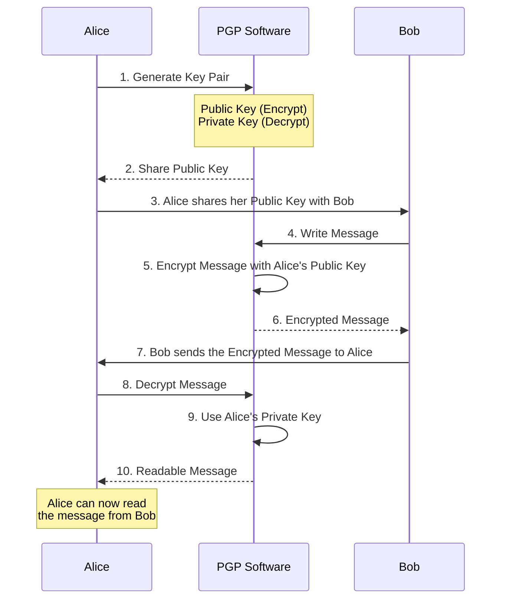

**PGP**, originally created by Phil Zimmermann in 1991, is a data encryption and decryption program that provides cryptographic privacy and authentication for data communication. PGP is often used for securing email communication, but it can also encrypt any sort of files, directories, and disk partitions.

**GPG** is a freely available implementation of the OpenPGP standard as defined by RFC4880 (also called PGP). It was developed by the GNU Project and is often referred to as the free and open-source counterpart to the original PGP. GPG allows users to encrypt and sign their data and communications.

GPG includes the same basic capabilities as PGP, such as:

- **Key pair generation**: Creating a pair of keys for each user, consisting of a public key (which can be shared) and a private key (which must remain confidential).
- **Data encryption**: Using public keys to encrypt data intended for a specific recipient.
- **Data decryption**: Using the corresponding private keys to decrypt received data.
- **Signing**: Using a private key to sign data, making it possible for recipients to verify the sender's identity.
- **Signature verification**: Checking the signature against the sender's public key to ensure that the data hasn't been altered and that the claimed sender is genuine.

:::infoComparison and Interoperability
GPG is fully compatible with the OpenPGP standard, which means that it can interoperate with PGP and other OpenPGP-compliant systems. Essentially, GPG can be used as a drop-in replacement for PGP, but it is available under a free software license (the GNU General Public License), whereas PGP includes proprietary elements.

Although they work in much the same way and the terms are sometimes used interchangeably, PGP typically refers to the specific software initially created by Zimmermann, while GPG refers to the free software community's version of the protocol.
:::

## GNU Privacy Guard tool (Symmetric)

Gnu Privacy Guard (or GnuPG) is the evolution of the earlier encryption standard known as Pretty Good Privacy (or PGP). GPG can use both symmetric and asymmetric encryption to encrypt, decrypt, and sign messages or data using *public* and *private* keys.

The GPG utility has a lot of options, but fortunately for us, encrypting and decrypting are easy to do and only require that you know three options for quick use: Create or encrypt with a **symmetric** cipher (`-c`), decrypt (`-d`), and extract and decrypt (no option).

### Encrypting a file

```
$ echo This is an encryption test > file1.txt

$ gpg -c file1.txt

 lqqqqqqqqqqqqqqqqqqqqqqqqqqqqqqqqqqqqqqqqqqqqqqqqqqqqqqk
 x Enter passphrase                                     x
 x                                                      x
 x                                                      x
 x Passphrase: ***********_____________________________ x
 x                                                      x
 x       <OK>                              <Cancel>     x
 mqqqqqqqqqqqqqqqqqqqqqqqqqqqqqqqqqqqqqqqqqqqqqqqqqqqqqqj

 lqqqqqqqqqqqqqqqqqqqqqqqqqqqqqqqqqqqqqqqqqqqqqqqqqqqqqqk
 x Please re-enter this passphrase                      x
 x                                                      x
 x Passphrase: ***********_____________________________ x
 x                                                      x
 x       <OK>                              <Cancel>     x
 mqqqqqqqqqqqqqqqqqqqqqqqqqqqqqqqqqqqqqqqqqqqqqqqqqqqqqqj

$ ls

file1.txt file1.txt.gpg
```

Encrypting a file with gpg leaves the original file intact, `file1.txt`, and adds the telltale `.gpg` extension to the newly encrypted file. You should probably remove the original file, `file1.txt`, so that the encrypted one is the sole source of the information contained in it. Alternatively, if you're going to share the encrypted version, you can rename it before sharing.

Also, the `.gpg` extension isn't required, but it does let the user know which decryption tool to use to read the file. You can rename the file to anything you want.

```
$ file file2.txt.gpg
file2.txt.gpg: GPG symmetrically encrypted data (AES cipher)

$ cat file2.txt.gpg 
�       �����y���S<��L��|���͊��v�"N>�M�1Z;��(���B���q�$�F���
o�xs���k%  

$ mv file2.txt.gpg testfile01.doc
$ file testfile01.doc
testfile01.doc: GPG symmetrically encrypted data (AES cipher)
```

### Decrypting a file

:::infoDecrypt within 10mins
Note that there is no passphrase prompt to decrypt the file within 10 mins after en encryption. If you want to be prompted to enter the password to decrypt the file again, you'll have to wait ten minutes, which is the default timeout value.
:::

```
$ ls
cfile.txt.gpg

$ gpg cfile.txt.gpg 
< Passphrase prompt >
gpg: WARNING: no command supplied.  Trying to guess what you mean ...
gpg: AES encrypted data
gpg: encrypted with 1 passphrase

$ ls
cfile.txt  cfile.txt.gpg
```

## Keyservers (Asymmetric)

:::infoA List of Keyservers
- [https://keybase.io](https://keybase.io/) (Originally created my PGP key here)
- [https://keys.openpgp.org](https://keys.openpgp.org/)
- [https://keyserver.ubuntu.com](https://keyserver.ubuntu.com/)
- [http://keys.gnupg.net](http://keys.gnupg.net/)
- [https://pgp.mit.edu](https://pgp.mit.edu/)
- [https://keyoxide.org](https://keyoxide.org/)
:::

A PGP keyserver is a server that stores and indexes PGP (Pretty Good Privacy) public keys, allowing users to easily search for and exchange them. Keyservers are an essential part of the **web of trust** in PGP, enabling users to establish connections with others and verify identities without having to exchange public keys through insecure channels.

### Without a Keyserver

Best way to distribute your key is by using one of the key servers that are available, but you can also share your public key directly(eg. via Whatsapp, or Facebook, etc) like the below diagram.



### How a Keyserver Works

Think of a PGP keyserver like a phone book:
- **Public PGP Keys**: similar to phone numbers, they are meant to be shared and are how you send encrypted messages to someone.
- **Keyserver**: acts like the phone book itself, an index of these public keys.

If you plan to send a secure message to someone who uses public key cryptography like PGP, you need to know what key to use to encrypt your message. **Public key servers act as a phonebook for such keys, allowing a person to use an email address, name, or key fingerprint to search for a full key and download it**. There are many PGP public key servers, but they usually share their key collections with each other. Keyservers can't verify whether the keys they publish are genuine or forgeries. Anyone can upload a key to a public key server—in anyone's name. That means that a key connected to a person's name or email on a keyserver might not be their real key. 

**In order to check the authenticity of a key, you need to check its signatures, or confirm its fingerprint with the original user in a trustworthy way.**

### Verify a public key 

#### Finger print

:::info Fingerprint
Public key cryptography uses large numbers as keys, sometimes with thousands of digits. To avoid the impracticality of sharing such long keys, fingerprints—shorter combinations of numbers and letters—are used as unique identifiers for the keys. By comparing these fingerprints, individuals can ensure they have the correct keys without needing to exchange the entire key. 

Typically, fingerprints consist of around 40 characters and are used for verification to prevent impersonation or interception of communication. While some software may offer alternative verification methods, some form of verification is necessary to protect against unauthorized access to communications.

```
$ ssh-keygen -lf ~/.ssh/id_rsa.pub
2048 00:11:22:33:44:55:66:77:88:99:aa:bb:cc:dd:ee:ff /Users/username/.ssh/id_rsa.pub (RSA)
```

The first part (`2048`) is the key length in bits, second part (`00:11:22:33:44:55:66:77:88:99:aa:bb:cc:dd:ee:ff`) is the fingerprint of the public key and the third part is location of the public key file itself.
:::


A public key can be verified if it is not signed with your private key by using a technique called "key fingerprinting". This involves obtaining a unique identifier of the public key, called a "fingerprint", and comparing it to a known, verified fingerprint. Here are the steps to verify a public key using key fingerprinting:

1.  Obtain the public key: The first step is to obtain the public key that you want to verify. This can be done by downloading it from a website or receiving it via email or other means.
2.  Generate the key fingerprint: The next step is to generate the key fingerprint. This can be done using a command-line tool such as "ssh-keygen" on Linux and MacOS or "puttygen" on Windows. The command will generate a unique identifier of the public key, which is the key fingerprint.
3.  Compare the key fingerprint: Compare the key fingerprint that you have generated to the one that was provided by the key's owner or a known trusted source. This can be done by comparing the fingerprints visually or by using a command-line tool to compare the fingerprints.
4.  Confirm the key's authenticity: If the key fingerprint matches the one provided by the key's owner or a trusted source, you can confirm that the key is authentic.

It's important to note that this method of verifying a public key is not foolproof, and an attacker with access to the key's fingerprint could still use a compromised key. Therefore it's always recommended to check for the authenticity of the key's fingerprint from multiple sources and also to verify the authenticity of the key's fingerprint through an additional secure communication channel, such as a phone call or face-to-face conversation.

#### Web of trust model

> TL;DR - In a Web of Trust is a decentralized trust model which everybody is a CA unlike the PKI model, there is always CAs trusted that vouches for you. Every user signs certificates for whoever he wants.

Another method to verify a public key is through the web of trust model, which is a network of trust relationships that can be established between public keys. In this method, public keys are signed by other trusted individuals, and these signatures can be used to verify the authenticity of a public key. This method is often used in the context of PGP (Pretty Good Privacy) encryption, where a user's public key is signed by other trusted individuals to establish a web of trust.

It's also worth noting that, in some scenarios, it's possible to use a certificate authority (CA) to verify the authenticity of a public key. A CA is a trusted third-party entity that issues digital certificates, which can be used to verify the authenticity of a public key.

In summary, verifying a public key can be done through key fingerprinting and comparing it to a known, verified fingerprint, through the web of trust model, where the public key is signed by other trusted individuals, or through a certificate authority. It's important to use multiple methods and sources to ensure the authenticity of the key.

### How to use it

The `gpg --keyserver` option is part of the GnuPG (GPG) suite, a free implementation of the OpenPGP standard. Here's how it typically works:

1. **Search for a Key**: To look up someone's public key.
   ```
   gpg --keyserver [keyserver_address] --search-keys [email/userID]
   ```
   `[keyserver_address]` is the URL of the keyserver. `[email/userID]` is the identifier of the public key you desire.

2. **Receive a Key**: To import someone's public key to your GPG keyring.
   ```
   gpg --keyserver [keyserver_address] --recv-keys [keyID]
   ```
   `[keyID]` is the unique identifier associated with the key you want to import.

3. **Send Your Key**: To upload your public key to a keyserver for others to find and use.
   ```
   gpg --keyserver [keyserver_address] --send-keys [yourKeyID]
   ```

4. **Refresh Your Keys**: Update all keys from a keyserver to receive any changes.
   ```
   gpg --keyserver [keyserver_address] --refresh-keys
   ```

### Important Considerations

:::dangerOnly use a keyserver that you trust
It's important to use a keyserver that you trust since keyservers can contain spam or false keys. Sometimes, keyservers synchronize with one another, spreading any changes globally.

Future reading: [Receiving a key from a keyserver in gnupg](https://superuser.com/questions/931812/receiving-a-key-from-a-keyserver-in-gnupg)
:::

- **Privacy**: When you upload a key, it becomes public, and email associated with the key can be harvested by spammers.
- **Verification**: Always verify keys through a trusted channel before using them.
- **Revocation**: If you lose access to your private key,