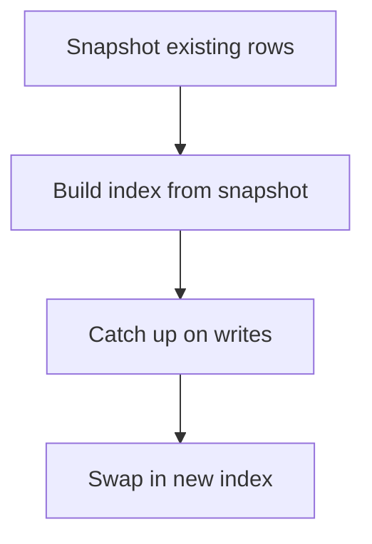

When you run your database–initialization script (for example, `scripts/init_langgraph_db.py`) to bootstrap a PostgreSQL schema from Python—loading your `.env`, opening a `psycopg_pool.AsyncConnectionPool`, and executing DDL migrations—you might hit:

```text
psycopg.errors.ActiveSqlTransaction: CREATE INDEX CONCURRENTLY cannot run inside a transaction block
```

In this post you’ll see:

- A quick refresher on what a transaction block is  
- Why `CREATE INDEX CONCURRENTLY` must run outside such a block  
- The one-line tweak (enabling autocommit) that makes your init script run smoothly every time  


:::info TL;DR
- psycopg_pool’s default `autocommit=False` means you’re always in one big transaction block.  
- `CREATE INDEX CONCURRENTLY` must run **outside** that block.  
- Fix it by passing `kwargs={"autocommit": True}` when creating your `AsyncConnectionPool`.  
:::


## Dealing with `CREATE INDEX CONCURRENTLY` in Python + psycopg_pool

**Scenario**  
Your `init_langgraph_db.py` script:

- Loads environment variables  
- Opens a `psycopg_pool.AsyncConnectionPool`  
- Runs DDL statements (tables, constraints, indexes)  

When it reaches a concurrent index, PostgreSQL refuses:

```text
psycopg.errors.ActiveSqlTransaction: CREATE INDEX CONCURRENTLY cannot run inside a transaction block
```

## Why `CREATE INDEX CONCURRENTLY` Fails
`CREATE INDEX CONCURRENTLY` builds an index **without locking out writes**. Internally it must:
1. Snapshot existing rows  
2. Build the index in batches  
3. Catch up on writes that occurred during the build  
4. Swap in the new index atomically  

Because it manages its own sub-transactions, PostgreSQL forbids wrapping it in your own block:

> **ERROR:** CREATE INDEX CONCURRENTLY cannot run inside a transaction block



:::info What’s a Transaction Block?
A **transaction block** is any set of SQL statements between:
- **BEGIN** (implicitly at the first statement when autocommit=False, or explicitly)
- **COMMIT** (persist) or **ROLLBACK** (undo)

This grouping provides the ACID guarantees—atomicity, consistency, isolation, and durability.
:::

:::info Psycopg3 / psycopg_pool Default
By default, Psycopg3 (and thus `psycopg_pool`) uses **autocommit=False**. That means:
- The first SQL statement implicitly starts a transaction block.  
- All subsequent statements remain inside that block until `conn.commit()` or connection close.
:::

## Relation to the `CREATE INDEX CONCURRENTLY` Error
Some PostgreSQL commands—like `CREATE INDEX CONCURRENTLY`—are designed to build indexes without locking out writes for extended periods. To achieve this, they must run **outside** the strict isolation of a normal transaction block. PostgreSQL enforces this by prohibiting such commands inside an explicit `BEGIN...COMMIT/ROLLBACK` block.

Enabling `autocommit=True` makes each SQL statement a standalone mini-transaction, committed immediately. That prevents grouping your DDL in one long block and allows `CONCURRENTLY` to run successfully.

## Full Example with Fix
```python
from psycopg_pool import AsyncConnectionPool
from langgraph.checkpoint.postgres.aio import AsyncPostgresSaver
import os, sys, logging
from dotenv import load_dotenv

logger = logging.getLogger(__name__)

async def main():
    # Load .env
    load_dotenv(os.path.join(os.path.dirname(__file__), '..', '.env'))
    db_uri = os.environ.get("POSTGRES_DB_URI")
    if not db_uri:
        logger.error("POSTGRES_DB_URI not set.")
        sys.exit(1)

    # Create pool with autocommit enabled (default is False!)
    pool = AsyncConnectionPool(
        conninfo=db_uri,
        min_size=1, max_size=1, open=True,
        kwargs={"autocommit": True}, # ← default is False!
    )

    try:
        checkpointer = AsyncPostgresSaver(pool)
        await checkpointer.setup()
        logger.info("LangGraph DB setup successfully.")
    except Exception:
        logger.exception("Error during DB setup")
        sys.exit(1)
    finally:
        await pool.close()
```

## Why This Doesn’t Violate ACID
| Property    | How `CONCURRENTLY` Still Upholds It                              |
|-------------|------------------------------------------------------------------|
| Atomicity   | If the build fails, it rolls back completely—no half-built index |
| Consistency | Index only appears when fully valid                              |
| Isolation   | No partial or invalid index visible to users                     |
| Durability  | Once built, it survives crashes                                  |

`CREATE INDEX CONCURRENTLY` scopes its own internal mini-transactions to ensure **availability** and **minimal locking**—all while respecting ACID under the hood.

