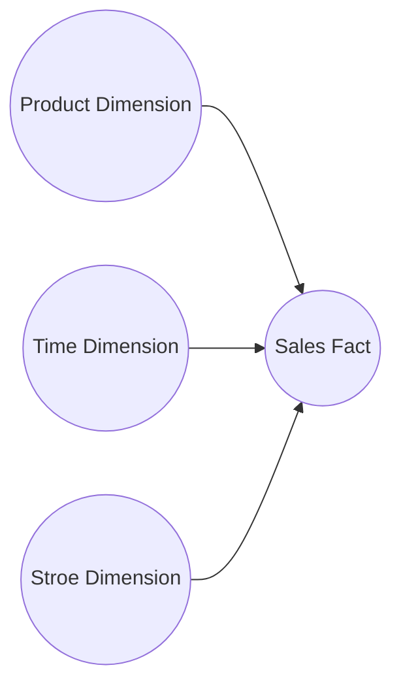

## Data model structures

## Levels of data modeling

In data modeling, there are typically three levels of data abstraction, known as the three-schema architecture. Each level represents a different perspective of the data and serves a specific purpose in the data modeling process. 

The **conceptual data model (CDM)** resides at the top, providing a satellite view of the business solution. Also, the CDM gives a context and scope to the **logical data model (LDM)**, which produces a detailed business solution. The LDM is the starting point for applying the influence of technology in the physical data model. 

|            | Audience                           | Purpose                                                    |
|------------|------------------------------------|------------------------------------------------------------|
| Conceptual | Business Stakeholders              | Communication & definition of business terms & rules       |
| Logical    | Data architecture/Business Analyst | Clarification & Detail of business rules & data structures |
| Physical   | DBAs/Developers                    | Technical implementation on a physical DB                  |

### Conceptual Data Model / Logical View

- **Conceptual data modeling** tries to answer the following questions:
    - What problems are involved with the business and require immediate solutions?
    - What are the core concepts of these problems?
    - How are these problems related to one another?
    - Is there any scope of the effort? What is the scope in relation to the effort made?
- Conceptual data modeling focuses on the high-level, abstract representation of the data, defining the relationships between major entities and the overall data model.
- It helps to determine the scope and direction of the application under consideration. In addition, it helps to create a preliminary analysis and definitions of key terms. The conceptual model comprises the most important concepts of the project and requirements that each of those concepts can be defined, and documented. 
- This level is designed to be independent of any specific database management system (DBMS) and is concerned with capturing the essential business entities and their relationships.

### Logical Data Model / User View

Source: [What is a Logical Data Model?](https://www.tibco.com/reference-center/what-is-a-logical-data-model)

- At this modeling level, we try to answer the following questions:
    - What should the collection look like?
    - How can we make information secure?
    - How should we store history information?
    - How can we answer business questions in a shorter amount of time?
    - What is the optimal way to perform sharding?
- An LDM is utilized as the initial step of the physical data model. The LDM consists of the detailed structures of a system. In addition, the LDM depicts the detailed relationships between the structures. An LDM can be described as detailed if it contains all of the essential entities, attributes, and key groups, and the relationships they have with one another.
- It defines how individual applications or users perceive the data and the specific data elements they need to access.
- This level does not rely on the types of DBMSs used. So, the models should look the same regardless of the type of DBMS system, such as MongoDB, Oracle, and so on.

The LDM provides great mapping, in the case of multiple technologies. The LDM will explain one technology-independent perspective, and then we can map this business perspective to each of the various technology perspectives. Logical data modeling involves completing four steps, including filling in the CDM, normalizing and abstracting the model, determining the most useful form, and finally reviewing and confirming the logical model. The most common features of a logical model involve the following:

- All entities and relationships among the model are given
- All attributes are specified for each entity
- The primary key is specified for each entity
- Foreign keys are specified
- Normalization occurs at this level

### Physical data modeling / Physical View

Source: [What is Data Modelling? Types (Conceptual, Logical, Physical)](https://www.guru99.com/data-modelling-conceptual-logical.html)

- It is the **physical level** to answer - the how of the system will be implemented using a specific DBMS system:
- The Internal Schema represents the physical storage and implementation details of the database on a specific DBMS or hardware platform.
- Physical data modeling contains all table structures, including column names, column data types, primary keys, column constraints, and the relationship between tables.
- This level is concerned with optimizing performance and storage efficiency.

The three-schema architecture provides a clear separation of concerns between users' views, logical data organization, and physical storage implementation, enabling data modeling to be more organized, flexible, and maintainable. It also allows changes at one level without affecting the other levels, providing a higher degree of data independence and adaptability.

### Summary

The following table compares the different types of modeling and feature sets included in different types of modeling:

| Question                                         | Conceptual Model | Logical Model | Physical Model                 |
| ------------------------------------------------ | ---------------- | ------------- | ---------------------------- |
| Are there entities and relationships?            | Yes              | Yes           | NA                           |
| Are attributes Mentioned?                        | Yes              | Yes           | NA                           |
| Are primary keys and foreign keys specified?     | No               | Yan           | Yes R                        |
| Are there table names?                           | NA               | NA            | Yes                          |
| ieee ae names and data types                     | NA               | NA            | Yes                          |
| Is it database dependent?                        | No               | No            | Yes                          |
| Are other database objects like views specified? | No               | No            | Yes                          |
| What kind of users is it targeted?               | Business         | Business      | More technical less business |

## Types of data model

You should now understand that data models are very important in the construction of a real database. Most DBMS are constructed in a structural fashion. These models can be categorized into different types, based on their structures. Different models apply to different stages of the database design process.
- **Hierarchical Data Model**: This model organizes data in a tree-like structure with a single root, and each parent node can have multiple child nodes. It was popular in early database systems and is not widely used today.
- **Network Data Model**: Similar to the hierarchical model, this model allows nodes to have multiple parent and child nodes, creating a more complex interconnected structure. It was an improvement over the hierarchical model but is also not commonly used anymore.
- **Relational Data Model**: This is one of the most widely used data models. It represents data as tables with rows and columns, where each table represents an entity and relationships between entities are established through keys.
- **Entity-Relationship (ER) Model**: A high-level data model that uses entities (objects) and their relationships to represent data. It's often used to design relational databases before implementation.
- **Object-Oriented Data Model**: This model extends the concepts of object-oriented programming to data. It represents data as objects with attributes and methods, and supports concepts like inheritance, encapsulation, and polymorphism.
- **Document Data Model**: Used in NoSQL databases, this model represents data as flexible, self-contained documents (e.g., JSON or XML) with varying structures, making it suitable for handling unstructured or semi-structured data.
- **Key-Value Data Model**: Also used in NoSQL databases, this model stores data as key-value pairs, where each key is unique and corresponds to a value (often in the form of a document or object).
- **Graph Data Model**: Ideal for representing complex relationships, this model uses nodes to represent entities and edges to represent relationships between entities. It's used in graph databases to model and query highly interconnected data.
- **Dimensional Data Model**: Primarily used in data warehousing and business intelligence, this model organizes data into dimensions and facts, facilitating efficient querying and reporting.
- **Multidimensional Data Model**: Suited for analytical processing, this model organizes data into multiple dimensions (e.g., time, geography) to provide deeper insights and analysis.

These are just a few examples of data models, and some models can be further categorized or combined based on specific use cases or requirements. The choice of data model depends on factors such as the nature of the data, the application's needs, and the scalability and performance requirements.

---

## Tojot - After 5

## Data Modelling Techniques (Add this to Types of data model)

Data modeling is a technique used to create a conceptual representation of data and its relationships within a system. It involves defining the structure, attributes, constraints, and interdependencies of data elements to provide a clear and organized view of how data is organized and used in an organization or application.

The main two types of Data Modeling Techniques are Entity Relationship (E-R) Model and UML (Unified Modelling Language).

### ERD

Used for modeling relational databases, ER diagrams represent entities, attributes, and relationships between objects. They are suitable for visualizing database schemas and top-level data views.

### UML - Class diagram

Derived from the Unified Modeling Language, these diagrams are mainly used for object-oriented programming and represent classes, attributes, methods, and various types of relationships between objects.

### Others

#### Data Dictionary

A tabular representation of data assets, the data dictionary includes lists of tables and their attributes, providing a detailed specification of data assets and can be used in conjunction with ER diagrams for comprehensive data modeling.

## Check

- data modeling techniques graph
- lucene vs elasticsearch