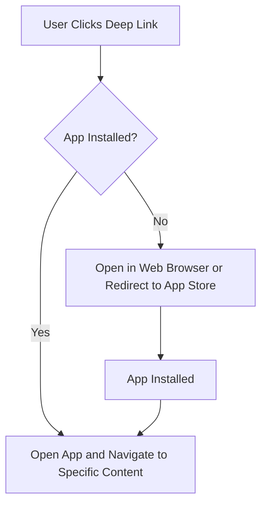

## What is Deep Linking?

Deep linking is a method that allows developers to direct users to specific content within an app, rather than just opening the app's home page. This technique enhances user experience by providing a seamless transition from web to app and within different parts of the app itself.

## Types of Deep Links


1. **Traditional Deep Links (URL Schemes)**:
    - **URL Scheme**: Custom protocols defined by an app to handle specific links.
        - Example: `whatsapp://send?text=Hello`
        - Pros: Simple to implement.
        - Cons: Limited to apps installed on the device. If the app is not installed, the link fails.
            - On some systems, nothing happens, and the screen may appear to be unresponsive.
            - On others, an error message might be shown, indicating that the link could not be opened.
            - Generally, there is no automatic redirection to the App Store or Play Store. The user needs to manually install the app.
        - Use Case: Often used for app-to-app communication.
2. **Universal Links (iOS) and App Links (Android)**:
    - **HTTP(S) Links**: Standard web links that direct users to specific content within the app if installed, or to a webpage if not.
        - Example: `https://www.example.com/product/12345`
        - Pros: Seamless fallback to web if the app is not installed.
        - Cons: Slightly more complex to implement.
        - Use Case: Marketing campaigns, emails, social media, etc.

## Implementation Details

### iOS Universal Links

1. **Create and Host the `apple-app-site-association` File**:
    - This JSON file must be placed at the root of your website or in the `.well-known` directory.
    - Example content:
    ```json
    {
      "applinks": {
        "apps": [],
        "details": [
          {
            "appID": "TEAMID.com.example.app",
            "paths": ["/products/*"]
          }
        ]
      }
    }
    ```
    - This file tells iOS which URLs your app can handle.

2. **Configure App Capabilities**:
    - In Xcode, enable the "Associated Domains" capability.
    - Add your domain with the `applinks:` prefix, e.g., `applinks:yourdomain.com`.

3. **Handle Universal Links in Your App**:
    - Implement the `application(_:continue:restorationHandler:)` method in your app delegate to handle incoming links.
    ```swift
    func application(_ application: UIApplication, continue userActivity: NSUserActivity, restorationHandler: @escaping ([UIUserActivityRestoring]?) -> Void) -> Bool {
        if userActivity.activityType == NSUserActivityTypeBrowsingWeb, let url = userActivity.webpageURL {
            // Handle the URL
            print("URL received: \(url)")
        }
        return true
    }
    ```

### Android App Links

1. **Create and Host the `assetlinks.json` File**:
    - This JSON file must be placed in the `.well-known` directory of your website.
    - Example content:
    ```json
    [
      {
        "relation": ["delegate_permission/common.handle_all_urls"],
        "target": {
          "namespace": "android_app",
          "package_name": "com.example.app",
          "sha256_cert_fingerprints": ["YOUR_APP_SIGNATURE"]
        }
      }
    ]
    ```
    - This file verifies that your app is authorized to handle the specified URLs.

2. **Configure the Android Manifest**:
    - Add intent filters to handle the links in your `AndroidManifest.xml`.
    ```xml
    <activity>
        <intent-filter android:autoVerify="true">
            <action android:name="android.intent.action.VIEW" />
            <category android:name="android.intent.category.DEFAULT" />
            <category android:name="android.intent.category.BROWSABLE" />
            <data android:scheme="https" android:host="yourdomain.com" android:pathPrefix="/products/" />
        </intent-filter>
    </activity>
    ```

3. **Handle App Links in Your App**:
    - In your activity, handle the incoming intents.
    ```java
    @Override
    protected void onCreate(Bundle savedInstanceState) {
        super.onCreate(savedInstanceState);
        Uri data = getIntent().getData();
        if (data != null) {
            // Handle the URL
            Log.d("AppLink", "URL received: " + data.toString());
        }
    }
    ```

## Advanced Concepts

### Deferred Deep Linking

Deferred deep linking allows you to deliver specific content to users even if they don't have the app installed when they click the link. When the user eventually installs the app, they are directed to the intended content. This is achieved using tracking and attribution services.

1. **Tracking Services**:
    - Use services like Branch.io, Adjust, or Firebase Dynamic Links to implement deferred deep linking.
    - These services track the user's journey from clicking the link to installing the app and then opening the app for the first time.
2. **Implementation Steps**:
    - Generate a deep link URL using the tracking service.
    - When the user clicks the link, the service records the click and redirects the user to the appropriate app store.
    - Upon app install, the service passes the stored data to the app, allowing it to navigate to the specific content.

### Contextual Deep Linking

Contextual deep linking provides additional context about the link, which can be used to personalize the user experience. This context can include user data, campaign information, or any other relevant metadata.

1. **Use Cases**:
    - Personalized onboarding experiences.
    - Customized content based on the user's previous interactions.
    - Enhanced marketing campaign tracking.
2. **Example**:
    - A link might include information about a specific user segment or campaign.
    - When the app opens, it reads this context and adjusts the content or user flow accordingly.

## Summary

Deep linking is a powerful tool for enhancing user experience and engagement in mobile apps. By directing users to specific content, you can improve navigation, provide personalized experiences, and increase conversion rates. Implementing traditional deep links, Universal Links, and App Links involves setting up specific configurations and hosting necessary files. Advanced concepts like deferred and contextual deep linking further enhance the capabilities of deep linking by providing tailored user journeys and improved tracking.

Here's a visual summary:


