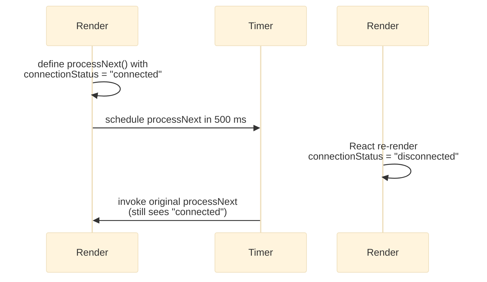

:::info TL-DR;
* **`useRef`** lets you hold a mutable value or DOM reference across renders **without** causing re-renders.  
* **When to use**:
  - Accessing or imperatively manipulating DOM nodes  
  - Storing mutable “instance” values (e.g. timers, latest state)  
  - Fixing stale-closure bugs in asynchronous callbacks  
:::

## What is `useRef`?

In React, every render “re-runs” your component function, so local variables get reset. `useRef` returns a stable object:

```ts
const refContainer = useRef<T>(initialValue);
````

* **`refContainer.current`** persists across renders.
* Updating `.current` does **not** trigger a re-render.

You can think of it like a “box” you keep beside your component—whatever you put in that box stays there until you overwrite it, but React won’t inspect it to decide whether to draw again.

## Core Use Cases

| Scenario                                | Solution                                    | Why `useRef`?                             |
| --------------------------------------- | ------------------------------------------- | ----------------------------------------- |
| **DOM access**                          | `const elRef = useRef(null)`                | Imperatively focus, measure, or scroll    |
| **Storing timers or intervals**         | `const timerRef = useRef<NodeJS.Timeout>()` | Clear timer on unmount without re-renders |
| **Latest state or props in async code** | `const latest = useRef(value)`              | Avoid stale closures in callbacks         |
| **Third-party libraries**               | `const chartRef = useRef()`                 | Pass DOM node to non-React code           |

> 💡 Note: If you want React to re-render on change, use `useState` instead. `useRef` is for **mutable**, non-render-triggering data.

## Avoiding Stale Closures in Async Callbacks

Imagine you schedule a `setTimeout` that reads a piece of state:

```ts
function processNext() {
  if (connectionStatus === "disconnected") {
    // …
  }
}

setTimeout(processNext, 500);
```

Because JavaScript closes over the **value at definition time**, `processNext` might see an outdated `connectionStatus`.

### The Stale-Closure Sequence



## Fix with `useRef`

1. **Store the latest value** in a ref:

   ```ts
   const connectionRef = useRef(connectionStatus);
   useEffect(() => {
     connectionRef.current = connectionStatus;
   }, [connectionStatus]);
   ```
2. **Read from `ref.current`** inside your async callback:

   ```ts
   function processNext() {
     if (connectionRef.current === "disconnected") {
       setCurrentStatus(null);
     }
     // …
   }
   ```

Now, regardless of when `processNext` runs, it always reads the up-to-date status.

## When **Not** to Reach for `useRef`

* **State you render** (UI logic)—use `useState`.
* **Derived values**—compute them directly or memoise with `useMemo`.

`useRef` shines when you need an **escape hatch**: imperative DOM work, timers, or stunning stale-closure demons.

### Further Reading

* [React Docs: `useRef`](https://reactjs.org/docs/hooks-reference.html#useref)
* [Overreacted: “A Complete Guide to useEffect”](https://overreacted.io/a-complete-guide-to-useeffect/) *(for context on hooks and timing)*
