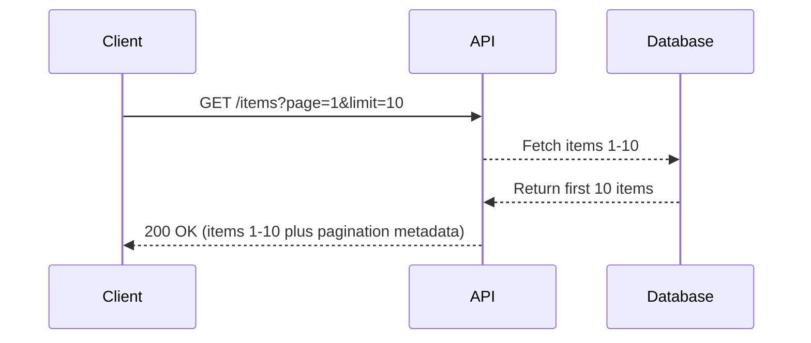
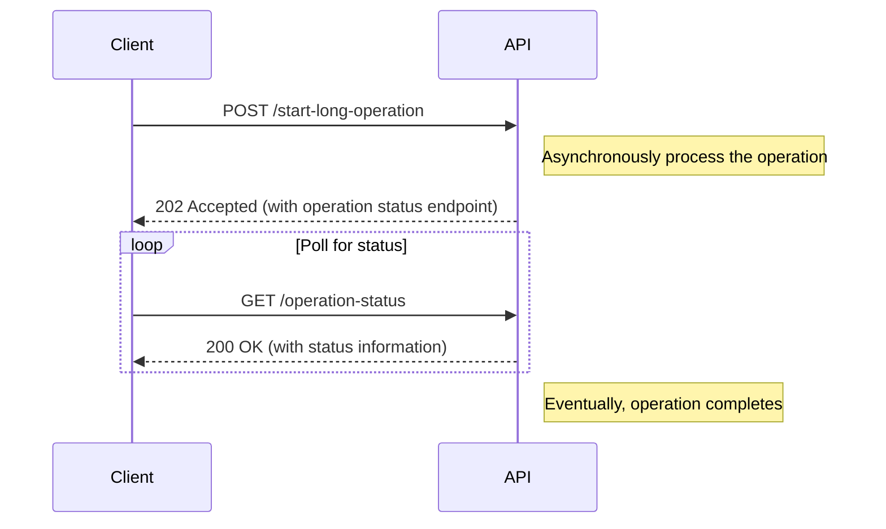
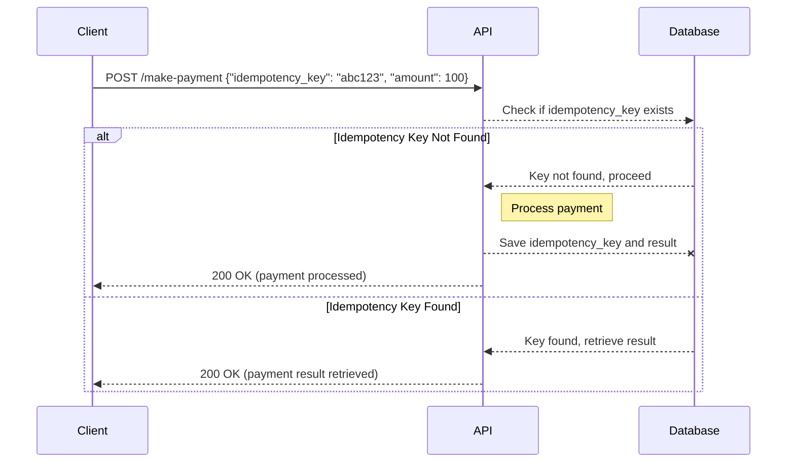
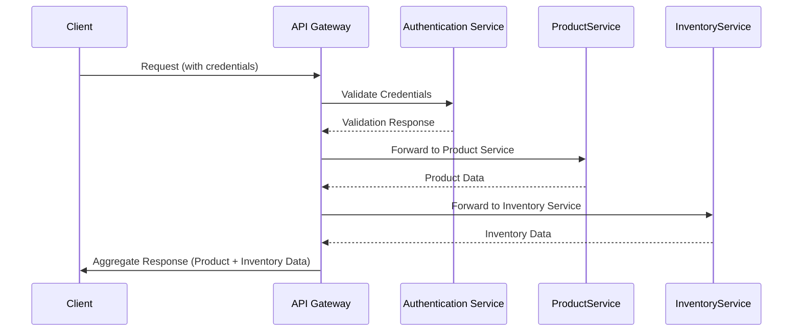

Effective API design is crucial for building scalable, maintainable, and user-friendly web services. There are several design patterns that have emerged as common solutions to recurring problems in API design. In this post, we will discuss three key patterns: pagination, long-running operations, and API idempotency.

## Pagination

> Further read: [pagination vs. load more vs. infinite scrolling design patterns](https://blogs.oracle.com/oracle-help-center/post/pagination-vs-infinite-scrolling-vs-load-more-bp-oracle-help-center)

Pagination is a design pattern that allows clients to retrieve subsets of data from the server, effectively breaking up large datasets into manageable chunks. This pattern is commonly used when dealing with large collections, like a list of users, products, or articles. Without pagination, a client would have to retrieve all data in a single request, which could be inefficient and costly in terms of bandwidth and memory.

When implementing pagination, there are a couple of common approaches you can take.
- **Offset-based pagination**: Uses a numeric offset to indicate the starting point of the data set and a limit to define the size of the response data. It is often embraced through Object-Relational Mapping (ORM) libraries.
- **Cursor-based pagination**: Leverages a stable cursor or pointer (like an item ID) to determine the next set of results relative to the items already fetched. Cursors are stateful on the server, creating dedicated database connections and transactions per HTTP client.
- **Keyset/seek-based pagination**: Relies on using column values from the result set to fetch the next set of rows in a performant manner, particularly when dealing with large volumes of data.
- **Page-based pagination**: Divides data into discrete pages and accesses those pages using page numbers, often used with a specified page size for consistent data chunks.

## Long-running Operations

Some API requests may trigger operations that take a significant amount of time to complete, such as generating a large report or processing a video. Instead of keeping the client waiting for the operation to finish, APIs implement long-running operations patterns, which typically look like this:

The API accepts the long-running request and quickly responds with an acknowledgment that the operation has started, usually providing an endpoint or resource from which **the client can check the status of the operation**.

## API Idempotency

Idempotency ensures that multiple identical requests have the same effect as making a single request. This pattern is particularly crucial for critical operations, such as making a payment or updating a record, as it guards against the implications of network failures and retry attempts.

### Payment Example

There are 3 potential scenarios when a payment request is made:

1.  The initial handshake between the client and server could fail, preventing the payment request from being sent. In this case, the client can retry the request and hope for success without risking double charging.
2.  The server receives the payment request but has not yet begun processing it when a failure occurs. The server sends an error code back to the client, and there is no change to the client's account.
3.  The server receives the payment request and successfully processes it or is processing it when a failure occurs. However, the failure happens before the server can return the `200` status code to the client. In this scenario, the client may not realize that their account has already been charged and may initiate another payment, leading to double charging.

Overall, the first two scenarios are acceptable, but the last scenario is problematic and could result in unintentional double charging.

### Possible solution

To address this problem, we need to develop an idempotent payment API. An idempotent API ensures that only the first call generates the expected result and subsequent calls are no-ops.

1.  Require clients to generate a unique key in the request header when initiating a request to the payment server.
2.  The key is sent to the server along with other payment-related information.
3.  The server stores the key and process status.
4.  If the client receives a failure, it can safely retry the request with the same key in the header, and the payment server can recognize this as a duplicate request and take appropriate action.

For example, if the previous failure interrupted an ongoing payment processing, the payment server might restore the state and continue processing.

The common approach in implementing idempotency is through the use of an idempotency key, which the client passes along with the request. The server uses this key to track the operation and ensure that it's only executed once.

### GET, POST, PUT, DELETE

- *Non-mutating APIs*, such as `GET`, are generally idempotent.
- *Mutating APIs*, 
    - such as `PUT`, update a resource's state. This means that executing the same `PUT` API multiple times updates the resource only once, while subsequent calls overwrite the resource with the same value. Therefore, `PUT` APIs are usually idempotent.
    - Similarly, the mutating API, `DELETE`, only takes effect during the first call, returning a `200` ( `OK`) status, while subsequent calls return `404` (`Not Found`).
    - The last mutating API, `POST`, creates a new resource. However, receiving multiple requests can cause servers to allocate different places for the new resource. Therefore, the `POST` API is usually not idempotent.

## API gateways

Although APIs offer security to the systems on either end, they are susceptible to overuse or abuse. If you're concerned about this, you may want to implement an API gateway to collect requests and route them accordingly.

An API gateway is a reverse proxy that acts as a unified interface to a set of individual back-end services. By centralizing common tasks and facilitating communication between services and clients, it significantly streamlines backend management and enhances the overall efficiency and reliability of the system.

:::infoBest Practices for API Gateway Implementation
- Limit Complexity: Avoid making the API Gateway a performance bottleneck or a single point of failure.
- Scalability: Ensure the Gateway can handle increasing loads smoothly.
- Security: Implement strong security practices, as it's a critical layer exposed to the public.
:::

### The Role of an API Gateway

API Gateways perform several key functions:

- **Routing**: Directing requests to the correct microservice.
- **Authentication**: Verifying the identity of the caller.
- **Authorization**: Ensuring the caller has permission to access the desired service.
- **Rate Limiting**: Preventing a single user from overwhelming the system with too many requests.
- **Fault Tolerance**: Gracefully handling service failures.
- **Service Aggregation**: Combining multiple service calls into one, reducing the number of requests made by a client.
- **Load Balancing**: Distributing incoming traffic across multiple instances of services to even out the load.
- **Caching**: Storing copies of frequently accessed data for quick retrieval.
- **Monitoring & Logging**: Recording activity for spotting issues and understanding usage patterns.

### Advantages

There are numerous benefits to deploying an API Gateway in a service architecture:

- **Abstraction**: Hides the complexity of microservices from the client.
- **Single Entry Point**: Clients only need to know the API Gateway's location, simplifying client-side code.
- **Cross-cutting Concerns**: Centralizes handling of concerns like SSL termination, IP whitelisting, etc.
- **Versioning**: Manages different versions of APIs seamlessly.

### Diagram

Below is a simple diagram illustrating how an API Gateway operates within a microservices architecture.

In this scenario, the client sends a request to the API Gateway, which then:

1. Checks the credentials with an authentication service.
2. Forwards the request to the relevant services (like ProductService or InventoryService).
3. Combines the responses and sends a single aggregated response back to the client.