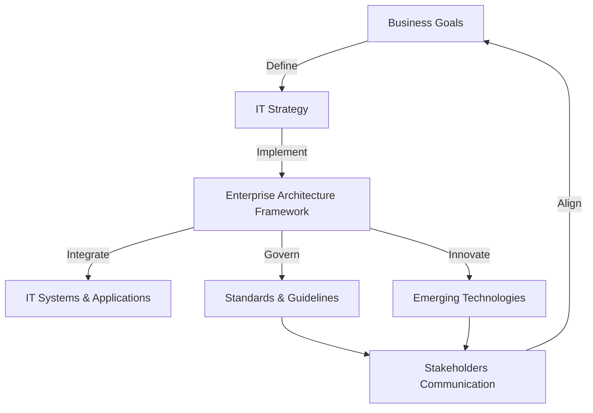

## Enterprise Architecture

:::infoDoes Enterprise Architecture Mean an Application with Lots of Users?
No, Enterprise Architecture is not about an application with lots of users, but rather about the strategic planning and alignment of an organization's entire IT infrastructure and processes with its business objectives.
:::

Enterprise Architecture (EA) is a strategic framework that aligns an organization's business objectives, processes, and technology to improve efficiency, agility, and effectiveness. It provides a comprehensive view of an organization’s structure, integrating various components such as information systems, business functions, and technology infrastructure. EA ensures that all parts of the organization work together to achieve the business goals while adapting to changes and leveraging new opportunities. It involves methodologies and tools for planning, designing, and governing the enterprise's systems and processes, ensuring they support and drive the overall business strategy.

EA is fundamentally * **an approach** rather than a specific technical guidance*. It focuses on how to use IT resources effectively to support and enhance the overall strategy and operations of an organization. 

## Top 3 EA frameworks

Here are three well-known Enterprise Architecture (EA) frameworks:

1. **TOGAF (The Open Group Architecture Framework)**:
   - **Overview**: TOGAF is a comprehensive framework that provides a structured approach for designing, planning, implementing, and governing enterprise information architecture.
   - **Features**: It includes a detailed method for developing an EA (the ADM – Architecture Development Method) and tools for implementation.
   - **Use Case**: Suitable for large organizations aiming for a standardized approach to EA.

2. **Zachman Framework**:
   - **Overview**: The Zachman Framework is a taxonomy for organizing EA artifacts, based on six interrogatives (What, How, Where, Who, When, Why) and six perspectives (Planner, Owner, Designer, Builder, Implementer, Worker).
   - **Features**: It emphasizes creating a holistic view of the enterprise and its information systems.
   - **Use Case**: Useful for structuring and classifying various enterprise artifacts and models.

3. **Federal Enterprise Architecture Framework (FEAF)**:
   - **Overview**: Developed by the U.S. Federal Government, FEAF provides a common methodology for government agencies to develop and manage their architectures.
   - **Features**: Includes models for business, data, service, technology, and performance.
   - **Use Case**: Ideal for federal or governmental organizations needing standardization and alignment across agencies.

## Enterprise Architecture Is Dead?

> This section is a summary of [Enterprise Architecture Is Dead; Long Live Enterprise Architecture](https://www.linkedin.com/pulse/enterprise-architecture-dead-long-live-daniel-angelucci/)

The demand for Enterprise Architects (EAs) is prevalent in IT, but their role and value are often misunderstood. Many organizations with established EA teams still find them ineffective, perceiving them as out-of-touch or bureaucratic. Traditional EA is criticized for focusing on aligning technology with business capabilities without grounding these efforts in tangible value drivers like revenue, optimized operations, or specific use cases. This disconnect often renders EA as an "ivory tower" exercise, leading to a preference for practical solution architects who can deliver concrete results.

To revitalize EA, the article suggests a shift towards a use-case-driven approach. Instead of simply mapping business capabilities to technology, EA should focus on delivering specific use cases that generate business value. This approach provides clearer value assessment, avoids over-engineering, and enhances governance. It also recommends restructuring EA teams: one axis should align with business value chains to articulate use cases and required IT capabilities, and the other should focus on governance, leveraging domain architects' expertise without removing them from their roles.

This proposed transformation aims to integrate EA more effectively into business operations, ensuring it contributes tangible value and effective governance, thus aligning EA with the needs of modern digital organizations.