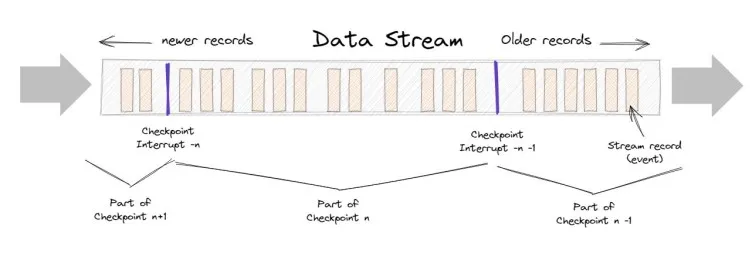

Knowing whether to use synchronous or asynchronous processing is crucial in system design, as making the wrong choice can lead to performance issues or poor user experience. Let's clarify the differences between these two approaches.

## Synchronous vs. Asynchronous Processes

**Synchronous processes** operate sequentially; only proceeding to the next step after the completion of the current one. Picture the process of ordering a sandwich at Subway. Your order is crafted following a fixed sequence: choose bread, select protein, add toppings, and finally apply sauce. The sandwich is made step-by-step, with each phase waiting for your decision, a typical synchronous operation.

**Asynchronous processes**, on the other hand, are independent and can occur concurrently. As an analogy, consider ordering a meal for pickup. You request a meal, drink, and dessert, then are given a pickup time. In the meantime, you can engage in other activities without waiting for each part of your order to be prepared — the tasks occur simultaneously.

## Importance of Asynchronous Processing

It's not always viable to perform tasks synchronously without degrading the user experience or system reliability. Platforms like Google and YouTube handle immense volumes of data and simultaneous user interactions that necessitate asynchronous processing; synchronous tasks at such scale would prolong response times or even lead to system failure.

In cases where synchronous processing is possible but taxing, asynchronous methods save on costs and response times, improving the user interaction. Tasks such as data uploads and database updates often occur in the background of apps to avoid making users wait unnecessarily.

## Types of Asynchronous Processing Strategies

There are various asynchronous processing strategies:

### Batch Processing

Optimal for applications processing sizable data bundles on a regular schedule, like in corporate finance systems.

*MapReduce*, established by Google, is a prominent batch processing model that simplifies the process into two stages:

Source: [Example of the MapReduce process to generate a directed graph.](https://www.researchgate.net/figure/Example-of-the-MapReduce-process-to-generate-a-directed-graph_fig1_352847534)

The reduced input is automatically sorted and stored for easy access. In addition to applications where regular review is needed, batch processing strategies like MapReduce work well in situations where running in parallel helps speed up the task. 

For example, if you have a complex analytics task where running on one machine would take days or weeks, splitting it across many processes makes it faster. Google uses it to process and index many different web pages in parallel. Note that MapReduce won't work as well for data that's not repetitive, as it won't condense down (reduce) as much.

### Stream Processing

Source: [Apache Flink 101: Checkpointing](https://blog.stackademic.com/apache-flink-basics-101-checkpointing-904343f47ec0)

With stream processing, data flows into your system as **events** occur. Events may be changes in state, or updates — for example, a customer clicking on an ad is an event. Stream processing will get you **close-to-real time results** which is valuable in applications where accuracy is critical such as a trading platform. These benefits are offset by complexity and fragility, however. 

**Check-pointing** can help alleviate problems with system outages, but you'll have to give careful consideration to checkpoint frequency. Frequent checkpoints mean faster recovery, but lower performance... which is the entire reason for going with stream processing in the first place.

### Lambda Architecture

Combines the robustness of batch processing with the immediacy of stream processing, but at the cost of operational complexity.

### Asynchronous Queues

Queues make asynchronous processes more reliable and less brittle as events are captured and processed in an orderly way. 

#### Message queue
**Task queues** are a type of **message queue**; sometimes they're built on top of message queues. For example, Celery supports many different "**message brokers**", such as Redis, RabbitMQ, and Amazon SQS. Generally:

- **Message queues**, which receive, log, and deliver messages, can be used to update users that jobs are being processed in the background, thus unblocking them and making for a better user experience. Redis and RabbitMQ are both popular choices.
- **Task queues** execute in addition to passing information. They schedule jobs, complete tasks, and report results. Celery is a popular choice.

#### Publish/Subscribe (or pub/sub)
Pub/Sub messaging is another async communication method to know. In pub/sub messaging, you have a subscriber who receives a message sent by a publisher via a broker. Because communication is decoupled, messages can be automatically pushed to all subscribers rather than pulled individually via a message queue. This method is popular in event-driven architecture because event-driven services can be delivered quickly and easily. Additionally, because publishers are isolated from subscribers, the system is easier to maintain and secure.

## When to choose Async/Syn Processing?

- Asynchronous processing might be the best option in scenarios where:
    - Processing time is lengthy or uncertain.
    - Immediate processing isn't necessary, like with social media feeds that update in real-time for the poster but propagate through the network gradually.
- Conversely, synchronous processing is more suited for simpler applications with predictable, quick processing times and when errors must be handled promptly, such as in immediate payment processing systems. 

## Use cases

- Asynchronous
    - Batch processing is useful when you need to process chunks of data in predictable intervals, as in accounting software. 
    - Stream processing is a good choice for applications like anomaly detection or sentiment analysis when timeliness is critical 
    - Lambda architecture can help you capture the benefits of both if you're willing to deal with added complexity. 
- Synchronous processing is still the best choice for simple applications where processing times are short and well-defined, and when errors must be dealt with immediately like in payment tools.

Take a look at the below table to help guide your decisions of which processing methods to use.

| Application                 | Processing Methods to Consider |
| --------------------------- | ------------------------------ |
| Analytics                   | Batch processing, MapReduce    |
| Web Crawling                | Batch processing, MapReduce    |
| Handling large file uploads | Job queue                      |
| Handling real-time events   | Stream processing              |
| Generating a newsfeed       | Job queue, Pub/Sub             |
| Scheduled tasks             | Job queue, Batch processing    |

### Products

- **Batch Processing with MapReduce:**
    - **Apache Hadoop:** An open-source framework for distributed storage and processing of large data sets using the MapReduce programming model.
    - **Cloudera Distribution for Hadoop (CDH):** A commercial distribution of Hadoop providing a software platform for data analytics and machine learning.
    - **Amazon EMR (Elastic MapReduce):** A web service for processing big data using Apache Hadoop and Apache Spark on the AWS cloud.
    - **Google Cloud Dataproc:** A managed service for running Apache Hadoop and Apache Spark on Google Cloud Platform.
- **Job Queue:**
    - **RabbitMQ:** An open-source message broker that uses a variety of messaging protocols.
    - **Amazon Simple Queue Service (SQS):** A scalable and fully managed message queuing service offered by Amazon Web Services.
    - **Apache Kafka:** A distributed stream-processing software platform that also provides job queue facilities using its durable messaging system.
    - **Beanstalkd:** A simple and fast work queue service for running background jobs that run for a prolonged period of time.
- **Stream Processing:**
    - **Apache Flink:** An open-source platform for distributed stream and batch data processing.
    - **Apache Storm:** A distributed real-time computation system for processing fast, large streams of data.
    - **Amazon Kinesis:** A platform to send your streaming data on AWS, which can then be analyzed in real-time.
    - **Google Cloud Dataflow:** A fully-managed service for transforming and enriching data in stream (real-time) and batch (historical) modes with equal reliability and expressiveness.
- **Pub/Sub (Publish/Subscribe):**
    - **Google Cloud Pub/Sub:** A scalable and flexible real-time messaging service that allows services to communicate asynchronously with each other.
    - **Apache Pulsar:** An open-source distributed pub/sub messaging system originally created at Yahoo and designed for high-performance.
    - **Redis Pub/Sub:** An in-memory data structure store that can be used as a database, cache, or as a pub/sub message broker.
    - **NATS:** A lightweight, high-performance messaging system for microservices, IoT, and cloud-native systems.