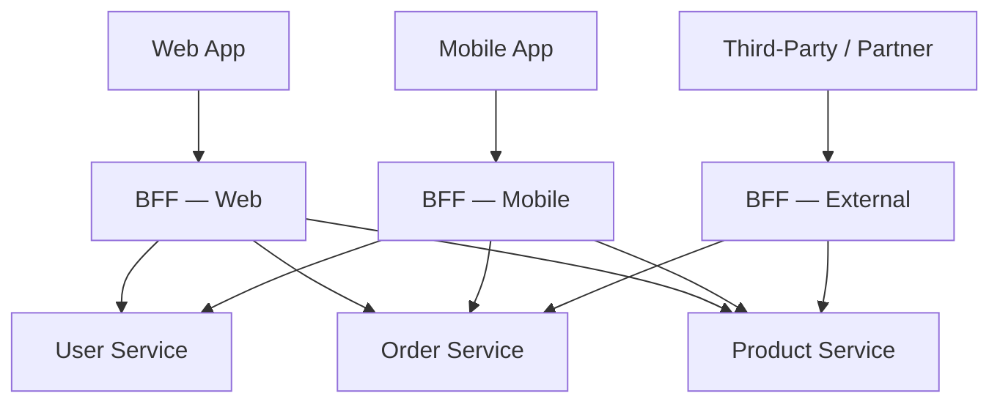
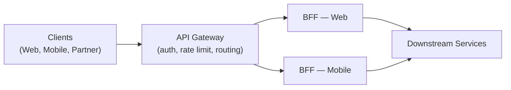

The Backend for Frontend (BFF) pattern addresses a common pain point in systems that serve multiple client types: a single general-purpose API inevitably becomes a compromise that serves no client particularly well. BFF resolves this by giving each client type its own dedicated backend layer, owned by the same team as the frontend.

## The Problem BFF Solves

When a single API must serve a web app, a mobile app, and potentially a third-party integration, several tensions emerge.

- **Over-fetching**: the API returns more data than any individual client needs, wasting bandwidth and increasing parse time — especially costly on mobile.
- **Under-fetching**: a single response does not contain everything the client needs, forcing multiple round trips to assemble a view.
- **Coupling**: any change to the API affects every client simultaneously, requiring careful coordination between frontend teams.
- **Misaligned ownership**: the backend team must understand the needs of several frontend teams, creating communication overhead and slower iteration.

## How BFF Works

A BFF sits between a client and the downstream services (microservices, databases, third-party APIs). It is a thin layer responsible for aggregation, transformation, and adaptation — converting the downstream service contracts into a shape that is exactly right for its client.

Each BFF calls the downstream services it needs, joins and transforms the results, and returns a response shaped for its client. The web BFF might return rich, deeply nested objects with images and metadata. The mobile BFF might return a leaner version with fewer fields, smaller images, and pagination tuned for slow networks.

:::info BFF ownership model
A BFF is typically owned by the same team that owns the frontend it serves. This tight coupling is intentional — it lets the frontend team iterate on the API contract without coordinating with other teams, and it keeps the interface honest because the same people building the screen are building the endpoint that feeds it.
:::

## Benefits

- **Right-sized responses**: each client receives only the data it needs, neither more nor less.
- **Independent evolution**: the web BFF and mobile BFF can evolve at different speeds without affecting one another.
- **Clear ownership**: the frontend team controls the full request-response lifecycle for their product surface.
- **Simplified frontend logic**: response shaping, data joining, and error normalization move into the BFF, keeping the frontend lighter.
- **Improved security boundary**: the BFF can expose only the subset of downstream data that its client is authorized to see, rather than relying on the client to filter.

## Trade-offs

| Concern | Detail |
|---|---|
| Code duplication | Logic shared across BFFs (auth handling, error formatting) can diverge over time if not extracted into shared libraries |
| Operational overhead | Each BFF is a deployed service that needs its own CI/CD, monitoring, and scaling policy |
| Proliferation risk | Without discipline, every team creates a BFF for every use case, producing an unmanageable sprawl of services |
| Latency | An extra network hop is added between client and downstream services; keep BFF logic thin to minimize this |

## BFF vs API Gateway

These two patterns are commonly confused but serve different purposes — and they are complementary.

| | API Gateway | BFF |
|---|---|---|
| **Purpose** | Cross-cutting concerns: routing, auth, rate limiting, SSL termination | Client-specific aggregation and response shaping |
| **Scope** | Applies uniformly to all clients | One instance per client type |
| **Ownership** | Platform/infrastructure team | Frontend team |
| **Logic** | Minimal business logic | Can contain view-model logic, joins, transformations |

In practice, an API Gateway and a BFF often appear together. The Gateway handles the infrastructure layer (auth tokens, rate limiting, TLS) and routes traffic to the appropriate BFF, which handles the product layer.

## When to Use BFF

BFF is a good fit when:

- You have two or more client types (web, mobile, IoT, partner API) with meaningfully different data needs.
- Your downstream architecture is composed of microservices, where a client call requires aggregating data from multiple services.
- Teams are organized around frontend surfaces and want autonomy over their API contract.
- You are experiencing over-fetching or under-fetching problems with a shared API.

:::tip When NOT to use BFF
If you have a single client type, or if your clients share nearly identical data requirements, a single well-designed API (or even a GraphQL endpoint) is simpler and avoids unnecessary service proliferation.
:::

## Practical Considerations

- Keep BFFs thin. Business logic belongs in domain services. A BFF should aggregate and transform, not implement rules.
- Extract shared cross-BFF utilities (request logging, auth helpers, error mapping) into internal libraries rather than copying them across BFFs.
- Consider GraphQL as an alternative if the primary driver is flexible field selection rather than client-specific aggregation. A GraphQL API can address over/under-fetching without the operational cost of multiple services.

## References

- [Sam Newman — Pattern: Backends For Frontends](https://samnewman.io/patterns/architectural/bff/)
- [Microsoft Azure Architecture Center — Backends for Frontends pattern](https://learn.microsoft.com/en-us/azure/architecture/patterns/backends-for-frontends)
