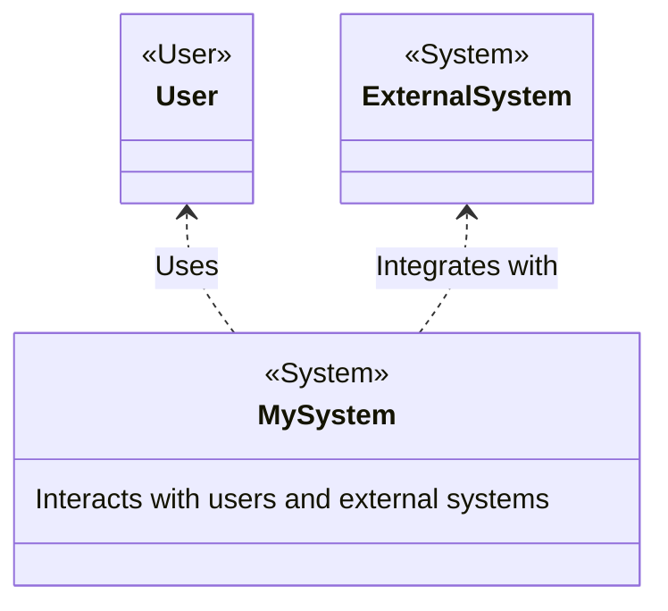
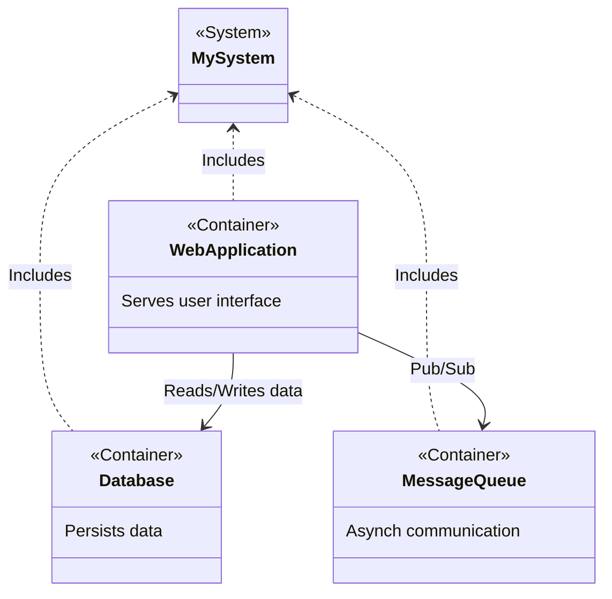
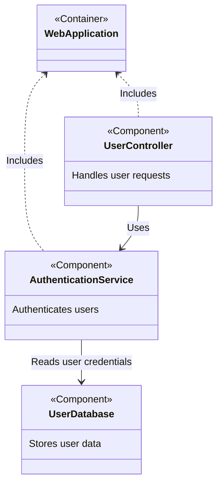
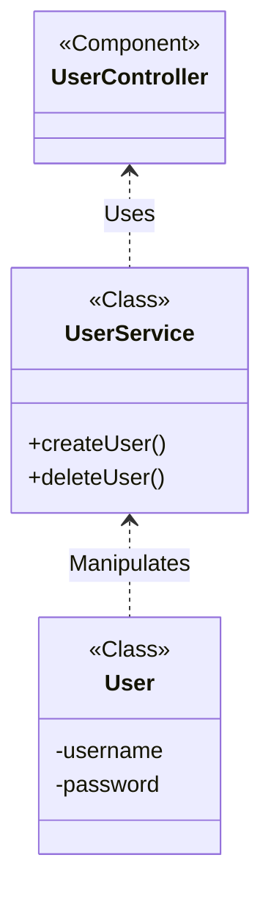

> For more diagrams to illustrate the concept of C4 model, check https://c4model.com/

The C4 Model is a framework for visualizing and documenting the architecture of software systems. Created by software architect Simon Brown, the C4 model provides a way for software development teams to communicate complex software architectures in a simple and approachable manner. The C4 stands for Context, Containers, Components, and Code, representing various levels of abstraction in the system architecture.

Here is an example of a C4 model diagram:

Source: [C4 Model, Architecture Viewpoint and Archi 4.7](https://www.archimatetool.com/blog/2020/04/18/c4-model-architecture-viewpoint-and-archi-4-7/)

## The Four Levels of the C4 Model

### Level 1: Context Diagrams
At the highest level of abstraction, Context diagrams provide a bird's-eye view of the system. They answer the question, "What is the overall scope and what are the system's interactions with users and other systems?" In this level, you'll see:

- System boundaries of your own system
- External systems (or users) sit outside the scope  that interact with the system
- High-level relationships and interactions

### Level 2: Container Diagrams

:::infoNot docker!
Not Docker! In the C4 model, a container represents an application or a data store. A container is something that needs to be running in order for the overall software system to work.
:::

Container diagrams zoom in one level lower than Context diagrams. They show the high-level technology choices, how responsibilities are separated, and how these containers communicate. Containers can be anything like a web application, database, mobile app, or server-side application.  Essentially, a container is **a separately runnable/deployable unit** (e.g. a separate process space) that executes code or stores data.

### Level 3: Component Diagrams
Diving further into the architecture, Component diagrams break down the containers into their respective components. These diagrams illustrate the architectural building blocks and how they interact with each other.

### Level 4: Code Diagrams

The most detailed level, Code diagrams, are essentially class diagrams that reveal the implementation details of the components identified in the previous level.

## Why Use the C4 Model?

The C4 Model helps teams:

- Communicate their software design at different levels of granularity
- Understand the big picture without getting lost in details
- Document architecture in an incremental and iterative manner
- Facilitate onboard new team members

Harnessing the power of the C4 Model allows the effective sharing of software structure and design choices, enhancing collaboration and clarity within a wide range of stakeholders, from business analysts to developers and operations staff.