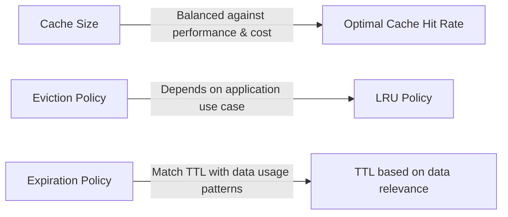

Caching is a critical element of system performance and scalability, providing rapid data access and reducing strain on key parts of the system. By harnessing the power of data locality, caching keeps frequently accessed data readily available for quicker retrieval, whether embedded within your local machine or deployed across massive internet applications.

# The Mechanics of Caching

Caching can be manifested through various approaches:

- **In-Memory Application Cache**: Data stored directly within an app's memory is quick to access but requires more memory across servers, impacting cost.
- **Distributed In-Memory Cache**: Tools like Memcached or Redis offer communal cache storage, reducing duplication across servers.
- **Database Cache**: Databases themselves cache data to avoid repeated calculations or operations.
- **File System Cache**: This type of cache stores file access patterns; Content Delivery Networks (CDNs) leverage file system caching to distribute data efficiently.

# Deciding What to Cache

Caching strategies are a balance between data freshness (accuracy) and data retrieval speed (performance). Limited cache size and higher operational costs necessitate strategic selection and eviction of cached data, referred to as caching policies:

- **First-in First-out (FIFO)**: The oldest data is evicted first.
- **Least Recently Used (LRU)**: Data not accessed recently is the first to go.
- **Least Frequently Used (LFU)**: The least accessed items are evicted, regardless of when they were last used.

Maintaining cache accuracy often involves timed entry expiration and aligning cache updates with data storage operations, such as write-through or write-behind caching.

# Ensuring Cache Coherence

To maintain coherent caches, systems may use:

- **Write-through cache**: Synchronize the cache and main memory together.
- **Write-behind cache**: Asynchronously update the main memory.
- **Cache-aside (or lazy loading)**: Fills the cache on-demand, based on application data requests.

# Further Considerations

Exploring detailed case studies, like Facebook's lessons with Memcache or Stack Overflow's caching strategies, provides valuable real-world insights.

# Key Cache Design Decisions

You must determine:

1. **Cache Size**: Balance user latency improvements against cost and system complexity. Aim for an optimal cache hit rate.
2. **Eviction Policy**: Choose based on your use case; LRU is a common and generally effective choice.
3. **Expiration Policy**: Apply a TTL that reflects your data's change rate and relevance.

In practice, optimizing your caching strategy will likely require iterative adjustment to align with user requirements and system characteristics.