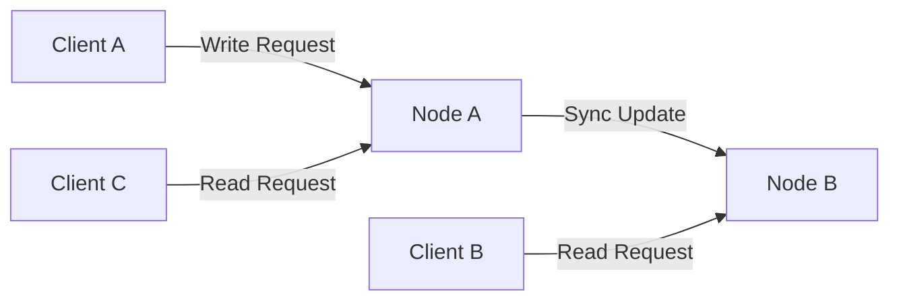
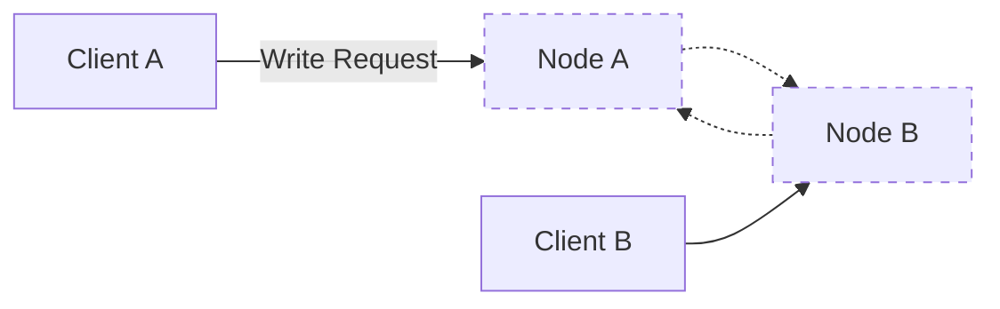
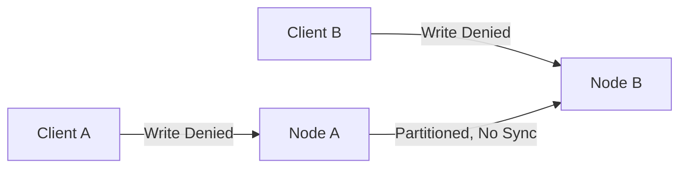
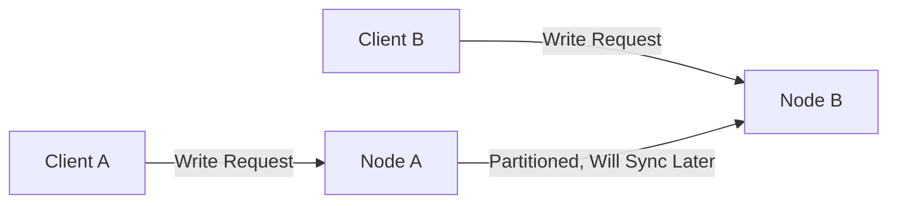

CAP stands for “Consistency”, “Availability”, and “Partition tolerance”. A network partition is a (temporary) network failure between nodes. Partition tolerance means being able to keep the nodes in a distributed database running even when there are network partitions. The theorem states that, in a distributed database, you can only ensure consistency or availability in the case of a network partition.

Modern databases are usually distributed and have multiple nodes over a network. Since network failures are inevitable, it’s important to decide beforehand the behavior of nodes in a database, in the event that packets are dropped/lagged or a node becomes unresponsive.

Understanding the CAP Theorem can be crucial for system design interviews, where you're expected to showcase your ability to clearly outline the implications of each characteristic and recognize the appropriate trade-offs for different applications tailored to specific requirements.

## Partition tolerance and theorem definition

The CAP theorem is a fundamental concept that applies to distributed databases, and it's comprised of three components: **Consistency**, **Availability**, and **Partition Tolerance**. To put it in simple terms:

- **Consistency** means that all nodes in a distributed system see the same data at the same time. It ensures that any read request to the system after a write has been acknowledged returns the value of that write.
- **Availability** ensures that the system remains operational and can always process requests, even in the event of failures. It doesn't promise that every transaction will be completed, but it does promise that a response will be given, whether it's a success or a failure message.
- **Partition Tolerance** means the system continues to operate despite arbitrary message loss or failure of part of the system (partitions). It's the system's resilience to network splits.

:::infoDoes consistency in CAP mean strong consistency?
In a strongly consistent database, if data is written and then immediately read after, it should always return the updated data. The problem is that in a distributed system, network communication doesn’t happen instantly, since nodes/servers are physically separated from each other and transferring data takes >0 time. 

This is why it’s not possible to have a perfectly, strongly consistent distributed database. In the real world, when we talk about databases that prioritize consistency, we usually refer to databases that are eventually consistent, with a very short, unnoticeable lag time between nodes.
:::

:::cautionDoes consistency in CAP mean strong consistency?
I’ve heard the CAP Theorem defined differently as “Choose 2 of the 3, Consistency, Availability or Partition Tolerance”?

This definition is incorrect. You can only choose a database to prioritize consistency or availability in the case of a network partition. You can’t choose to forfeit the “P” in CAP, because network partitions happen all the time in the real world. A database that is not partition tolerant would mean that it’s unresponsive during network failures, and could not be available either.
:::

Imagine in **a multi-primary architecture scenario** which data can be written to multiple nodes (Node A and Node B). Under normal circumstances, an update made to Node A is also passed along to Node B, making sure that both nodes are in sync.

However, if a network partition occurs, and Node A cannot communicate with Node B, they cannot sync up. The way each node responds to new information depends on the priorities set by the database configuration, specifically whether it favors consistency or availability.

### Consistency
In a system that prioritizes consistency, both Node A and Node B would refuse any write requests during a network partition. This ensures that no out-of-sync updates can occur—if Node A has received an update, then Node B must also have it before either node accepts new write requests.

### Availability
On the other hand, in a system that prioritizes availability, it accepts the fact that data may temporarily be out of sync in order to ensure that service continues regardless of partition issues. Each node will continue to accept write requests. Once the partition is resolved, the system will work on syncing the data across nodes to achieve eventual consistency.

### Conclusion

:::infoRead requests
Notice that only write requests were discussed above. This is because read requests don’t affect the state of the data, and don’t require re-syncing between nodes. Read requests are typically fine during network partitions for both consistent and available databases.
:::

:::infoSQL databases
SQL databases like MySQL, PostgreSQL, Microsoft SQL Server, Oracle, etc, usually prioritize consistency. **Primary-secondary replication** is a common distributed architecture in SQL databases, and in the event of a primary becoming unavailable, the role of primary would failover to one of the replica nodes. During this failover process and electing a new primary node, the database cannot be written to, so that consistency is preserved.
:::

In conclusion, the CAP theorem states that a distributed system can have at most two of the following three properties: Consistency, Availability, and Partition Tolerance. During network partitions, a choice must be made between consistency and availability.

## Popular databases

Here's a table listing some of the most common databases along with their cloud platforms, categorized by whether they prioritize consistency or availability:

| Database (Cloud Platform)        | Prioritize Consistency | Prioritize Availability |
|----------------------------------|------------------------|------------------------|
| MongoDB                          |                        | ✓                      |
| Cassandra                        |                        | ✓                      |
| Apache CouchDB                   |                        | ✓                      |
| DynamoDB (AWS)                   |                        | ✓                      |
| SQL Databases                    | ✓                      |                        |
| MariaDB (AWS RDS)                | ✓                      |                        |
| Oracle (Oracle Cloud)            | ✓                      |                        |
| Redis                            | ✓                      |                        |
| Google BigTable                  | ✓                      |                        |

## Choosing the Right Trade-off

In a system design interview, you may be asked which approach to take. Here's what to consider:

- **Consistency:** Choose this if your system requires transactions to be seen by all users at the same time, like financial services.
- **Availability:** Choose this if your system should be responsive and always online, like social media platforms.
- **Partition Tolerance:** Must be chosen if your system is distributed across multiple nodes and network partitions are a risk.

## Examples:

### Q1

Question: When architecting a distributed database for an e-commerce platform that mirrors Amazon's functionality, with a focus on real-time stock validation to forestall issuing refunds, which attribute of the CAP Theorem — consistency or availability — should be the foundation of your database design?

Answer: **Consistency** is essential in this context. During a scenario where network partitions occur and database nodes cannot communicate, it is preferable to temporarily prevent any transactions (hence rejecting all write operations) than to risk multiple customers successfully ordering a single item in stock due to concurrent writes on disparate nodes. An emphasis on *availability*, conversely, would permit such conflicting operations, leading inevitably to customer dissatisfaction due to order cancellations and refunds.

### Q2

Questions: If after careful deliberation, project managers determine that refunding customers for items sold during network outages is more cost-efficient than displaying out-of-stock messages, does this alter the database's priority between consistency or availability according to the CAP Theorem?

Answer: **Availability** should now take precedence. The refined business strategy suggests that the occasional need to process refunds, due to selling unavailable stock, is more acceptable than completely stopping sales when the network is unserviceable. This pivot aligns with an available system that continues to accept write operations (new purchases) even when a network partition is present, ensuring continual sales activity at the expense of the occasional post-purchase stock consistency issue.