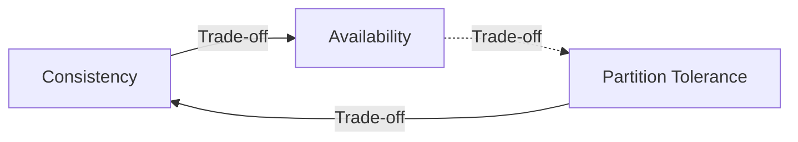

# Understanding CAP Theorem for System Design Interviews

The CAP Theorem is a fundamental principle in distributed system design that outlines the limitations and trade-offs between three key characteristics: Consistency, Availability, and Partition Tolerance. Understanding the CAP Theorem can be crucial for system design interviews, where you're expected to showcase your ability to design scalable, reliable systems.

Let's break down the CAP Theorem to help you get a firm grasp of the concept:

## Consistency
Consistency means that all nodes in a distributed system see the same data at the same time. It ensures that any read request to the system after a write has been acknowledged returns the value of that write.

**Analogy:** Imagine a library catalog. When a book is checked in or out, the catalog is updated. Consistency is like ensuring that every copy of the catalog across all library branches is immediately updated so that everyone has the latest information.

## Availability
Availability ensures that the system remains operational and can always process requests, even in the event of failures. It doesn't promise that every transaction will be completed, but it does promise that a response will be given, whether it's a success or a failure message.

**Analogy:** Think of a 24/7 convenience store. No matter when you visit, the store is open, and you can attempt to buy something. Sometimes, what you want might be out of stock (similar to a failed transaction), but the store is always available to serve you with what they have.

## Partition Tolerance
Partition Tolerance means the system continues to operate despite arbitrary message loss or failure of part of the system (partitions). It's the system's resilience to network splits.

**Analogy:** Consider a situation where a storm disrupts the communication between two towns. Partition tolerance is like having a backup radio communication system that ensures the towns can still coordinate essential services even if the standard telephone lines are down.

### The CAP Theorem Statements

Now, the CAP Theorem states that a distributed system can only guarantee two of these three properties at the same time. A system has to trade off against the third, depending on the system's needs and the nature of the data.

To illustrate the CAP Theorem, let's use a mermaid diagram:

### Types of Systems Based on CAP

- **CP (Consistency/Partition Tolerance):** These systems prioritize consistency and partition tolerance over availability. In the event of a partition, they may refuse to serve requests to ensure no inconsistent data is returned.

- **AP (Availability/Partition Tolerance):** These systems prioritize availability and partition tolerance, which means they will serve requests and try to maintain operation even in the presence of a partition, potentially at the cost of returning inconsistent data.

- **CA (Consistency/Availability):** These systems prioritize consistency and availability but can't handle partitions well. However, achieving both consistency and availability without partition tolerance is impractical in distributed systems, and thus, CA systems are typically not feasible for systems that require distribution.

### Choosing the Right Trade-off
In a system design interview, you may be asked which approach to take. Here's what to consider:

- **Consistency:** Choose this if your system requires transactions to be seen by all users at the same time, like financial services.

- **Availability:** Choose this if your system should be responsive and always online, like social media platforms.

- **Partition Tolerance:** Must be chosen if your system is distributed across multiple nodes and network partitions are a risk.

### Conclusion

Understanding and explaining CAP Theorem is important in system design interviews as it demonstrates your grasp on the fundamental trade-offs in distributed system design. By clearly outlining the implications of each characteristic and recognizing the appropriate trade-offs for different applications, you showcase your ability to design robust systems tailored to specific requirements.