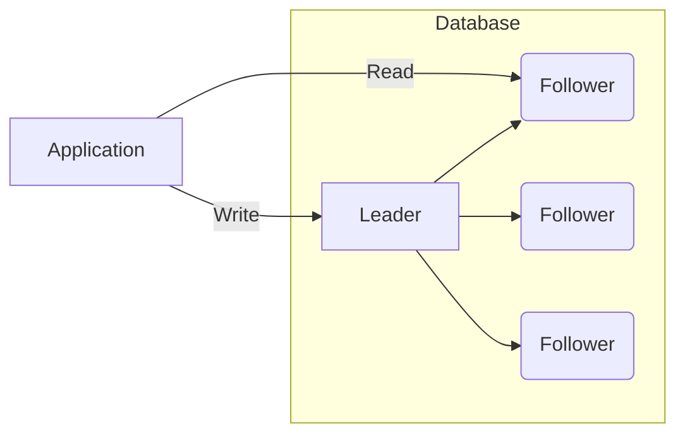

# Strategies for Database Replication

Database replication involves duplicating data from a source database to one or more destination databases. This process has numerous advantages, such as providing redundancy against data loss in the event of system failures, handling increased user traffic, and reducing latency issues, which can be crucial when adopting a regional distribution approach. We will delve into some specific scenarios later on.

> **Reminder:** This discussion focuses on database replication strategies, but replication is a concept that applies *to a variety of data systems*, from caching layers to application servers, to file storage solutions – Amazon S3 and Google Cloud Storage are prominent examples.

## The Importance of Replication

Replication is a critical aspect of modern distributed systems, where unreliability of network connections is a given (refer to [CAP theorem](/software-development/system-design/data/cap-theorem/)). Storing copies of data in different locations can be an effective safeguard against data loss.

Moreover, replication serves as a proactive means for scaling applications. By distributing data across several nodes, you can cut down on latency, boost performance, and ensure a stable experience for users across various locations and varying system demands.

## The Mechanics of Replication

:::infoHow AWS provides the features
If you want to know more how the AWS provides the corresponding replication strategies in their database products, check the below links:
- [RDS - replication](/aws/database/rds/#replication)
- [aurora-replica-for-read](/aws/database/rds/aurora/#replica-for-read)
- [Multi-Master For Write](/aws/database/rds/aurora/#multi-master-for-write)
:::

Replication seems straightforward if the data rarely changes. However, real-world systems often feature frequent updates. The question is, how do you maintain consistent writes across multiple, identical databases in a timely manner? There are various strategies to manage this, each with its own set of pros and cons.

### Leader-Follower Replication

One widely adopted approach is **leader-follower** (or primary-replica) replication, where write operations are directed to a single leader database. This leader then distributes the updates to its follower databases.

#### Synchronous vs. Asynchronous Replication

- **Synchronous replication** is built on the principle that both the leader and follower databases must acknowledge a write for it to be considered successful. While this ensures all followers are up-to-date, it can significantly slow down the process. If a follower fails, the whole write operation is compromised. The latency involved with making followers, potentially located vast distances apart, commit to the write can be substantial.

- **Asynchronous replication**, where the leader database pushes updates to its followers without waiting for an acknowledgement, may be a better choice where speed takes priority over absolute consistency. This does introduce the possibility of data inconsistencies, particularly if the leader database fails before followers have acknowledged the updates.

### Handling Leader Failures

When the leader in a leader-follower system fails (a process known as **failover**), typically a follower is promoted to act as the new leader. However, failure tolerance is more complicated within asynchronous replication since the absence of a leader halts the ability to process writes.

#### Introducing Multiple Leaders

To mitigate the implications of leader failure, you can employ a **multi-leader** setup, with more than one database accepting writes. Should one leader fail, the remaining ones continue operating. This introduces the need to manage potential data conflicts between leaders and to synchronize the additional leaders.

#### Consensus Algorithms

In the wake of a leader's demise, consensus algorithms like **Paxos** and its more approachable counterpart **Raft** play a role in choosing a new leader and reaching consistency through data replication.

:::infoPaxos
Google, which uses Paxos as the foundation of [Spanner](https://www.usenix.org/system/files/conference/osdi12/osdi12-final-16.pdf), its scalable-yet-synchronously-replicated distributed database, [published a paper](https://research.google/pubs/pub33002/) on its struggles to create a fault-tolerant system based on Paxos.

Try your luck with [Paxos Made Simple](https://www.microsoft.com/en-us/research/publication/paxos-made-simple/?from=http%3A%2F%2Fresearch.microsoft.com%2Fen-us%2Fum%2Fpeople%2Flamport%2Fpubs%2Fpaxos-simple.pdf), the slightly frustrated attempt by brilliant computer scientist Leslie Lamport to explain his widely-used but little-understood consensus algorith
:::

### Leaderless Replication

Some systems discard the leader-follower hierarchy entirely, as seen with Amazon's DynamoDB and its concept of leaderless replication. This approach can simplify operations but requires innovative solutions to manage the resulting disorder.

- **Read repair** lets clients identify discrepancies and correct them on-the-fly.
- Background routines, such as DynamoDB's "anti-entropy," continuously work to ensure data integrity.
- **Quorums** support swift data updates by setting a minimum number of replicas that must acknowledge a write before it's considered for reading.

## Implementing a Replication Strategy

Considering the array of benefits and strategies available, it's advisable to incorporate replication into any non-trivial system architecture. The key lies in selecting the most suitable replication strategy based on your specific requirements:

- If your system is read-heavy, consider the **leader-follower replication**.
- For systems requiring high write volumes or global distribution, **leaderless replication** might be the answer, though proper conflict resolution strategies are essential.
- **Multi-leader replication**
    - **Scaling across multiple data centers:** When you're scaling across multiple data centers, because you'd want to have one leader in each data center that can perform writes — and then replicate to other data centers.
    - **Multi-region:** Use replicas as database backups for disaster recovery on a per-region basis. For example, you want to be able to handle major outages or natural disasters that affect particular regions, so you implement a multi-leader strategy in affected regions to handle writes in case of failover.

