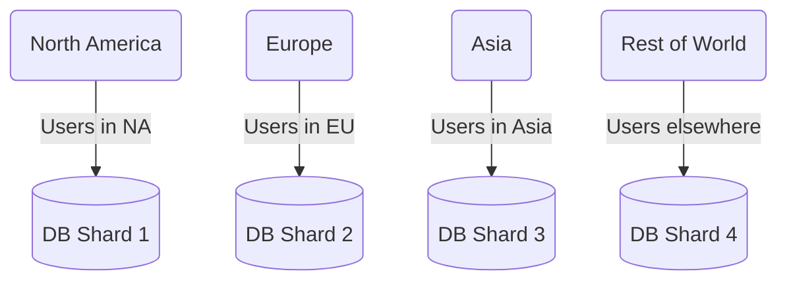
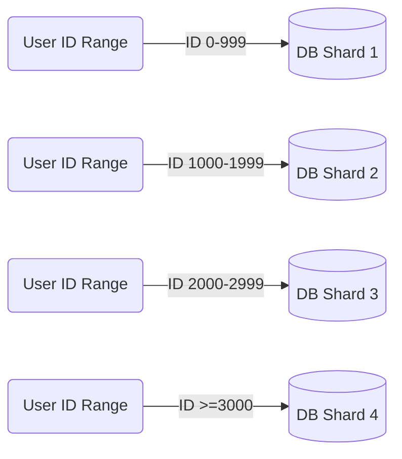
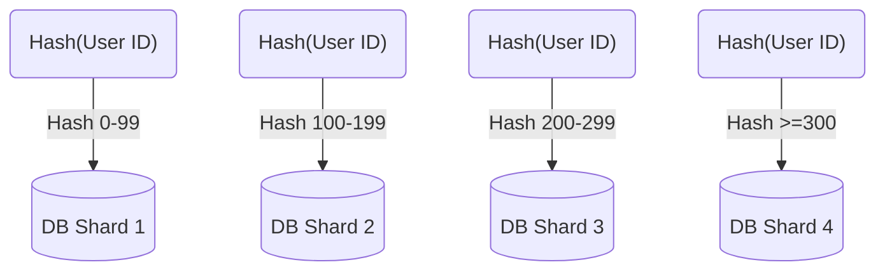

In traditional database systems, data is stored within Relational Database Management Systems (RDBMS) in structured tables made up of rows and columns. Related data is separated into multiple tables and linked together with *Foreign Keys*, which ensures synchronization and can be joined to form a complete data picture.

As data scales up, RDBMS can hit performance limits due to CPU, memory, or disk bottlenecks, requiring premium hardware for maintaining performance. Yet, even the best hardware may not meet the data demands of successful modern applications.

To manage large data sets, tables can be split into horizontal segments, known as *shards*, and distributed across different database servers. This technique, termed **database sharding**, strategically partitions tables.

## Sharding Strategies

Selecting the right sharding strategy depends on data structure. The most common methods include:

### Geo-Based Sharding

Data is allocated based on geographical location, e.g., the continent or region like "East US". Nodes closest to the user reduce latency, but the geographic distribution of users might be uneven.

### Range-Based Sharding

Data is divided according to key value ranges, such as the first letter of a name, which results in simple partition calculations but potentially uneven data distribution.

### Hash-Based Sharding

A hashing function distributes data evenly across partitions, reducing hotspots, yet related rows might be split, preventing performance optimization.

### Manual vs. Automatic Sharding
Some databases automatically manage sharding, dynamically adjusting partitions for balanced data and query distribution—enhancing performance. However, not all databases offer automatic sharding. Manual sharding at the application layer can be quite complex and may cause hotspots.

- **Increased Development Complexity:** Sharding introduces substantial development complexity, necessitating that applications select an optimal sharding strategy and determine shard quantity based on data growth projections. Should these projections change, the application must tackle data re-balancing, and at runtime, ascertain the specific shard housing the required data and the method to access it.
- **Data Distribution Imbalances:** Manual sharding may lead to uneven data distribution across shards, departing from initial estimations. Such disparities can result in 'hotspots,' causing performance bottlenecks and potential server crashes.
- **Scalability and Re-partitioning Issues:** Selecting a shard count that's too low initially can force a re-partitioning exercise to rectify performance degradation due to data volume increase. This process is intricate and particularly challenging when it's imperative to avoid system downtime.
- **Complex Schema Changes:** With sharding, even routine operational tasks, like database schema updates, grow in complexity. Ensuring schema consistency across shards and accurately migrating data to a new schema—in the case of non-backward compatible changes—complicates maintenance tasks.

## Benefits of Sharding
1. Scalability with growing data.
2. Faster query performance due to smaller indexed datasets.
3. Reduced system-wide downtime, with each shard isolated.
4. Use of less expensive commodity hardware.

## Drawbacks of Sharding
1. Not all data is amenable to sharding.
2. Maintaining foreign key relationships across shards is challenging.
3. Complexities and hotspots in manual sharding.
4. Limitations on types of cross-shard queries, like joins.
5. Difficulty in changing or reverting the sharding setup.
6. Increased operational costs due to shards requiring high-availability solutions.
